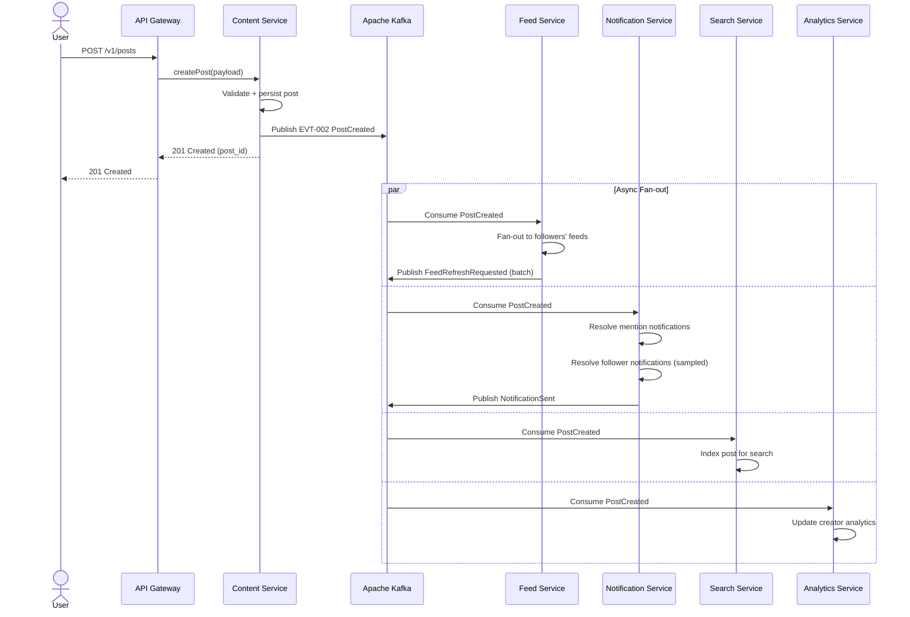

# Event Catalog — Social Networking Platform

All inter-service communication is asynchronous and event-driven via Apache Kafka. This catalog is the authoritative reference for all domain events produced and consumed by platform services.

## Contract Conventions

### Event Schema Standard
All events use **CloudEvents v1.0** envelope with a JSON payload. The Kafka message key is always the aggregate root ID (e.g., `user_id`, `post_id`) to ensure partition locality.

**Envelope Fields:**
| Field | Type | Description | Example |
|---|---|---|---|
| specversion | String | CloudEvents version | "1.0" |
| id | UUID | Unique event ID | "550e8400-e29b-41d4-a716-446655440000" |
| source | String | Service URN that produced the event | "urn:snp:user-service" |
| type | String | Fully-qualified event type | "user.user.registered" |
| subject | String | Aggregate root ID | "usr_abc123" |
| time | RFC3339 | Event timestamp (UTC) | "2024-01-15T10:30:00Z" |
| datacontenttype | String | Payload content type | "application/json" |
| data | Object | Domain-specific event payload | {...} |
| schemaurl | String | JSON Schema URL for validation | "https://schema.snp.io/events/v1/user.user.registered.json" |

### Kafka Topic Naming Convention
`{domain}.{aggregate}.{event_name}` — all lowercase, dots as delimiters.

- Retention: 7 days (default), 30 days for audit-critical events (`moderation.*`, `user.account.*`)
- Partitioning: by aggregate root ID (consistent hashing)
- Replication factor: 3 (production)
- Compaction: enabled for state-sync topics (e.g., `feed.*`)

### Schema Evolution Rules
- **Backward compatible**: new optional fields may be added to event payloads without version bump.
- **Breaking changes**: require a new topic version (e.g., `content.post.created.v2`) and a dual-publish migration period of 30 days.
- All schemas are registered in the **Confluent Schema Registry**.

## Domain Events

| Event ID | Event Name | Kafka Topic | Producing Service | Consuming Services | Trigger | Retention |
|---|---|---|---|---|---|---|
| EVT-001 | UserRegistered | user.user.registered | User Service | Notification Service, Email Service, Analytics Service | New user account created | 30 days |
| EVT-002 | PostCreated | content.post.created | Content Service | Feed Service, Notification Service, Search Service, Analytics Service | Post published successfully | 7 days |
| EVT-003 | PostReacted | content.post.reacted | Content Service | Notification Service, Analytics Service, Feed Service | User adds/changes reaction | 7 days |
| EVT-004 | UserFollowed | social.user.followed | Social Graph Service | Feed Service, Notification Service, Analytics Service | Follow request accepted | 7 days |
| EVT-005 | StoryPublished | content.story.published | Story Service | Feed Service, Notification Service, Analytics Service | Story media processing complete | 7 days |
| EVT-006 | MessageSent | messaging.message.sent | Messaging Service | Notification Service, WebSocket Gateway | Message created in conversation | 7 days |
| EVT-007 | ContentReported | moderation.content.reported | Moderation Service | Moderation Queue Service, Analytics Service | User submits content report | 30 days |
| EVT-008 | ContentModerated | moderation.content.moderated | Moderation Service | Content Service, Feed Service, Notification Service, Analytics Service | Moderator or AI makes moderation decision | 30 days |
| EVT-009 | NotificationSent | notification.notification.sent | Notification Service | Analytics Service, Delivery Tracker | Push/in-app/email sent to user | 7 days |
| EVT-010 | AdImpressionRecorded | ads.impression.recorded | Ads Service | Analytics Service, Billing Service | Ad rendered in user's feed | 7 days |
| EVT-011 | FeedRefreshRequested | feed.feed.refresh_requested | Feed Service | Feed Ranking Service, Cache Warmer | User opens feed or pulls-to-refresh | 7 days |
| EVT-012 | AccountBanned | user.account.banned | User Service | Session Service, Feed Service, Messaging Service, Notification Service, Analytics Service | Admin or automated system bans account | 30 days |
| EVT-013 | PostDeleted | content.post.deleted | Content Service | Feed Service, Search Service, Cache Service | Post soft-deleted by author or moderator | 30 days |
| EVT-014 | CommentCreated | content.comment.created | Content Service | Notification Service, Analytics Service, Feed Service | Comment posted on content | 7 days |
| EVT-015 | StoryExpired | content.story.expired | Story Service | Feed Service, Media Service (cleanup) | 24h TTL reached | 7 days |

### Event Payload Examples

**EVT-002 PostCreated Payload:**
```json
{
  "post_id": "pst_xyz789",
  "author_id": "usr_abc123",
  "content_type": "photo",
  "visibility": "public",
  "media_count": 3,
  "hashtags": ["travel", "photography"],
  "mentions": ["usr_def456"],
  "created_at": "2024-01-15T10:30:00Z"
}
```

**EVT-004 UserFollowed Payload:**
```json
{
  "follow_id": "flw_uvw000",
  "follower_id": "usr_abc123",
  "followee_id": "usr_ghi789",
  "follower_count_delta": 1,
  "is_mutual": false,
  "followed_at": "2024-01-15T10:31:00Z"
}
```

## Publish and Consumption Sequence

The following sequence diagram illustrates how a PostCreated event flows through the system:



### Fan-out Strategy Decision Tree
- **Accounts with < 10,000 followers:** fan-out on write (write to each follower's feed cache at post time).
- **Accounts with ≥ 10,000 followers (celebrities):** fan-out on read (followers pull a merged feed combining their personal feed with the celebrity's latest posts).
- **Stories:** fan-out on read always (short-lived content, not worth write-time fan-out).

## Operational SLOs

| Event | Max Publish Latency | Max End-to-End Delivery | Consumer Lag Alert | Retry Policy |
|---|---|---|---|---|
| EVT-001 UserRegistered | 500 ms | 5 s | > 1,000 messages | 3 retries, 5s backoff |
| EVT-002 PostCreated | 200 ms | 10 s (feed update) | > 5,000 messages | 3 retries, 2s exp backoff |
| EVT-003 PostReacted | 300 ms | 5 s | > 10,000 messages | 2 retries, 1s backoff |
| EVT-004 UserFollowed | 300 ms | 10 s | > 2,000 messages | 3 retries, 5s backoff |
| EVT-006 MessageSent | 100 ms | 500 ms (WebSocket push) | > 500 messages | 5 retries, 500ms backoff |
| EVT-007 ContentReported | 500 ms | 30 s (queue entry) | > 500 messages | 3 retries, 10s backoff |
| EVT-008 ContentModerated | 1 s | 60 s (feed removal) | > 100 messages | 3 retries, 30s backoff |
| EVT-010 AdImpressionRecorded | 100 ms | 60 s (billing aggregation) | > 50,000 messages | 2 retries, no delay |
| EVT-012 AccountBanned | 200 ms | 5 s (session termination) | > 100 messages | 5 retries, 1s backoff |

### Dead Letter Queue (DLQ) Policy
- All Kafka consumers have a corresponding DLQ topic: `{original_topic}.dlq`
- Messages are routed to DLQ after exhausting all retries.
- DLQ messages generate a PagerDuty alert to the on-call engineer.
- DLQ retention: 14 days.
- Manual reprocessing tooling available in the ops runbook.

### Monitoring & Alerting
- **Consumer lag** monitored via Kafka Exporter → Prometheus → Grafana dashboard "Event Pipeline Health".
- **Publish errors** tracked as a metric `kafka.publish.errors.total` per service.
- **SLO breach** alerts fire at 90% of the SLO budget consumed (error budget burn rate > 2x).
- All event schemas are validated at publish time via Confluent Schema Registry; schema violations are logged and trigger an alert.
