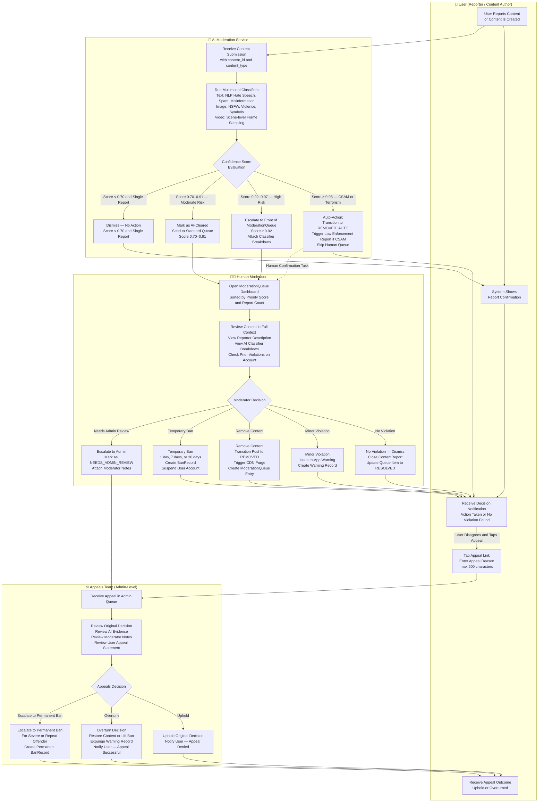
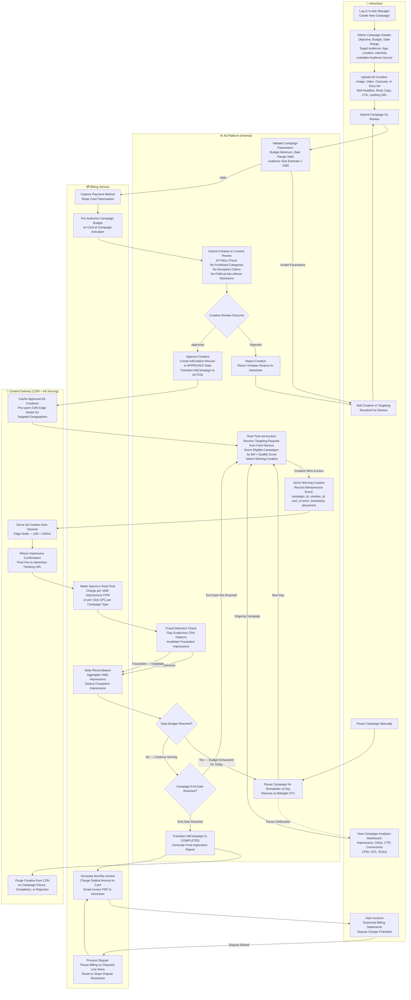

# Swimlane Diagrams — Social Networking Platform

## 1. Overview

This document presents swimlane diagrams for two critical cross-functional platform processes: the Content Moderation Pipeline and the Ad Campaign Lifecycle. Swimlane diagrams extend standard activity diagrams by assigning each step to a specific actor (lane), making responsibility boundaries explicit and highlighting handoffs between systems or teams.

These diagrams are the primary reference for integration engineers, product managers, and compliance officers who need to understand accountability for each action in a multi-party process. Each lane represents a distinct actor: a user-facing role, an automated internal service, or a human team. Handoffs between lanes signal API calls, event publications, queue operations, or human task assignments.

---

## 2. Content Moderation Pipeline

This pipeline covers the full lifecycle of a content moderation event — from the moment a user submits a report (or new content is created) through AI pre-screening, human review, decision enforcement, and the appeals process. The four lanes reflect the actual operational boundaries: the end user (reporter and reported), the automated AI Moderation Service, the human Moderation team, and the Appeals team handling escalated disputes.

**Trigger conditions:**
- A `RegisteredUser` explicitly reports a post, comment, story, profile, or direct message.
- The platform's proactive scanning pipeline flags content at creation time (all new posts pass through AI screening).
- A scheduled re-scan job re-evaluates previously borderline content against an updated model.

### 2.1 Pipeline Notes

**Priority Queue Ordering:** The `ModerationQueue` is a priority queue sorted by `(ai_confidence_score * report_count_weight * content_reach_factor)` where `content_reach_factor` is a multiplier based on how many users have viewed the flagged content. Content reaching > 10 000 impressions is boosted by 2×.

**SLA Targets:**

| Category | Target Review Time |
|---|---|
| CSAM / Child Safety (auto-removed, human confirmation) | 2 hours |
| Terrorism / Incitement to Violence (high confidence) | 4 hours |
| Hate Speech / Harassment (escalated) | 8 hours |
| Standard Spam / Nudity | 24 hours |
| Appeals | 72 hours |

**Repeat Offender Logic:** A user's third confirmed violation within 90 days automatically adds a `REPEAT_OFFENDER` flag to their `User` record. This flag causes all future posts by the account to undergo mandatory human review (bypassing the AI-pass-only path) for 180 days, regardless of AI confidence scores.

**Audit Trail:** Every action taken in the pipeline — AI verdict, moderator decision, admin override, appeal outcome — is logged with a timestamp, the acting agent's identifier, and a snapshot of the content at time of review. This log is retained for 7 years for legal compliance.

---

## 3. Ad Campaign Lifecycle

This swimlane covers the complete lifecycle of an advertising campaign: from the advertiser creating a campaign brief through creative submission, review, activation, live delivery with real-time budget tracking, and final billing reconciliation. The four lanes represent the Advertiser (external actor), the Ad Platform (internal service layer), the Billing Service, and the Content Delivery layer responsible for serving impressions.

**Key Entities:** `Advertiser`, `AdCampaign`, `AdCreative`, `AdImpression`

### 3.1 Campaign Lifecycle Notes

**Auction Mechanics:** The ad auction is a generalised second-price auction. Each eligible `AdCampaign` has an effective CPM bid and a Quality Score (0–10) calculated from the creative's historical CTR, landing page quality, and audience relevance. The effective rank is `bid × quality_score`. The winning campaign pays the second-highest effective bid plus $0.01, not its own maximum bid.

**Budget Controls:**

| Control | Behaviour |
|---|---|
| Daily Budget | Campaign paused when daily spend reaches the daily budget; resumes at midnight UTC |
| Lifetime Budget | Campaign paused permanently when cumulative spend reaches the lifetime cap |
| Pacing | Even pacing distributes budget evenly across the campaign window; accelerated pacing spends as fast as possible |

**Creative Review SLA:** Ad creatives submitted for review receive a decision within 24 hours for standard categories and within 1 hour for expedited review (available on premium ad accounts). Automated AI review covers prohibited content categories (weapons, adult content, hate speech, deceptive health claims) and returns a verdict within 60 seconds for image creatives and 5 minutes for video.

**Fraud Detection:** The platform operates a click-fraud detection model that analyses IP diversity, device fingerprint clustering, click-to-conversion lag, and post-click engagement depth. Impressions or clicks identified as fraudulent are invalidated within 24 hours and excluded from billing. Advertisers can view the fraud-adjusted metrics in their analytics dashboard.

**GDPR & Ad Targeting Compliance:** User interest vectors used in ad targeting are derived from anonymised, aggregated engagement signals. No raw personal data is shared with advertisers. Users can opt out of interest-based advertising via their Privacy Settings, which removes them from all lookalike and interest-targeted audiences and serves only contextual ads.
