# System Context Diagram — Social Networking Platform

## 1. Overview

This document describes the system context of the Social Networking Platform — the highest-level view of the software system, the people who interact with it, and the external systems it integrates with. Using the C4 model's Level 1 (Context) notation, it clarifies system boundaries, key actors, and the nature of each external dependency.

The Social Networking Platform is a cloud-native, horizontally scalable web and mobile application. Its core responsibilities include managing user identity and social graphs, content creation and distribution, real-time messaging, algorithmic feed curation, content moderation, advertising delivery, and compliance with privacy regulations (GDPR, CCPA). The system delegates specialised concerns — payments, email delivery, video encoding, AI inference, and push notifications — to dedicated third-party or internal services.

---

## 2. System Context Diagram

```mermaid
C4Context
    title System Context — Social Networking Platform

    %% ── People ────────────────────────────────────────────────────────
    Person(guest, "Guest", "Unauthenticated visitor browsing public profiles and posts")
    Person(user, "Registered User", "Authenticated member creating content, messaging, and engaging with the social graph")
    Person(creator, "Content Creator", "Produces posts, reels, and stories; accesses audience analytics and monetisation")
    Person(advertiser, "Advertiser", "Creates and manages paid ad campaigns with audience targeting")
    Person(moderator, "Moderator / Admin", "Reviews flagged content, manages bans, and configures platform policies")

    %% ── Core System ───────────────────────────────────────────────────
    System(snp, "Social Networking Platform", "Manages user profiles, social graph, content lifecycle, news feed, direct messaging, communities, content moderation, and the advertising platform")

    %% ── Internal Supporting Systems ───────────────────────────────────
    System_Boundary(internal, "Internal Platform Services") {
        System(feedEngine, "Feed Ranking Engine", "ML-based service that ranks FeedItems using engagement signals, relevance scores, and freshness decay")
        System(mediaService, "Media Processing Service", "Transcodes uploaded video and images; generates thumbnails; stores to object storage")
        System(notifService, "Notification Dispatcher", "Aggregates and routes in-app, push, email, and SMS notifications based on user preferences")
        System(aiMod, "AI Moderation Service", "Runs multimodal classifiers (text, image, video) for hate speech, NSFW, spam, and dangerous content detection")
        System(searchService, "Search & Discovery Service", "Full-text and semantic search over users, posts, hashtags; powers trending topics")
        System(analyticsService, "Analytics & Insights Service", "Processes impression events, engagement signals, and ad performance metrics")
    }

    %% ── External Systems ──────────────────────────────────────────────
    System_Ext(oauthGoogle, "Google OAuth 2.0", "Federated identity provider for social sign-in")
    System_Ext(oauthApple, "Apple Sign-In", "Federated identity provider for iOS and macOS sign-in")
    System_Ext(emailProvider, "Email Delivery Service (SendGrid)", "Transactional and marketing email delivery with delivery tracking")
    System_Ext(smsProvider, "SMS Gateway (Twilio)", "OTP delivery, 2FA codes, and account alerts via SMS")
    System_Ext(pushProvider, "Push Notification Gateway (FCM / APNs)", "Delivers push notifications to Android (FCM) and iOS (APNs) devices")
    System_Ext(objectStorage, "Object Storage (S3-compatible)", "Stores raw and processed media assets, profile avatars, and ad creatives")
    System_Ext(cdn, "CDN (CloudFront / Fastly)", "Distributes static assets, media files, and story content globally with edge caching")
    System_Ext(paymentGateway, "Payment Gateway (Stripe)", "Processes advertiser billing, handles invoicing and card payment tokenisation")
    System_Ext(aiProvider, "AI Inference Platform (AWS Rekognition / Azure AI)", "Provides managed image and video classification endpoints used by the AI Moderation Service")
    System_Ext(mapService, "Geolocation Service (Google Maps API)", "Geocodes location tags on posts and stories; provides place autocomplete")
    System_Ext(translationAPI, "Translation API (DeepL / Google Translate)", "Auto-translates post content and comments for multilingual users")
    System_Ext(legalReporting, "Law Enforcement Reporting Portal (NCMEC CyberTipline)", "Mandatory reporting endpoint for CSAM detection events")
    System_Ext(gdprProcessor, "GDPR Data Export Service", "Packages and delivers user data export archives in response to DSAR requests")

    %% ── Relationships: People → Core System ──────────────────────────
    Rel(guest, snp, "Browses public content, registers", "HTTPS")
    Rel(user, snp, "Creates content, messages, reacts, manages profile", "HTTPS / WSS")
    Rel(creator, snp, "Publishes posts, reels, stories; views analytics", "HTTPS / WSS")
    Rel(advertiser, snp, "Creates campaigns, uploads creatives, views performance", "HTTPS")
    Rel(moderator, snp, "Reviews moderation queue, applies actions", "HTTPS")

    %% ── Relationships: Core System → Internal Services ───────────────
    Rel(snp, feedEngine, "Requests ranked feed slices; sends engagement events", "gRPC / Kafka")
    Rel(snp, mediaService, "Submits media upload jobs; retrieves transcoded URLs", "Internal REST / Message Queue")
    Rel(snp, notifService, "Emits notification events (follow, like, mention, DM)", "Kafka")
    Rel(snp, aiMod, "Submits content for policy screening; receives verdicts", "gRPC / async queue")
    Rel(snp, searchService, "Indexes posts, users, hashtags; executes search queries", "REST / Elasticsearch")
    Rel(snp, analyticsService, "Streams impression and engagement events", "Kafka")

    %% ── Relationships: Core System → External Systems ─────────────────
    Rel(snp, oauthGoogle, "Exchanges OAuth 2.0 tokens for user identity", "HTTPS / OAuth 2.0")
    Rel(snp, oauthApple, "Exchanges Sign-In tokens for user identity", "HTTPS / OAuth 2.0")
    Rel(snp, emailProvider, "Sends transactional emails (verification, alerts, GDPR export)", "HTTPS / SMTP")
    Rel(snp, smsProvider, "Sends OTPs and 2FA codes", "HTTPS / REST")
    Rel(snp, pushProvider, "Delivers push notification payloads", "HTTPS / HTTP/2")
    Rel(snp, objectStorage, "Uploads and retrieves media assets", "HTTPS / S3 API")
    Rel(snp, cdn, "Serves media and static assets via edge nodes", "HTTPS")
    Rel(snp, paymentGateway, "Creates payment intents; processes ad billing charges", "HTTPS / REST")
    Rel(snp, mapService, "Geocodes and resolves location tags", "HTTPS / REST")
    Rel(snp, translationAPI, "Requests on-demand content translation", "HTTPS / REST")
    Rel(snp, legalReporting, "Submits mandatory CSAM reports", "HTTPS / CyberTipline API")
    Rel(snp, gdprProcessor, "Triggers DSAR export packaging; polls for completion", "HTTPS / REST")
    Rel(aiMod, aiProvider, "Delegates image/video classification inference", "HTTPS / REST")
    Rel(notifService, pushProvider, "Routes push payloads per device token", "HTTPS")
    Rel(notifService, emailProvider, "Routes email notifications", "HTTPS / SMTP")
    Rel(notifService, smsProvider, "Routes SMS alerts", "HTTPS / REST")
    Rel(mediaService, objectStorage, "Writes transcoded media files", "HTTPS / S3 API")
    Rel(mediaService, cdn, "Triggers cache invalidation on media update/deletion", "HTTPS / REST")
```

---

## 3. External Systems & Integrations

| External System | Type | Protocol / Standard | Purpose |
|---|---|---|---|
| Google OAuth 2.0 | Identity Provider | HTTPS, OAuth 2.0 / OpenID Connect | Federated social sign-in for web and Android; eliminates password-based registration friction |
| Apple Sign-In | Identity Provider | HTTPS, OAuth 2.0 / OpenID Connect | Mandatory federated sign-in for iOS/macOS App Store distribution; supports private email relay |
| SendGrid | Email Delivery | HTTPS, SMTP, SendGrid REST API | Transactional emails: account verification, password reset, weekly digest, GDPR export delivery, policy violation notices |
| Twilio | SMS Gateway | HTTPS, Twilio REST API | One-time passwords for phone-based registration and 2FA; account security alerts |
| FCM (Firebase Cloud Messaging) | Push Gateway | HTTPS, HTTP/2 | Android and web push notification delivery |
| APNs (Apple Push Notification service) | Push Gateway | HTTP/2, TLS | iOS push notification delivery with silent and background notification support |
| AWS S3 (or S3-compatible) | Object Storage | HTTPS, S3 API | Persistent storage for raw uploads, transcoded media, profile avatars, story media, and ad creatives |
| CloudFront / Fastly | CDN | HTTPS | Global edge distribution of media assets; signed URL generation for private content; CDN purge on content removal |
| Stripe | Payment Gateway | HTTPS, Stripe REST API | Advertiser billing: campaign budget charging, invoicing, card tokenisation via Stripe Elements, dispute handling |
| AWS Rekognition / Azure AI Vision | AI Inference | HTTPS, REST | Managed computer-vision endpoints for image NSFW classification and video label detection, consumed by the AI Moderation Service |
| Google Maps Platform | Geolocation | HTTPS, REST | Place autocomplete and geocoding for location-tagged posts and stories; reverse geocoding for location privacy controls |
| DeepL / Google Translate | Translation | HTTPS, REST | On-demand translation of post body and comment text; language detection for content localisation |
| NCMEC CyberTipline | Legal Reporting | HTTPS, CyberTipline API | Mandatory automated reporting of CSAM detections as required by 18 U.S.C. § 2258A |
| GDPR Data Export Service | Compliance | HTTPS, REST | Packages user personal data into a portable archive (JSON / ZIP) in response to Data Subject Access Requests |

---

## 4. Data Flows

### 4.1 User Authentication Flow
A guest or returning user initiates authentication via the platform's web/mobile client. For email/password, credentials are sent over HTTPS to the Authentication Service, which verifies the `UserCredential` record, issues a JWT access token (15-minute TTL) and a refresh token (30-day TTL). For OAuth, the client receives an authorisation code from Google/Apple and exchanges it at the platform's token endpoint; the platform validates the ID token and issues its own session tokens.

### 4.2 Content Upload & Distribution Flow
When a user submits a post with media, the client uploads media files directly to pre-signed S3 URLs (reducing load on the API tier). The API tier creates the `Post` record in `PENDING_REVIEW` state and enqueues a media processing job. The Media Processing Service transcodes video and generates thumbnails, writing outputs back to S3 and registering `PostMedia` records. On successful transcoding, the AI Moderation Service is invoked. On clearance, the Feed Ranking Engine fans out `FeedItem` records to followers' feeds and the CDN is primed with the new content URLs.

### 4.3 Real-Time Messaging Flow
DM sends travel from the client over a persistent WebSocket connection to the Messaging Service. The message payload is encrypted client-side before transmission. The Messaging Service persists the encrypted `DirectMessage` record to the database and delivers the payload over WebSocket to any active connections for the recipient. If the recipient is offline, the Notification Dispatcher receives a delivery-failure signal and routes a push notification via FCM/APNs. Read receipts are acknowledged over WebSocket and update the `DirectMessage` status asynchronously.

### 4.4 Feed Ranking Flow
Continuously, the Feed Ranking Engine consumes impression and engagement events from a Kafka topic published by the core platform. It runs a scoring model against each `FeedItem` for each user, weighing signals: author relationship strength, post recency, content type preference, historical engagement patterns, and diversity constraints. Updated `ranking_score` values are written back to the `FeedItem` table and cached at the edge. The next feed request reads the freshly scored items.

### 4.5 Ad Delivery Flow
When a user's feed is rendered, the core platform calls the Ad Delivery Service with the user's anonymised interest vector and demographic attributes. The Ad Delivery Service runs a real-time auction over eligible `AdCampaign` and `AdCreative` records, selecting the highest-scoring creative within budget. The winning creative is injected into the feed response as a sponsored `FeedItem`. An `AdImpression` record is written, incrementing the campaign's impression counter and debiting the budget via Stripe's metered billing API at the end of each billing cycle.

### 4.6 Content Moderation Flow
Reports and newly created content are routed to the AI Moderation Service, which calls the AWS Rekognition / Azure AI Vision endpoint for image/video analysis and runs in-house NLP classifiers for text. The service returns a verdict with a confidence score per violation category. Low-confidence items enter the human `ModerationQueue`; high-confidence items trigger immediate action. Decisions and their audit trail are persisted in the `ModerationQueue` and `BanRecord` tables.

### 4.7 GDPR Compliance Flow
When a user submits a Data Subject Access Request (export or deletion), the request is logged and routed to the GDPR Data Export Service. For export, the service queries all tables containing the user's `user_id`, packages the data into a JSON archive, and uploads it to a time-limited S3 pre-signed URL delivered to the user's verified email address within 30 days. For deletion, a deletion pipeline cascades removal of `User`, `UserProfile`, `Post`, `DirectMessage`, `Reaction`, `Follow`, and all derived records, retaining only anonymised analytical aggregates and legal hold data for the legally required retention period.
