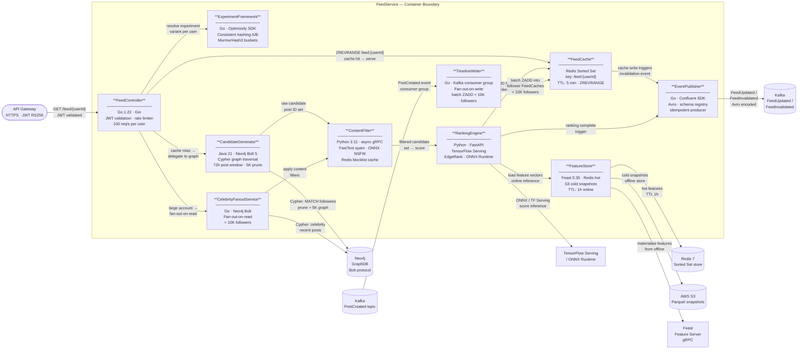

```mermaid
flowchart LR
    KafkaEvt[("Kafka\nFeedUpdated\nCommentAdded\nLikeReceived")]
    KafkaAnalytics[("Kafka\nDelivery Analytics\ntopic")]
    PG[("PostgreSQL\nuser_profile\nnotification_log")]
    RedisRQ[("Redis 7\nRetry sorted set\ndlq:{channel}")]
    FCM["Google FCM\nAPNs HTTP/2\nPush Gateway"]
    SendGrid["SendGrid\nSMTP · REST API\nEmail"]
    Twilio["Twilio\nREST API\nSMS"]
    GRPCCaller(["Internal Services\ngRPC TriggerNotification"])

    subgraph NotificationService["NotificationService — Container Boundary"]
        direction TB

        NC["**NotificationController**\n────────────────\nGo 1.22 · gRPC + REST\nKafka consumer group\nRedis idempotency 30s"]

        UPE["**UserPreferenceEngine**\n────────────────\nGo · pgx · PostgreSQL\nDigest vs real-time\nQuiet hours evaluation\nRedis cache TTL 10min"]

        DR["**DeliveryRouter**\n────────────────\nGo · Strategy pattern\nFCM · APNs · SendGrid\nTwilio · goroutine fan-out\n10s per-adapter timeout"]

        RQ["**RetryQueue**\n────────────────\nRedis sorted set\nSidekiq 7 worker\nExp. backoff + jitter\nmax 3 retries · 1h cap"]

        DRec["**DeliveryReceipt**\n────────────────\nGo · pgx · PostgreSQL\nnotification_log table\nWebhook handler\nKafka analytics sink"]

        UH["**UnsubscribeHandler**\n────────────────\nGo · pgx · PostgreSQL\nRFC 8058 one-click\nFCM deregistration\nGDPR erasure workflow"]
    end

    %% ── Inbound triggers ───────────────────────────────
    KafkaEvt     -->|"FeedUpdated /\nCommentAdded /\nLikeReceived\nconsumer group"| NC
    GRPCCaller   -->|"TriggerNotification\ngRPC unary call"| NC

    %% ── Preference resolution ──────────────────────────
    NC           -->|"resolve channel\nand timing plan"| UPE
    UPE          -->|"SELECT preferences\nquiet hours · digest"| PG

    %% ── Delivery routing ───────────────────────────────
    NC           -->|"dispatch with\nresolved plan"| DR
    DR           -->|"FCM HTTP v1 /\nAPNs HTTP/2 + JWT"| FCM
    DR           -->|"SendGrid REST\nemail delivery"| SendGrid
    DR           -->|"Twilio REST\nSMS delivery"| Twilio

    %% ── Failure handling ───────────────────────────────
    DR           -->|"push on failure\nwith attempt count"| RQ
    RQ           -->|"re-enqueue after\nbackoff delay"| DR

    %% ── Receipt tracking ───────────────────────────────
    DR           -->|"per-channel\nDeliveryResult"| DRec
    DRec         -->|"INSERT notification_log\nstatus · provider_msg_id"| PG
    DRec         -->|"SendGrid open/click\nFCM ack webhooks"| PG
    DRec         -->|"aggregated metrics\ndelivery / open / CTR"| KafkaAnalytics

    %% ── Unsubscribe / GDPR ─────────────────────────────
    UH           -->|"update channel\nopt-out status"| UPE
    UH           -->|"UPDATE preferences\nDELETE notification_log\nGDPR erasure"| PG
    UH           -->|"FCM token\nderegistration"| FCM
```

# C4 Component Diagrams

This document presents C4 Component-level diagrams for two core services in the Social Networking Platform: **FeedService** and **NotificationService**. Each diagram exposes the internal components of the service container, their responsibilities, technologies, and the interactions between them and with external systems. Diagrams follow the C4 model convention at the Component level (Level 3), sitting inside a single deployable Container boundary.

---

## FeedService

### Service Overview

The FeedService assembles, ranks, caches, and delivers personalised content feeds to users. It handles both fan-out-on-write (for accounts with fewer than 10K followers) and fan-out-on-read (for celebrity accounts exceeding that threshold). Feed construction combines Neo4j graph traversal, ML-based EdgeRank scoring, A/B experiment assignment, and multi-layer content safety filtering. The service is deployed as a horizontally-scalable set of Go microservices, backed by Python FastAPI ML inference endpoints and a Java-based graph query layer. All components communicate over internal Kubernetes cluster DNS with mTLS enforced by the service mesh (Istio).

### System Boundary

The FeedService container receives authenticated HTTP requests from the API Gateway, consumes domain events from Kafka (`PostCreated`, `FeedUpdated`), reads graph relationships from Neo4j, and persists ranked feed results in Redis Sorted Sets. External ML inference is delegated to TensorFlow Serving and ONNX Runtime endpoints. Feature signals are stored in Feast, backed by Redis for hot online data and S3 Parquet for cold offline snapshots.

### Component Diagram



### Component Descriptions

| Component | Responsibility | Technology Stack |
|---|---|---|
| **FeedController** | HTTP handler for `GET /feed/{userId}`. Validates JWT auth tokens (RS256 via JWKS endpoint), enforces per-user rate limiting at 100 req/s via a Redis token-bucket, resolves the experiment variant from ExperimentFramework, then serves from FeedCache on a hit or delegates to CandidateGenerator on a miss. Returns paginated ranked post IDs with an opaque cursor encoding the last Sorted Set score. | Go 1.22, Gin framework, Kubernetes Ingress (nginx), Redis token bucket, JWKS caching |
| **CandidateGenerator** | Expands the requesting user's follow graph by executing parameterised Cypher queries against Neo4j. Returns post IDs authored by followees within a 72-hour recency window. For users with more than 5K followees, applies breadth-first truncation (sorted by affinity weight) to cap graph traversal depth and bound query latency below 50 ms p99. Streams candidate IDs in batches of 500 to ContentFilter. | Java 21, Neo4j Bolt driver 5.x, Spring Boot, Bolt routing table, reactive streams |
| **RankingEngine** | Scores each candidate post using an EdgeRank-style model: `score = affinity(user, author) × weight(post_type) × time_decay(post_age_hours)`. Loads feature vectors from FeatureStore (user affinity signals, post engagement rates, content type weights) and submits inference batches to TensorFlow Serving or ONNX Runtime. Writes the scored results back to FeedCache as a Redis Sorted Set and triggers EventPublisher on completion. | Python 3.11, FastAPI, TensorFlow Serving 2.x, ONNX Runtime 1.17, NumPy, gRPC server |
| **FeedCache** | Maintains a Redis Sorted Set per user keyed as `feed:{userId}` where members are post IDs and scores are rank floats from RankingEngine. Enforces a 5-minute TTL; expiry triggers the cache-miss read path on the next request. Supports paginated retrieval via `ZREVRANGE … BYSCORE` with a score cursor. Limits each user's Sorted Set to top-500 entries using `ZREMRANGEBYRANK` after every write. | Redis 7.2, go-redis v9 (Go), Jedis 3.x (Java), Sorted Set with TTL, pipeline batch writes |
| **TimelineWriter** | Fan-out-on-write worker for post authors with fewer than 10K followers. Consumes `PostCreated` Kafka events, resolves the author's follower list from a follower-list cache (Redis) or Neo4j fallback, computes a pre-rank score based on recency and author affinity, and performs batch `ZADD` operations into each follower's FeedCache. Commits Kafka offsets only after all ZADD operations succeed, ensuring at-least-once delivery. | Go 1.22, confluent-kafka-go, Kafka consumer group, Redis pipeline batch, offset commit on ack |
| **CelebrityFanoutService** | Fan-out-on-read strategy for post authors with more than 10K followers. Does not pre-populate follower caches at write time. At read time, FeedController delegates to this service, which queries Neo4j for the celebrity's recent posts, pipes them through ContentFilter, scores them via RankingEngine, and merges the results into the requesting user's assembled feed ranked set. Uses a per-request short-lived cache (30s) for celebrity post lists to avoid redundant Neo4j queries under high read concurrency. | Go 1.22, Neo4j Bolt driver, internal gRPC to ContentFilter and RankingEngine, in-process LRU cache |
| **EventPublisher** | Publishes `FeedUpdated` and `FeedInvalidated` domain events to Kafka using Avro-encoded messages validated against the Confluent Schema Registry. Configured as an idempotent producer (`acks=all`, `enable.idempotence=true`, `retries=MAX_INT`) to guarantee exactly-once delivery semantics within the producer epoch. Events are consumed by the NotificationService, analytics pipeline, and cache invalidation workers. | Go 1.22, Confluent Kafka Go SDK, Avro schema registry client, idempotent producer configuration |
| **FeatureStore** | Two-tier feature storage: Redis for hot online user interaction signals (likes, shares, comments, dwell-time per post, author follow strength) with a 1-hour TTL; AWS S3 Parquet for cold offline snapshots consumed by batch training jobs. Feast orchestrates feature materialisation from offline to online on a 15-minute schedule. Exposes features to RankingEngine via a gRPC feature server with sub-5 ms p99 latency on the Redis-backed hot path. | Redis 7.2 (online store), AWS S3 + Apache Parquet (offline), Feast 0.35 feature server, gRPC |
| **ExperimentFramework** | Assigns each user to a feed algorithm experiment variant using consistent hashing (MurmurHash3 mod bucket count) to ensure stable, repeatable assignment across requests without per-request DB lookups. Tracks active experiments: ranking model version, candidate generation strategy, celebrity threshold, and UI layout variant. Ships experiment metadata in the feed response envelope so the API Gateway and client can apply variant-specific rendering. Reports exposure events and metric deltas to the analytics Kafka topic. | Go 1.22, Optimizely Go SDK (or custom flag evaluation engine), consistent hashing ring, Kafka sink |
| **ContentFilter** | Removes ineligible posts from the candidate set before scoring. Applies four sequential filter layers: (1) user-defined blocklist and muted-account list loaded from Redis; (2) platform policy blocklist refreshed daily into Redis; (3) spam detection using a FastText binary classifier at threshold 0.85; (4) NSFW detection using a fine-tuned ResNet-50 model served via ONNX Runtime. Exposes an async gRPC endpoint to accept batched candidate post IDs and return filtered results with rejection reasons for audit logging. | Python 3.11, FastText 0.9.2, ONNX Runtime 1.17, Redis 7.2 (blocklist), async gRPC, Prometheus metrics |

### Component Relationships

**Read Path — Warm Cache**

When a user requests their feed and the `feed:{userId}` Sorted Set exists in Redis with valid entries, FeedController serves the response entirely from FeedCache using `ZREVRANGE … BYSCORE`. ExperimentFramework is consulted on every request (in-process, sub-millisecond via consistent hash) to attach the correct experiment variant metadata to the response envelope. No Neo4j traversal, ContentFilter invocation, or RankingEngine inference is triggered.

**Read Path — Cache Miss**

On cache miss (TTL expiry or first-time request), FeedController delegates to CandidateGenerator. CandidateGenerator executes a parameterised Cypher query against Neo4j, walking the follow graph and collecting post IDs from followees' activity within a 72-hour window. Candidates are streamed in batches of 500 to ContentFilter, which applies blocklist, spam, and NSFW layers sequentially. The filtered set is forwarded to RankingEngine. RankingEngine loads feature vectors from FeatureStore's Redis hot path and submits scored inference batches to TensorFlow Serving. Ranked results are written back into FeedCache. EventPublisher emits a `FeedUpdated` event upon successful cache population.

**Write Path — Fan-out-on-Write**

When a user with fewer than 10K followers creates a post, the `PostCreated` Kafka event is consumed by TimelineWriter. TimelineWriter resolves the author's follower list (from a Redis follower-list cache, falling back to Neo4j on cache miss), computes a pre-rank score using `recency × base_affinity_weight`, and performs batch `ZADD` operations against each follower's `feed:{followerId}` Sorted Set. After writing, `ZREMRANGEBYRANK feed:{followerId} 0 -501` prunes entries beyond rank 500. Kafka offsets are committed only after all ZADD operations in the batch succeed.

**Write Path — Fan-out-on-Read (Celebrity Accounts)**

When an account with more than 10K followers creates a post, no pre-population occurs. CelebrityFanoutService intercepts the read request from FeedController, queries Neo4j for the celebrity's recent posts (72-hour window, capped at 200 candidates), routes them through ContentFilter, scores them via RankingEngine, and merges the resulting ranked entries into the user's assembled feed. Celebrity post lists are cached in-process for 30 seconds to absorb concurrent read traffic spikes.

---

## NotificationService

### Service Overview

The NotificationService delivers real-time and digest notifications to users across three channels: push (FCM/APNs), email (SendGrid), and SMS (Twilio). It consumes domain events from Kafka, enforces user-defined notification preferences and quiet-hours windows, routes deliveries through channel-specific adapters using the Strategy pattern, and tracks delivery receipts for analytics. Failures are handled by a dead-letter retry queue with exponential backoff and full jitter. GDPR right-to-erasure flows and RFC 8058 one-click email unsubscribe are managed by a dedicated UnsubscribeHandler.

### System Boundary

The NotificationService container consumes events from Kafka topics (`FeedUpdated`, `CommentAdded`, `LikeReceived`) and exposes a gRPC API (`TriggerNotification`) for direct invocation from other internal services. It reads and writes user preference data from PostgreSQL, stores retry state in Redis, logs delivery attempts to the `notification_log` PostgreSQL table, and integrates with three external delivery providers: Google FCM, Apple APNs, SendGrid, and Twilio. Delivery analytics events are published to a Kafka analytics topic consumed by the BI pipeline.

### Component Diagram



### Component Descriptions

| Component | Responsibility | Technology Stack |
|---|---|---|
| **NotificationController** | Entry point for all notification triggers. Consumes events from three Kafka topics (`FeedUpdated`, `CommentAdded`, `LikeReceived`) via a consumer group with manual offset commit after successful downstream hand-off. Exposes a gRPC unary endpoint (`TriggerNotification`) for synchronous dispatch from internal services (e.g., DirectMessageService, MentionService). Applies a 30-second idempotency window keyed on `notif:{userId}:{eventType}:{sourceEntityId}` in Redis to suppress duplicate events from Kafka at-least-once redelivery. Routes surviving events to UserPreferenceEngine before any delivery action. | Go 1.22, gRPC/protobuf, confluent-kafka-go, Redis idempotency key with 30s TTL, manual offset commit |
| **UserPreferenceEngine** | Reads and evaluates per-user notification preferences from the PostgreSQL `user_profile` table. Determines per-channel opt-in status (push/email/SMS independently), whether the user has selected digest delivery (hourly or daily batching) versus real-time, and whether the current timestamp falls within the user's configured quiet-hours window (stored as JSONB in PostgreSQL). Returns a resolved DeliveryPlan struct indicating which channels to activate and whether to enqueue for digest aggregation or deliver immediately. Caches resolved plans in Redis for 10 minutes to reduce database load. | Go 1.22, pgx v5 PostgreSQL driver, Redis 7.2 (plan cache, TTL 10 min), JSONB preference schema |
| **DeliveryRouter** | Implements the Strategy pattern with three registered channel adapters: FCM/APNs (push), SendGrid (email), and Twilio (SMS). For users with multiple active channels, fans out concurrently by launching one goroutine per channel with a 10-second per-adapter context deadline. Each adapter returns a typed `DeliveryResult{channel, status, providerMsgID, failureReason}`. On success, the result is forwarded to DeliveryReceipt. On failure (`token_invalid`, `smtp_bounce`, `sms_undeliverable`, `timeout`), the result is pushed to RetryQueue. A failure on one channel does not cancel goroutines for other channels. | Go 1.22, FCM HTTP v1 API (OAuth2), APNs HTTP/2 + JWT, SendGrid Go SDK v3, Twilio REST client |
| **RetryQueue** | Handles all delivery failures from DeliveryRouter. Failed notification payloads are serialised (protobuf) and inserted into a Redis Sorted Set keyed `retry:{channel}`, scored by the next-attempt Unix epoch computed as: `next = now + min(3600, random(0, base × 2^attempt))` (full jitter exponential backoff, `base = 5s`, cap 1 hour). A Sidekiq 7 background worker (or Kafka retry-topic consumer group) polls the Sorted Set every 5 seconds with `ZRANGEBYSCORE … LIMIT 100` and resubmits eligible entries to DeliveryRouter. After three failed attempts, entries are moved to `dlq:{channel}` and a PagerDuty alert event is emitted. | Redis 7.2 (sorted set), Sidekiq 7.x with Redis backend, exponential backoff with full jitter, dead-letter set |
| **DeliveryReceipt** | Records every delivery attempt in the PostgreSQL `notification_log` table with columns: `notification_id UUID`, `user_id`, `channel`, `status` (pending/delivered/failed/opened/clicked/bounced), `provider_message_id`, `attempted_at TIMESTAMPTZ`, `delivered_at TIMESTAMPTZ`, `failure_reason TEXT`. Processes inbound provider webhooks: SendGrid Event Webhook (open, click, bounce, spam report) and FCM delivery receipts update the corresponding log row. Computes rolling delivery analytics (delivery rate, open rate, click-through rate by campaign, channel, and template) and publishes aggregated metric events to the Kafka analytics topic every 60 seconds. | Go 1.22, pgx v5, Kafka producer (analytics topic), SendGrid webhook verifier, FCM receipt handler |
| **UnsubscribeHandler** | Implements RFC 8058 one-click unsubscribe: all outbound emails include a `List-Unsubscribe-Post` header pointing to this handler's HTTP endpoint; a POST to that endpoint opts the user out of the relevant notification type without requiring login. Handles FCM token deregistration when DeliveryRouter receives a `registration_id_not_registered` response (device token expired) or when a user explicitly revokes push permission via the app settings API. Propagates all preference changes to UserPreferenceEngine by updating `user_profile.notification_preferences` and invalidating the Redis plan cache. For GDPR Right-to-Erasure requests, deletes all rows from `notification_log` for the subject user, removes FCM and APNs token mappings, clears Redis idempotency and cache keys, and publishes an `ErasureCompleted` event to Kafka for downstream services. | Go 1.22, pgx v5, RFC 8058 HTTP handler, FCM management API, GDPR erasure transaction, Kafka producer |

### Component Relationships

**Event-Driven Notification Trigger**

Kafka events emitted by upstream services (FeedService's `FeedUpdated`, CommentService's `CommentAdded`, ReactionService's `LikeReceived`) are consumed by NotificationController in a consumer group (`notification-service-cg`). Consumer instances are partitioned by `userId` key to ensure ordering guarantees per user. Before any processing, the controller evaluates the Redis idempotency key for a 30-second window; duplicate events are acknowledged and skipped. Valid events are forwarded synchronously to UserPreferenceEngine for preference resolution before delivery routing begins.

**Preference-Aware Delivery**

UserPreferenceEngine queries the PostgreSQL `user_profile` table (with a 10-minute Redis cache layer) to build a DeliveryPlan for each notification trigger. The plan includes: which channels are active (`push_enabled`, `email_enabled`, `sms_enabled`), whether the notification type falls within user-configured digest batching, and whether the current UTC time is within the user's quiet-hours window. Notifications falling within quiet hours are shelved in a Redis delay queue scored by the quiet-hours end timestamp and re-queued for delivery when the window closes. Digest-mode notifications are accumulated in a Redis List keyed `digest:{userId}:{period}` and flushed by a scheduled digest worker at the configured interval.

**Multi-Channel Fan-out**

DeliveryRouter fans out concurrently across all channels in the resolved DeliveryPlan. Each channel adapter runs in an independent goroutine bounded by a 10-second context deadline. The router waits for all goroutines to complete or time out, collecting a slice of `DeliveryResult` values. Results are forwarded to DeliveryReceipt in bulk. Failed results are individually enqueued into RetryQueue with their original payload, attempt count, and failure classification. A timeout result on one channel is treated identically to a transient failure and retried with backoff.

**Retry and Dead-Letter Flow**

RetryQueue stores failed delivery attempts in a Redis Sorted Set scored by next-attempt epoch. A Sidekiq worker polls the set every 5 seconds, fetches entries eligible for retry (`score ≤ now()`), deserialises the notification payload, and re-invokes DeliveryRouter for the specific failed channel. The attempt counter in the payload is incremented before re-enqueueing. After three failed attempts, the entry is atomically moved from `retry:{channel}` to `dlq:{channel}` using a Lua script to prevent race conditions between worker instances. Dead-letter entries are retained for 7 days for manual inspection and replay tooling.

**Delivery Tracking and Analytics**

Every delivery attempt — successful or failed — is written to the `notification_log` table via DeliveryReceipt using pgx batch inserts to reduce round-trips. Provider webhooks update existing log rows: SendGrid's Event Webhook (verified via X-Twilio-Email-Event-Webhook-Signature) updates status to `opened`, `clicked`, or `bounced`; FCM delivery receipts update `delivered_at`. Aggregated metrics (delivery rate, open rate, click-through rate segmented by channel, campaign, and notification type) are computed as 60-second rolling aggregations and published to the Kafka `notification.analytics.v1` topic, where they are consumed by the BI pipeline (Apache Spark) and by the real-time Grafana dashboard via Kafka Streams.

**Unsubscribe and GDPR Erasure**

UnsubscribeHandler exposes a public HTTP endpoint that processes RFC 8058 `List-Unsubscribe-Post` requests for email notifications. All outbound emails generated by DeliveryRouter's SendGrid adapter include `List-Unsubscribe` and `List-Unsubscribe-Post` headers pointing to this endpoint with a signed token encoding `(userId, notificationType, channel)`. On invocation, the handler verifies the token signature (HMAC-SHA256), writes an opt-out record to `user_profile.notification_preferences`, invalidates the UserPreferenceEngine Redis cache for the affected user, and returns HTTP 200. For FCM token deregistration, the handler accepts both automatic triggers (from DeliveryRouter forwarding `registration_id_not_registered` errors) and explicit user-initiated calls. GDPR erasure executes within a single PostgreSQL transaction: deletes all `notification_log` rows for the user, removes the user's preference row, clears Redis keys, and publishes an `ErasureCompleted` Kafka event with the subject's `userId` so downstream services can process their own data obligations.

---

## Design Decisions

### Fan-out Strategy Threshold

The 10K follower threshold separating fan-out-on-write (TimelineWriter) from fan-out-on-read (CelebrityFanoutService) is maintained as a runtime flag in ExperimentFramework rather than a hard-coded constant. This allows the threshold to be adjusted per deployment environment or progressively rolled back if write amplification becomes excessive for mid-tier accounts in the 5K–50K follower range. The flag supports gradual percentage rollout per user cohort to evaluate the latency trade-off between the two strategies at intermediate follower counts.

### Feed Cache TTL and Freshness

A 5-minute TTL on FeedCache balances content freshness with backend load reduction. During a TTL window, posts created by followees will not surface in an already-cached feed. TimelineWriter mitigates this for non-celebrity accounts by eagerly writing new post IDs into follower caches on creation (fan-out-on-write), providing near-real-time feed updates without requiring cache expiry. For celebrity accounts, CelebrityFanoutService's 30-second in-process post-list cache bounds the staleness of celebrity content to 30 seconds at the cost of slightly elevated Neo4j read traffic during the post-list cache warm-up period.

### Notification Channel Isolation

Failures in one delivery channel must not prevent delivery on other channels. DeliveryRouter enforces this by bounding each goroutine with an independent context and collecting results after all goroutines complete or time out. The retry and dead-letter path operates at the individual channel level: a successful push delivery is never re-attempted even if email bounced simultaneously. This design prevents a degraded SendGrid connection from causing push notification latency.

### Feature Store Tiering and Materialisation Lag

FeatureStore uses Redis for features that require sub-5ms retrieval during online inference. S3-backed Parquet snapshots serve as the offline store for batch model training and backfill operations. The Feast materialisation pipeline (offline → online) runs every 15 minutes. Features that change slowly (e.g., long-term author affinity scores computed by a weekly batch job) are tolerated to be up to 15 minutes stale in online inference. High-frequency interaction signals (likes, comments within the current session) are written directly to Redis by the interaction ingestion service and bypass the materialisation lag, ensuring the RankingEngine sees signals from the current user session during online inference.

### Idempotency Across Kafka Redelivery

Both FeedService's EventPublisher and NotificationService's NotificationController address Kafka's at-least-once delivery guarantee through complementary mechanisms. EventPublisher uses idempotent producer configuration (`enable.idempotence=true`, `acks=all`) to prevent broker-level duplicate production. NotificationController applies a consumer-side 30-second Redis idempotency window to suppress duplicates arising from consumer group rebalances or offset rewind during crash recovery. The combination of producer-side idempotence and consumer-side deduplication provides end-to-end exactly-once effective delivery semantics for notification triggers.

---

## Service-Level Objectives

### FeedService SLOs

| Metric | Target | Measurement Window |
|---|---|---|
| Feed read latency (p50, cache hit) | ≤ 20 ms | Rolling 5 min |
| Feed read latency (p99, cache hit) | ≤ 80 ms | Rolling 5 min |
| Feed read latency (p99, cache miss — full pipeline) | ≤ 800 ms | Rolling 5 min |
| Feed availability (successful responses / total) | ≥ 99.9% | Rolling 28 days |
| CandidateGenerator Neo4j query latency (p99) | ≤ 50 ms | Rolling 5 min |
| RankingEngine inference latency (p99, batch of 500) | ≤ 120 ms | Rolling 5 min |
| ContentFilter throughput | ≥ 5,000 candidates/s per instance | Sustained load |
| TimelineWriter fan-out lag (PostCreated → FeedCache write) | ≤ 2 s (p99) | Rolling 5 min |
| FeedCache hit rate | ≥ 85% | Rolling 1 hour |
| ExperimentFramework assignment latency | ≤ 1 ms (in-process) | Per-request |

### NotificationService SLOs

| Metric | Target | Measurement Window |
|---|---|---|
| Push notification delivery latency (p50) | ≤ 500 ms | Rolling 5 min |
| Push notification delivery latency (p99) | ≤ 3 s | Rolling 5 min |
| Email delivery latency (p50, real-time mode) | ≤ 5 s | Rolling 5 min |
| SMS delivery latency (p99) | ≤ 10 s | Rolling 5 min |
| Notification delivery availability | ≥ 99.5% | Rolling 28 days |
| Retry queue drain time (after transient failure) | ≤ 15 min | Per incident |
| Dead-letter rate (exhausted retries / total attempts) | ≤ 0.1% | Rolling 24 hours |
| Preference resolution latency (p99, cache hit) | ≤ 5 ms | Rolling 5 min |
| GDPR erasure completion time | ≤ 30 days (SLA) / ≤ 24 h (internal target) | Per request |

---

## Observability

### FeedService Instrumentation

Each FeedService component emits structured logs (JSON, via zap in Go and structlog in Python), Prometheus metrics, and OpenTelemetry distributed traces. Traces are propagated across component boundaries using W3C TraceContext headers over gRPC and HTTP.

| Component | Key Metrics | Key Trace Spans |
|---|---|---|
| **FeedController** | `feed_request_total{status}`, `feed_request_duration_seconds{cache_hit}`, `rate_limit_rejected_total` | `feed.controller.handle`, `feed.controller.jwt_verify` |
| **CandidateGenerator** | `candidate_query_duration_seconds`, `candidate_count_histogram`, `neo4j_connection_pool_utilization` | `candidate.neo4j.cypher`, `candidate.prune` |
| **RankingEngine** | `ranking_inference_duration_seconds`, `ranking_batch_size_histogram`, `tf_serving_error_total` | `ranking.feature_load`, `ranking.inference`, `ranking.cache_write` |
| **FeedCache** | `cache_hit_total`, `cache_miss_total`, `cache_eviction_total`, `redis_op_duration_seconds` | `cache.zrevrange`, `cache.zadd`, `cache.zremrangebyrank` |
| **TimelineWriter** | `fanout_write_total`, `fanout_lag_seconds`, `kafka_consumer_lag{topic,partition}` | `writer.consume`, `writer.resolve_followers`, `writer.batch_zadd` |
| **ContentFilter** | `filter_pass_total`, `filter_reject_total{reason}`, `classifier_inference_duration_seconds` | `filter.blocklist`, `filter.spam_classify`, `filter.nsfw_classify` |
| **ExperimentFramework** | `experiment_assignment_total{variant}`, `experiment_exposure_total{experiment_id}` | `experiment.assign` |
| **EventPublisher** | `event_publish_total{topic}`, `event_publish_error_total`, `kafka_producer_queue_depth` | `publisher.produce` |

### NotificationService Instrumentation

| Component | Key Metrics | Key Trace Spans |
|---|---|---|
| **NotificationController** | `notification_trigger_total{source,event_type}`, `idempotency_skip_total`, `kafka_consumer_lag{topic}` | `notification.controller.consume`, `notification.controller.dedup` |
| **UserPreferenceEngine** | `preference_resolution_duration_seconds`, `preference_cache_hit_total`, `quiet_hours_skip_total` | `preference.resolve`, `preference.db_query` |
| **DeliveryRouter** | `delivery_attempt_total{channel}`, `delivery_success_total{channel}`, `delivery_failure_total{channel,reason}`, `delivery_duration_seconds{channel}` | `router.fanout`, `router.fcm`, `router.sendgrid`, `router.twilio` |
| **RetryQueue** | `retry_enqueue_total{channel}`, `retry_attempt_total{channel,attempt_number}`, `dlq_move_total{channel}` | `retry.enqueue`, `retry.dequeue`, `retry.resubmit` |
| **DeliveryReceipt** | `receipt_insert_total`, `webhook_received_total{provider,event_type}`, `analytics_publish_total` | `receipt.insert`, `receipt.webhook_update` |
| **UnsubscribeHandler** | `unsubscribe_total{channel,method}`, `gdpr_erasure_total`, `fcm_deregister_total` | `unsubscribe.process`, `unsubscribe.gdpr_erasure` |

---

## Key Data Schemas

### FeedService — Redis Sorted Set Structure

```
Key:    feed:{userId}                  (e.g., feed:usr_01HXZ3GKVM9)
Type:   Sorted Set
Member: {postId}                       (e.g., post_01HXZABCDEF)
Score:  float64 rank score             (e.g., 0.8734521)
TTL:    300 seconds (5 min)
Max entries per key: 500 (ZREMRANGEBYRANK enforced after each write)
```

Members pruned with `ZREMRANGEBYRANK feed:{userId} 0 -501` immediately after each batch ZADD to prevent unbounded growth. Score encodes the EdgeRank result: higher score = higher rank = returned first by `ZREVRANGE`.

### FeedService — PostCreated Kafka Event Schema (Avro)

```json
{
  "namespace": "com.socialnetwork.feed.events",
  "type": "record",
  "name": "PostCreated",
  "fields": [
    { "name": "post_id",      "type": "string" },
    { "name": "author_id",    "type": "string" },
    { "name": "created_at",   "type": { "type": "long", "logicalType": "timestamp-millis" } },
    { "name": "content_type", "type": { "type": "enum", "name": "ContentType", "symbols": ["TEXT", "IMAGE", "VIDEO", "LINK", "POLL"] } },
    { "name": "media_urls",   "type": { "type": "array", "items": "string" }, "default": [] },
    { "name": "follower_count", "type": "long" },
    { "name": "tags",         "type": { "type": "array", "items": "string" }, "default": [] }
  ]
}
```

### NotificationService — notification_log Table Schema

```sql
CREATE TABLE notification_log (
    notification_id     UUID            PRIMARY KEY DEFAULT gen_random_uuid(),
    user_id             TEXT            NOT NULL,
    event_type          TEXT            NOT NULL,
    source_entity_id    TEXT            NOT NULL,
    channel             TEXT            NOT NULL CHECK (channel IN ('push', 'email', 'sms')),
    status              TEXT            NOT NULL DEFAULT 'pending'
                                        CHECK (status IN ('pending', 'delivered', 'failed', 'opened', 'clicked', 'bounced', 'unsubscribed')),
    provider_message_id TEXT,
    failure_reason      TEXT,
    retry_count         SMALLINT        NOT NULL DEFAULT 0,
    attempted_at        TIMESTAMPTZ     NOT NULL DEFAULT now(),
    delivered_at        TIMESTAMPTZ,
    opened_at           TIMESTAMPTZ,
    clicked_at          TIMESTAMPTZ,
    created_at          TIMESTAMPTZ     NOT NULL DEFAULT now()
);

CREATE INDEX idx_notification_log_user_id       ON notification_log (user_id, created_at DESC);
CREATE INDEX idx_notification_log_status        ON notification_log (status) WHERE status IN ('pending', 'failed');
CREATE INDEX idx_notification_log_source_entity ON notification_log (source_entity_id, event_type);
```

### NotificationService — DeliveryPlan Internal Struct

```go
type DeliveryPlan struct {
    UserID          string
    NotificationID  string
    EventType       string
    Channels        []ChannelConfig
    DigestMode      bool
    DigestPeriod    DigestPeriod // HOURLY | DAILY
    QuietHoursActive bool
    QuietHoursEnd   time.Time
}

type ChannelConfig struct {
    Channel    Channel // PUSH | EMAIL | SMS
    PushToken  string  // FCM registration token or APNs device token
    EmailAddr  string
    PhoneNumber string
    Platform   Platform // ANDROID | IOS
}
```

---

## Infrastructure and Scaling Notes

### FeedService Scaling

FeedController and TimelineWriter are stateless Go binaries deployed as Kubernetes Deployments with Horizontal Pod Autoscaler (HPA) configured on CPU utilisation (target 60%) and custom feed request latency metrics via KEDA. The RankingEngine and ContentFilter are deployed as separate Python Deployments behind internal ClusterIP Services; they scale independently on GPU utilisation (RankingEngine) and CPU utilisation (ContentFilter). CandidateGenerator runs as a Java Deployment with JVM heap tuned to 4 GB per pod; Neo4j connection pool size is set to 25 connections per pod with Bolt routing awareness for the Neo4j Causal Cluster.

Redis FeedCache is deployed as a Redis Cluster (6 shards, 3 replicas per shard) to distribute the per-user Sorted Set load. Shard assignment uses consistent hashing on `userId`. FeatureStore Redis is a separate Redis Sentinel cluster (3 sentinels, 1 primary, 2 replicas) with persistence (`appendonly yes`, `appendfsync everysec`).

### NotificationService Scaling

NotificationController scales on Kafka consumer lag (KEDA KafkaLag scaler, target lag 1000 messages per partition per replica). DeliveryRouter pods scale on the sum of in-flight goroutine count and outbound HTTP connection pool utilisation. Sidekiq workers for RetryQueue are deployed as a separate Kubernetes Deployment scaled on the Redis retry sorted-set cardinality using a KEDA Redis List scaler.

All PostgreSQL writes from DeliveryReceipt use pgx batch-insert mode to reduce the number of round-trips per Kafka batch; the `notification_log` table is partitioned by `created_at` (monthly range partitions) to support efficient partition detachment for data retention enforcement (90-day retention policy). A pg_partman cron job creates future partitions and drops expired ones automatically.

### Network Topology

All intra-cluster communication between FeedService components uses Kubernetes internal DNS (`component.namespace.svc.cluster.local`) over gRPC with TLS terminated by Istio sidecar proxies (mutual TLS, Istio PeerAuthentication policy set to STRICT). Cross-service HTTP calls to TensorFlow Serving and Feast use HTTP/2 with connection multiplexing. External provider calls from NotificationService's DeliveryRouter (FCM, SendGrid, Twilio) egress through a dedicated NAT gateway with a static IP address allowlisted by each provider for IP-based rate limit attribution.
