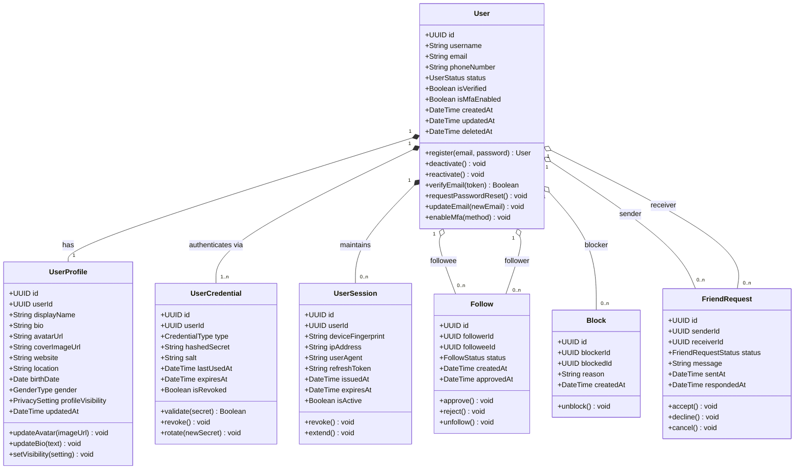
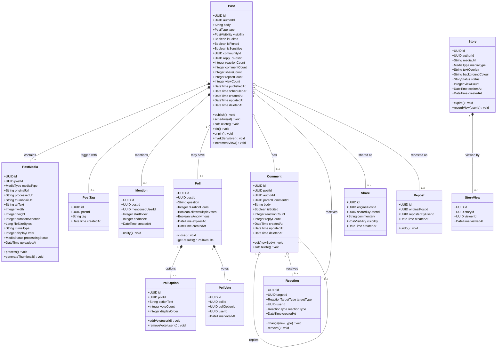
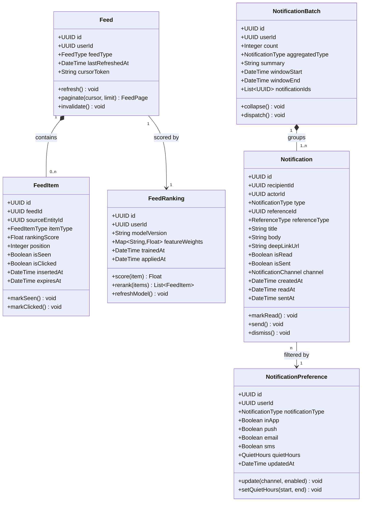
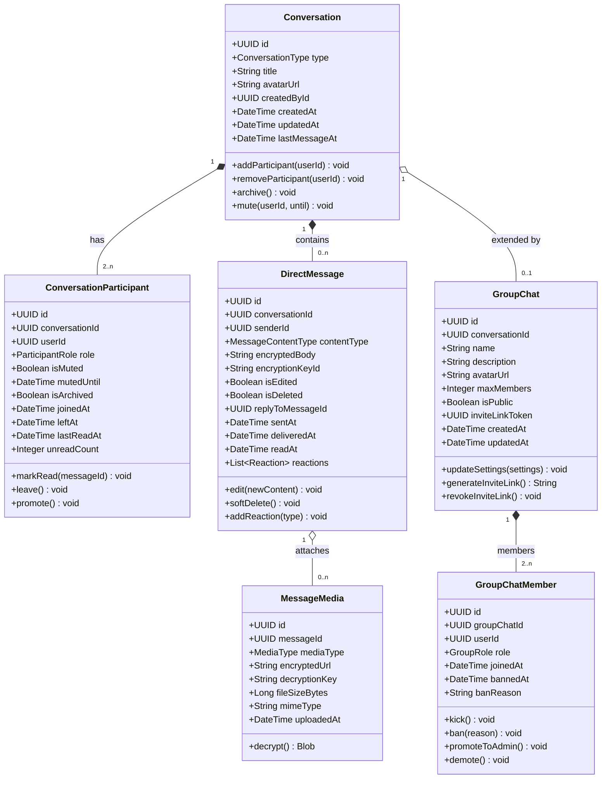
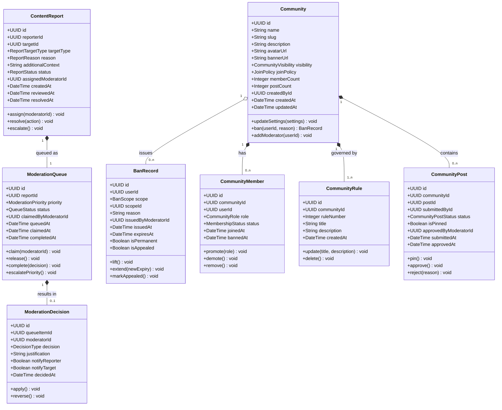
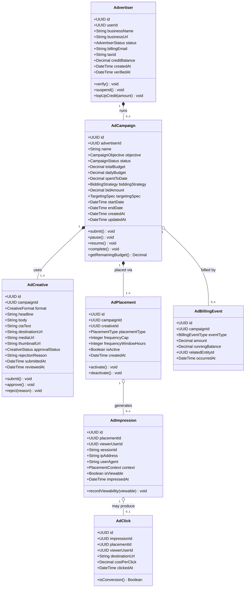

# Class Diagrams — Social Networking Platform

## 1. Overview

This document captures the detailed object-oriented class model for the Social Networking Platform. Each domain section contains a Mermaid `classDiagram` that shows attributes, methods, and inter-class relationships. Together these diagrams form the authoritative blueprint for entity modelling, ORM schema generation, and API contract design.

Relationship notation used throughout:
- `<|--` inheritance / extends
- `*--` composition (strong ownership)
- `o--` aggregation (loose ownership)
- `-->` directed association
- `..>` dependency

---

## 2. User Domain

Covers identity, authentication credentials, social graph edges (follow / block / friend request), and profile metadata.

---

## 3. Content Domain

Models all user-generated content: posts, media attachments, stories, polls, comments, reactions, shares, and reposts.

---

## 4. Feed & Notification Domain

Captures the structures that power personalised feed delivery and in-app/push notification dispatch.

---

## 5. Messaging Domain

Models direct messages and group chats with end-to-end encryption metadata.

---

## 6. Moderation & Community Domain

Captures content moderation workflows, community spaces, and membership governance.

---

## 7. Advertising Domain

Models the full ad lifecycle from campaign creation through impression and click tracking.

