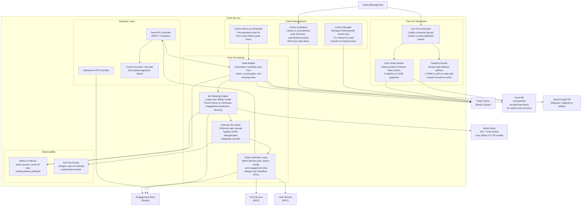
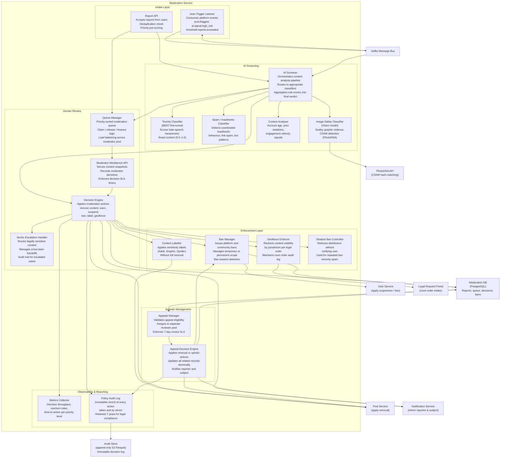

# Component Diagrams — Social Networking Platform

## 1. Overview

This document decomposes the platform's most complex services into their internal software components, showing how data and control flow between them. The diagrams use Mermaid `graph TD` with subgraphs to delineate service boundaries. External dependencies (databases, caches, message queues) appear outside the service boundary to clarify integration points.

Each service boundary corresponds to a separately deployable unit. Components within a service share memory and communicate via in-process function calls or internal async workers; cross-service communication always transits the message bus or synchronous RPC.

---

## 2. Feed Service

The Feed Service is responsible for assembling, ranking, caching, and serving the personalised home feed, explore feed, and notification-driven feeds for every active user.

### Component Responsibilities

| Component | Responsibility |
|---|---|
| **Feed Builder** | Merges push-written items (cache) with pull-on-read candidates for high-follower authors. Applies recency cutoff (7 days for home feed). |
| **ML Ranking Engine** | Loads per-user affinity models, scores each candidate using weighted features (freshness 30%, predicted CTR 50%, diversity 20%). |
| **Diversity Re-ranker** | Prevents consecutive posts from the same author, enforces topic spread across interest categories, injects sponsored slots at configured positions. |
| **Entity Hydration Layer** | Batch-fetches post bodies, author summaries, engagement counts, and media URLs via parallel RPC calls. Reduces per-item latency to a single parallel round-trip. |
| **Fan-Out Consumer** | Pulls `post.published` events from Kafka and triggers push writes to all follower feed caches. |
| **Celebrity Router** | For accounts with >100k followers, bypasses push-write to avoid write amplification; feed builder pulls their latest posts on demand. |
| **Cache Manager** | Maintains `feed:{userId}` Redis sorted sets, enforces max-500-item caps via `LTRIM`, and refreshes TTL on every read. |
| **Cache Warm-up Scheduler** | Runs 30 minutes before predicted peak traffic, pre-building feeds for the top 10% of DAU users. |
| **Cache Invalidator** | Consumes `post.deleted`, `post.removed`, and `user.blocked` events; removes stale feed items in real time. |
| **A/B Test Router** | Deterministically assigns users to ranking model variants based on userId hash; emits experiment exposure events. |

---

## 3. Messaging Service

The Messaging Service handles all real-time direct messages and group chats with end-to-end encryption key management, delivery receipts, and cross-device push notification.

```mermaid
graph TD
    subgraph MessagingService["Messaging Service"]
        direction TB

        subgraph Transport["Transport Layer"]
            WSGateway["WebSocket Gateway\nPersistent connections per device\nAuthentication on handshake\nHeartbeat / reconnect handling"]
            RESTAdapter["REST Adapter\nFallback for clients that\ncannot hold WebSocket connections"]
            PresenceManager["Presence Manager\nTracks online/away/offline status\nBroadcasts presence to open conversations"]
        end

        subgraph Routing["Message Routing"]
            MessageRouter["Message Router\nFanout to all devices of\neach conversation participant\nRoutes to WebSocket or Push path"]
            DeliveryTracker["Delivery Tracker\nUpdates sent→delivered→read\nReceipt timestamps per device"]
            OfflineBuffer["Offline Message Buffer\nQueues messages for offline users\nDrains on reconnect (ordered by sentAt)"]
        end

        subgraph Encryption["Encryption Management"]
            EncryptionManager["Encryption Manager\nSignal Protocol key management\nKey bundle registration per device\nRatchet state maintenance"]
            KeyDistributor["Key Distributor\nServes recipient public key bundles\nto senders before first message\nValidates key freshness"]
        end

        subgraph Persistence["Persistence Layer"]
            ConversationManager["Conversation Manager\nCreate / update conversations\nManage participants, roles, settings\nHandle group membership events"]
            MessageStore["Message Store\nPersists encrypted message ciphertext\nManages TTL for disappearing messages\nHandles edit and soft-delete"]
            ReadReceiptStore["Read Receipt Store\nBatch-updates lastReadAt per participant\nComputes per-user unread counts"]
        end

        subgraph PushDelivery["Push Delivery"]
            PushDispatcher["Push Dispatcher\nSends FCM (Android) and APNs (iOS)\npayloads for offline users\nIncludes encrypted notification body"]
            PushTokenRegistry["Push Token Registry\nStores device tokens per userId\nExpires stale tokens on delivery failure"]
        end

        subgraph Moderation["Messaging Moderation"]
            SpamFilter["Spam Filter\nDetects unsolicited bulk messages\nRate-limits and flags suspicious senders"]
            ContentScanner["Content Scanner\nClient-side scanning hash check (CSAM)\nServer-side metadata signals"]
        end
    end

    %% External
    AuthService["Auth Service\n(JWT validation)"]
    UserService["User Service\n(profile, block list)"]
    NotifService["Notification Service\n(in-app badges)"]
    MessageDB["Message DB\n(Cassandra)\npartitioned by conversation_id"]
    PresenceCache["Presence Cache\n(Redis)\nonline:{userId}"]
    KafkaBus["Kafka Message Bus"]
    FCM["Firebase Cloud Messaging"]
    APNs["Apple Push Notification Service"]

    %% Transport connections
    WSGateway --> AuthService
    WSGateway --> PresenceManager
    WSGateway --> MessageRouter
    RESTAdapter --> MessageRouter

    %% Routing
    MessageRouter --> PresenceCache
    MessageRouter --> PresenceManager
    MessageRouter --> DeliveryTracker
    MessageRouter --> OfflineBuffer
    MessageRouter --> SpamFilter
    MessageRouter --> ContentScanner
    MessageRouter --> PushDispatcher
    DeliveryTracker --> MessageDB
    OfflineBuffer --> MessageDB

    %% Encryption
    MessageRouter --> EncryptionManager
    EncryptionManager --> KeyDistributor
    EncryptionManager --> MessageDB

    %% Persistence
    MessageRouter --> ConversationManager
    ConversationManager --> MessageDB
    ConversationManager --> UserService
    MessageStore --> MessageDB
    ReadReceiptStore --> MessageDB

    %% Push
    PushDispatcher --> PushTokenRegistry
    PushDispatcher --> FCM
    PushDispatcher --> APNs
    PushDispatcher --> NotifService

    %% Events
    ConversationManager --> KafkaBus
    DeliveryTracker --> KafkaBus
```

### Component Responsibilities

| Component | Responsibility |
|---|---|
| **WebSocket Gateway** | Maintains one persistent connection per authenticated device; dispatches inbound messages to the router and pushes outbound events to the correct socket. |
| **Presence Manager** | Uses Redis TTL-based keys to track online status; broadcasts `user.online` / `user.offline` events to open conversation channels. |
| **Message Router** | The central fanout hub; determines which participants are online (WebSocket path) vs offline (push path) and routes accordingly. |
| **Delivery Tracker** | Maintains `sent`, `delivered`, and `read` timestamps; batches read receipt updates to reduce DB write amplification. |
| **Offline Buffer** | Stores messages for users without an active WebSocket connection; ordered drains ensure message ordering is preserved on reconnect. |
| **Encryption Manager** | Implements the Signal Double Ratchet protocol; manages per-device key bundles, session establishment, and ratchet advancement. |
| **Conversation Manager** | Handles CRUD for conversations and group memberships; validates block relationships before allowing message delivery. |
| **Push Dispatcher** | Sends platform-specific push notifications via FCM and APNs; retries on transient failures; removes invalid tokens after permanent delivery failures. |
| **Spam Filter** | Rate-limits senders, detects link spam patterns, and flags accounts sending identical messages to >50 recipients per hour. |
| **Content Scanner** | Compares media hashes against known CSAM databases (PhotoDNA API); metadata-only scan preserves E2E encryption. |

---

## 4. Moderation Service

The Moderation Service orchestrates automated content screening, human review workflows, appeals processing, and enforcement action application across the platform.

### Component Responsibilities

| Component | Responsibility |
|---|---|
| **AI Screener** | Orchestrates parallel calls to specialist classifiers; combines sub-scores with configurable weights to produce a final severity score and recommended action. |
| **Toxicity Classifier** | Fine-tuned BERT model trained on platform-specific hate speech and harassment datasets; operates in 28 languages. |
| **Image Safety Classifier** | Vision model detecting nudity gradations, graphic violence, and CSAM. PhotoDNA hash matching provides a zero-false-negative backstop. |
| **Queue Manager** | Maintains a priority-sorted work queue (CRITICAL, HIGH, MEDIUM, LOW); implements claim-with-timeout so abandoned items are re-queued automatically. |
| **Decision Engine** | Translates a moderator's or AI's decision into concrete platform actions; writes atomically to the moderation DB and triggers downstream service calls. |
| **Ban Manager** | Issues bans with configurable scope (platform-wide, community-scoped) and duration; logs evasion attempts (new accounts from same device fingerprint / IP). |
| **Appeals Manager** | Validates appeal eligibility (subject only, within window, no prior appeal on same decision); routes to a segregated reviewer pool to prevent bias. |
| **Geofence Enforcer** | Processes court orders and legal takedown requests; restricts content visibility by country code without full removal; maintains an immutable audit trail. |
| **Policy Audit Log** | Writes every moderation action to an append-only Parquet store on S3; supports GDPR deletion redaction via pointer invalidation rather than physical deletion. |
