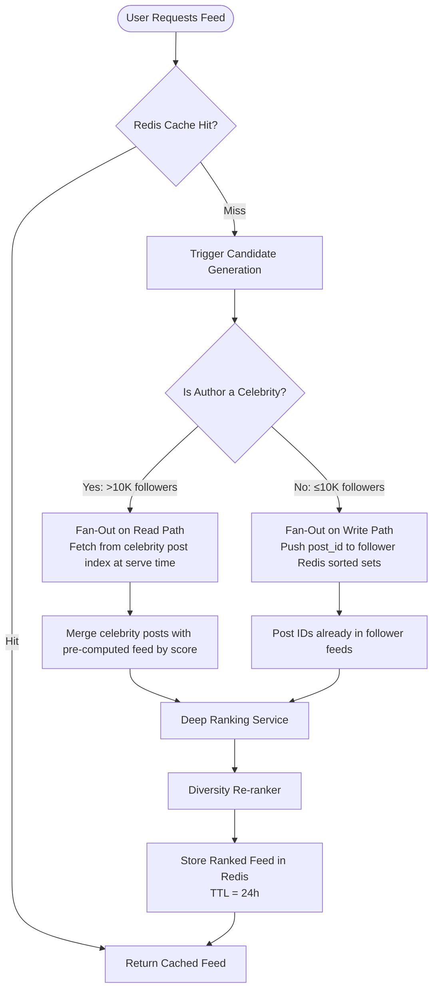
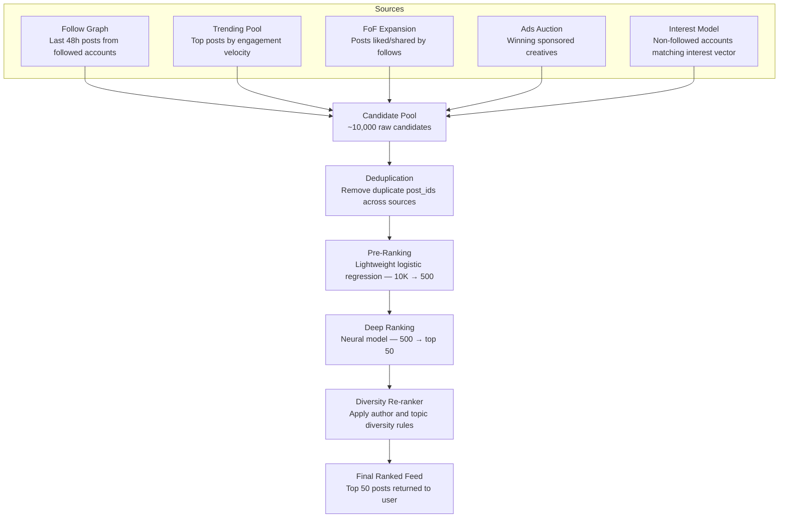
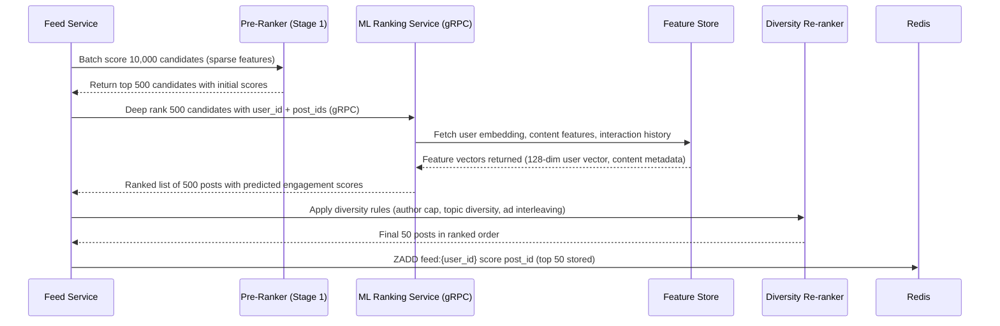
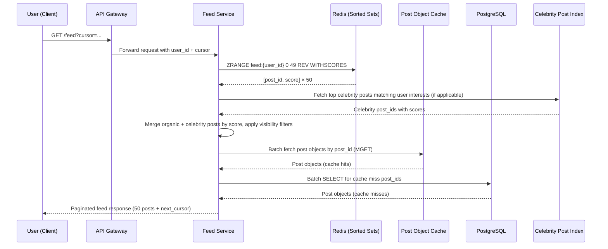
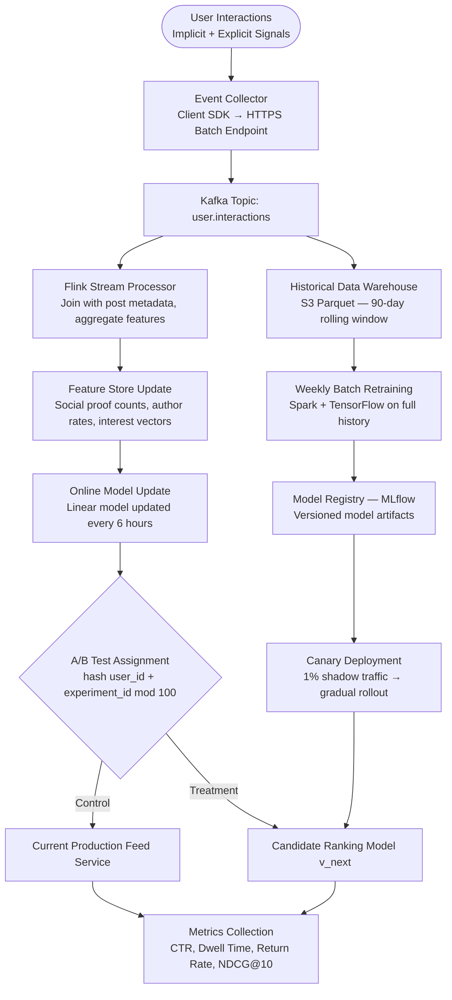

# Feed Ranking and Recommendation System

## Overview

The core challenge of a social feed is selecting the most relevant content from a candidate pool that can easily reach tens of thousands of posts for an active user. A naive chronological feed fails at scale because users with diverse follow graphs — mixing prolific posters, dormant accounts, and celebrities — receive a firehose of low-signal content while missing high-value posts buried by recency. The ranking system must model each user's preferences, the content's intrinsic quality, and the social graph context in real time, with latency budgets under 150 ms for a feed request.

Two fundamental architectural patterns exist for assembling feeds. The **push model (fan-out on write)** pre-computes a personalized feed for every follower the moment a post is published. A Kafka consumer reads `NewPost` events and writes ranked post IDs into each follower's Redis sorted set. This makes feed reads extremely fast — a single Redis `ZRANGE` — but creates a write amplification problem: a user with 5 million followers triggers 5 million sorted-set writes per post. At high celebrity post frequency, this saturates write throughput and causes fan-out lag. The **pull model (fan-out on read)** defers assembly until the user requests their feed. The system traverses the follow graph at read time, fetches recent posts from each followed account, scores them, and returns the result. This handles celebrities naturally but introduces significant read latency and per-request compute cost.

The production approach is a **hybrid fan-out** strategy that splits on follower count. Authors with fewer than 10,000 followers use fan-out on write: their posts are pushed into follower feeds immediately. Authors exceeding the 10,000-follower threshold — classified as "celebrities" — are excluded from fan-out. At read time, the feed service fetches celebrity posts separately from a dedicated high-volume post index and merges them with the pre-computed feed by ranking score. This caps write amplification while maintaining low read latency for the common case.

Feed data in Redis is given a **24-hour TTL**. Feeds are not rebuilt proactively; instead, they are refreshed lazily on the next request after expiry, or eagerly invalidated on events such as an unfollow, a block, or a post deletion. The sorted set stores up to 1,000 post IDs per user to bound memory usage, with older entries pruned via `ZREMRANGEBYRANK`.



---

## Candidate Generation

Candidate generation is the first stage of the ranking pipeline, responsible for narrowing the universe of all recent posts down to a manageable set — typically 500 to 1,000 candidates — that the expensive deep-ranking model will score. The process runs in parallel across multiple candidate sources, each contributing a different signal dimension, and the results are merged, deduplicated, and pre-ranked before entering the neural ranking stage.

The **follow graph traversal** source fetches post IDs from all accounts the user follows, constrained to posts published within the last 48 hours. This is implemented as a Redis-backed follow list lookup followed by a batch read of per-author recent-post sorted sets. Posting volume varies enormously across accounts, so each followed author contributes at most 10 candidates to prevent prolific posters from monopolizing the pool. The 48-hour window is a configurable parameter tuned against the user's typical session frequency: users with low session frequency have the window extended automatically.

The **trending content pool** contributes globally and topic-locally trending posts ranked by engagement velocity — the rate of likes, comments, and shares per hour normalized by author follower count to surface rising content before it becomes mainstream. The **friend-of-friend (FoF) expansion** source adds posts that accounts the user follows have recently liked or shared; these carry social proof and are injected as a discovery channel. The **interest model** source retrieves posts from non-followed accounts whose topic embeddings have high cosine similarity to the user's 128-dimensional interest vector, enabling organic content discovery.

**Sponsored content** is injected separately via an ad auction service that returns the winning ad creative IDs along with their bid-weighted quality scores. Ads are allocated reserved positions in the final ranked list (every 5th slot) and bypass the organic ranking model, though a minimum quality threshold is enforced to prevent irrelevant ads from harming user experience. After all sources contribute candidates, a lightweight pre-ranker applies a fast logistic regression model to score all ~10,000 raw candidates and prune them to the top 500 for deep ranking.

The deduplication step merges the multi-source candidate pool by `post_id`, resolving conflicts (the same post appearing in multiple sources) by keeping the highest source-assigned initial score and annotating the candidate with all source tags. Source tags matter because they contribute to the pre-ranking feature vector: a post surfaced by both Follow Graph and FoF Expansion carries a combined social signal stronger than one sourced from the Interest Model alone. Candidate pool sizing is monitored as a health signal — a pool consistently smaller than 2,000 raw candidates may indicate a sparse follow graph or inactive following behavior, triggering a recommendation to the user to follow more accounts during their next session.



---

## Ranking Algorithm

The ranking system uses a **two-stage architecture** to balance throughput with model sophistication. Stage 1 is a pre-ranker that scores all ~10,000 candidates using a lightweight logistic regression model operating on sparse features (follower counts, raw engagement numbers, post age). It runs in-process within the Feed Service with sub-millisecond latency per candidate and reduces the pool to the top 500 candidates by initial score. Stage 2 is a deep neural ranker implemented as a multi-task learning model that predicts multiple engagement outcomes simultaneously — like probability, comment probability, share probability, and 30-second dwell probability — using dense embeddings and cross-feature interactions.

The Stage 2 neural model architecture is a **deep cross network (DCN-v2)**: a parallel combination of a deep feed-forward tower and a cross tower that explicitly models feature interactions up to arbitrary polynomial degree. Inputs to the model include the 128-dim user interest embedding, the 128-dim post topic embedding, and roughly 40 scalar features (recency, author follower count, social proof count, device type, etc.). The deep tower has 4 layers of size [512, 256, 128, 64] with ReLU activations. The cross tower has 3 cross layers. Outputs from both towers are concatenated and passed through a final sigmoid layer for each prediction head (like, comment, share, dwell_30s). The model is trained with a weighted multi-task loss: `L = α·BCE(like) + β·BCE(comment) + γ·BCE(share) + δ·BCE(dwell)` where weights are tuned to balance gradient magnitudes across tasks. The model has approximately 8 million parameters and serves inference in under 20 ms for a batch of 500 candidates on a GPU inference server.

The final ranking score for a candidate post is computed as:

```
final_score = engagement_probability × recency_weight × relationship_strength
              × content_type_multiplier × diversity_penalty

engagement_probability = P(like)×w1 + P(comment)×w2 + P(share)×w3 + P(dwell_30s)×w4
  where w1=0.2, w2=0.3, w3=0.35, w4=0.15  (tuned via A/B experiments)

recency_weight = exp(−λ × hours_since_post)
  λ = 0.05 for video content (longer shelf life)
  λ = 0.12 for text posts (faster decay)
  λ = 0.08 for image posts

relationship_strength = mutual_follows_score + past_interaction_rate + profile_similarity_score
  (normalized to [0, 1])

content_type_multiplier:
  video  = 1.4
  image  = 1.1
  text   = 1.0
  link   = 0.9
  (configurable via feature flags)

diversity_penalty:
  2nd consecutive post from same author in session  → multiply by 0.5
  3rd+ consecutive post from same author in session → multiply by 0.2
```

The **engagement probability** is the primary driver and is computed by the neural model as the weighted sum of four predicted probabilities. Weights are configured per user segment — new users have higher weight on dwell time since they have fewer historical interactions, while power users have higher weight on comment and share probabilities. The **recency weight** uses an exponential decay function with a content-type-specific decay constant λ, ensuring video content stays relevant longer than short text posts.

**Relationship strength** is a composite signal drawn from the Feature Store: mutual follow status (binary, but strong signal), past interaction rate (how often the user has liked/commented on this author's prior posts in the last 30 days), and profile similarity derived from embedding cosine similarity. The **diversity penalty** is applied after initial scoring as a re-ranking step: if the same author would appear more than twice in the top 10 results, their subsequent posts are penalized to ensure feed variety.



---

## ML Feature Engineering

Feature engineering is where ranking system quality is most directly determined. Features are grouped into three categories — user features, content features, and interaction features — and are stored in a Feature Store (backed by Redis for online serving and S3/Parquet for offline training) with update frequencies ranging from real-time to daily batch jobs.

**User Features** capture the individual's behavior patterns and inferred preferences:

- **Activity patterns**: time-of-day engagement histogram (24 buckets), average session length, DAU/WAU ratio (measures engagement consistency), and typical inter-session gap.
- **Topic interest vector**: 128-dimensional dense embedding updated daily via matrix factorization over the user's interaction history. Each dimension loosely corresponds to a latent topic cluster.
- **Device and app context**: device type (iOS/Android/web), app version, connection type (WiFi/cellular). Video content is down-ranked for users on cellular connections with low bandwidth scores.
- **Account maturity signals**: account age in days, total lifetime interactions, verified status, follow graph density (total follows, mutual follow ratio, average follower count of followed accounts).

**Content Features** describe the post independent of the requesting user:

- **Media type and quality**: media type enum, image resolution score, video completion rate from prior viewers, text length bucket.
- **Topic embedding**: BERT-based 768-dimensional topic embedding computed at post creation time, compressed to 128 dimensions via PCA for serving efficiency.
- **Author credibility**: verified badge status, account age, report-to-impression ratio over last 30 days, historical engagement rate percentile among peers.
- **Freshness signals**: post creation timestamp, last-edit timestamp (edited posts get a small freshness boost), time since first engagement received.
- **Prior performance**: historical CTR for the author's last 20 posts, average dwell time across similar content types.

**Interaction Features** (user × content cross-features) carry the highest predictive signal:

- Prior like rate and comment rate between this user and this author (last 90 days).
- Whether the user and author mutually follow each other (strong positive signal).
- Cosine similarity between the post's topic embedding and the user's interest vector.
- **Social proof count**: number of mutual follows who have already liked or commented on this post.
- Whether the user has saved or shared any prior post from this author.

Feature freshness matters significantly. Social proof counts are updated every 5 minutes via a Flink streaming job. User interest vectors are refreshed daily in a batch Spark job. Author credibility scores are recomputed hourly. This tiered update schedule balances accuracy with compute cost, ensuring the most volatile signals (social proof) are current while amortizing expensive embedding recomputation over longer windows.

The table below summarizes the feature groups, their storage location, update frequency, and dimensionality used at serving time:

| Feature Group         | Key Features                                      | Update Frequency | Storage          | Dimensionality     |
|-----------------------|---------------------------------------------------|------------------|------------------|--------------------|
| User Activity         | Time-of-day histogram, session length, DAU/WAU    | Real-time        | Redis (hash)     | 24 + 5 scalars     |
| User Interest Vector  | Topic embedding from interaction history          | Daily batch      | Feature Store    | 128-dim float      |
| User Graph Density    | Follow count, mutual ratio, avg follower count    | Hourly           | Feature Store    | 6 scalars          |
| Content Topic         | BERT embedding compressed via PCA                 | At post creation | Feature Store    | 128-dim float      |
| Content Quality       | Media type, resolution, video completion rate     | At post creation | Feature Store    | 8 scalars          |
| Author Credibility    | Verified, account age, report ratio, CTR %ile     | Hourly           | Feature Store    | 5 scalars          |
| Social Proof          | Mutual-follow likes count on this post            | Every 5 minutes  | Redis (counter)  | 1 scalar           |
| Interaction History   | Like rate, comment rate, shared posts (90 days)   | Streaming        | Feature Store    | 6 scalars          |

---

## Feed Serving Architecture

The feed serving path is designed around a read-heavy workload: for every write event (a new post), there may be millions of subsequent feed reads referencing that post. The serving stack must achieve p99 latency under 150 ms end-to-end, which requires the hot path to touch only Redis and a post-object cache, with no synchronous database queries.

When a user requests their feed, the API Gateway routes the request to the Feed Service. The service first queries the Redis sorted set `feed:{user_id}` using `ZRANGE feed:{user_id} 0 49 REV WITHSCORES`, returning the top 50 post IDs ordered by descending ranking score. For users who follow celebrities, an additional read is made to the celebrity post index (a separate Redis sorted set keyed by topic cluster and time bucket) and the results are merged in-memory by score before hydration. Visibility filters are applied at this stage to exclude posts from blocked users, posts from private accounts the user no longer follows, and posts that have been deleted since they were cached in the feed.

Post hydration — converting post IDs to full post objects — is performed via a batch `MGET` against the post object cache (Redis or Memcached), falling back to a batch `SELECT ... WHERE id IN (...)` against PostgreSQL for cache misses. The post object cache has a 1-hour TTL for post metadata and is invalidated on edit or deletion. The assembled response is serialized and returned paginated using a cursor equal to the ranking score of the last returned post, enabling subsequent pages to resume with `ZRANGEBYSCORE feed:{user_id} (cursor -inf REV LIMIT 0 50`.

The feed serving path has a strict **latency budget breakdown**: Redis sorted-set read (5 ms), celebrity post index merge (8 ms), visibility filter evaluation (2 ms), post-object cache batch fetch (15 ms on warm cache, 50 ms with PostgreSQL fallback for up to 5% miss rate), response serialization (5 ms). Total hot-path p50 is ~35 ms; p99 target is 150 ms. If the ML Ranking Service is unavailable (circuit breaker open), the Feed Service falls back to the pre-computed Redis feed with stale scores rather than returning an error, trading accuracy for availability. Feed assembly failures are tracked by a `feed.assembly.fallback_rate` metric; sustained rates above 1% page the on-call engineer.

Regional feed caches are maintained in the same availability zone as the serving fleet to minimize network round-trip time. The feed sorted sets for inactive users (no session in 7 days) are allowed to expire without proactive refresh, reducing Redis memory pressure. When such users return, a synchronous feed rebuild is triggered and the user sees a loading indicator for the first request — an acceptable UX tradeoff for the memory savings on the inactive cohort, which can represent 30–40% of total registered users.



---

## Redis Sorted Sets and Fan-Out Strategy

Redis sorted sets are the core data structure of the feed storage layer. Each user has a sorted set keyed as `feed:{user_id}`, where each member is a `post_id` and the score is the composite ranking value — a floating-point number encoding both the ML ranking score and recency decay, computed as `ranking_score × exp(−λ × age_hours)`. This double-encodes freshness into the score so that old posts naturally sink to the bottom of the sorted set even without re-scoring.

```
# Fan-out worker: processing NewPost event from Kafka

post_id       = event.post_id
author_id     = event.author_id
post_score    = pre_rank(event)          # lightweight pre-ranking score [0, 1]
post_age_h    = 0                        # newly published
decay_lambda  = 0.08                     # default λ for image posts
initial_score = post_score * exp(-decay_lambda * post_age_h)

followers     = fetch_follower_ids(author_id)  # from follow graph service

pipeline = redis.pipeline()
for follower_id in followers:
    feed_key = f"feed:{follower_id}"
    pipeline.zadd(feed_key, {post_id: initial_score})
    pipeline.zremrangebyrank(feed_key, 0, -1001)  # keep max 1000 posts
    pipeline.expire(feed_key, 86400)              # reset TTL to 24h
pipeline.execute()

# Score decay for existing posts (run every 4h via scheduled job):
# ZADD feed:{user_id} [decayed_score] [post_id]  (XX flag to update only)
# ZREMRANGEBYSCORE feed:{user_id} -inf [7-day-threshold-score]
```

The fan-out worker runs as a Kafka consumer group named `feed-fanout`, partitioned by `author_id` to ensure all fans of a given author are processed by the same consumer partition, enabling per-author rate limiting and ordered delivery. For authors with more than 10,000 followers, the worker skips the fan-out entirely and writes only to an `author_recent_posts:{author_id}` sorted set — a smaller, author-keyed index that the feed service reads at request time for celebrity post merging.

Feed invalidation events are produced to a separate Kafka topic `feed.invalidation`. When a user blocks another user, all posts from the blocked author are removed via `ZREM`. When a post is deleted, a `ZREM` is issued to all affected feed keys (feasible for non-celebrities; for celebrity posts, deletion is handled by the visibility filter at serve time). When a user unfollows an account, no immediate invalidation is performed — the next feed refresh will naturally exclude the unfollowed author's new posts, and old posts fade out as their scores decay.

**Memory analysis:** At 1,000 posts × 8 bytes (score) + ~36 bytes (post_id as UUID string) per entry, a single user feed sorted set consumes approximately 44 KB of Redis memory. Across 10 million active users, this amounts to ~440 GB of Redis memory dedicated to feed data. In practice, because many users' feeds are expired (TTL) between sessions, actual memory consumption is 40–60% of this theoretical maximum. Redis Cluster with 6 shards of 128 GB each (replicated) provides sufficient headroom with room for hot-key distribution. Per-user feed keys are distributed across shards by `user_id` hash, so no single shard is a bottleneck unless a hash slot becomes hot — monitored via `redis-cli --hotkeys` sampled every 15 minutes.

---

## Cold Start Problem

The cold start problem manifests in two distinct forms: new user cold start (no interaction history, no follow graph) and new content cold start (no engagement history on a newly published post). Both require dedicated strategies that operate outside the standard ranking pipeline.

**New user cold start** is handled through a progressive onboarding flow. On account creation, the user selects at least three interest categories from a curated list. These selections seed an initial interest vector by averaging the precomputed topic embeddings of all posts in those categories over the last 7 days. The initial feed is populated with a mix of globally trending content (40%), location-based trending content (20%), and posts from popular accounts in the selected interest categories (40%). No personalized ML scoring is applied until the user has generated at least 10 interaction events. After the 10th interaction, the feed service triggers an asynchronous re-ranking job that recomputes the user's feed using their nascent interaction vector, blending it with the cold-start priors at a 30/70 ratio. The blend ratio shifts toward the learned model with each subsequent interaction batch.

**New content cold start** solves the chicken-and-egg problem of ranking posts that have no engagement history. When a post is published, the fan-out worker injects it into a random 0.1% sample of the author's followers' feeds (or, for celebrity authors, a 0.05% random sample of their follower base). These seeded feeds serve as an exploration budget. A Flink job monitors the post's engagement rate in this sample over a 1-hour window. If the engagement rate exceeds the author's historical average by more than 20%, the post is promoted to full fan-out distribution and its pre-ranking score is boosted by a configurable multiplier. If engagement falls below threshold after 2 hours, the post's distribution score is slightly penalized relative to the author's historical baseline, preventing low-quality content from consuming feed slots.

The exploration budget is tracked per author per day and is proportional to account reach: an account with 1,000 followers has a daily exploration budget of 5 new posts explored at full depth; an account with 100,000 followers has a budget of 20. This prevents gaming — repeatedly publishing low-quality posts to consume exploration slots — while still giving emerging creators enough exposure to build momentum. Authors who have consistently high post-quality scores (measured by the engagement rate of their exploration samples over the last 30 days) are given an **accelerated boost**: their new posts skip the 1-hour sample window and enter the standard ranking pipeline immediately with a modest confidence prior, reducing latency to visibility for known good producers.

---

## A/B Testing Framework

Ranking model changes are among the highest-risk modifications in the system — a subtle weight change can meaningfully harm user engagement across millions of sessions. The A/B testing framework provides statistically rigorous experiment infrastructure that is deeply integrated with the ranking pipeline.

Experiment assignment is deterministic: `bucket = hash(user_id + experiment_id) mod 100`. A user's bucket assignment is stable across sessions and devices for the lifetime of an experiment, preventing exposure to multiple variants of the same experiment. A permanent holdout group is maintained at 10% of the user base (bucket 90–99), always assigned to the control ranking model, providing a stable baseline for regression detection and long-term metric drift monitoring.

Key metrics tracked per experiment:

- **CTR** (click-through rate): clicks on posts / posts shown
- **Dwell time**: average time spent viewing posts from the feed (proxy for content satisfaction)
- **Follow rate**: new follows initiated from a feed post view
- **Return rate**: whether the user returns within 24 hours (session retention signal)
- **Churn risk delta**: change in 30-day churn probability score for experiment users

Experiments require a minimum 95% confidence interval (two-tailed t-test or Mann-Whitney U for non-normal distributions) and a minimum run duration of 7 days to account for day-of-week effects. Ranking model versions are managed via feature flags stored in a configuration service, allowing instant rollback without a code deployment. For ranking weight experiments, **interleaving** is used as a complementary method: posts from both model A and model B are shown in the same feed in alternating positions, and relative engagement preference (clicks on A-ranked vs B-ranked posts) is measured. Interleaving detects relative model quality with far smaller sample sizes than standard A/B splits.

Experiment lifecycle is managed through an internal experiment registry with four stages: **Draft** (configuration authored, not yet assigned traffic), **Ramp** (1–5% traffic, monitoring for crashes and egregious metric regressions), **Full** (50/50 or configurable split, full statistical analysis active), and **Concluded** (winner identified, feature flag updated, experiment closed). An automated guardrail system blocks experiments from advancing to Full if p99 feed latency degrades by more than 20 ms or if the error rate on the Feed Service increases — ensuring engineering velocity is not traded for stability. Experiment results are stored permanently in the experiment registry for retrospective analysis and for building a knowledge base of which feature interactions produce reliably positive effects across user segments.

**Novelty effects** — temporary engagement boosts caused by the novelty of a new feed layout or feature rather than genuine preference — are mitigated by requiring a 7-day minimum run time and weighting the last 3 days of data more heavily than the first 4 when computing the final treatment effect estimate. Long-term holdout experiments (30-day holdout of 1% of users with no ranking updates) periodically measure the cumulative value of all ranking improvements shipped in a quarter, providing a sanity check against metric inflation from novelty bias.

---

## Content Diversity and Fairness

Left unconstrained, a purely engagement-maximizing ranking model converges toward a narrow set of content archetypes — high-drama posts, viral memes, and a small set of highly engaging authors — creating filter bubbles and amplifying low-quality sensationalist content. Explicit diversity and fairness interventions are applied as a post-ranking re-ranking layer.

**Author diversity** is enforced by the consecutive same-author penalty built into the ranking score (described in the Ranking Algorithm section) and a hard cap: at most 3 posts from the same author may appear in the top 20 feed positions, regardless of their individual scores. **Topic diversity** is enforced by requiring at least 3 distinct topic clusters (as determined by the post topic embedding nearest cluster centroid) in the top 10 feed positions. If the ranked list violates this constraint, the lowest-scoring post in the over-represented cluster is swapped with the highest-scoring post from an under-represented cluster.

Sponsored content interleaving follows the rule of at most 1 sponsored post per every 5 organic posts. Sponsored posts that have received a high negative-feedback rate (user reported, hidden, or flagged) from prior impressions are removed from circulation regardless of their bid value. **Filter bubble mitigation** is implemented by reserving 10% of feed slots for content whose topic embedding distance from the user's interest vector exceeds a configurable threshold — deliberately showing content slightly outside the user's comfort zone to broaden discovery. This slot reservation is configurable and can be reduced for users who explicitly signal preference for narrow-topic feeds.

Fairness auditing runs as a weekly batch job that computes per-demographic impression rates for content produced by authors in different demographic groups (inferred from profile data). Systematic under-ranking of content from particular groups triggers an alert and a fairness review process. No automatic score adjustment is made without a manual review, to prevent unintended bias amplification from automated corrections.

The diversity re-ranker operates as a greedy **Maximal Marginal Relevance (MMR)** algorithm after the initial ranked list is produced. Starting from the top-scored post, each subsequent selection maximizes a linear combination of individual relevance score and marginal diversity (distance in topic embedding space from all already-selected posts). The trade-off parameter `λ_diversity` (0 = pure relevance, 1 = pure diversity) is set to 0.15 by default and increases to 0.25 for users whose historical feed shows low topic diversity, nudging them toward broader exposure without overriding relevance. The parameter is exposed as a user preference setting under "Feed Preferences → Content Variety," allowing users to voluntarily increase or decrease the diversity injection level.

---

## Feedback Loop and Model Retraining

The ranking model's quality depends on continuous learning from user interactions. The feedback loop architecture captures both implicit and explicit signals, processes them through a streaming pipeline, and feeds them back into the model via both online and batch learning paths.

**Implicit signals** are inferred from client-side instrumentation:

- **Skip** (scroll past in under 1 second): strong negative signal — user saw the post but did not engage.
- **Dwell time > 5 seconds**: moderate positive signal indicating read engagement.
- **Dwell time > 30 seconds on video**: strong positive engagement signal for video content.
- **Share**: strongest positive signal, indicating perceived value beyond personal consumption.
- **Hide / "Not interested"**: strong negative signal, used to down-rank similar content.

**Explicit signals** include like/reaction, save (bookmark), comment, report, and unfollow-after-viewing (the user unfollowed an account immediately after viewing their post — high-signal negative indicator). All signals are tagged with the experiment bucket assignment at the time of capture to enable per-experiment signal attribution.

The signal pipeline routes client events through an event collector (SDK → HTTPS batch endpoint) into a Kafka topic `user.interactions`. A Flink streaming job consumes this topic, joins events with post metadata and user state from the Feature Store, computes aggregated feature updates (social proof counts, author engagement rates, user interest vector incremental updates), and writes results back to the Feature Store with low latency (< 2-minute end-to-end lag). An **online learning** path updates a lightweight linear component of the ranking model every 6 hours using the last 6 hours of interaction data, allowing rapid adaptation to trending topics or breaking news. The full **deep neural model** is retrained weekly in a batch Spark + TensorFlow pipeline on the full 90-day interaction history. Models are versioned in MLflow with automatic lineage tracking, and new model versions are deployed via canary release (1% of traffic) in shadow mode — scores computed but not served — before full rollout.



Model quality is monitored via daily metric dashboards tracking **NDCG@10** (normalized discounted cumulative gain at position 10, measuring ranking quality against observed engagement), **diversity score** (average pairwise topic distance in top-10 feed positions), and **freshness score** (average age of posts in served feeds). Regression alerts fire if any metric degrades by more than 5% relative to the 7-day rolling baseline, triggering automatic rollback to the prior model version via the MLflow registry and feature flag system.
