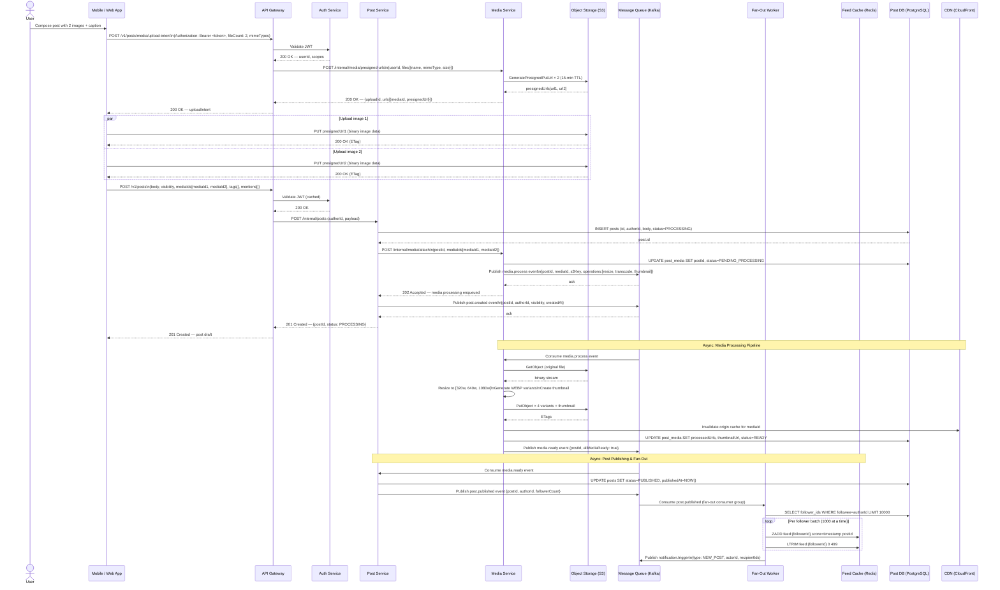
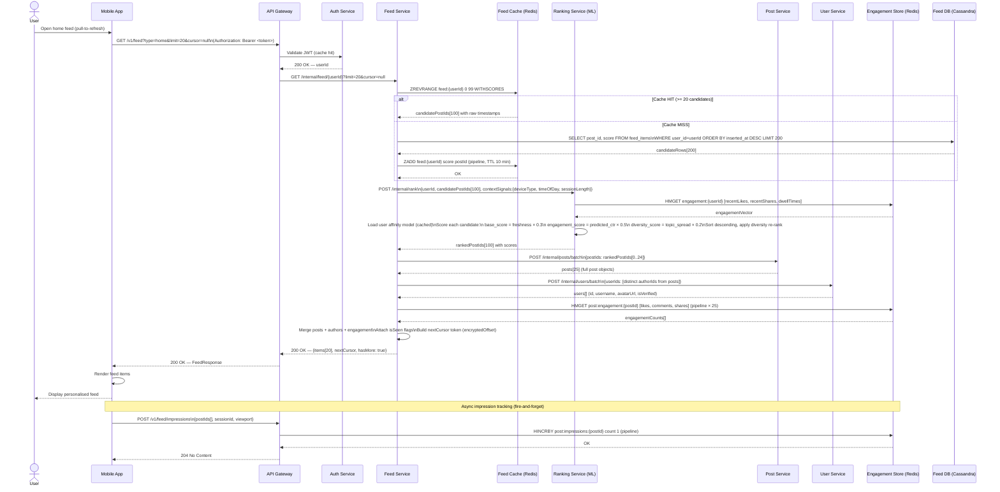
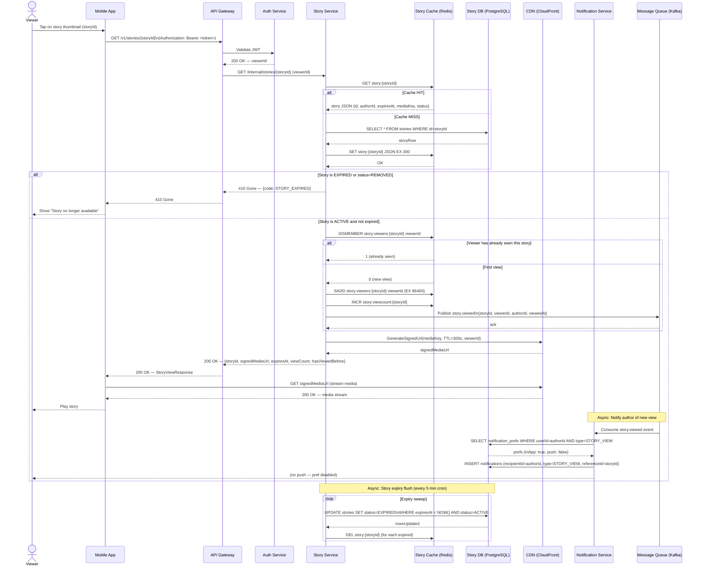
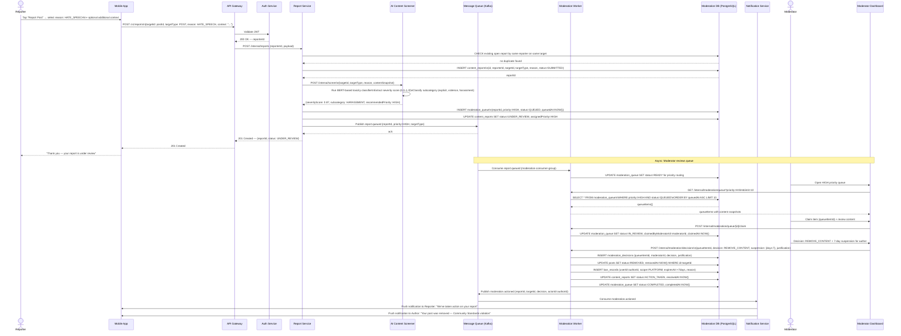
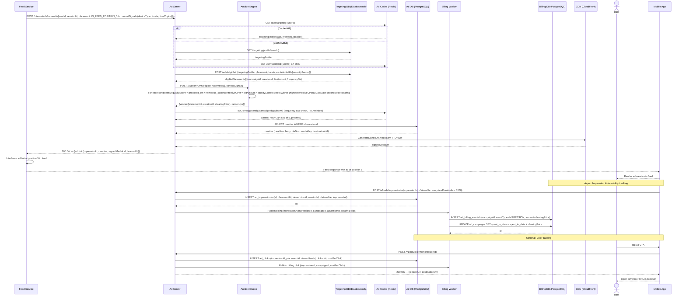

# Sequence Diagrams — Social Networking Platform

## 1. Overview

This document details the runtime interaction sequences for the five most architecturally significant flows in the Social Networking Platform. Each sequence diagram shows the precise message exchanges between clients, API gateway, microservices, external providers, and data stores. These diagrams drive API contract design, SLA budgeting, and integration testing.

---

## 2. Post Creation with Media Upload

A user composes a post that includes one or more media files. The flow covers pre-signed URL generation, direct-to-object-storage upload, async media processing, and fan-out to followers' feeds.

---

## 3. Feed Fetch with ML Ranking

A user opens the app and requests their personalised home feed. The feed service retrieves candidate posts, applies machine-learning ranking, hydrates entities, and returns a paginated response.

---

## 4. Story View with Expiry Check

A user taps on a story. The platform validates that the story has not expired, records the view deduplicated, and delivers the media URL via CDN with a signed token.

---

## 5. Content Report & Moderation Queue

A user reports a post. The platform creates a report record, scores it for urgency using an AI screener, inserts it into the moderation queue at the appropriate priority, and dispatches a resolution notification once a moderator acts.

---

## 6. Ad Serving & Impression Tracking

The feed service requests an ad to interleave into a user's feed. The ad server selects the best-matching creative using targeting and auction logic, logs the impression, and asynchronously records the billing event.

