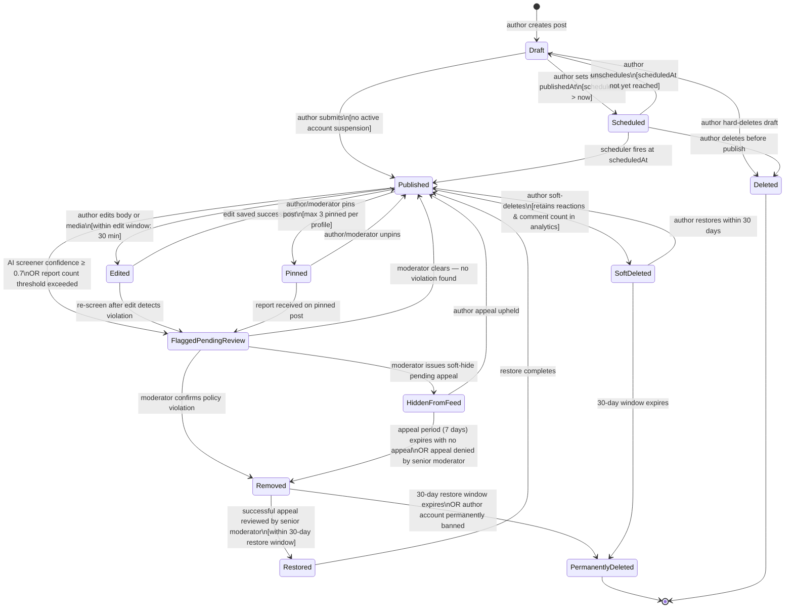
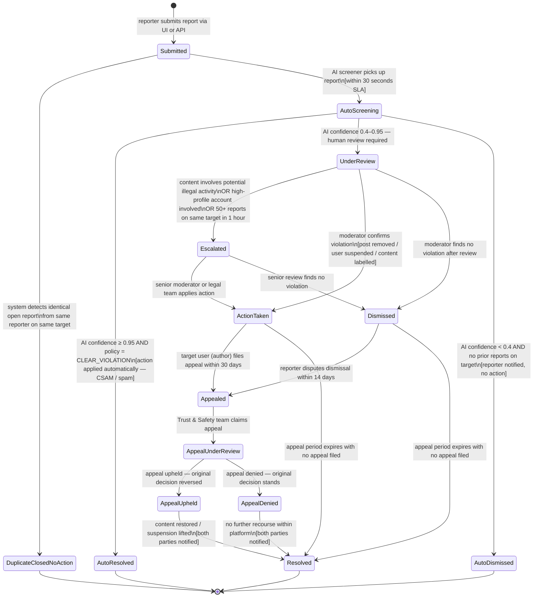
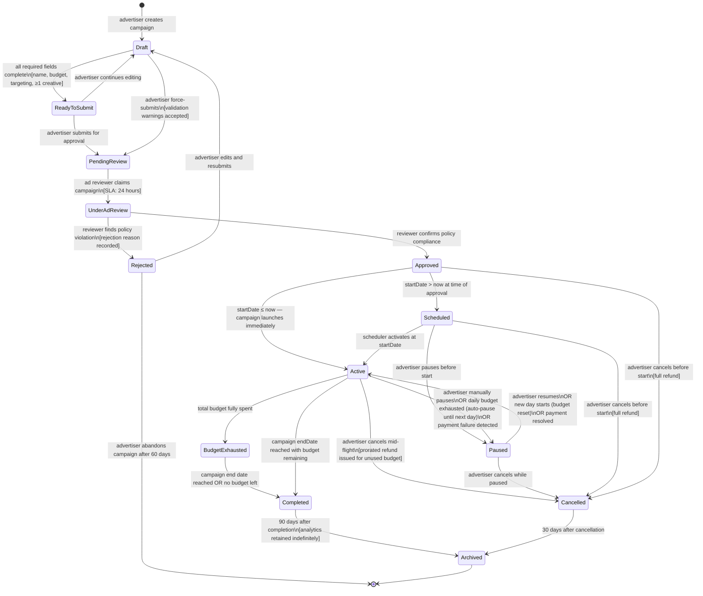

# State Machine Diagrams — Social Networking Platform

## 1. Overview

This document specifies the finite state machines that govern the lifecycle of the platform's core entities. Each `stateDiagram-v2` block defines all valid states, the transitions between them, the events that trigger those transitions, and any guard conditions. These models drive validation logic in service layers and database check constraints.

---

## 2. Post Lifecycle

A post progresses from initial drafting through publication and can be flagged, removed, or restored at any point. Scheduled posts introduce a time-delayed transition to published.

**State Descriptions:**

| State | Description |
|---|---|
| `Draft` | Post is being composed; visible only to the author. |
| `Scheduled` | Post is ready but will auto-publish at a future time. |
| `Published` | Post is visible to the audience defined by its visibility setting. |
| `Edited` | Transient state while an edit is being saved; reverts to Published. |
| `Pinned` | Publicly visible and surfaced at the top of the author's profile. |
| `FlaggedPendingReview` | Temporarily visible but queued for moderator review. |
| `HiddenFromFeed` | Removed from all feeds and search; author notified and appeal window open. |
| `Removed` | Taken down for policy violation; no longer publicly accessible. |
| `Restored` | Moderator overturned removal; transitioning back to Published. |
| `SoftDeleted` | Author-initiated removal; data retained for 30 days. |
| `PermanentlyDeleted` | Data purged from primary store; only anonymised analytics retained. |

---

## 3. User Account Status

User accounts move through states driven by verification events, terms-of-service violations, and voluntary deactivation.

```mermaid
stateDiagram-v2
    [*] --> PendingVerification : user completes registration

    PendingVerification --> Active : email verified within 72 hours
    PendingVerification --> Expired : verification link not used within 72 hours\n[account purged after 7 days]

    Active --> EmailUnverified : user changes email address\n[new verification email sent]
    EmailUnverified --> Active : new email verified within 72 hours
    EmailUnverified --> Active : user reverts to previous email

    Active --> TemporarilySuspended : moderator issues time-limited suspension\n(1 day – 90 days)
    TemporarilySuspended --> Active : suspension period expires automatically
    TemporarilySuspended --> PermanentlyBanned : user violates terms again during suspension\nOR appeal denied after escalation

    Active --> UnderInvestigation : severe report received\n[account restricted pending review]
    UnderInvestigation --> Active : investigation cleared — no violation
    UnderInvestigation --> TemporarilySuspended : violation confirmed, proportionate suspension applied
    UnderInvestigation --> PermanentlyBanned : egregious violation confirmed\n(CSAM, terrorism, doxing)

    Active --> Deactivated : user voluntarily deactivates account\n[30-day grace period; login resumes reactivation]
    Deactivated --> Active : user logs in within 30-day window
    Deactivated --> ScheduledForDeletion : 30-day window expires without reactivation

    ScheduledForDeletion --> Active : user logs in before deletion job runs\n[up to 14-day buffer]
    ScheduledForDeletion --> Deleted : deletion job completes\n[GDPR-compliant data erasure]

    PermanentlyBanned --> BanAppealed : user submits appeal within 60 days
    BanAppealed --> PermanentlyBanned : appeal denied by Trust & Safety team
    BanAppealed --> Active : appeal upheld — ban overturned with review notes

    PermanentlyBanned --> Deleted : ban remains unchallenged for 1 year\nOR user requests account deletion

    Expired --> [*]
    Deleted --> [*]
```

**State Descriptions:**

| State | Description |
|---|---|
| `PendingVerification` | Account created; awaiting email confirmation. |
| `Active` | Fully operational; all features available. |
| `EmailUnverified` | Account active but new email address awaiting confirmation. |
| `UnderInvestigation` | Account restricted; reduced posting and messaging capabilities. |
| `TemporarilySuspended` | Login blocked for a defined period; content hidden from public. |
| `PermanentlyBanned` | Login permanently blocked; public content removed. |
| `BanAppealed` | Ban under review by Trust & Safety team. |
| `Deactivated` | User-initiated dormancy; profile hidden but data retained. |
| `ScheduledForDeletion` | Irreversible deletion queued; GDPR erasure pipeline initiated. |
| `Deleted` | All PII erased; anonymised records retained for legal compliance. |
| `Expired` | Unverified account automatically purged. |

---

## 4. Content Report Status

A report moves through a structured moderation pipeline from submission to final resolution, with an optional appeal stage.

**State Descriptions:**

| State | Description |
|---|---|
| `Submitted` | Report received and persisted; awaiting AI triage. |
| `AutoScreening` | AI classifier is evaluating the reported content. |
| `UnderReview` | Assigned to a human moderator in the moderation queue. |
| `Escalated` | Forwarded to senior moderation or legal team. |
| `ActionTaken` | Moderation action applied; subject and reporter notified. |
| `Dismissed` | Report reviewed; no policy violation found. |
| `AutoResolved` | AI applied action autonomously (high-confidence violations only). |
| `AutoDismissed` | AI determined no violation; report closed without human review. |
| `Appealed` | Target or reporter has filed a formal appeal. |
| `AppealUnderReview` | Appeal is being reviewed by Trust & Safety team. |
| `AppealUpheld` | Appeal succeeded; original decision reversed. |
| `AppealDenied` | Appeal rejected; original decision maintained. |
| `Resolved` | Report lifecycle complete; record retained for audit. |

---

## 5. Ad Campaign Status

An ad campaign moves from advertiser creation through platform approval, live delivery, and post-completion archival.

**State Descriptions:**

| State | Description |
|---|---|
| `Draft` | Campaign being configured; no ad serving. |
| `ReadyToSubmit` | All required fields complete; awaiting advertiser submission. |
| `PendingReview` | Submitted for platform policy review; no serving. |
| `UnderAdReview` | Assigned to a reviewer; active review in progress. |
| `Approved` | Cleared for delivery; waiting for startDate or launching. |
| `Rejected` | Policy violation found; advertiser must revise. |
| `Scheduled` | Approved and waiting for future startDate. |
| `Active` | Actively serving ads; impressions and clicks being recorded. |
| `Paused` | Serving halted (manually or due to budget/payment). |
| `BudgetExhausted` | Total budget consumed; serving stops. |
| `Completed` | Campaign finished; final billing reconciliation runs. |
| `Cancelled` | Advertiser terminated campaign early. |
| `Archived` | Historical record; read-only access for reporting. |
