# Architecture Diagram — Social Networking Platform

## Overview

The Social Networking Platform is built as a domain-oriented microservices system. Each service owns its data store, exposes a versioned API, and communicates asynchronously via Apache Kafka for all non-latency-sensitive paths. Synchronous RPC (gRPC over Istio mTLS) is reserved for real-time read paths where latency guarantees are required (e.g., feed hydration during a timeline fetch).

The architecture targets:
- **Sub-100 ms p99 feed reads** via a multi-tier cache hierarchy (L1 Redis, L2 Cassandra)
- **1 M+ concurrent WebSocket connections** across a horizontally scaled messaging cluster
- **Fan-out throughput of 500 k writes/s** at peak via Kafka-backed push-on-write feed assembly
- **Multi-region active-active** with local writes and eventual cross-region consistency

---

## High-Level System Architecture

```mermaid
graph TB
    subgraph Clients["Client Layer"]
        WebApp["Web App\n(React SPA)"]
        MobileIOS["iOS App\n(Swift)"]
        MobileAndroid["Android App\n(Kotlin)"]
        ThirdParty["Third-Party\nOAuth Clients"]
    end

    subgraph Edge["Edge Layer"]
        CDN["CDN\n(CloudFront)\nStatic assets + media"]
        WAF["WAF + DDoS Shield\n(AWS Shield Advanced)"]
        DNS["Global DNS\n(Route 53 Latency Routing)"]
    end

    subgraph Gateway["API Gateway Layer"]
        APIGW["API Gateway\n(Kong)\nAuth · Rate Limiting\nRouting · TLS Termination"]
        WSGateway["WebSocket Gateway\n(custom Node.js)\nReal-time messaging\nLive notifications"]
    end

    subgraph Services["Core Microservices"]
        direction TB
        ProfileSvc["Profile Service\nUser CRUD, settings,\nverification, privacy"]
        PostSvc["Post Service\nContent creation,\nediting, deletion, media"]
        FeedSvc["Feed Service\nFan-out, ranking,\ntimeline assembly"]
        FollowSvc["Follow/Social Graph Service\nFollow, unfollow,\nblock, mute, friends"]
        MsgSvc["Messaging Service\nDM, group chats,\nE2E encryption"]
        NotifSvc["Notification Service\nPush, in-app, email\npreference management"]
        ModSvc["Moderation Service\nAI screening, human\nreview, appeals, bans"]
        SearchSvc["Search Service\nFull-text, hashtags,\nusers, trending"]
        GroupSvc["Groups/Communities Service\nCommunity CRUD,\nmembership, posts"]
        AdSvc["Ad Service\nCampaign management,\nauctions, impressions"]
        AnalyticsSvc["Analytics Service\nCreator insights,\nbusiness metrics"]
        MediaSvc["Media Service\nUpload, transcoding,\nCDN management"]
        AuthSvc["Auth Service\nOAuth 2.0, JWT,\nMFA, sessions"]
        StoryService["Story Service\nEphemeral content,\n24h TTL, viewers"]
    end

    subgraph DataStores["Data Stores"]
        direction TB
        Postgres["PostgreSQL 15\n(primary relational store)"]
        Redis["Redis 7 Cluster\n(cache, sessions, rate limits,\nfeed sorted sets, presence)"]
        Cassandra["Apache Cassandra\n(feed items, messages,\ntimeline — high write throughput)"]
        S3["AWS S3\n(media objects,\nprofile photos, videos)"]
        Elasticsearch["Elasticsearch 8\n(full-text search index)"]
        Neo4j["Neo4j / Aurora Graph\n(social graph traversal)"]
        ClickHouse["ClickHouse\n(analytics events,\nad impressions, metrics)"]
    end

    subgraph Messaging["Async Messaging"]
        Kafka["Apache Kafka\n(MSK)\nEvent streaming backbone"]
    end

    subgraph ML["ML Platform"]
        SageMaker["SageMaker\nModel training + serving"]
        FeatureStore["Feature Store\n(SageMaker Feature Store)\nUser affinity, engagement signals"]
        MLModels["Deployed Models\nFeed ranking · Spam detection\nToxicity · Recommendations"]
    end

    subgraph Observability["Observability Stack"]
        Prometheus["Prometheus\n+ Grafana"]
        Jaeger["Jaeger\nDistributed Tracing"]
        ELK["ELK Stack\nCentralised Logging"]
        PagerDuty["PagerDuty\nAlerting + On-call"]
    end

    %% Client → Edge
    WebApp & MobileIOS & MobileAndroid & ThirdParty --> DNS
    DNS --> WAF
    WAF --> APIGW
    WAF --> WSGateway
    WebApp & MobileIOS & MobileAndroid --> CDN

    %% Gateway → Services
    APIGW --> AuthSvc
    APIGW --> ProfileSvc
    APIGW --> PostSvc
    APIGW --> FeedSvc
    APIGW --> FollowSvc
    APIGW --> NotifSvc
    APIGW --> SearchSvc
    APIGW --> GroupSvc
    APIGW --> AdSvc
    APIGW --> AnalyticsSvc
    APIGW --> MediaSvc
    APIGW --> StoryService
    WSGateway --> MsgSvc
    WSGateway --> NotifSvc

    %% Services → Data Stores
    ProfileSvc --> Postgres
    ProfileSvc --> Redis
    PostSvc --> Postgres
    PostSvc --> Redis
    FeedSvc --> Redis
    FeedSvc --> Cassandra
    FollowSvc --> Postgres
    FollowSvc --> Neo4j
    MsgSvc --> Cassandra
    MsgSvc --> Redis
    NotifSvc --> Postgres
    NotifSvc --> Redis
    ModSvc --> Postgres
    SearchSvc --> Elasticsearch
    SearchSvc --> Redis
    GroupSvc --> Postgres
    AdSvc --> Postgres
    AdSvc --> Redis
    AnalyticsSvc --> ClickHouse
    MediaSvc --> S3
    AuthSvc --> Postgres
    AuthSvc --> Redis
    StoryService --> Redis
    StoryService --> S3

    %% Services → Kafka
    PostSvc -->|"post.created\npost.deleted"| Kafka
    FollowSvc -->|"follow.created\nfollow.removed"| Kafka
    MsgSvc -->|"message.sent"| Kafka
    ModSvc -->|"moderation.actioned"| Kafka
    AdSvc -->|"ad.impression\nad.click"| Kafka

    %% Kafka → Consumers
    Kafka -->|"post.created"| FeedSvc
    Kafka -->|"post.created"| NotifSvc
    Kafka -->|"post.created"| SearchSvc
    Kafka -->|"post.created"| ModSvc
    Kafka -->|"moderation.actioned"| PostSvc
    Kafka -->|"moderation.actioned"| NotifSvc
    Kafka -->|"ad.impression"| AnalyticsSvc

    %% ML
    FeedSvc --> SageMaker
    ModSvc --> SageMaker
    SageMaker --> FeatureStore
    SageMaker --> MLModels

    %% Observability
    Services --> Prometheus
    Services --> Jaeger
    Services --> ELK
    Prometheus --> PagerDuty
```

---

## Service Inventory

| Service | Language | Primary Store | Kafka Topics Produced | Kafka Topics Consumed |
|---|---|---|---|---|
| **Auth Service** | Node.js (TypeScript) | Postgres + Redis | `auth.login` | — |
| **Profile Service** | Node.js (TypeScript) | Postgres + Redis | `profile.updated` | `auth.login` |
| **Post Service** | Node.js (TypeScript) | Postgres + Redis | `post.created`, `post.deleted`, `post.updated` | `moderation.actioned` |
| **Feed Service** | Go | Redis + Cassandra | — | `post.created`, `post.deleted`, `follow.created`, `follow.removed` |
| **Follow/Social Graph Service** | Go | Postgres + Neo4j | `follow.created`, `follow.removed`, `block.created` | — |
| **Messaging Service** | Node.js (TypeScript) | Cassandra + Redis | `message.sent`, `conversation.created` | `block.created` |
| **Notification Service** | Python | Postgres + Redis | — | `post.created`, `message.sent`, `moderation.actioned`, `follow.created` |
| **Moderation Service** | Python | Postgres | `moderation.actioned`, `ban.issued` | `post.created`, `report.submitted`, `media.uploaded` |
| **Search Service** | Go | Elasticsearch | — | `post.created`, `post.deleted`, `profile.updated`, `moderation.actioned` |
| **Groups Service** | Node.js (TypeScript) | Postgres | `group.post.created` | — |
| **Ad Service** | Go | Postgres + Redis | `ad.impression`, `ad.click`, `ad.conversion` | — |
| **Analytics Service** | Python | ClickHouse | — | `ad.impression`, `ad.click`, `post.created` |
| **Media Service** | Go | S3 + Postgres | `media.uploaded`, `media.transcoded` | — |
| **Story Service** | Node.js (TypeScript) | Redis + S3 | `story.created`, `story.expired` | — |

---

## Communication Patterns

### Synchronous RPC (gRPC)

Used for real-time read paths where the caller needs the response before completing its own response. All gRPC calls are secured with mTLS via the Istio service mesh.

| Caller | Target | Operation | Timeout |
|---|---|---|---|
| Feed Service | Post Service | `BatchGetPosts(postIds[])` | 50 ms |
| Feed Service | Profile Service | `BatchGetProfiles(userIds[])` | 30 ms |
| Feed Service | Social Graph Service | `GetFollowers(userId, limit)` | 30 ms |
| API Gateway | Auth Service | `ValidateToken(jwt)` | 10 ms |
| Post Service | Media Service | `GetPresignedUploadUrl(fileType)` | 20 ms |
| Notification Service | Profile Service | `GetNotificationPrefs(userId)` | 20 ms |

### Asynchronous Messaging (Kafka)

Used for all event-driven workflows where the producer does not need to wait for downstream processing. Topics use a `<domain>.<event>` naming convention with a minimum replication factor of 3.

| Topic | Partitions | Retention | Key Strategy |
|---|---|---|---|
| `post.created` | 128 | 7 days | `authorId` (co-locate by author) |
| `post.deleted` | 32 | 7 days | `postId` |
| `follow.created` | 64 | 7 days | `followerId` |
| `follow.removed` | 64 | 7 days | `followerId` |
| `message.sent` | 256 | 30 days | `conversationId` |
| `moderation.actioned` | 32 | 30 days | `contentId` |
| `ad.impression` | 256 | 3 days | `campaignId` |
| `report.submitted` | 32 | 14 days | `reportId` |
| `media.uploaded` | 128 | 3 days | `mediaId` |

---

## Cross-Cutting Concerns

### Authentication and Authorisation
All API Gateway routes require a valid JWT issued by the Auth Service (RS256, 1-hour expiry with sliding refresh tokens stored in Redis). Service-to-service calls use short-lived mTLS certificates managed by Istio SPIFFE identities. OAuth 2.0 (PKCE flow) is supported for third-party clients.

### Rate Limiting
Applied at the API Gateway level using a sliding-window algorithm persisted in Redis. Rate limits are tiered:
- **Anonymous**: 60 req/min per IP
- **Authenticated**: 1,000 req/min per user
- **Creator (verified)**: 5,000 req/min per user
- **Developer (API key)**: configurable per application, default 10,000 req/hour

### Circuit Breakers
All synchronous gRPC calls are wrapped with a circuit breaker (50% error rate threshold, 10-second open window). The Feed Service degrades gracefully: if the Post Service is unavailable, previously hydrated posts served from the feed cache are returned without re-hydration.

### Observability
Every service emits:
- **Structured JSON logs** → Fluent Bit → Elasticsearch
- **Prometheus metrics** (RED: Rate, Error, Duration) scraped every 15 s → Grafana dashboards
- **OpenTelemetry traces** → Jaeger for distributed request tracing (100% sampling for errors, 1% for success paths)

### Data Residency
User data for EU residents is stored exclusively in `eu-west-1` (Ireland) region. GDPR compliance is enforced via regional data plane isolation; cross-region replication uses anonymised event copies stripped of PII.

---

## Deployment Topology Summary

| Region | Role | Services Deployed |
|---|---|---|
| `us-east-1` | Primary read/write | All services (full stack) |
| `eu-west-1` | Active-active (EU) | All services (EU data residency) |
| `ap-southeast-1` | Read replica + cache | Feed, Profile, Post, Search (read-only shards) |

Traffic is routed by Route 53 latency-based routing to the closest region. Write operations for US and APAC users resolve to `us-east-1` primary. Cross-region replication for the social graph uses Aurora Global Database with sub-1-second replica lag. Feed caches are region-local and rebuilt from Kafka replay on cold start.
