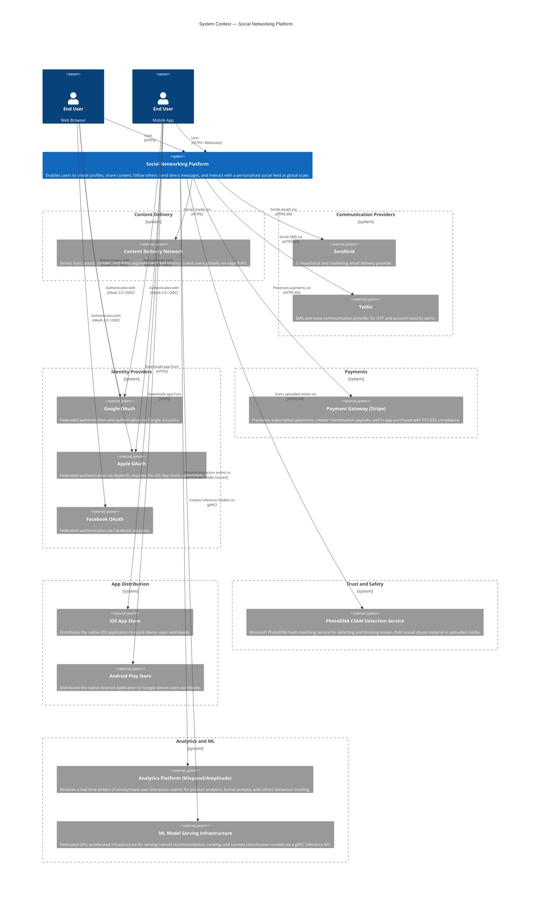

# C4 Architecture Diagrams

The following diagrams describe the architecture of the Social Networking Platform using the C4 model methodology. This document covers two levels of abstraction: the **System Context** diagram, which situates the platform within its broader ecosystem of users and external systems, and the **Container** diagram, which decomposes the platform into its major deployable units and illustrates how they interact. Together, these two views provide a comprehensive architectural overview suitable for both technical and stakeholder audiences, serving as the primary reference for engineers, architects, and technical leadership when reasoning about system boundaries, responsibilities, and integration points.

---

## System Context

The system context diagram establishes the boundaries of the Social Networking Platform and identifies the primary actors and external systems with which it interacts. It is intended to answer the fundamental questions of who uses the system and what external dependencies the platform relies upon, deliberately avoiding internal implementation detail. At this level of abstraction, the platform is treated as a single black box, and the diagram communicates the scope of the system relative to the outside world.

### External Actor Descriptions

**End User (Web Browser):** Interacts with the platform through a React single-page application delivered via CDN, performing all core social actions including profile management, content creation, feed browsing, and direct messaging. No application logic or credentials are stored client-side; all sensitive operations delegate to the backend.

**End User (Mobile App):** Interacts with the platform through native iOS or Android applications, benefiting from device-native capabilities such as push notifications, camera access, biometric authentication, and offline caching. Mobile clients maintain persistent WebSocket connections for real-time feed and messaging updates.

**Content Delivery Network:** Distributes static assets, user-uploaded images, and adaptive-bitrate video content to geographically dispersed users via globally distributed edge nodes, reducing origin server load and significantly improving perceived latency for media-heavy interactions.

**SendGrid (Email Provider):** Handles all transactional email communication including account verification links, password reset flows, and security alerts, as well as scheduled marketing digest emails, providing reliable delivery with bounce tracking and DMARC alignment.

**Twilio (SMS Provider):** Delivers one-time passwords for multi-factor authentication and critical account security notifications via SMS, ensuring reliable delivery across global carrier networks in jurisdictions where push notifications are unavailable or untrusted.

**Google OAuth:** Provides federated identity via Google accounts using the OpenID Connect protocol, enabling users to register and authenticate without maintaining a separate platform password, and supplying verified email addresses to bootstrap user profiles.

**Apple OAuth:** Provides federated identity via Apple ID, a mandatory integration for any iOS application that offers third-party sign-in options under App Store Review Guidelines, and uniquely supports the privacy-preserving "Hide My Email" relay address feature.

**Facebook OAuth:** Provides federated identity via Facebook accounts, lowering registration friction for users already active within the Meta ecosystem, and optionally supplying social graph seeds for friend discovery during onboarding.

**Payment Gateway (Stripe):** Manages all financial transactions including recurring premium subscription billing, creator tip and monetisation payouts via Stripe Connect, and in-app virtual goods purchases, maintaining full PCI-DSS Level 1 compliance on behalf of the platform.

**iOS App Store:** The primary distribution channel through which Apple device users discover and install the native iOS application; governs in-app purchase payment policies, requiring use of StoreKit for all digital goods transactions on the platform.

**Android Play Store:** The primary distribution channel through which Android device users discover and install the native Android application, supporting staged rollouts for gradual version adoption and in-app review API integration for surfacing ratings prompts.

**PhotoDNA CSAM Detection Service:** Integrates with Microsoft's PhotoDNA perceptual hash-matching service to automatically detect and block the upload of known child sexual abuse material, fulfilling mandatory legal obligations under NCMEC reporting requirements and ensuring platform compliance across all operating jurisdictions.

**Analytics Platform (Mixpanel/Amplitude):** Receives a high-throughput stream of anonymised user interaction events—including page views, content engagement, and conversion funnels—enabling product teams to analyse feature adoption, retention cohorts, and A/B experiment results in near real-time.

**ML Model Serving Infrastructure:** Hosts production-grade trained machine learning models on GPU-accelerated compute, exposing a gRPC inference API consumed by the platform's ML Ranking Service for feed ranking, content recommendation, spam classification, and engagement prediction workloads that exceed the compute capacity of general-purpose application nodes.

---

## Container Diagram

The container diagram decomposes the Social Networking Platform into its individual deployable units, illustrating the technology choices made for each component, the responsibilities each container owns, and the communication pathways between them. Each container represents a separately deployable process or data store that can be independently scaled, replaced, or failed without a complete system outage. The diagram intentionally omits infrastructure concerns such as load balancers, service meshes, and Kubernetes namespaces to remain focused on logical architecture.

```mermaid
C4Container
    title Container Diagram — Social Networking Platform

    Person(webUser, "End User (Web)", "Web browser user")
    Person(mobileUser, "End User (Mobile)", "iOS / Android user")

    Container_Boundary(snp, "Social Networking Platform") {
        Container(webApp, "Web Application", "React SPA / TypeScript", "Client-rendered single-page application served via CDN. Provides the full platform experience on desktop and mobile web browsers.")
        Container(iosApp, "Mobile Application iOS", "Swift / SwiftUI", "Native iOS application targeting iOS 16+. Delivers push notifications via APNs, offline feed caching, and biometric authentication.")
        Container(androidApp, "Mobile Application Android", "Kotlin / Jetpack Compose", "Native Android application targeting API 29+. Uses FCM for push delivery and WorkManager for background sync tasks.")

        Container(apiGateway, "API Gateway", "Kong / AWS API Gateway", "Unified ingress for all client traffic. Handles TLS termination, JWT validation, rate limiting, request routing, and OpenTelemetry trace injection.")

        Container(userService, "User Service", "Go / gRPC + REST", "Authoritative source for user identity, profiles, follower/following graphs, and block lists. Issues and validates platform-native JWTs. Handles OAuth token exchange with third-party identity providers.")
        Container(postService, "Post Service", "Go / gRPC + REST", "Manages the lifecycle of posts, comments, likes, shares, and quote posts. Generates S3 pre-signed upload URLs for media attachments. Enforces content rate limits and size constraints.")
        Container(feedService, "Feed Service", "Go / gRPC", "Assembles personalised home feeds and the global Explore feed using a hybrid fan-out strategy. Reads pre-computed feed sorted sets from Redis and invokes the ML Ranking Service for real-time candidate re-scoring.")
        Container(messagingService, "Messaging Service", "Go / WebSocket", "Manages real-time one-to-one and group conversations. Maintains persistent WebSocket connections and routes messages across nodes via Redis pub/sub. Stores ciphertext payloads in Cassandra.")
        Container(notificationService, "Notification Service", "Node.js / TypeScript", "Consumes notification trigger events from Kafka and dispatches push notifications (APNs/FCM), in-app notifications, and email digests, respecting per-user channel preferences.")
        Container(moderationService, "Moderation Service", "Python / FastAPI", "Executes ML-based content classification pipelines for hate speech, spam, and graphic violence detection. Routes ambiguous cases to human review queues. Integrates with PhotoDNA for CSAM scanning.")
        Container(mlRankingService, "ML Ranking Service", "Python / TensorFlow Serving", "Performs real-time and batch inference for feed ranking, content relevance scoring, and engagement prediction. Delegates heavy inference workloads to the external ML Model Serving Infrastructure.")

        ContainerDb(redis, "Redis Cluster", "Redis 7 / Cluster Mode", "Primary in-memory layer for pre-computed feed sorted sets, session tokens, rate-limit counters, social graph caches, and cross-node pub/sub message routing.")
        ContainerDb(postgres, "PostgreSQL", "PostgreSQL 15 / Patroni HA", "Primary relational store for user profiles, post metadata, social graph edges, subscription records, and moderation decisions. Managed via Patroni with synchronous streaming replication.")
        ContainerDb(cassandra, "Cassandra", "Apache Cassandra 4", "Time-series store for direct messages, activity logs, and notification history. Optimised for write-heavy, append-only workloads with linear horizontal scaling via consistent hashing.")
        ContainerDb(elasticsearch, "Elasticsearch", "Elasticsearch 8", "Full-text and faceted search index for users, posts, and hashtags. Supports type-ahead autocomplete, semantic search, and real-time trending topic queries.")
        ContainerDb(s3, "S3 + CDN", "AWS S3 / CloudFront", "Object storage for user-uploaded images, transcoded video files, and static frontend assets. CloudFront distributions enforce access control via signed URLs and serve content from edge locations globally.")
        Container(kafka, "Apache Kafka", "Apache Kafka 3 / MSK", "Distributed event streaming backbone decoupling producers from consumers. Key topics include post events, feed updates, moderation queue, notification triggers, and analytics events, all partitioned by entity ID.")
    }

    System_Ext(cdn, "Content Delivery Network", "Global CDN edge nodes")
    System_Ext(sendgrid, "SendGrid", "Email delivery provider")
    System_Ext(twilio, "Twilio", "SMS delivery provider")
    System_Ext(googleOAuth, "Google OAuth", "Identity provider")
    System_Ext(appleOAuth, "Apple OAuth", "Identity provider")
    System_Ext(facebookOAuth, "Facebook OAuth", "Identity provider")
    System_Ext(stripe, "Stripe", "Payment gateway")
    System_Ext(photodna, "PhotoDNA", "CSAM detection service")
    System_Ext(mixpanel, "Mixpanel / Amplitude", "Analytics platform")
    System_Ext(mlInfra, "ML Model Serving Infrastructure", "GPU inference cluster")
    System_Ext(apns, "APNs / FCM", "Mobile push notification services")

    Rel(webUser, webApp, "Uses", "HTTPS")
    Rel(mobileUser, iosApp, "Uses", "HTTPS / WebSocket")
    Rel(mobileUser, androidApp, "Uses", "HTTPS / WebSocket")

    Rel(webApp, apiGateway, "API calls", "HTTPS / REST")
    Rel(iosApp, apiGateway, "API calls", "HTTPS / REST + WebSocket")
    Rel(androidApp, apiGateway, "API calls", "HTTPS / REST + WebSocket")

    Rel(apiGateway, userService, "Routes user requests to", "gRPC / mTLS")
    Rel(apiGateway, postService, "Routes post requests to", "gRPC / mTLS")
    Rel(apiGateway, feedService, "Routes feed requests to", "gRPC / mTLS")
    Rel(apiGateway, messagingService, "Routes messaging requests to", "WebSocket / gRPC")
    Rel(apiGateway, stripe, "Proxies payment requests to", "HTTPS API")

    Rel(userService, postgres, "Reads and writes user and graph data", "SQL / TLS")
    Rel(userService, redis, "Caches sessions and graph lookups", "Redis Protocol")
    Rel(userService, kafka, "Publishes follow and unfollow events", "Kafka Producer")
    Rel(userService, googleOAuth, "Validates identity tokens with", "OAuth 2.0 / OIDC")
    Rel(userService, appleOAuth, "Validates identity tokens with", "OAuth 2.0 / OIDC")
    Rel(userService, facebookOAuth, "Validates identity tokens with", "OAuth 2.0 / OIDC")

    Rel(postService, postgres, "Reads and writes post metadata", "SQL / TLS")
    Rel(postService, s3, "Generates pre-signed upload URLs for", "AWS SDK / S3 API")
    Rel(postService, kafka, "Publishes post lifecycle events", "Kafka Producer")
    Rel(postService, moderationService, "Submits content for moderation", "gRPC / mTLS")

    Rel(feedService, redis, "Reads and writes feed sorted sets", "Redis Protocol")
    Rel(feedService, postService, "Hydrates post data for feed candidates", "gRPC / mTLS")
    Rel(feedService, mlRankingService, "Requests real-time ranking scores", "gRPC / mTLS")
    Rel(feedService, kafka, "Consumes feed-update and follow events", "Kafka Consumer")

    Rel(messagingService, cassandra, "Reads and writes message payloads", "CQL / TLS")
    Rel(messagingService, redis, "Routes messages cross-node via", "Redis Pub/Sub")
    Rel(messagingService, kafka, "Publishes message and conversation events", "Kafka Producer")

    Rel(notificationService, kafka, "Consumes notification trigger events", "Kafka Consumer")
    Rel(notificationService, apns, "Delivers mobile push notifications via", "HTTPS / APNs + FCM API")
    Rel(notificationService, sendgrid, "Sends email notifications via", "HTTPS API")
    Rel(notificationService, twilio, "Sends SMS alerts via", "HTTPS API")
    Rel(notificationService, postgres, "Reads and writes notification state", "SQL / TLS")

    Rel(moderationService, postgres, "Writes moderation decisions and review queues", "SQL / TLS")
    Rel(moderationService, photodna, "Scans uploaded images for CSAM via", "HTTPS API")
    Rel(moderationService, kafka, "Publishes moderation outcome events", "Kafka Producer")

    Rel(mlRankingService, redis, "Caches feature vectors and inference results", "Redis Protocol")
    Rel(mlRankingService, mlInfra, "Delegates heavy inference workloads to", "gRPC")
    Rel(mlRankingService, kafka, "Consumes real-time engagement signals", "Kafka Consumer")

    Rel(kafka, mixpanel, "Streams analytics events via", "Kafka Connect / HTTPS")
    Rel(s3, cdn, "Acts as CDN origin for assets", "HTTPS")
    Rel(webApp, cdn, "Is served from", "HTTPS")
    Rel(iosApp, cdn, "Downloads media assets from", "HTTPS")
    Rel(androidApp, cdn, "Downloads media assets from", "HTTPS")
```

### Container Descriptions

**Web Application (React SPA / TypeScript)**

The web application is a client-rendered single-page application built with React and TypeScript, bundled with Vite, and distributed globally through CDN edge nodes to eliminate origin latency for asset delivery. It communicates with the API Gateway exclusively over HTTPS and maintains a persistent WebSocket connection for real-time feed updates and direct messaging. Code-splitting and lazy loading minimise the initial bundle size, and a service worker provides offline-capable asset caching via the Cache API. All sensitive operations—authentication, content moderation decisions, and payment processing—delegate entirely to backend services, with no business logic or credentials residing client-side.

**Mobile Application iOS (Swift / SwiftUI)**

The native iOS application is implemented in Swift using the SwiftUI declarative UI framework, targeting iOS 16 and above to leverage the latest concurrency primitives and SwiftUI lifecycle APIs. It integrates Apple Push Notification service (APNs) for reliable background notification delivery, the AVFoundation and PhotosUI frameworks for rich media capture and upload, and LocalAuthentication for Face ID and Touch ID biometric flows. An offline-first design persists a local SQLite cache of recent feed items and conversation threads via Core Data, ensuring the application remains useful during intermittent connectivity. App Clip support enables lightweight entry points for shared content without requiring a full installation.

**Mobile Application Android (Kotlin / Jetpack Compose)**

The Android application mirrors the iOS feature set using Kotlin and Jetpack Compose for declarative, reactive UI rendering, targeting Android 10 (API level 29) and above to maintain broad device compatibility. Firebase Cloud Messaging (FCM) handles all push notification delivery, and WorkManager schedules lifecycle-aware background tasks for feed prefetching and offline analytics event batching. The application follows Material Design 3 guidelines and supports dynamic colour theming on Android 12+ devices. Paging 3 is used for efficient paginated loading of feeds, and Coil handles asynchronous image loading with in-memory and disk caching tiers.

**API Gateway (Kong / AWS API Gateway)**

The API Gateway serves as the single, unified ingress point for all external client traffic, providing a clear demarcation between the public internet and the internal service mesh. It performs TLS termination, verifies JWT signatures and scopes before forwarding any request downstream, and enforces per-user and per-IP rate limiting policies to mitigate abuse and credential stuffing attacks. Downstream services are reached over mutually authenticated TLS (mTLS) gRPC channels, eliminating the possibility of unauthenticated service-to-service calls. The gateway also handles request/response transformation, injects distributed tracing headers conforming to the W3C Trace Context specification, and supports canary routing for progressive feature rollouts without client-side involvement.

**User Service (Go / gRPC + REST)**

The User Service is the authoritative source of truth for all user identity, profile, and social graph data, and is one of the most critical services in the platform given the breadth of its downstream consumers. Written in Go for its low memory footprint and high-concurrency goroutine model, it exposes both a gRPC interface for internal service-to-service calls and a REST/JSON interface consumed by the API Gateway for browser-compatible requests. The complete follower/following adjacency graph is stored as edges in PostgreSQL and materialised into Redis sorted sets for sub-millisecond social graph traversal in hot paths such as feed assembly and notification targeting. OAuth token validation for Google, Apple, and Facebook identity providers is performed here prior to issuing short-lived, signed platform-native JWTs that downstream services can verify independently without contacting the User Service on every request.

**Post Service (Go / gRPC + REST)**

The Post Service manages the complete lifecycle of user-generated content: creation, editing, deletion, and all forms of engagement including likes, comments, reposts, and quote posts. Rather than routing large binary media payloads through the API Gateway and service mesh, it generates S3 pre-signed upload URLs that clients use to upload media objects directly to object storage, significantly reducing network bandwidth and processing overhead in the data path. Upon successful post creation, the service publishes a `post.created` event to Kafka, allowing the Feed Service, Moderation Service, Notification Service, and analytics pipeline to react asynchronously without introducing synchronous coupling. Engagement counters are stored in PostgreSQL with optimistic concurrency control to handle high-concurrency like storms without row-level lock contention.

**Feed Service (Go / gRPC)**

The Feed Service is responsible for assembling and serving two distinct feed surfaces: the personalised home feed, which surfaces content from accounts a user follows ranked by predicted engagement, and the algorithmic Explore feed, which surfaces content from beyond the user's explicit social graph to drive content discovery. The service employs a hybrid fan-out delivery strategy described in detail in the architectural decisions section below. Pre-computed feed candidate lists are stored as Redis sorted sets keyed by user ID, with scores representing a composite of recency and engagement signals. The ML Ranking Service is invoked to re-score and reorder the top-K candidates from the Redis sorted set before results are serialised and returned to the client, ensuring personalised ordering without requiring a full feed rebuild on every request.

**Messaging Service (Go / WebSocket)**

The Messaging Service provides real-time one-to-one and group direct messaging, maintaining persistent WebSocket connections with connected clients and delivering ordered, reliable message delivery across the platform. When a sender and recipient are connected to different service instances, Redis pub/sub acts as the cross-node routing mechanism, with the recipient's connection node subscribing to a channel keyed by user ID. Message payloads are persisted to Cassandra using a data model optimised for the primary query pattern of fetching the latest N messages for a given conversation, using bucketed time-UUID clustering columns to prevent unbounded partition growth. End-to-end encryption key negotiation is implemented using a Signal Protocol-inspired double ratchet mechanism, ensuring the server stores and transmits only ciphertext.

**Notification Service (Node.js / TypeScript)**

The Notification Service aggregates notification trigger events from multiple Kafka topics—including `post.liked`, `post.commented`, `user.followed`, `mention.created`, and `message.received`—and translates them into the appropriate delivery channel for each recipient. Node.js is selected for this role because its event-loop concurrency model is well-suited to the high-concurrency I/O-bound fan-out pattern of reading preferences, formatting payloads, and dispatching to multiple external provider APIs simultaneously without the overhead of thread-per-request models. An intelligent batching layer collapses multiple redundant notifications from the same source event—such as 50 likes on a single post—into a single digest notification, reducing notification fatigue while preserving signal. In-app notification state, including read receipts and dismissal status, is persisted in PostgreSQL.

**Moderation Service (Python / FastAPI)**

The Moderation Service provides the platform's automated and human-assisted content safety infrastructure, operating on both a synchronous path for newly submitted posts and an asynchronous batch path for retroactive scanning. On the automated path, submitted images are dispatched to Microsoft PhotoDNA for perceptual hash-matching against the known CSAM database, and text content is classified by fine-tuned transformer models for hate speech, targeted harassment, spam, and graphic violence. Content receiving a confidence score above a configurable action threshold is automatically hidden or removed; content in the ambiguous confidence band is routed to a human review queue with SLA-based priority tiers. Python is selected as the implementation language to leverage the mature ML and computer vision ecosystem (Transformers, scikit-learn, OpenCV, Pillow) without requiring cross-language FFI bridges.

**ML Ranking Service (Python / TensorFlow Serving)**

The ML Ranking Service provides inference capabilities for the platform's core personalisation and recommendation features, serving as the bridge between the application tier and the specialised ML model infrastructure. It exposes a gRPC interface consumed by the Feed Service, hosting lightweight model variants locally for low-latency online inference on shallow feature sets, while proxying computationally intensive re-ranking requests that require deep feature embeddings to the external ML Model Serving Infrastructure on GPU-accelerated nodes. The service consumes real-time engagement events from Kafka—including dwell time, likes, shares, and skip signals—to update short-term user interest representations in Redis without requiring a full model retrain cycle. Pre-computed feature vectors for active users are materialised in Redis to minimise per-request featurisation latency and avoid redundant database reads on the hot inference path.

**Redis Cluster (Redis 7 / Cluster Mode)**

Redis serves as the primary in-memory data layer, underpinning multiple distinct subsystems across the platform simultaneously. Feed sorted sets store pre-ranked lists of post IDs per user, enabling O(log N) insertion during fan-out-on-write and O(1) ranked range retrieval at feed read time. The session store holds short-lived JWT refresh tokens and OAuth PKCE state parameters with appropriate TTLs. Rate-limit counters leverage Redis' atomic INCR and EXPIRE commands to enforce per-user API quotas at sub-millisecond latency without incurring database round-trips. The pub/sub subsystem underpins the Messaging Service's cross-node WebSocket routing. Redis Cluster mode is deployed with six nodes—three primary shards and three replicas—providing both horizontal throughput scaling and transparent failover on primary node loss.

**PostgreSQL (PostgreSQL 15 / Patroni HA)**

PostgreSQL serves as the primary relational database for all structured, transactional data that requires ACID guarantees: user profiles, post records, social graph edges, subscription states, payment records, and moderation decisions. A Patroni-managed streaming replication cluster with a single synchronous standby guarantees zero data loss (RPO = 0) on primary node failure, while a set of asynchronous read replicas behind a PgBouncer connection pool absorbs the high volume of read queries from the User and Post services. Row-level security policies enforce data access isolation between service roles, and pg_partman manages time-based range partitioning on high-volume append tables such as `post_likes`, `notification_log`, and `audit_events` to bound query plan costs as the dataset grows.

**Cassandra (Apache Cassandra 4)**

Apache Cassandra is selected as the storage engine for all write-heavy, time-ordered data workloads where horizontal scalability and write availability take precedence over full relational capabilities. Direct messages are modelled with a partition key of `(conversation_id, time_bucket)` and a clustering column of `message_id` (ULID), yielding efficient range scans over recent message windows without the secondary index overhead that would degrade write throughput on a relational engine. Activity logs for audit and compliance are written with a 90-day TTL, and Cassandra handles expiry natively without requiring external cleanup jobs. Its masterless, peer-to-peer replication architecture with a replication factor of 3 across multiple availability zones ensures the message store sustains writes and reads even during partial cluster outages, a non-negotiable requirement for the messaging use case.

**Elasticsearch (Elasticsearch 8)**

Elasticsearch powers all user-facing discovery and search functionality: finding users by name or username, searching posts by keyword or hashtag, discovering accounts by topic interest, and surfacing trending content in real time. The index schema is deliberately denormalised—user documents embed follower count, verification badge status, and bio text to eliminate join-time lookups, and post documents embed the author's display name and avatar URL to make a single index query sufficient for rendering search results. A custom BM25 scoring function is extended with a rescoring pass that incorporates engagement signal boosters and recency decay factors to suppress low-quality or stale content. The `search_as_you_type` field type with edge n-gram tokenisation delivers sub-50 ms type-ahead autocomplete responses under production query volumes.

**S3 + CDN (AWS S3 / CloudFront)**

All binary assets—user profile images, post photographs, video files in multiple adaptive bitrate (HLS) transcoded variants, and the compiled frontend application bundle—reside in AWS S3 with object versioning enabled. S3 lifecycle rules automatically transition objects to S3 Standard-IA storage class after 30 days of inactivity, reducing storage costs for the long tail of infrequently accessed media. CloudFront distributions are configured with Origin Access Control (OAC) to prevent direct S3 access, acting as the secure and globally distributed content delivery layer. Signed URLs with short expiry windows enforce access control for private or user-restricted media, ensuring that content cannot be shared beyond its intended audience by redistributing a bare URL.

**Apache Kafka (Apache Kafka 3 / MSK)**

Kafka forms the asynchronous event streaming backbone of the platform, decoupling every major producer from its downstream consumers and enabling each service to scale, fail, and redeploy independently. Core topics include `user.events` (follow, unfollow, block), `post.events` (created, deleted, flagged), `feed.updates` (fan-out signals for the Feed Service), `moderation.queue` (content awaiting classification), `notification.triggers` (engagement events for the Notification Service), and `analytics.events` (the raw interaction stream forwarded to Mixpanel via Kafka Connect). Each topic is partitioned by the primary entity ID—user ID for social graph events, post ID for content events—preserving causal ordering within an entity while allowing full parallelism across partitions. Kafka's configurable retention window (7 days by default) supports event replay for newly deployed consumers and post-incident forensic analysis.

---

## Key Architectural Decisions

### Microservices Architecture

The platform is decomposed into independently deployable microservices rather than a monolithic application for several mutually reinforcing reasons that become compelling at social-network scale. Different subsystems exhibit radically divergent traffic profiles: the Feed Service sustains read throughput several orders of magnitude above the Post Service's write rate during peak hours, while the Moderation Service's CPU-bound ML classification workloads demand GPU-class compute nodes entirely unlike the memory-optimised instances preferred by the Redis-heavy Feed Service. A microservices topology allows each service to be horizontally scaled, deployed, and updated independently on the hardware profile that best matches its workload, eliminating the resource contention and deployment coupling that would arise in a shared monolithic process. Engineering teams take end-to-end ownership of individual services, enabling parallel development streams across multiple product areas simultaneously and reducing the blast radius of any failure through circuit breaker, timeout, and bulkhead isolation patterns at service boundaries.

### Feed Delivery: Fan-out on Write vs Fan-out on Read

Feed generation is the highest-traffic read path on the platform, and the choice of delivery strategy has cascading implications for infrastructure cost, data freshness, and read latency. A pure fan-out-on-write approach pre-materialises a post into every follower's Redis feed sorted set at creation time, delivering O(1) read latency at the cost of O(F) write amplification proportional to the author's follower count. For a celebrity account with 10 million followers, a single post triggers 10 million Redis write operations, producing unacceptable write amplification that can saturate the cluster during peak posting windows. Conversely, a pure fan-out-on-read approach constructs each user's feed entirely at query time by merging posts from every followed account, producing prohibitive read latency for users following thousands of active accounts. The platform resolves this tension with a hybrid strategy: accounts with fewer than 10,000 followers use fan-out-on-write with pre-computed Redis sorted sets for O(1) read assembly, while high-follower accounts above this threshold are excluded from write-time fan-out and their posts are injected into follower feeds at query time via a targeted merge. This bounds write amplification within operationally manageable limits while delivering consistent sub-100 ms feed assembly latency for the overwhelming majority of user sessions.

### Cassandra for Message Storage

Apache Cassandra is selected as the storage engine for direct messages in preference to PostgreSQL for reasons intrinsic to the access patterns and durability characteristics of messaging workloads at scale. Message writes are inherently append-only and arrive at extremely high velocity—a group conversation with 100 active participants can generate thousands of writes per minute, and the platform may sustain millions of concurrent conversations globally. Cassandra's log-structured merge-tree (LSM) storage engine is architecturally optimised for sustained sequential write throughput with predictable single-digit millisecond latencies, whereas PostgreSQL's B-tree index structures degrade in write performance under high-concurrency append loads as page splits and vacuum operations introduce latency variance. The natural time-ordering of messages maps directly to Cassandra's clustering column model, enabling efficient bounded range scans over recent message windows without requiring secondary indexes or application-level cursor management. Furthermore, Cassandra's linear horizontal scaling via consistent hashing and its masterless replication model allow the message store to grow with platform adoption by simply adding nodes, without requiring schema migrations, sharding logic in application code, or planned maintenance windows.

### Kafka for Asynchronous Event Processing

Apache Kafka is adopted as the platform's event streaming backbone in preference to a traditional message broker (such as RabbitMQ or Amazon SQS) or direct synchronous service calls for three compounding reasons. First, durability and event replayability: Kafka retains all events for a configurable retention window—7 days in production—allowing newly deployed consumer services or services recovering from extended outages to replay the complete historical event stream without requiring upstream producers to re-emit data or buffer events on behalf of slow consumers. Second, resilience through temporal decoupling: a service publishing a `post.created` event has zero runtime dependency on the availability or throughput of its downstream consumers; if the Notification Service undergoes a deployment, it lags behind and catches up automatically on restart without any data loss or producer-side backpressure. Third, native fan-out efficiency: a single Kafka topic can be consumed simultaneously by multiple independent consumer groups—the Feed Service, Moderation Service, ML Ranking Service, and analytics pipeline all consume the `post.events` topic in parallel with no inter-group coordination overhead, a pattern that would require either multiple queues or a complex publish-subscribe topology in a traditional message broker.

### Separation of the ML Ranking Service

The ML Ranking Service is deliberately extracted as a standalone microservice rather than embedding ranking logic within the Feed Service, and this architectural boundary is one of the most consequential decisions in the platform's design. Machine learning model inference workloads have compute resource profiles fundamentally different from general application services: they require GPU or AVX-512-accelerated CPU hardware, hold large in-memory model artefacts measured in gigabytes, and depend on specialised serving runtimes such as TensorFlow Serving or NVIDIA Triton Inference Server that introduce complex dependency chains incompatible with a general-purpose Go service container. Maintaining a clean gRPC interface between the Feed Service and the ML Ranking Service enforces a strict contract that decouples the model experimentation and deployment cycle from the application release cadence: ML engineers can retrain, shadow-test, and hot-swap model versions via A/B routing in the ranking service without requiring any coordination with the Feed Service team or triggering a platform-wide deployment. The separation also enables cost-optimised infrastructure provisioning—GPU-equipped nodes are allocated exclusively to the ranking service rather than being over-provisioned across all application instances—and allows the service to be scaled independently during ranking-intensive workloads such as Explore feed cold-start ranking for new users.

---

## Diagram Conventions

All diagrams in this document follow the C4 model notation as defined by Simon Brown. **Persons** represent human actors that interact with the system. **Systems** represent the highest-level grouping of related functionality, whether owned by this organisation or external. **Containers** represent individually deployable units of software—processes, data stores, or serverless functions—within a system boundary. Arrows denote runtime interactions and are labelled with the communication protocol or mechanism used. Technology annotations are expressed as the second label within each shape and reflect the production technology choices at the time of writing; they are expected to evolve as the platform matures. Diagrams are intentionally scoped to the level of abstraction that communicates architectural intent without drifting into implementation specifics, which are captured in service-level design documents.
