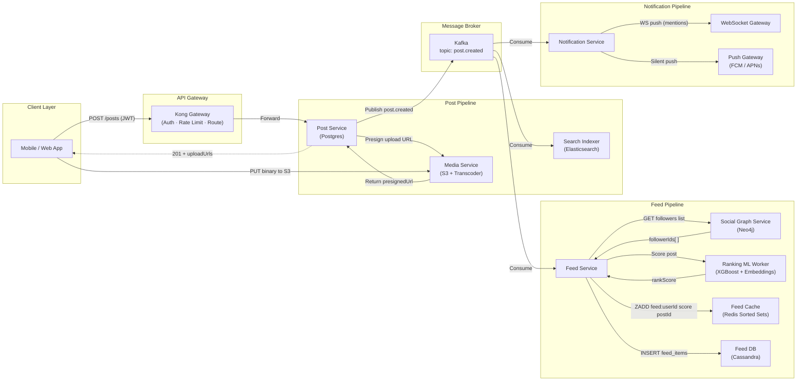
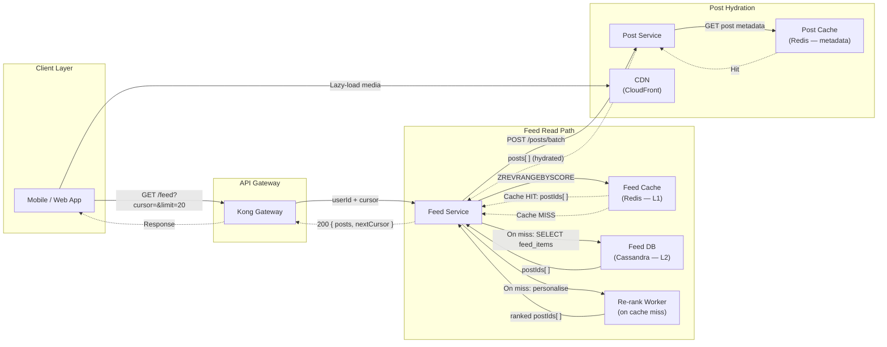
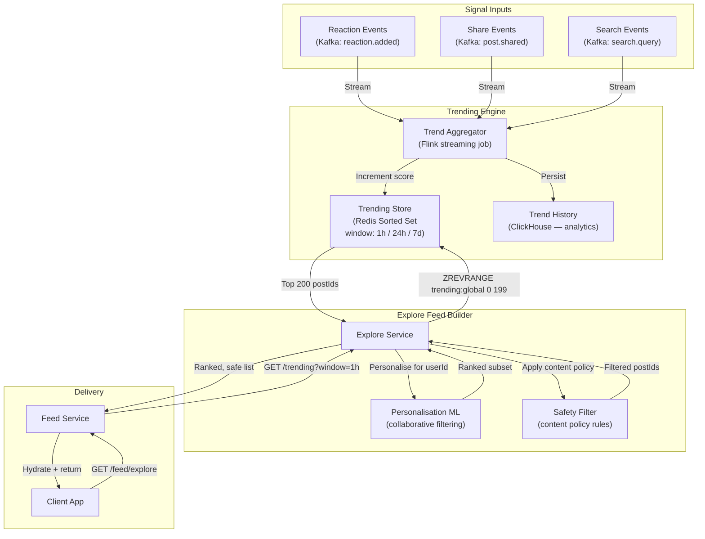
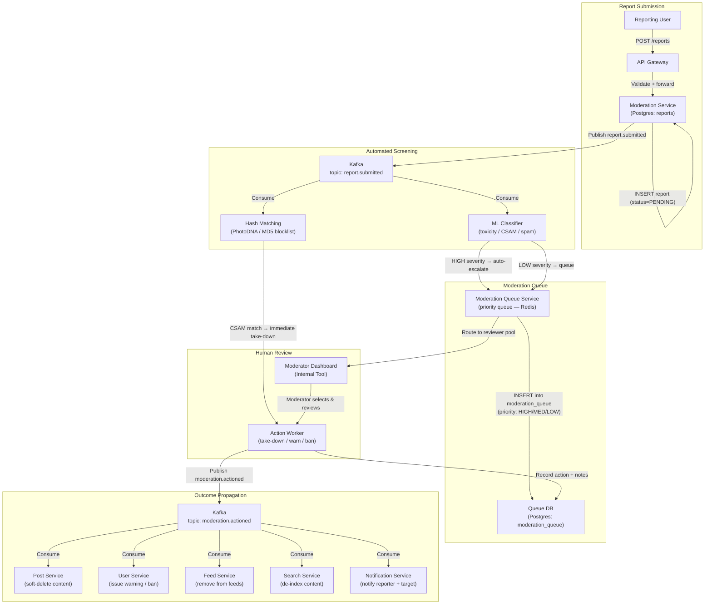
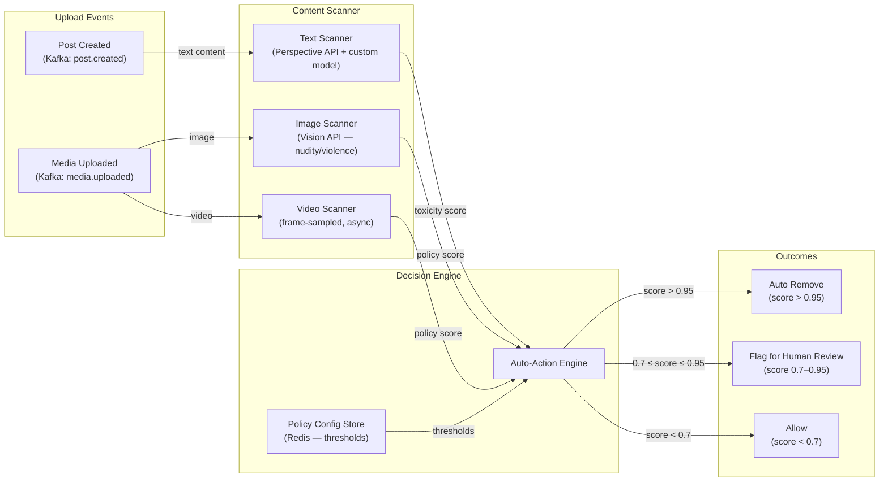
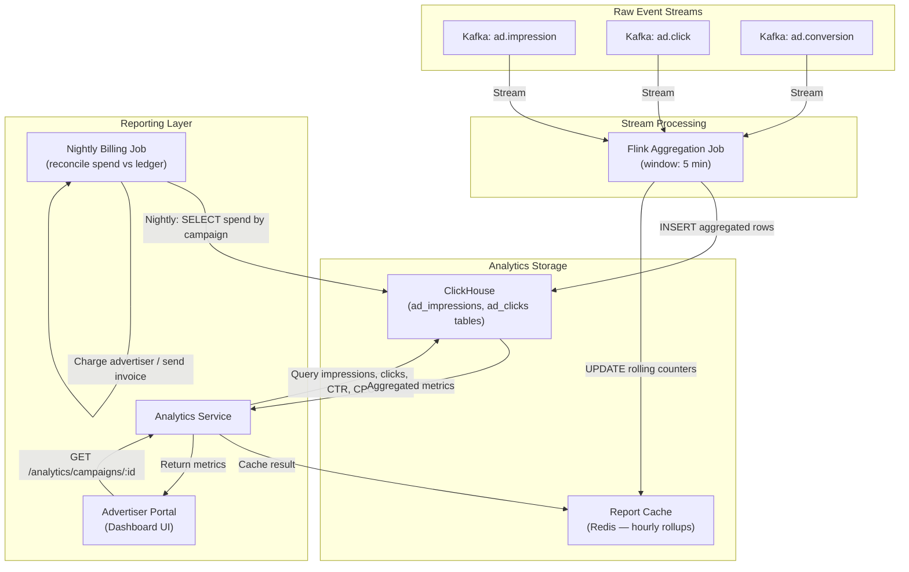

# Data Flow Diagrams — Social Networking Platform

## 1. Overview

These diagrams trace how data moves through the platform's microservices, message broker,
caches, and storage layers for three high-impact scenarios:

| # | Scenario | Key Concern |
|---|----------|-------------|
| 1 | Feed Data Flow | Latency < 200 ms for feed reads; eventual consistency for fan-out |
| 2 | Content Moderation | Safety SLA: actionable reports triaged within 24 h |
| 3 | Advertising | Impression attribution < 1 s; billing reconciled nightly |

All flows traverse the API Gateway for inbound requests. Internal service-to-service calls use
gRPC over a service mesh (Istio). Asynchronous data movement uses Kafka topics with at-least-once
delivery and idempotent consumers.

---

## 2. Feed Data Flow

### 2.1 Write Path — Post Creation to Feed Delivery



### 2.2 Read Path — Timeline Fetch



### 2.3 Explore / Trending Feed



---

## 3. Content Moderation Data Flow

### 3.1 User-Submitted Report Flow



### 3.2 Proactive Automated Scanning



---

## 4. Advertising Data Flow

### 4.1 Ad Serving — Request-Time Flow

```mermaid
flowchart LR
    subgraph Client["Client Layer"]
        APP["Mobile / Web App"]
    end

    subgraph Gateway["API Gateway"]
        GW["Kong Gateway"]
    end

    subgraph AdDecision["Ad Decision Engine"]
        AdSvc["Ad Service"]
        AuctionEngine["Auction Engine\n(eCPM second-price)"]
        TargetingEngine["Targeting Engine\n(segments + context)"]
        FreqCap["Frequency Cap\n(Redis: impressions per user)"]
        AdCache["Ad Creative Cache\n(Redis — 5 min TTL)"]
    end

    subgraph CampaignData["Campaign Data"]
        AdDB["Ad DB\n(Postgres: campaigns/creatives)"]
        SegmentStore["User Segment Store\n(Redis Bitmaps)"]
    end

    subgraph Tracking["Impression Tracking"]
        ImpressionKafka["Kafka\ntopic: ad.impression"]
        AnalyticsSvc["Analytics Service\n(ClickHouse)"]
        BillingSvc["Billing Service\n(Postgres: spend ledger)"]
    end

    subgraph CDN["Media Delivery"]
        CDN["CDN (CloudFront)\nAd Creative Assets"]
    end

    APP -->|"GET /feed (slot: in-feed-ad)"| GW
    GW -->|"Forward + userId"| AdSvc

    AdSvc -->|"Check daily cap"| FreqCap
    FreqCap -->|"Cap not reached"| AdSvc

    AdSvc -->|"GET eligible segments"| SegmentStore
    SegmentStore -->|"segmentIds[ ]"| AdSvc

    AdSvc -->|"GET creatives by segments"| AdCache
    AdCache -.->|"Cache miss"| AdDB
    AdDB -->|"eligible campaigns + bids"| AdSvc
    AdSvc -->|"Run auction"| AuctionEngine
    AuctionEngine -->|"Winning creative + clearing price"| AdSvc

    AdSvc -->|"Render ad slot"| GW
    GW -->|"Include ad in feed response"| APP
    APP -->|"Fetch media asset"| CDN

    APP -->|"Impression beacon (async)"| AdSvc
    AdSvc -->|"Increment freq cap"| FreqCap
    AdSvc -->|"Publish ad.impression"| ImpressionKafka

    ImpressionKafka -->|"Consume"| AnalyticsSvc
    ImpressionKafka -->|"Consume"| BillingSvc
```

### 4.2 Ad Performance Reporting Data Flow


