# Domain Model — Social Networking Platform

## 1. Overview

The domain model is organised around five core bounded contexts, each owned by a dedicated
microservice. Entities within a context are strongly consistent; cross-context references use
IDs only (no foreign-key joins across service boundaries).

| Bounded Context | Aggregate Roots | Owned By |
|-----------------|-----------------|----------|
| Identity | User, UserCredential | User Service |
| Social Graph | Follow, Block, FriendRequest | Social Graph Service |
| Content | Post, Story, Comment, Reaction, Poll | Post Service / Story Service |
| Messaging | DirectMessage, GroupChat | Messaging Service |
| Community & Moderation | Community, ContentReport, BanRecord | Community + Moderation Service |
| Advertising | Advertiser, AdCampaign, AdCreative | Ad Service |
| Notifications | Notification, NotificationPreference | Notification Service |

---

## 2. Domain Model Diagram

```mermaid
classDiagram
    %% ─── Identity Context ───────────────────────────────────────────────────
    class User {
        +UUID id
        +String username
        +String email
        +UserStatus status
        +Boolean isVerified
        +Boolean isPrivate
        +DateTime createdAt
        +DateTime updatedAt
        +DateTime deletedAt
    }

    class UserProfile {
        +UUID id
        +UUID userId
        +String displayName
        +String bio
        +String avatarUrl
        +String coverUrl
        +String website
        +String location
        +Date birthDate
        +String pronouns
        +DateTime updatedAt
    }

    class UserCredential {
        +UUID id
        +UUID userId
        +CredentialType type
        +String hashedSecret
        +String provider
        +String providerSubject
        +DateTime lastUsedAt
        +DateTime expiresAt
    }

    User "1" --> "1" UserProfile : has
    User "1" --> "1..*" UserCredential : authenticates via

    %% ─── Social Graph Context ────────────────────────────────────────────────
    class Follow {
        +UUID id
        +UUID followerId
        +UUID followeeId
        +FollowStatus status
        +DateTime createdAt
    }

    class Block {
        +UUID id
        +UUID blockerId
        +UUID blockedId
        +String reason
        +DateTime createdAt
    }

    class FriendRequest {
        +UUID id
        +UUID senderId
        +UUID receiverId
        +FriendRequestStatus status
        +String message
        +DateTime sentAt
        +DateTime respondedAt
    }

    User "1" --> "0..*" Follow : initiates
    User "1" --> "0..*" Block : enforces
    User "1" --> "0..*" FriendRequest : sends

    %% ─── Content Context ─────────────────────────────────────────────────────
    class Post {
        +UUID id
        +UUID authorId
        +String content
        +PostType type
        +PostVisibility visibility
        +Boolean commentsDisabled
        +UUID parentPostId
        +Int reactionCount
        +Int commentCount
        +Int shareCount
        +Int repostCount
        +DateTime publishedAt
        +DateTime editedAt
        +DateTime deletedAt
    }

    class PostMedia {
        +UUID id
        +UUID postId
        +MediaType mediaType
        +String storageKey
        +String cdnUrl
        +String thumbnailUrl
        +Int width
        +Int height
        +Int durationSeconds
        +Int sortOrder
        +DateTime createdAt
    }

    class PostTag {
        +UUID postId
        +UUID hashtagId
        +DateTime taggedAt
    }

    class Mention {
        +UUID id
        +UUID postId
        +UUID mentionedUserId
        +MentionContext context
        +DateTime createdAt
    }

    class Poll {
        +UUID id
        +UUID postId
        +String question
        +DateTime expiresAt
        +Boolean multipleChoice
    }

    class PollOption {
        +UUID id
        +UUID pollId
        +String label
        +Int voteCount
    }

    class PollVote {
        +UUID id
        +UUID pollId
        +UUID optionId
        +UUID userId
        +DateTime votedAt
    }

    class Story {
        +UUID id
        +UUID authorId
        +StoryMediaType mediaType
        +String storageKey
        +String cdnUrl
        +String overlayJson
        +StoryVisibility visibility
        +Int viewCount
        +DateTime expiresAt
        +DateTime createdAt
    }

    class Comment {
        +UUID id
        +UUID postId
        +UUID authorId
        +UUID parentCommentId
        +String content
        +Int reactionCount
        +Int replyCount
        +DateTime createdAt
        +DateTime editedAt
        +DateTime deletedAt
    }

    class Reaction {
        +UUID id
        +UUID actorId
        +UUID targetId
        +ReactionTargetType targetType
        +ReactionType type
        +DateTime createdAt
    }

    class Share {
        +UUID id
        +UUID sharedByUserId
        +UUID postId
        +ShareDestination destination
        +DateTime sharedAt
    }

    class Repost {
        +UUID id
        +UUID reposterId
        +UUID originalPostId
        +String addedComment
        +DateTime repostedAt
    }

    class Hashtag {
        +UUID id
        +String tag
        +Int postCount
        +Int followCount
        +DateTime createdAt
    }

    class HashtagFollow {
        +UUID userId
        +UUID hashtagId
        +DateTime followedAt
    }

    Post "1" --> "0..*" PostMedia : contains
    Post "1" --> "0..*" PostTag : tagged with
    Post "1" --> "0..1" Poll : may have
    Poll "1" --> "2..*" PollOption : offers
    PollOption "1" --> "0..*" PollVote : receives
    Post "1" --> "0..*" Comment : receives
    Comment "0..1" --> "0..*" Comment : has replies
    Post "1" --> "0..*" Reaction : receives
    Post "1" --> "0..*" Mention : contains
    Post "1" --> "0..*" Share : shared via
    Post "1" --> "0..*" Repost : reposted as
    Hashtag "1" --> "0..*" PostTag : appears in
    Hashtag "1" --> "0..*" HashtagFollow : followed by

    %% ─── Feed Context ─────────────────────────────────────────────────────────
    class Feed {
        +UUID id
        +UUID userId
        +FeedType type
        +DateTime lastRefreshedAt
    }

    class FeedItem {
        +UUID id
        +UUID feedId
        +UUID postId
        +Float rankScore
        +DateTime insertedAt
        +Boolean seen
    }

    class FeedRanking {
        +UUID postId
        +UUID userId
        +Float engagementScore
        +Float recencyScore
        +Float socialScore
        +Float finalScore
        +DateTime computedAt
    }

    Feed "1" --> "0..*" FeedItem : contains
    FeedItem "1" --> "1" FeedRanking : ranked by

    %% ─── Notification Context ─────────────────────────────────────────────────
    class Notification {
        +UUID id
        +UUID recipientId
        +UUID actorId
        +NotificationType type
        +UUID entityId
        +String entityType
        +String title
        +String body
        +String deeplink
        +Boolean read
        +DateTime createdAt
        +DateTime readAt
    }

    class NotificationPreference {
        +UUID id
        +UUID userId
        +NotificationType type
        +Boolean inApp
        +Boolean push
        +Boolean email
        +DateTime updatedAt
    }

    User "1" --> "0..*" Notification : receives
    User "1" --> "0..*" NotificationPreference : configures

    %% ─── Messaging Context ────────────────────────────────────────────────────
    class DirectMessage {
        +UUID id
        +UUID conversationId
        +UUID senderId
        +Bytes ciphertext
        +MessageStatus status
        +UUID mediaId
        +DateTime sentAt
        +DateTime deliveredAt
        +DateTime readAt
        +DateTime deletedAt
    }

    class GroupChat {
        +UUID id
        +String name
        +String avatarUrl
        +UUID createdByUserId
        +GroupChatRole defaultRole
        +DateTime createdAt
        +DateTime updatedAt
    }

    class GroupChatMember {
        +UUID groupChatId
        +UUID userId
        +GroupChatRole role
        +DateTime joinedAt
        +DateTime mutedUntil
    }

    GroupChat "1" --> "2..*" GroupChatMember : has
    GroupChat "1" --> "0..*" DirectMessage : contains

    %% ─── Community Context ────────────────────────────────────────────────────
    class Community {
        +UUID id
        +String name
        +String slug
        +String description
        +String avatarUrl
        +CommunityVisibility visibility
        +Boolean requireApproval
        +Int memberCount
        +DateTime createdAt
    }

    class CommunityMember {
        +UUID communityId
        +UUID userId
        +CommunityRole role
        +DateTime joinedAt
        +DateTime bannedAt
    }

    class CommunityPost {
        +UUID id
        +UUID communityId
        +UUID postId
        +UUID pinnedByUserId
        +Boolean isPinned
        +DateTime postedAt
    }

    Community "1" --> "1..*" CommunityMember : has
    Community "1" --> "0..*" CommunityPost : contains

    %% ─── Moderation Context ──────────────────────────────────────────────────
    class ContentReport {
        +UUID id
        +UUID reporterId
        +UUID targetId
        +ReportTargetType targetType
        +ReportReason reason
        +String details
        +ReportStatus status
        +DateTime createdAt
        +DateTime resolvedAt
    }

    class ModerationQueue {
        +UUID id
        +UUID reportId
        +UUID assignedModeratorId
        +ModerationAction action
        +String notes
        +DateTime assignedAt
        +DateTime completedAt
    }

    class BanRecord {
        +UUID id
        +UUID userId
        +UUID moderatorId
        +BanScope scope
        +String reason
        +DateTime bannedAt
        +DateTime expiresAt
        +Boolean isPermanent
    }

    ContentReport "1" --> "1" ModerationQueue : queues into
    User "1" --> "0..*" BanRecord : subject to

    %% ─── Advertising Context ─────────────────────────────────────────────────
    class Advertiser {
        +UUID id
        +String companyName
        +String contactEmail
        +AdvertiserStatus status
        +DateTime createdAt
    }

    class AdCampaign {
        +UUID id
        +UUID advertiserId
        +String name
        +CampaignObjective objective
        +Decimal budgetTotal
        +Decimal budgetDaily
        +DateTime startDate
        +DateTime endDate
        +CampaignStatus status
    }

    class AdCreative {
        +UUID id
        +UUID campaignId
        +String headline
        +String bodyText
        +String ctaLabel
        +String ctaUrl
        +String mediaUrl
        +CreativeStatus status
    }

    class AdImpression {
        +UUID id
        +UUID creativeId
        +UUID userId
        +String placementSlot
        +Boolean clicked
        +Decimal costMicros
        +DateTime impressedAt
    }

    Advertiser "1" --> "1..*" AdCampaign : runs
    AdCampaign "1" --> "1..*" AdCreative : contains
    AdCreative "1" --> "0..*" AdImpression : generates
```

---

## 3. Aggregate Boundaries

Each aggregate root is the single entry point for mutations within its cluster. No service
should reach into another aggregate's internal entities directly.

### Identity Aggregate
- **Root:** `User`
- **Cluster:** `UserProfile`, `UserCredential`
- **Invariants:** Email must be globally unique. Username must match `[a-z0-9_.]{3,30}`.
  Credentials of type `PASSWORD` must store only a bcrypt hash, never plaintext.

### Post Aggregate
- **Root:** `Post`
- **Cluster:** `PostMedia`, `PostTag`, `Mention`, `Poll`, `PollOption`, `PollVote`
- **Invariants:** A post cannot exceed 10 media attachments. A poll must have 2–4 options and
  cannot be edited after any vote is cast. `visibility=PRIVATE` posts fan-out to followers only.

### Story Aggregate
- **Root:** `Story`
- **Invariants:** Stories expire at 24 hours by default (configurable up to 7 days for premium
  users). Once expired, the CDN key is invalidated within 60 seconds.

### Comment Aggregate
- **Root:** `Comment`
- **Invariants:** Replies are limited to 3 nesting levels. A deleted comment's content is
  replaced with `[deleted]` but the node is retained to preserve thread structure.

### DirectMessage / GroupChat Aggregate
- **Root:** `GroupChat` (for group threads), `conversationId` UUID (for 1-on-1 threads)
- **Invariants:** Message `ciphertext` is stored as-is; the service never decrypts it. 
  Delivery status transitions: `SENT → DELIVERED → READ` (no backward transitions).

---

## 4. Domain Events

Domain events are published to Kafka. Consumers are decoupled from the producing service.

| Event | Producer | Primary Consumers |
|-------|----------|-------------------|
| `user.registered` | User Service | Profile Service, Notification Service |
| `user.deactivated` | User Service | Feed Service, Social Graph Service, Moderation Service |
| `follow.created` | Social Graph Service | Feed Service, Notification Service |
| `follow.removed` | Social Graph Service | Feed Service |
| `post.created` | Post Service | Feed Service, Notification Service (mentions), Search Service |
| `post.deleted` | Post Service | Feed Service, Search Service, Moderation Service |
| `comment.created` | Post Service | Notification Service, Feed Service |
| `reaction.added` | Post Service | Notification Service, Analytics Service |
| `story.created` | Story Service | Feed Service, Notification Service |
| `story.expired` | Story Service | Media Service (CDN invalidation) |
| `message.sent` | Messaging Service | Notification Service, WebSocket Gateway |
| `message.read` | Messaging Service | WebSocket Gateway (receipts) |
| `report.submitted` | Moderation Service | Moderation Queue worker |
| `ban.issued` | Moderation Service | User Service, Feed Service, Social Graph Service |
| `ad.impression` | Ad Service | Analytics Service, Billing Service |
| `ad.click` | Ad Service | Analytics Service, Billing Service |
