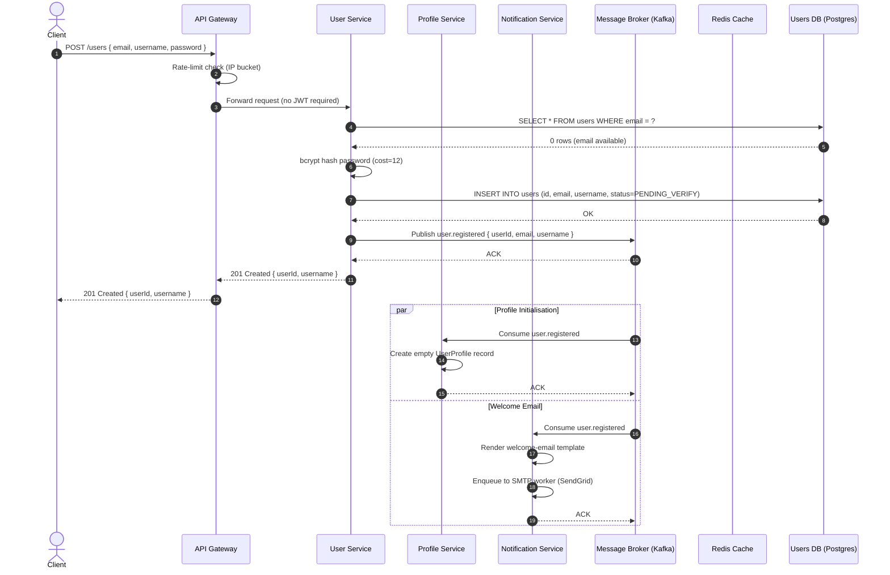
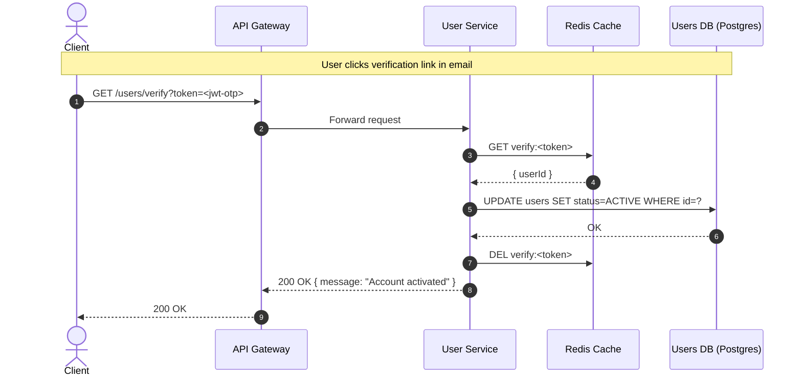
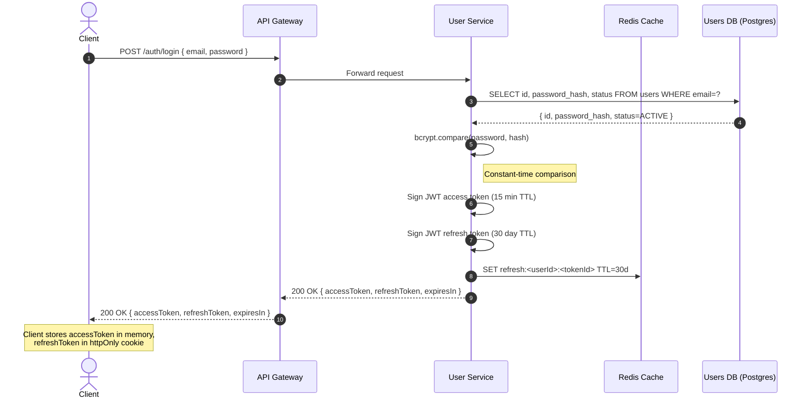
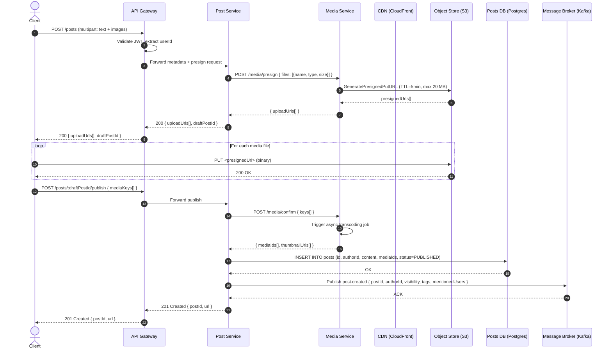
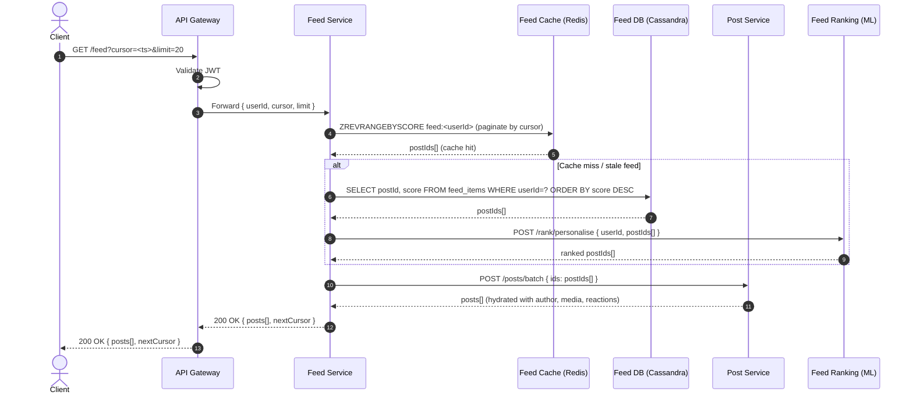
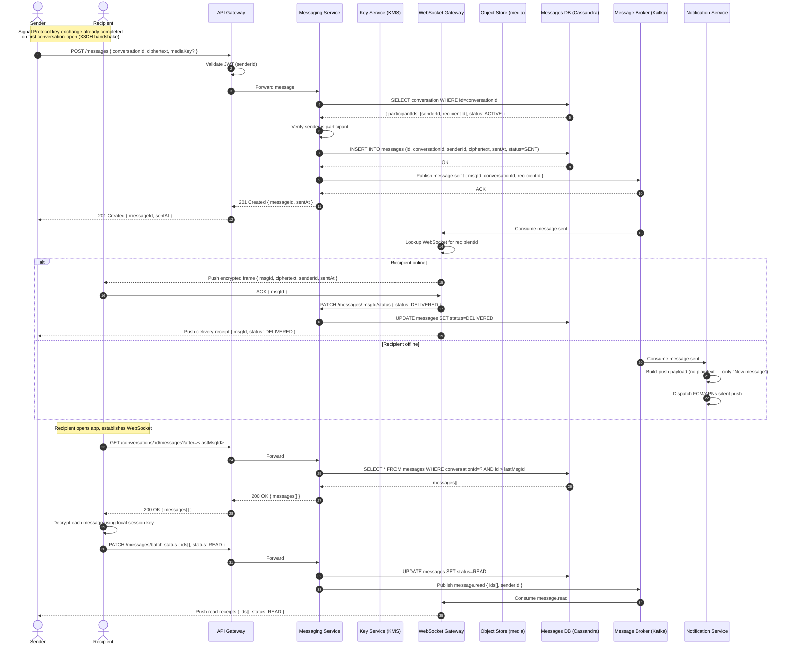

# System Sequence Diagrams — Social Networking Platform

## 1. Overview

These sequence diagrams capture the end-to-end message flow across microservices for the four most
critical runtime paths in the Social Networking Platform:

| # | Scenario | Primary Services Involved |
|---|----------|--------------------------|
| 1 | User Registration & Login | User Service, Profile Service, Auth/Token Service, Notification Service |
| 2 | Create Post & Feed Fan-Out | Post Service, Media Service, Feed Service, Social Graph Service, Cache, Message Broker |
| 3 | Real-time Notification Delivery | Any trigger service, Notification Service, WebSocket Gateway, Push Gateway |
| 4 | Direct Message (E2E Encrypted) | Messaging Service, WebSocket Gateway, Notification Service, Media Service |

All inter-service calls go through an internal service mesh (mTLS). Client-facing calls pass through
the API Gateway, which handles JWT validation, rate limiting, and request routing.

---

## 2. User Registration & Login

### 2.1 Registration Flow

A new user submits their email and password. The User Service creates the account, hashes the
credential, fires a domain event, and delegates welcome-email dispatch to the Notification Service.
The Profile Service initialises an empty profile record on the same event.



### 2.2 Email Verification Flow



### 2.3 Login & Token Issuance Flow



---

## 3. Create Post & Feed Fan-Out

### 3.1 Post Creation with Media Upload



### 3.2 Feed Fan-Out (Hybrid Push/Pull)

```mermaid
sequenceDiagram
    autonumber
    participant MB as Message Broker (Kafka)
    participant FeedSvc as Feed Service
    participant SGSvc as Social Graph Service
    participant RankSvc as Feed Ranking (ML)
    participant Cache as Feed Cache (Redis)
    participant DB as Feed DB (Cassandra)

    MB->>FeedSvc: Consume post.created { postId, authorId }

    FeedSvc->>SGSvc: GET /graph/followers { userId: authorId, limit: 10000 }
    SGSvc-->>FeedSvc: { followerIds[] }

    Note over FeedSvc: Celebrity check: if followers > 1M,<br/>switch to pull-on-read for large accounts

    FeedSvc->>RankSvc: POST /rank/score { postId, authorId }
    RankSvc->>RankSvc: Compute engagement-prediction score (BERT embeddings + XGBoost)
    RankSvc-->>FeedSvc: { score: 0.87, boostFactors: [...] }

    loop Fan-out (batched, async workers)
        FeedSvc->>Cache: ZADD feed:<followerId> score postId (TTL=7d)
        FeedSvc->>DB: INSERT INTO feed_items (userId, postId, score, ts)
    end

    Note over FeedSvc,DB: Active users (online in last 5 min) get<br/>Cache-only fan-out; others get DB write.
```

### 3.3 Feed Read (Client Fetching Timeline)



---

## 4. Real-time Notification Delivery

```mermaid
sequenceDiagram
    autonumber
    participant TriggerSvc as Trigger Service (e.g. Post Service)
    participant MB as Message Broker (Kafka)
    participant NotifSvc as Notification Service
    participant PrefDB as Prefs DB (Postgres)
    participant WS as WebSocket Gateway
    participant Push as Push Gateway (FCM/APNs)
    participant Email as Email Worker (SendGrid)
    participant Cache as Notification Cache (Redis)
    actor Recipient

    TriggerSvc->>MB: Publish notification.trigger { type: REACTION, actorId, targetUserId, entityId }

    MB->>NotifSvc: Consume notification.trigger

    NotifSvc->>PrefDB: SELECT preferences WHERE userId=targetUserId AND type=REACTION
    PrefDB-->>NotifSvc: { inApp: true, push: true, email: false }

    NotifSvc->>NotifSvc: Render notification payload { title, body, deeplink }
    NotifSvc->>Cache: LPUSH notif:<targetUserId> payload (TTL=30d, max 500 items)

    par In-App (WebSocket)
        NotifSvc->>WS: POST /ws/send { userId: targetUserId, event: "notification", payload }
        WS->>WS: Lookup active socket(s) for userId
        alt User online
            WS-->>Recipient: Push frame over WebSocket
        else User offline
            WS->>NotifSvc: 404 user-offline
            Note over NotifSvc: Notification already in cache;<br/>client fetches on reconnect
        end
    and Mobile Push
        NotifSvc->>Push: POST /push { deviceTokens[], title, body, data }
        Push->>Push: Route to FCM (Android) or APNs (iOS)
        Push-->>NotifSvc: { sent: 2, failed: 0 }
    end

    Recipient->>WS: WebSocket CONNECT (on app open)
    WS->>NotifSvc: GET /notifications/unread?userId=targetUserId
    NotifSvc->>Cache: LRANGE notif:<targetUserId> 0 49
    Cache-->>NotifSvc: pending notifications[]
    NotifSvc-->>WS: notifications[]
    WS-->>Recipient: Batch push unread notifications
```

---

## 5. Direct Message (E2E Encrypted)


