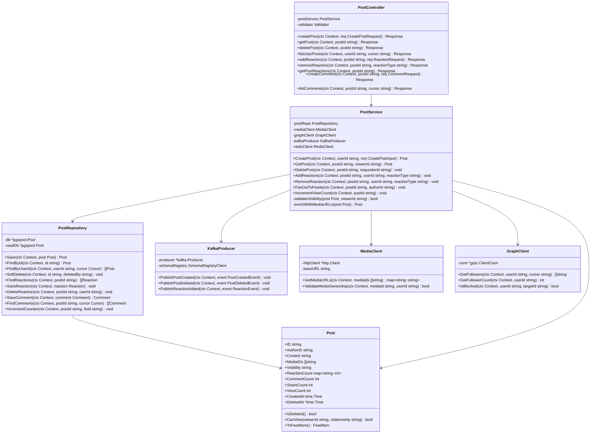
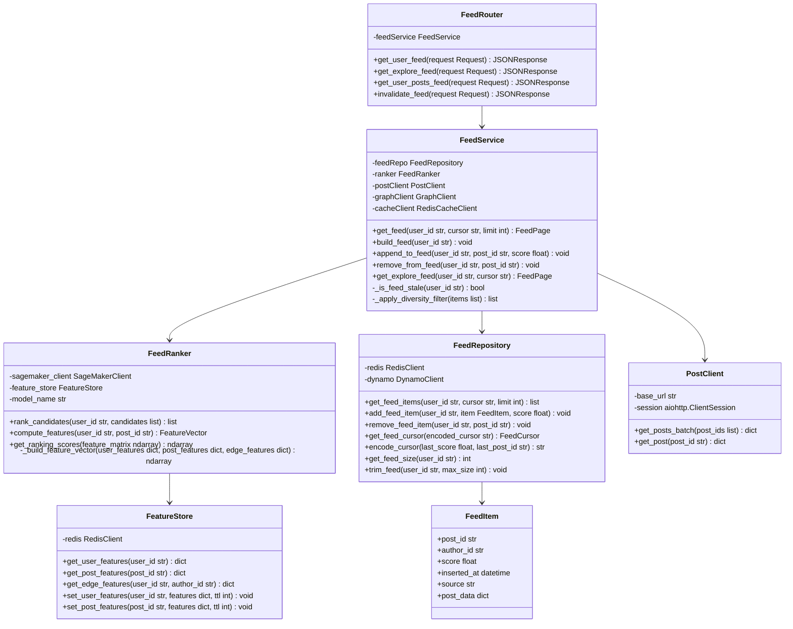
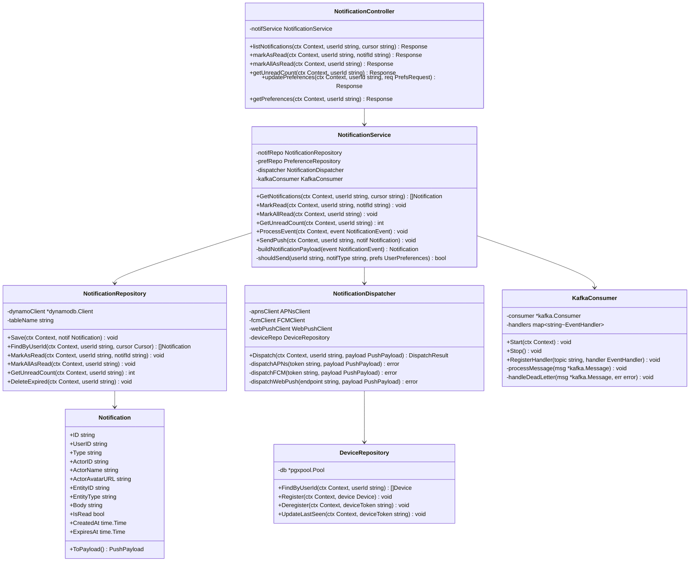
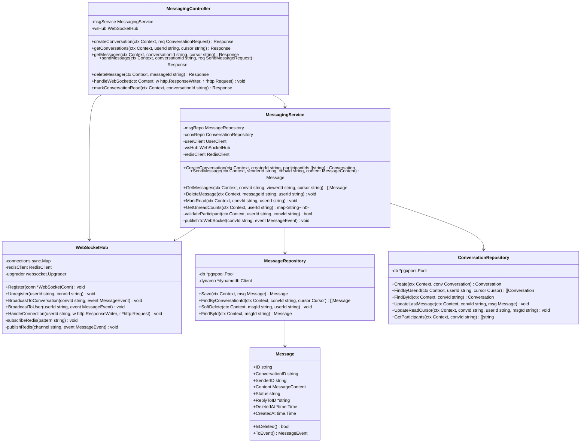

# C4 Code Diagram — Social Networking Platform

## 1. Overview

This document presents code-level (C4 Level 4) class diagrams for four core services of the
Social Networking Platform: **Post Service**, **Feed Service**, **Notification Service**, and
**Messaging Service**. Each diagram shows the primary classes, their public interfaces, and
inter-class relationships, reflecting the layered architecture (Controller → Service →
Repository) used across all Go and Python services.

All Go services follow a hexagonal architecture pattern: inbound adapters (HTTP handlers),
domain core (service + domain models), and outbound adapters (repositories, Kafka producer,
external clients). Python services (Feed, Moderation, Analytics) follow a similar structure
with FastAPI routers acting as controllers.

---

## 2. Post Service — Code Structure

---

## 3. Feed Service — Code Structure

---

## 4. Notification Service — Code Structure

---

## 5. Messaging Service — Code Structure

