# Cloud Architecture — Social Networking Platform

## 1. Overview

The Social Networking Platform is built entirely on AWS, leveraging managed services to
minimize operational overhead while maintaining the scale and reliability required for a
consumer social product. The architecture follows a microservices model with event-driven
communication via Amazon MSK (Kafka), multi-layer caching with ElastiCache (Redis), full-text
search via Amazon OpenSearch, and ML-powered feed ranking backed by SageMaker inference
endpoints. All secrets are managed through AWS Secrets Manager; data at rest and in transit
is encrypted using AWS KMS-managed keys.

---

## 2. Cloud Architecture Diagram

```mermaid
graph TD
    subgraph "Client Layer"
        WEB["Web App\n(React / Next.js)"]
        IOS["iOS App\n(Swift)"]
        AND["Android App\n(Kotlin)"]
    end

    subgraph "Security & Edge"
        WAF["AWS WAF\n(OWASP rules, rate limiting,\nIP reputation)"]
        SHIELD["AWS Shield Advanced\n(DDoS mitigation)"]
        CF["Amazon CloudFront\n(CDN, signed URLs,\nLambda@Edge)"]
        COGNITO["Amazon Cognito\n(User Pools + Identity Pools\nFederation: Google, Apple, FB)"]
    end

    subgraph "Compute"
        EKS["AWS EKS\n(14 microservices,\nIstio service mesh,\nKarpenter autoscaling)"]
        LAMBDA["AWS Lambda\n(Thumbnail generation,\nevent processors,\nscheduled jobs)"]
        SAGE["Amazon SageMaker\n(Feed ranking model inference\nReal-time endpoint)"]
    end

    subgraph "API Gateway"
        APIGW["Amazon API Gateway\n(HTTP API — partner integrations\n+ webhook delivery)"]
        ALB["Application Load Balancer\n(Main ingress for EKS)"]
    end

    subgraph "Data Stores"
        RDS["Amazon RDS\n(PostgreSQL 16\nMulti-AZ, read replicas\nUsers, Posts, Graph, Communities)"]
        ELASTICACHE["Amazon ElastiCache\n(Redis 7 Cluster Mode\nSessions, feed cache,\nrate limiting, pub/sub)"]
        DYNAMO["Amazon DynamoDB\n(Messages, notifications,\nstory views, ad impressions\nOn-demand capacity)"]
        OPENSEARCH["Amazon OpenSearch\n(User search, post search,\nhashtag search, community search)"]
        S3["Amazon S3\n(Media storage:\nimages, videos, stories\nAvatar originals)"]
        S3_LOGS["Amazon S3\n(Access logs, analytics\nevents, audit trails)"]
        TIMESTREAM["Amazon Timestream\n(Metrics, engagement\ntime-series data)"]
    end

    subgraph "Messaging & Eventing"
        MSK["Amazon MSK\n(Kafka 3.x, 3 brokers\n18 topic partitions\nEvent bus for all services)"]
        SNS["Amazon SNS\n(Push notification fan-out\nAPNs, FCM, Web Push)"]
        SQS["Amazon SQS\n(Dead-letter queues,\nemail job queue,\nreport processing)"]
        EB["Amazon EventBridge\n(Scheduled rules,\npartner event buses,\ncron jobs)"]
    end

    subgraph "CDN & Media Processing"
        CF_MEDIA["Amazon CloudFront\n(Media CDN\nsigned cookies)"]
        MEDIACONVERT["AWS Elemental MediaConvert\n(Video transcoding:\nHLS adaptive bitrate,\nMP4 thumbnail extraction)"]
        REKOGNITION["Amazon Rekognition\n(NSFW content detection,\nface similarity for moderation)"]
    end

    subgraph "ML & AI"
        SAGE
        COMPREHEND["Amazon Comprehend\n(Sentiment analysis,\ntoxic comment detection,\nentity extraction)"]
        TRANSLATE["Amazon Translate\n(Auto content translation\nfor international users)"]
        PERSONALIZE["Amazon Personalize\n(People You May Know\nrecommendations)"]
    end

    subgraph "Monitoring & Observability"
        CW["Amazon CloudWatch\n(Logs, metrics, alarms,\ndashboards)"]
        XRAY["AWS X-Ray\n(Distributed tracing\nacross all services)"]
        GRAFANA["Amazon Managed Grafana\n(Business dashboards,\nSRE dashboards)"]
        PROM["Amazon Managed\nPrometheus\n(Kubernetes metrics)"]
    end

    subgraph "Security & Compliance"
        KMS["AWS KMS\n(Encryption keys for\nRDS, S3, Kafka, DynamoDB)"]
        SM["AWS Secrets Manager\n(DB credentials, API keys,\nauto-rotation)"]
        GUARDDUTY["Amazon GuardDuty\n(Threat detection)"]
        MACIE["Amazon Macie\n(PII detection in S3)"]
        CT["AWS CloudTrail\n(API audit log)"]
    end

    subgraph "Developer Tooling"
        ECR["Amazon ECR\n(Container registry\nimage scanning)"]
        CODEPIPE["AWS CodePipeline\n(CI/CD orchestration)"]
        ARGOCD["ArgoCD\n(GitOps Kubernetes\ndeployments)"]
    end

    WEB & IOS & AND --> CF
    CF --> WAF --> ALB
    WAF --> SHIELD
    ALB --> EKS

    EKS --> RDS & ELASTICACHE & DYNAMO & OPENSEARCH
    EKS --> MSK
    EKS --> S3 & COGNITO
    EKS --> SAGE & APIGW
    EKS --> SM & KMS

    MSK --> LAMBDA
    LAMBDA --> MEDIACONVERT & REKOGNITION & SNS
    LAMBDA --> S3

    SNS --> SQS
    SQS --> LAMBDA

    EB --> LAMBDA

    MEDIACONVERT --> S3
    S3 --> CF_MEDIA

    EKS --> CW & XRAY
    PROM --> GRAFANA

    ECR --> EKS
    ARGOCD --> EKS
```

---

## 3. Data Store Selection Rationale

| Store | Use Case | Justification |
|-------|----------|---------------|
| RDS PostgreSQL | Users, profiles, posts, graph edges, communities | Strong consistency, complex joins, ACID transactions. Social graph stored as adjacency list with B-tree indexes on `(follower_id, followee_id)`. Row-level security for multi-tenant data isolation. |
| ElastiCache Redis | Feed cache, session tokens, rate limiting, WebSocket pub/sub, distributed locks | Sub-millisecond latency for feed delivery. Sorted sets for ranked feeds. Streams for lightweight async processing. TTL-based session management. |
| DynamoDB | Messages, notifications, story views, ad impressions | High write throughput with predictable latency. Time-ordered access patterns fit single-table design. No cross-table joins needed. On-demand capacity scales to 100k+ WCU instantly. |
| Amazon OpenSearch | Full-text user/post/hashtag/community search | Inverted index with BM25 scoring. Supports fuzzy matching, autocomplete (`edge_ngram` analyzer), and geospatial filtering for location-based search. Scales independently of primary DB. |
| Amazon S3 | Media blobs, backups, analytics event logs | Durable (11 nines), cheap at scale, native CloudFront integration. Lifecycle policies archive to S3 Glacier after 90 days. Versioning enabled on media bucket for accidental delete recovery. |
| Amazon Timestream | Engagement metrics (views, clicks, impressions) time-series | Purpose-built for time-series with automatic tiering (memory → magnetic storage). Query performance 1000x faster than RDS for time-range aggregations. Retained 90 days in memory tier, 2 years magnetic. |
| Amazon DynamoDB (notifications) | Notification inbox per user | `(user_id, created_at)` partition key enables efficient paginated queries. TTL auto-expires notifications after 30 days. |

---

## 4. Cost Optimization

### 4.1 Compute

- **EKS Spot Instances:** 60% of node capacity runs on EC2 Spot (m6i.xlarge / m6i.2xlarge)
  using Karpenter with instance type diversification across 8 families to minimize interruption.
  Stateless services (Feed, Post, Search) are fully Spot-tolerant. Stateful services
  (Messaging WebSocket) run on On-Demand nodes.
- **Right-sizing:** Monthly review of VPA (Vertical Pod Autoscaler) recommendations to adjust
  resource requests and limits. Over-provisioned pods are resized to free up node capacity.
- **Lambda cold start mitigation:** Provisioned concurrency for thumbnail Lambda (10 instances)
  during peak hours (09:00–23:00 UTC).

### 4.2 Data

- **RDS:** Reserved Instances (1-year, no upfront) for RDS primary instances — 40% savings
  over on-demand. Read replicas use On-Demand pricing as their count varies.
- **ElastiCache:** Reserved nodes (1-year) for all cache nodes — 38% savings.
- **S3 Intelligent-Tiering:** Enabled on media bucket. Objects not accessed for 30 days
  automatically move to infrequent access tier (40% cost reduction).
- **DynamoDB:** On-demand pricing to avoid over-provisioned capacity waste. Auto-scaling
  policies apply when usage patterns become predictable enough for provisioned mode.
- **OpenSearch:** UltraWarm nodes for indices older than 7 days — 80% cheaper than hot nodes.

### 4.3 Networking

- S3 and DynamoDB accessed via VPC Gateway Endpoints (zero data transfer cost).
- ECR, Secrets Manager, and CloudWatch accessed via VPC Interface Endpoints to avoid NAT
  Gateway data processing charges (~$0.045/GB saved on container image pulls).
- CloudFront cache hit ratio target: >85% — reduces origin egress costs significantly.

---

## 5. Disaster Recovery

### 5.1 Recovery Objectives

| Tier | Services | RTO | RPO |
|------|----------|-----|-----|
| Tier 1 (Critical) | Auth, Post, Feed, Messaging | 15 minutes | 1 minute |
| Tier 2 (Important) | Profile, Graph, Notification | 30 minutes | 5 minutes |
| Tier 3 (Standard) | Analytics, Ad, Moderation | 2 hours | 1 hour |

### 5.2 Backup Strategy

- **RDS:** Automated daily snapshots retained 35 days; transaction logs to S3 every 5 minutes
  (point-in-time recovery). Cross-region snapshot copy to `eu-west-1` every 24 hours.
- **DynamoDB:** Point-in-time recovery (PITR) enabled on all tables — continuous backups,
  restore to any second within 35-day window. On-demand exports to S3 weekly.
- **Redis:** Persistence disabled (cache is reconstructable). Redis Cluster snapshots taken
  nightly as a warm-up optimization, not as a recovery data source.
- **Elasticsearch/OpenSearch:** Automated snapshots to S3 every 4 hours. Index state
  management (ISM) handles snapshot lifecycle.
- **S3 Media:** Cross-region replication to `eu-west-1` bucket with same-day replication SLA.
  Object Lock enabled with Governance mode on original uploads (30-day retention).

### 5.3 Failover Procedure (Region-Level)

1. Route 53 health check detects `us-east-1` ALB unhealthy (3 consecutive failures, 30s cadence).
2. DNS automatically routes 100% of traffic to `eu-west-1` ALB within 60 seconds.
3. `eu-west-1` RDS read replica is promoted to primary via RDS Managed Failover (automated).
   Estimated promotion time: 1–3 minutes.
4. Kafka `eu-west-1` cluster becomes the authoritative event bus; `us-east-1` consumers
   are drained and stopped.
5. SRE on-call is paged via PagerDuty. Post-recovery: reverse failover is manual to prevent
   flapping.

### 5.4 Chaos Engineering

Monthly GameDay exercises using AWS Fault Injection Simulator (FIS):
- Random EKS node termination (Spot interruption simulation)
- RDS primary instance failover
- ElastiCache node failure
- Kafka broker eviction
- Latency injection: 200ms added to all RDS read replica queries
