# Deployment Diagram — Social Networking Platform

## 1. Overview

This document describes the Kubernetes deployment architecture for the Social Networking Platform
running on AWS EKS. The cluster is organized into logical namespaces for ingress routing,
application workloads, and data services. Each microservice is deployed as an independent
`Deployment` with a corresponding `Service`, `HorizontalPodAutoscaler`, and `PodDisruptionBudget`.

Traffic enters through a global AWS Application Load Balancer, passes through NGINX Ingress
Controller, and is routed to the appropriate service namespace. All inter-service communication
within `app-namespace` uses internal ClusterIP services.

---

## 2. Kubernetes Deployment Diagram

```mermaid
graph TD
    Internet["🌐 Internet"] --> ALB["AWS ALB\n(Layer 7)"]
    ALB --> NGINX["NGINX Ingress Controller\ningress-namespace"]

    subgraph "AWS EKS Cluster — us-east-1"

        subgraph "ingress-namespace"
            NGINX
            CERT["cert-manager\n(TLS certificates)"]
            NGINX --> CERT
        end

        subgraph "app-namespace"
            NGINX --> USVC["User Service\nDeployment (3 replicas)"]
            NGINX --> PSVC["Profile Service\nDeployment (3 replicas)"]
            NGINX --> POSTSVC["Post Service\nDeployment (5 replicas)"]
            NGINX --> FEEDSVC["Feed Service\nDeployment (5 replicas)"]
            NGINX --> MEDIASVC["Media Service\nDeployment (3 replicas)"]
            NGINX --> STORYSVC["Story Service\nDeployment (3 replicas)"]
            NGINX --> MSGSVC["Messaging Service\nDeployment (4 replicas)"]
            NGINX --> NOTIFSVC["Notification Service\nDeployment (3 replicas)"]
            NGINX --> COMSVC["Community Service\nDeployment (3 replicas)"]
            NGINX --> MODSVC["Moderation Service\nDeployment (2 replicas)"]
            NGINX --> ADSVC["Ad Service\nDeployment (3 replicas)"]
            NGINX --> ANASVC["Analytics Service\nDeployment (2 replicas)"]
            NGINX --> SRCHSVC["Search Service\nDeployment (3 replicas)"]
            NGINX --> GRAPHSVC["Social Graph Service\nDeployment (4 replicas)"]

            HPA_POST["HPA: Post Service\nmin=5, max=30"]
            HPA_FEED["HPA: Feed Service\nmin=5, max=40"]
            HPA_MSG["HPA: Messaging Service\nmin=4, max=20"]
            HPA_GRAPH["HPA: Graph Service\nmin=4, max=20"]
            HPA_POST --> POSTSVC
            HPA_FEED --> FEEDSVC
            HPA_MSG --> MSGSVC
            HPA_GRAPH --> GRAPHSVC
        end

        subgraph "data-namespace"
            PG_SVC["PostgreSQL\nStatefulSet (Primary + 2 Replicas)"]
            REDIS_SVC["Redis Cluster\nStatefulSet (6 nodes)"]
            ES_SVC["Elasticsearch\nStatefulSet (3 nodes)"]
            KAFKA_SVC["Kafka (MSK)\nExternal Managed"]
        end

        subgraph "monitoring-namespace"
            PROM["Prometheus\nDeployment (1 replica)"]
            GRAF["Grafana\nDeployment (1 replica)"]
            ALERT["Alertmanager\nDeployment (1 replica)"]
            PROM --> GRAF
            PROM --> ALERT
        end

        subgraph "istio-system"
            ISTIOD["istiod\n(control plane)"]
            INGW["Istio Ingress Gateway"]
        end

        USVC --> PG_SVC
        PSVC --> PG_SVC
        POSTSVC --> PG_SVC
        POSTSVC --> REDIS_SVC
        FEEDSVC --> REDIS_SVC
        SRCHSVC --> ES_SVC
        POSTSVC --> KAFKA_SVC
        FEEDSVC --> KAFKA_SVC
        NOTIFSVC --> KAFKA_SVC
        GRAPHSVC --> PG_SVC
        GRAPHSVC --> REDIS_SVC
        MSGSVC --> PG_SVC
        MSGSVC --> REDIS_SVC
    end
```



---

## 3. Deployment Specifications

| Service | Replicas (Base) | CPU Request | CPU Limit | Memory Request | Memory Limit | HPA Min | HPA Max |
|---------|----------------|-------------|-----------|----------------|--------------|---------|---------|
| User Service | 3 | 250m | 1000m | 256Mi | 512Mi | 3 | 15 |
| Profile Service | 3 | 250m | 1000m | 256Mi | 512Mi | 3 | 12 |
| Social Graph Service | 4 | 500m | 2000m | 512Mi | 1Gi | 4 | 20 |
| Post Service | 5 | 500m | 2000m | 512Mi | 1Gi | 5 | 30 |
| Media Service | 3 | 1000m | 4000m | 1Gi | 2Gi | 3 | 15 |
| Feed Service | 5 | 1000m | 4000m | 1Gi | 2Gi | 5 | 40 |
| Notification Service | 3 | 250m | 1000m | 256Mi | 512Mi | 3 | 15 |
| Messaging Service | 4 | 500m | 2000m | 512Mi | 1Gi | 4 | 20 |
| Community Service | 3 | 250m | 1000m | 256Mi | 512Mi | 3 | 12 |
| Moderation Service | 2 | 500m | 2000m | 512Mi | 1Gi | 2 | 10 |
| Ad Service | 3 | 500m | 2000m | 512Mi | 1Gi | 3 | 15 |
| Analytics Service | 2 | 500m | 2000m | 512Mi | 1Gi | 2 | 8 |
| Search Service | 3 | 500m | 2000m | 512Mi | 1Gi | 3 | 15 |
| Story Service | 3 | 250m | 1000m | 256Mi | 512Mi | 3 | 15 |

HPA scaling is triggered at **70% CPU utilization** and **80% memory utilization**. Scale-down
stabilization window is set to 300 seconds to prevent thrashing.

---

## 4. Rolling Update Strategy

All deployments use `RollingUpdate` with the following parameters:

```yaml
strategy:
  type: RollingUpdate
  rollingUpdate:
    maxUnavailable: 1
    maxSurge: 2
```

**Deployment pipeline:**
1. New image is pushed to ECR after CI passes all tests and security scans.
2. ArgoCD detects the updated image tag in the Helm values file.
3. ArgoCD applies the new `Deployment` manifest. Kubernetes creates surge pods while old pods
   continue serving traffic.
4. Readiness probe on new pods must pass before any old pods are terminated.
5. If more than 2 consecutive pods fail their readiness check within 5 minutes, a
   `ProgressDeadlineExceeded` event triggers automatic rollback via ArgoCD's auto-rollback policy.

**Canary releases** are configured for high-risk services (Feed, Post, Ad) using Argo Rollouts:
- 10% canary for 5 minutes → 30% for 5 minutes → 100% if error rate < 0.5%

---

## 5. Health Checks & Readiness Probes

All services expose `/health/live` (liveness) and `/health/ready` (readiness) endpoints.

```yaml
livenessProbe:
  httpGet:
    path: /health/live
    port: 8080
  initialDelaySeconds: 15
  periodSeconds: 20
  failureThreshold: 3

readinessProbe:
  httpGet:
    path: /health/ready
    port: 8080
  initialDelaySeconds: 10
  periodSeconds: 5
  failureThreshold: 2

startupProbe:
  httpGet:
    path: /health/live
    port: 8080
  failureThreshold: 30
  periodSeconds: 10
```

**Readiness gate conditions per service:**

| Service | Readiness Checks |
|---------|-----------------|
| User Service | DB connection pool healthy, Redis reachable |
| Post Service | DB connection pool healthy, Redis reachable, Kafka producer connected |
| Feed Service | Redis reachable, ML model loaded, Kafka consumer lag < 10k |
| Messaging Service | DB connection pool healthy, Redis reachable, WebSocket listener bound |
| Search Service | Elasticsearch cluster green or yellow, index aliases resolved |
| Media Service | S3 presigned URL generation successful, MediaConvert client reachable |

---

## 6. PodDisruptionBudgets

To ensure high availability during node drains and cluster upgrades, each service has a
`PodDisruptionBudget` ensuring minimum availability:

| Service | Min Available |
|---------|--------------|
| User Service | 2 |
| Post Service | 3 |
| Feed Service | 3 |
| Messaging Service | 2 |
| Social Graph Service | 2 |
| All other services | 1 |
