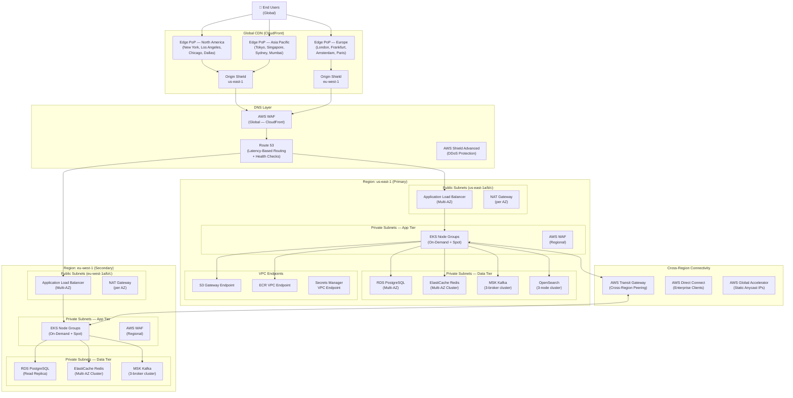

# Network Infrastructure — Social Networking Platform

## 1. Overview

The Social Networking Platform uses a globally distributed network infrastructure built on
AWS. Traffic is served through Amazon CloudFront CDN with 450+ edge PoPs worldwide, backed by
an Active-Active multi-region deployment across `us-east-1` (primary) and `eu-west-1`
(secondary). Route 53 Latency-Based Routing directs users to their closest healthy region.
All internal service-to-service communication runs over private subnets within VPC peering
or AWS Transit Gateway.

---

## 2. Network Topology

---

## 3. CDN Configuration

### 3.1 CloudFront Distribution Setup

Two distinct CloudFront distributions are maintained:

**Static Asset Distribution** (`cdn.socialapp.io`):
- Origin: S3 bucket with OAC (Origin Access Control)
- TTL: 31536000s (1 year) for content-hashed assets (JS, CSS, fonts)
- TTL: 86400s for images without content hash
- Compression: Gzip + Brotli enabled
- HTTP/3 (QUIC) enabled
- Viewer protocol: HTTPS-only; TLSv1.2 minimum
- Cache key: URI only (no query strings, no headers)

**API Distribution** (`api.socialapp.io`):
- Origin: ALB in primary region; failover to secondary region via Origin Group
- TTL: 0 for all API responses (cache disabled by default; individual endpoints opt-in)
- Cached endpoints: `GET /feed` (TTL 30s), `GET /posts/{id}` (TTL 60s)
- Cache key for API: URI + `Authorization` header hash + `Accept-Language` header
- Origin shield: Enabled in `us-east-1`

### 3.2 Media Delivery

User-uploaded images and videos are served through CloudFront with signed URLs:
- Signed cookies for authenticated media (private profiles, DMs)
- Signed URLs valid for 1 hour; pre-signed at request time by Media Service
- Lambda@Edge function at **Origin Request** event rewrites image URLs to request
  on-the-fly resized variants from S3 (e.g., `?w=400&h=400&f=webp`)

---

## 4. Load Balancing Strategy

### 4.1 External ALB (Per Region)

- **Scheme:** Internet-facing
- **Listeners:** HTTPS:443 (certificate managed by ACM), HTTP:80 redirects to HTTPS
- **Target group:** EKS nodes (NodePort) or IP mode (pod IPs via AWS VPC CNI)
- **Sticky sessions:** Disabled; all services are stateless at the HTTP layer
- **Idle timeout:** 60 seconds
- **Deregistration delay:** 30 seconds (fast pod shutdown)
- **Connection draining:** Enabled; 30-second grace period

### 4.2 Internal Load Balancing (Kubernetes)

Kubernetes `Service` objects of type `ClusterIP` handle internal routing. Kube-proxy uses
iptables in IPVS mode for lower latency at high connection counts. Istio sidecar proxies
(Envoy) enforce:
- Circuit breaking: 50% error threshold over 30 seconds triggers open circuit for 10 seconds
- Retry policy: 2 retries with 25ms jitter, only for idempotent methods (GET, HEAD)
- Timeout: 5 seconds default; Feed Service 3 seconds; Messaging WebSocket 0 (no timeout)

### 4.3 WebSocket Connections (Messaging Service)

WebSocket connections are established through ALB with `idle_timeout = 3600` seconds.
Sticky sessions are enabled at the ALB target group level using the `AWSALB` cookie so that
WebSocket upgrade requests always reach the same pod. Redis Pub/Sub is used for cross-pod
message delivery, eliminating the need for connection-aware routing for message fan-out.

---

## 5. VPC & Security Groups

### 5.1 VPC Layout (us-east-1)

| Subnet Type | CIDR | AZ | Purpose |
|-------------|------|----|---------|
| Public-1a | 10.0.0.0/24 | us-east-1a | ALB, NAT Gateway |
| Public-1b | 10.0.1.0/24 | us-east-1b | ALB, NAT Gateway |
| Public-1c | 10.0.2.0/24 | us-east-1c | ALB, NAT Gateway |
| Private-App-1a | 10.0.10.0/22 | us-east-1a | EKS Worker Nodes |
| Private-App-1b | 10.0.14.0/22 | us-east-1b | EKS Worker Nodes |
| Private-App-1c | 10.0.18.0/22 | us-east-1c | EKS Worker Nodes |
| Private-Data-1a | 10.0.30.0/24 | us-east-1a | RDS, Redis |
| Private-Data-1b | 10.0.31.0/24 | us-east-1b | RDS, Redis |
| Private-Data-1c | 10.0.32.0/24 | us-east-1c | RDS, Redis |

### 5.2 Security Group Rules

**ALB Security Group:**
- Inbound: TCP 443 from 0.0.0.0/0; TCP 80 from 0.0.0.0/0
- Outbound: TCP 30000-32767 to EKS Node SG (NodePort range)

**EKS Node Security Group:**
- Inbound: All TCP from ALB SG; All TCP from same SG (node-to-node)
- Outbound: All to 0.0.0.0/0 (via NAT Gateway for ECR, S3 pulls)

**Data Tier Security Group (RDS, Redis, MSK):**
- Inbound: TCP 5432 (PG), 6379 (Redis), 9092 (Kafka) from EKS Node SG only
- Outbound: None

### 5.3 Network ACLs

Stateless NACLs on data subnets deny all traffic except:
- Inbound TCP from app subnet CIDRs on specific database ports
- Outbound ephemeral ports (1024-65535) back to app subnets

---

## 6. DNS & Global Traffic Management

### 6.1 Route 53 Configuration

| Record | Type | Routing Policy | TTL |
|--------|------|----------------|-----|
| api.socialapp.io | A (Alias) | Latency-Based | 60s |
| cdn.socialapp.io | A (Alias) | Simple (CloudFront) | 300s |
| ws.socialapp.io | A (Alias) | Latency-Based | 30s |
| *.socialapp.io | A (Alias) | Simple | 300s |

Latency-based records are backed by health checks against `/health/live` on each regional ALB.
Failover threshold: 3 consecutive failures within 30 seconds → region removed from rotation.
Failback: automatic after 2 consecutive successes.

### 6.2 Global Accelerator

AWS Global Accelerator provides two static Anycast IPv4 addresses used in marketing materials
and partner integrations. Traffic enters the AWS backbone at the nearest AWS edge location,
reducing last-mile latency by 20–40% compared to public internet routing. Endpoint groups
are weighted: us-east-1 = 100, eu-west-1 = 100 (active-active).
