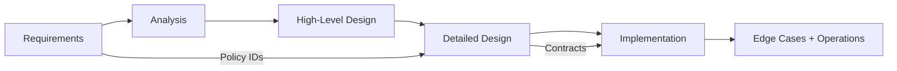

# Student Information System Design Documentation

> Comprehensive system design documentation for a full-fledged Student Information System (SIS) for a college that helps organize and manage all student details including enrollment, academics, attendance, grades, and administrative operations.

## Documentation Structure

| Phase | Folder | Description |
|-------|--------|-------------|
| 1 | [requirements](./requirements/) | Functional & non-functional requirements, user stories |
| 2 | [analysis](./analysis/) | Use cases, system context, activity & swimlane diagrams |
| 3 | [high-level-design](./high-level-design/) | Sequence diagrams, domain model, DFD, architecture, C4 |
| 4 | [detailed-design](./detailed-design/) | Class, sequence, state diagrams, ERD, API design |
| 5 | [infrastructure](./infrastructure/) | Deployment, network, cloud architecture |
| 6 | [implementation](./implementation/) | Implementation guidelines, C4 code diagram, backend status matrix |
| 7 | [edge-cases](./edge-cases/) | Failure scenarios, detection signals, and recovery/mitigation runbooks |

## System Overview

### Actors
- **Students** - View academic records, enroll in courses, access grades and schedules
- **Faculty** - Manage courses, record grades, track attendance, communicate with students
- **Academic Advisors** - Guide student academic plans, approve course selections
- **Admin Staff** - Handle registration, enrollment, financial records, and platform management
- **Department Heads** - Manage departments, faculty assignments, and curriculum
- **Registrar** - Maintain official academic records, issue transcripts, oversee graduation
- **Parent/Guardian** - View student academic progress (limited read-only access)

### Key Features
- Student enrollment and registration management
- Course catalog and schedule management
- Grade recording and transcript generation
- Attendance tracking and reporting
- Fee management and financial aid
- Academic calendar and event management
- Communication and notification system
- Analytics and performance reporting
- Library integration
- Role-based access control

## Diagram Generation

All diagrams are written in Mermaid code. To generate images:

1. **VS Code**: Install "Mermaid Preview" extension
2. **Online**: Use [mermaid.live](https://mermaid.live)
3. **CLI**: Use `mmdc` (Mermaid CLI)
   ```bash
   npm install -g @mermaid-js/mermaid-cli
   mmdc -i input.md -o output.png
   ```

Phases
┌─────────────────────────────────────────────────────────────────┐
│                     1. REQUIREMENTS PHASE                       │
├─────────────────────────────────────────────────────────────────┤
│  • Requirements Document                                        │
│  • User Stories                                                 │
└───────────────────────────┬─────────────────────────────────────┘
                            ↓
┌─────────────────────────────────────────────────────────────────┐
│                     2. ANALYSIS PHASE                           │
├─────────────────────────────────────────────────────────────────┤
│  • Use Case Diagram (what users can do)                         │
│  • Use Case Descriptions                                        │
│  • System Context Diagram (system boundaries)                   │
│  • Flowchart / Activity Diagram (business process)              │
│  • BPMN / Swimlane Diagram (cross-department workflows)         │
└───────────────────────────┬─────────────────────────────────────┘
                            ↓
┌─────────────────────────────────────────────────────────────────┐
│                  3. HIGH-LEVEL DESIGN PHASE                     │
├─────────────────────────────────────────────────────────────────┤
│  • System Sequence Diagram (black-box interactions)             │
│  • Domain Model (key entities & relationships)                  │
│  • Data Flow Diagram (how data moves)                           │
│  • High-Level Architecture Diagram (major components)           │
│  • C4 Context & Container Diagram                               │
└───────────────────────────┬─────────────────────────────────────┘
                            ↓
┌─────────────────────────────────────────────────────────────────┐
│                  4. DETAILED DESIGN PHASE                       │
├─────────────────────────────────────────────────────────────────┤
│  • Class Diagram (detailed classes, methods, attributes)        │
│  • Sequence Diagram (internal object interactions)              │
│  • State Machine Diagram (object state transitions)             │
│  • ERD / Database Schema (tables, relationships)                │
│  • Component Diagram (software modules)                         │
│  • API Design / Integration Diagram                             │
│  • C4 Component Diagram                                         │
└───────────────────────────┬─────────────────────────────────────┘
                            ↓
┌─────────────────────────────────────────────────────────────────┐
│                  5. INFRASTRUCTURE PHASE                        │
├─────────────────────────────────────────────────────────────────┤
│  • Deployment Diagram (software to hardware mapping)            │
│  • Network / Infrastructure Diagram                             │
│  • Cloud Architecture Diagram (AWS/GCP/Azure)                   │
└───────────────────────────┬─────────────────────────────────────┘
                            ↓
┌─────────────────────────────────────────────────────────────────┐
│                     6. IMPLEMENTATION                           │
├─────────────────────────────────────────────────────────────────┤
│  • Code                                                         │
│  • C4 Code Diagram (optional, class-level)                      │
└─────────────────────────────────────────────────────────────────┘

## Getting Started

1. Start with `requirements/` to align scope and priorities.
2. Review `analysis/` and `high-level-design/` for behavior and architecture context.
3. Review `edge-cases/` before implementation to align failure handling and operational guardrails.
4. Use `detailed-design/` + `implementation/` to plan build and rollout.

## Documentation Status

- ✅ Core documentation set is available across all seven phases.
- ✅ Analysis coverage includes activity flow, swimlane/BPMN, data dictionary, business rules, and event catalog.
- ✅ Edge-case pack includes operational, security/compliance, interface-surface, and domain scenario coverage.

## Implementation-Ready Addendum for Readme

### Purpose in This Artifact
Defines how all phases consume lifecycle, grading, RBAC, and integration specs.

### Scope Focus
- Program-level governance map
- Enrollment lifecycle enforcement relevant to this artifact
- Grading/transcript consistency constraints relevant to this artifact
- Role-based and integration concerns at this layer

### Supplemental Mermaid (Artifact-Specific)


#### Implementation Rules
- Enrollment lifecycle operations must emit auditable events with correlation IDs and actor scope.
- Grade and transcript actions must preserve immutability through versioned records; no destructive updates.
- RBAC must be combined with context constraints (term, department, assigned section, advisee).
- External integrations must remain contract-first with explicit versioning and backward-compatibility strategy.

#### Acceptance Criteria
1. Business rules are testable and mapped to policy IDs in this artifact.
2. Failure paths (authorization, policy window, downstream sync) are explicitly documented.
3. Data ownership and source-of-truth boundaries are clearly identified.
4. Diagram and narrative remain consistent for the scenarios covered in this file.

