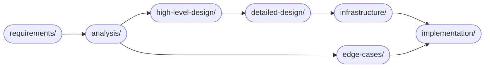

# Student Information System — Design Documentation

> Comprehensive, implementation-ready system design documentation for a full-featured **Student Information System (SIS)** supporting multi-campus, multi-program institutions. Covers the complete student lifecycle from admission through graduation, including enrollment, course management, grading, attendance, fees, financial aid, examinations, and reporting.

---

## Key Features

| Feature | Description |
|---|---|
| **Student Enrollment & Registration** | Full lifecycle from admission to graduation: application, admission, matriculation, term registration, add/drop, withdrawal, reinstatement |
| **Course Catalog & Section Scheduling** | Manage courses, course prerequisites, sections per term, room assignments, delivery modes (in-person, online, hybrid) |
| **Timetable & Conflict Management** | Automated timetable generation with conflict detection; support for multi-campus and async-online sections |
| **Grade Management & GPA Calculation** | Configurable grade scales, gradebook entry, final grade posting, GPA/CGPA computation, repeat-forgiveness rules, grade amendments with audit trail |
| **Attendance Tracking** | Session-level attendance marking, attendance percentage computation, automatic eligibility evaluation for examinations, medical-leave handling |
| **Transcript Generation** | Official and unofficial transcripts with tamper-evident hash; version-controlled; Registrar sign-off workflow |
| **Fee Assessment & Payment** | Term-based fee invoicing by category, late-fee accrual, academic-hold placement on overdue accounts, payment plans, payment gateway integration |
| **Financial Aid & Scholarships** | Scholarship definition, merit/need/sports award management, term-by-term eligibility re-evaluation, disbursement coordination |
| **Examination Management** | Exam scheduling, eligibility gating by attendance, result entry and publication, supplemental/make-up exam workflows |
| **Academic Holds** | Financial, academic, and disciplinary hold placement and clearance; hold-aware enforcement on all academic actions |
| **Waitlist Management** | FIFO waitlist with cohort-priority override, automatic seat promotion, configurable confirmation windows and expiry |
| **Graduation Audit** | Automated multi-criteria graduation audit (program requirements, CGPA, financial clearance, holds, residency); degree conferral workflow |
| **Parent / Guardian Portal** | Read-only portal access for parents and guardians to view student academic progress, attendance, and fee status |
| **Academic Calendar** | Institution-wide and program-specific academic calendars; enrollment windows, grade deadlines, exam periods, holidays |
| **Multi-Campus / Multi-Term Support** | Configurable per-campus and per-term policies; timezone-aware scheduling; cross-campus enrollment with transfer-credit articulation |
| **Reports & Analytics** | Enrollment statistics, cohort GPA trends, attendance summaries, fee collection dashboards, scholarship utilization, graduation rate tracking |
| **Notifications & Communications** | Event-driven notifications (enrollment confirmations, grade postings, fee due dates, exam reminders, hold alerts, waitlist promotions) |
| **RBAC + ABAC Access Control** | Role-based access with attribute-based overlays for campus, department, term, and section context; MFA for privileged operations |
| **Audit Trail** | Immutable audit log for all grade, transcript, fee, hold, and sensitive operations with actor identity and correlation tracking |
| **External Integrations** | LMS (roster sync), IdP/SSO (SAML/OIDC + SCIM), Payment Gateway, Financial Aid System, Library, Regulatory Reporting |

---

## Actors

| Actor | Description | Primary Capabilities |
|---|---|---|
| **Student** | Enrolled individual pursuing a program | Course registration, view grades/attendance/transcript, pay fees, apply for scholarships |
| **Faculty / Instructor** | Teaching staff assigned to sections | Mark attendance, enter grades, manage gradebook, view section roster |
| **Academic Advisor** | Faculty or staff guiding student academic plans | Approve overloads, issue waivers, review petitions, monitor advisee progress |
| **Registrar** | Official keeper of academic records | Manage enrollment windows, issue transcripts, approve graduation, override policies |
| **Admin Staff** | Administrative support and platform management | User management, fee processing, report generation, configuration |
| **Department Head** | Manages department curriculum and faculty | Approve attendance condonations, department-level reports |
| **Finance / Bursar** | Manages fee accounts and financial processes | Invoice management, payment processing, hold management, waiver approval |
| **Parent / Guardian** | Read-only stakeholder viewing student progress | View grades, attendance, fee status (limited, consent-gated) |
| **System / Policy Engine** | Automated background processes | Nightly rule evaluation, waitlist promotion, scholarship re-evaluation, hold placement |

---

## Documentation Structure

| # | Folder | File | Description |
|---|---|---|---|
| 1 | `requirements/` | `requirements.md` | Functional and non-functional requirements |
| 2 | `requirements/` | `user-stories.md` | User stories with acceptance criteria |
| 3 | `analysis/` | `use-case-diagram.md` | Use case diagrams per actor |
| 4 | `analysis/` | `use-case-descriptions.md` | Detailed use case descriptions with flows |
| 5 | `analysis/` | `system-context-diagram.md` | System boundary and external integrations |
| 6 | `analysis/` | `activity-diagrams.md` | Business process activity flows |
| 7 | `analysis/` | `swimlane-diagrams.md` | Cross-role workflow swimlane / BPMN diagrams |
| 8 | `analysis/` | `data-dictionary.md` | Canonical entity reference, attributes, ER diagram |
| 9 | `analysis/` | `business-rules.md` | Enforceable business rules BR-01 through BR-10 |
| 10 | `analysis/` | `event-catalog.md` | Domain event contracts, payloads, and SLOs |
| 11 | `high-level-design/` | `system-sequence-diagrams.md` | Black-box system sequence diagrams |
| 12 | `high-level-design/` | `domain-model.md` | Domain model with aggregates and relationships |
| 13 | `high-level-design/` | `data-flow-diagrams.md` | Data flow diagrams (levels 0–2) |
| 14 | `high-level-design/` | `architecture-diagram.md` | High-level component architecture |
| 15 | `high-level-design/` | `c4-diagrams.md` | C4 context and container diagrams |
| 16 | `detailed-design/` | `class-diagrams.md` | Class diagrams with attributes and methods |
| 17 | `detailed-design/` | `sequence-diagrams.md` | Internal sequence diagrams for key flows |
| 18 | `detailed-design/` | `state-machine-diagrams.md` | State machines for Student, Enrollment, Grade, Fee |
| 19 | `detailed-design/` | `erd-database-schema.md` | Full ERD and DDL-ready database schema |
| 20 | `detailed-design/` | `component-diagrams.md` | Software component / module diagrams |
| 21 | `detailed-design/` | `api-design.md` | REST API design with endpoints and payloads |
| 22 | `detailed-design/` | `c4-component-diagram.md` | C4 component diagram |
| 23 | `infrastructure/` | `deployment-diagram.md` | Deployment topology and environment mapping |
| 24 | `infrastructure/` | `network-infrastructure.md` | Network zones, security groups, and traffic flows |
| 25 | `infrastructure/` | `cloud-architecture.md` | Cloud architecture (AWS/GCP/Azure reference) |
| 26 | `implementation/` | `implementation-guidelines.md` | Coding standards, patterns, and setup guide |
| 27 | `implementation/` | `c4-code-diagram.md` | C4 code-level diagram |
| 28 | `implementation/` | `backend-status-matrix.md` | Implementation status per feature / module |
| 29 | `edge-cases/` | `README.md` | Edge case index and severity classification |
| 30 | `edge-cases/` | `enrollment-and-seat-allocation.md` | Enrollment race conditions, waitlist edge cases |
| 31 | `edge-cases/` | `grades-and-transcript-corrections.md` | Grade amendment, transcript correction edge cases |
| 32 | `edge-cases/` | `attendance-and-term-policies.md` | Attendance disputes, term boundary edge cases |
| 33 | `edge-cases/` | `fee-assessment-and-waivers.md` | Fee calculation, waiver, and payment edge cases |
| 34 | `edge-cases/` | `api-and-ui.md` | API contract and UI interaction edge cases |
| 35 | `edge-cases/` | `security-and-compliance.md` | Security, access control, and compliance edge cases |
| 36 | `edge-cases/` | `operations.md` | Operational failure and recovery edge cases |

---

## Getting Started

### Reading Order

Follow this sequence to build context progressively before implementation:

1. **`requirements/`** — Align on scope, actors, and priorities. Read `requirements.md` first, then `user-stories.md`.
2. **`analysis/`** — Understand domain behavior: read `use-case-diagram.md`, then `activity-diagrams.md` and `swimlane-diagrams.md` for workflows. Read `data-dictionary.md` for the entity model, `business-rules.md` for enforcement logic, and `event-catalog.md` for integration contracts.
3. **`high-level-design/`** — Understand system structure: start with `system-context-diagram.md`, then `architecture-diagram.md`, `domain-model.md`, and `c4-diagrams.md`.
4. **`edge-cases/`** — Read before writing implementation code. Understand all failure scenarios, detection signals, and recovery runbooks.
5. **`detailed-design/`** — Implement from `erd-database-schema.md`, `class-diagrams.md`, `api-design.md`, and `sequence-diagrams.md`.
6. **`infrastructure/`** and **`implementation/`** — Plan deployment, CI/CD, and rollout using these guides.

### Diagram Rendering

All diagrams use [Mermaid](https://mermaid.js.org/) syntax.

| Method | Instructions |
|---|---|
| **VS Code** | Install the "Mermaid Preview" extension (`bierner.markdown-mermaid`) |
| **GitHub** | Mermaid diagrams render natively in `.md` files |
| **Online** | Paste into [mermaid.live](https://mermaid.live) |
| **CLI export** | `npm install -g @mermaid-js/mermaid-cli && mmdc -i input.md -o output.png` |

### Prerequisites for Implementation

- Review `analysis/business-rules.md` for all BR-01 through BR-10 rules before writing any enrollment, grading, or fee logic.
- Review `analysis/event-catalog.md` before implementing any service that produces or consumes domain events.
- Review `edge-cases/` before writing any state-transition logic to ensure failure paths are handled.
- All API endpoints must conform to the contracts in `detailed-design/api-design.md`.
- Database schema must be implemented as specified in `detailed-design/erd-database-schema.md`.

---

## Documentation Status

| File | Phase | Status | Last Updated | Notes |
|---|---|---|---|---|
| `requirements/requirements.md` | Requirements | ✅ Complete | 2024-08 | FR + NFR + constraints |
| `requirements/user-stories.md` | Requirements | ✅ Complete | 2024-08 | Stories with acceptance criteria |
| `analysis/use-case-diagram.md` | Analysis | ✅ Complete | 2024-08 | All actor use cases |
| `analysis/use-case-descriptions.md` | Analysis | ✅ Complete | 2024-08 | Detailed flows + alternates |
| `analysis/system-context-diagram.md` | Analysis | ✅ Complete | 2024-08 | External integrations mapped |
| `analysis/activity-diagrams.md` | Analysis | ✅ Complete | 2024-08 | Key business process flows |
| `analysis/swimlane-diagrams.md` | Analysis | ✅ Complete | 2024-08 | Cross-role BPMN diagrams |
| `analysis/data-dictionary.md` | Analysis | ✅ Complete | 2024-08 | 30+ entities; ER diagram |
| `analysis/business-rules.md` | Analysis | ✅ Complete | 2024-08 | BR-01 through BR-10 |
| `analysis/event-catalog.md` | Analysis | ✅ Complete | 2024-08 | 18 domain events; SLOs |
| `high-level-design/system-sequence-diagrams.md` | HLD | ✅ Complete | 2024-08 | Black-box sequences |
| `high-level-design/domain-model.md` | HLD | ✅ Complete | 2024-08 | Aggregates and associations |
| `high-level-design/data-flow-diagrams.md` | HLD | ✅ Complete | 2024-08 | DFD levels 0–2 |
| `high-level-design/architecture-diagram.md` | HLD | ✅ Complete | 2024-08 | Component architecture |
| `high-level-design/c4-diagrams.md` | HLD | ✅ Complete | 2024-08 | C4 context + container |
| `detailed-design/class-diagrams.md` | Detailed Design | ✅ Complete | 2024-08 | All domain modules |
| `detailed-design/sequence-diagrams.md` | Detailed Design | ✅ Complete | 2024-08 | Internal service interactions |
| `detailed-design/state-machine-diagrams.md` | Detailed Design | ✅ Complete | 2024-08 | Student, Enrollment, Grade, Fee |
| `detailed-design/erd-database-schema.md` | Detailed Design | ✅ Complete | 2024-08 | Full schema with DDL |
| `detailed-design/component-diagrams.md` | Detailed Design | ✅ Complete | 2024-08 | Module decomposition |
| `detailed-design/api-design.md` | Detailed Design | ✅ Complete | 2024-08 | REST endpoints + payloads |
| `detailed-design/c4-component-diagram.md` | Detailed Design | ✅ Complete | 2024-08 | C4 component level |
| `infrastructure/deployment-diagram.md` | Infrastructure | ✅ Complete | 2024-08 | K8s deployment topology |
| `infrastructure/network-infrastructure.md` | Infrastructure | ✅ Complete | 2024-08 | Network zones + security groups |
| `infrastructure/cloud-architecture.md` | Infrastructure | ✅ Complete | 2024-08 | AWS reference architecture |
| `implementation/implementation-guidelines.md` | Implementation | ✅ Complete | 2024-08 | Coding standards + setup |
| `implementation/c4-code-diagram.md` | Implementation | ✅ Complete | 2024-08 | C4 code-level view |
| `implementation/backend-status-matrix.md` | Implementation | ✅ Complete | 2024-08 | Feature implementation status |
| `edge-cases/README.md` | Edge Cases | ✅ Complete | 2024-08 | Index + severity classification |
| `edge-cases/enrollment-and-seat-allocation.md` | Edge Cases | ✅ Complete | 2024-08 | Enrollment race conditions |
| `edge-cases/grades-and-transcript-corrections.md` | Edge Cases | ✅ Complete | 2024-08 | Grade amendment flows |
| `edge-cases/attendance-and-term-policies.md` | Edge Cases | ✅ Complete | 2024-08 | Attendance disputes |
| `edge-cases/fee-assessment-and-waivers.md` | Edge Cases | ✅ Complete | 2024-08 | Fee and payment edge cases |
| `edge-cases/api-and-ui.md` | Edge Cases | ✅ Complete | 2024-08 | API contract edge cases |
| `edge-cases/security-and-compliance.md` | Edge Cases | ✅ Complete | 2024-08 | Security and compliance risks |
| `edge-cases/operations.md` | Edge Cases | ✅ Complete | 2024-08 | Operational failure scenarios |
