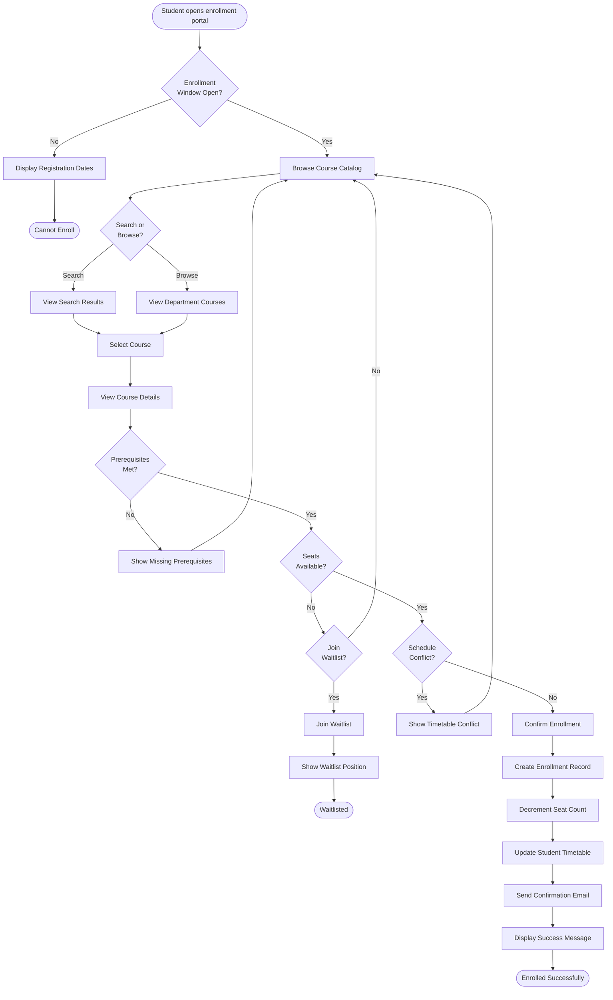
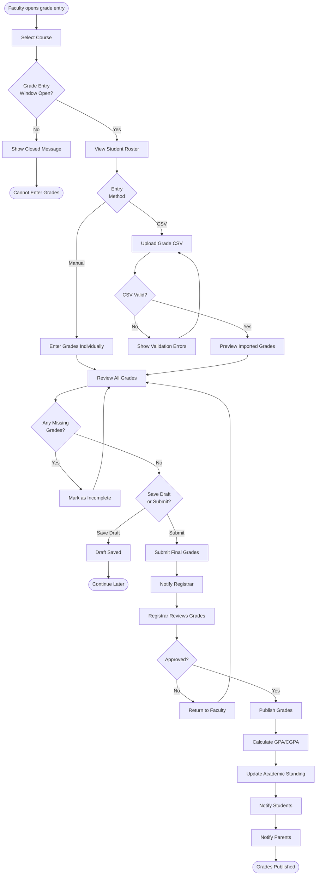
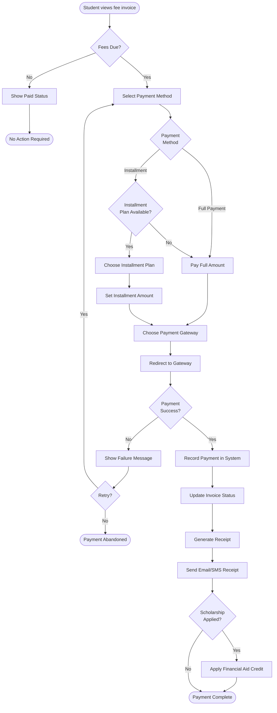
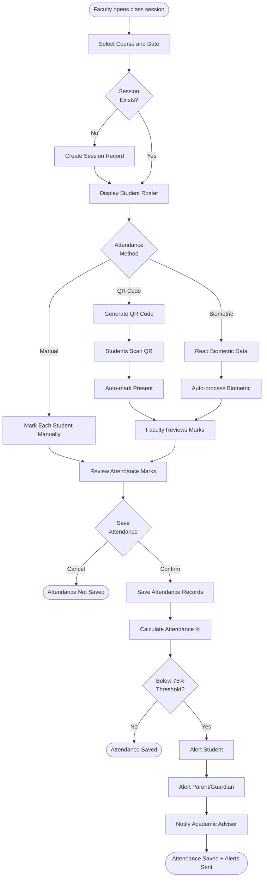
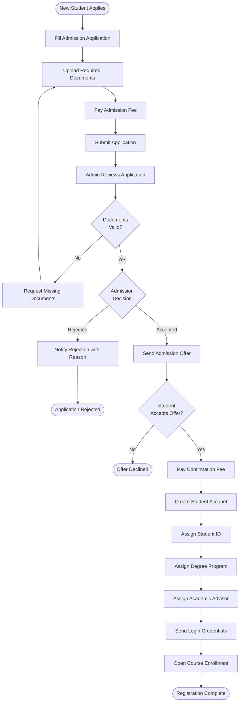
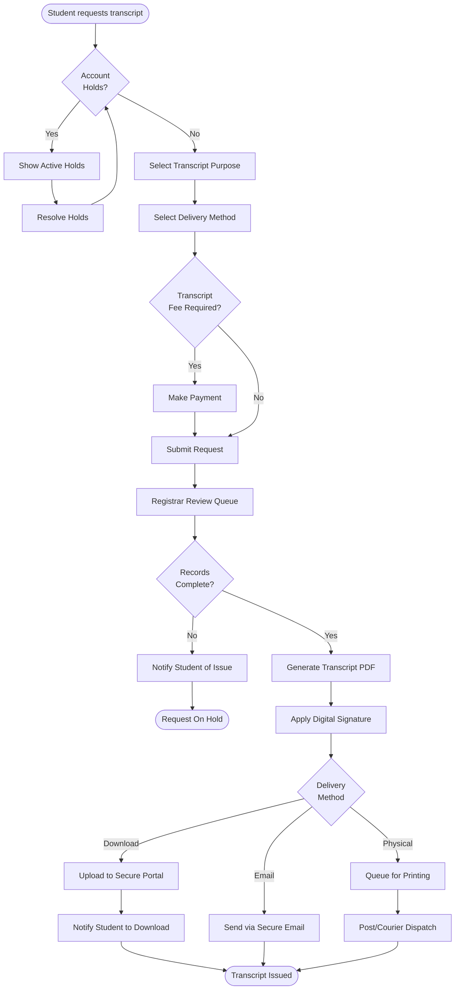
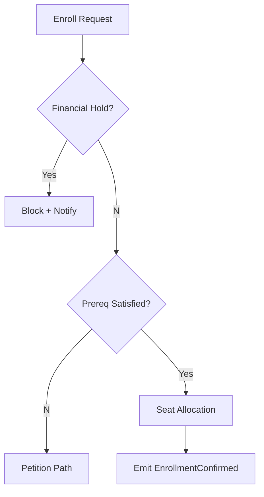

# Activity Diagrams

## Overview
Activity diagrams showing the business process flows for key operations in the Student Information System.

---

## Course Enrollment Flow

---

## Grade Recording and Publication Flow

---

## Fee Payment Flow

---

## Attendance Marking Flow

---

## Student Registration Flow

---

## Transcript Request Flow

## Implementation-Ready Addendum for Activity Diagrams

### Purpose in This Artifact
Adds missing decision nodes for holds, overrides, and downstream recalculations.

### Scope Focus
- Activity coverage closure
- Enrollment lifecycle enforcement relevant to this artifact
- Grading/transcript consistency constraints relevant to this artifact
- Role-based and integration concerns at this layer

### Supplemental Mermaid (Artifact-Specific)

#### Implementation Rules
- Enrollment lifecycle operations must emit auditable events with correlation IDs and actor scope.
- Grade and transcript actions must preserve immutability through versioned records; no destructive updates.
- RBAC must be combined with context constraints (term, department, assigned section, advisee).
- External integrations must remain contract-first with explicit versioning and backward-compatibility strategy.

#### Acceptance Criteria
1. Business rules are testable and mapped to policy IDs in this artifact.
2. Failure paths (authorization, policy window, downstream sync) are explicitly documented.
3. Data ownership and source-of-truth boundaries are clearly identified.
4. Diagram and narrative remain consistent for the scenarios covered in this file.

