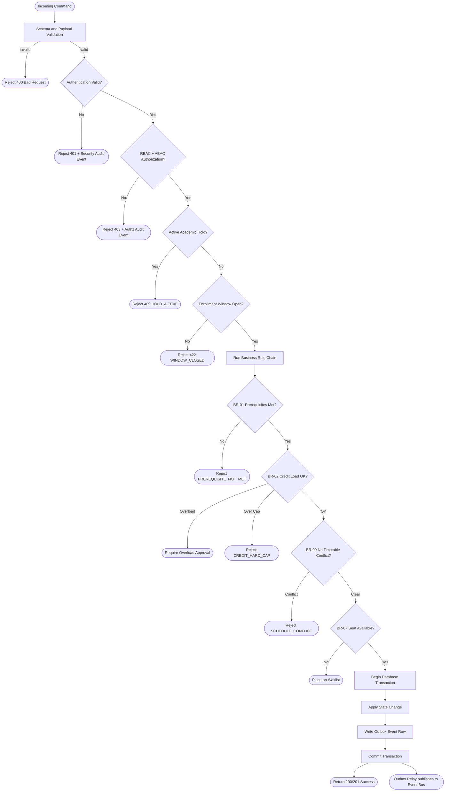
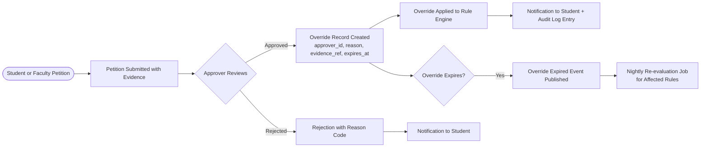

# Business Rules

This document defines the complete set of enforceable policy rules for the **Student Information System (SIS)**. Rules are evaluated at the API layer, domain service layer, and background processors. Each rule is versioned and configurable where institutional policy varies.

## Context

- **Domain:** Student information management — enrollment, grading, attendance, fees, scholarships, and graduation.
- **Rule Categories:** Academic eligibility, financial obligations, scheduling constraints, data integrity, and compliance.
- **Enforcement Points:** REST API handlers, domain service layer, nightly policy jobs, event-driven processors, and administrative override workflows.
- **Versioning:** Each rule carries an `effective_from` date and a `version` tag. Rule parameters are stored in `InstitutionPolicy` configuration, not hard-coded.

---

## Enforceable Rules

### BR-01 — Prerequisite Enforcement

**Trigger:** Student requests enrollment in a course section.

**Policy:** A student may not enroll in a course unless every prerequisite defined in `Course.prerequisites` has been completed with a final grade ≥ `Prerequisite.min_grade` (default `D` / 1.0 grade points; configurable per prerequisite link).

**Checks performed at enrollment time:**
1. Retrieve all `Prerequisite` records for the target course.
2. For each prerequisite, query `CourseAttempt` for the student filtered by `status = COMPLETED` and `grade_points >= min_grade`.
3. Also accept: transfer credits with `prerequisite_satisfied = true` validated by the Registrar.
4. Also accept: concurrent co-requisite enrollment (only for `type = CO_REQUISITE`).
5. If any prerequisite is unmet and no active `PrerequisiteWaiver` exists → **reject** with `PREREQUISITE_NOT_MET`.

**Exception paths:**
- Academic Advisor issues a `PrerequisiteWaiver` with required written justification before or during the enrollment window.
- Department Head may approve a batch waiver for an entire cohort via `BatchWaiver` record.

---

### BR-02 — Maximum Credit Load Per Term

**Trigger:** Student adds a section to their enrollment for a term.

**Policy:** Total enrolled credit hours for a single term may not exceed `Program.max_credits_per_term` (default **18** for undergraduate; **15** for graduate). Enrollment above the standard limit is an **overload** and requires explicit approval.

| Scenario | Credits | Required Approval |
|---|---|---|
| Standard load | ≤ 18 UG / ≤ 15 GR | None |
| Overload | 19–21 UG / 16–18 GR | Academic Advisor `OverloadApproval` |
| Hard cap | > 21 UG / > 18 GR | Blocked — no override permitted |

**Exceptions:**
- Final-term graduation overload may be approved by the Registrar up to the hard cap.
- Summer/intersession terms have a separate configurable cap (`Term.max_credits_override`).

---

### BR-03 — GPA Calculation

**Trigger:** Grade posted for a course attempt; grade amendment applied; term closure.

**Policy:** Cumulative GPA (CGPA) is computed as:

```
CGPA = Σ(grade_points × credit_hours) / Σ(credit_hours)
```

Only credit-bearing attempts with a quality grade (A through F) are included. Excluded from GPA: `W` (Withdrawal), `I` (Incomplete), `AU` (Audit), `TR` (Transfer), `P/F` (Pass/Fail if `Program.pf_excluded_from_gpa = true`).

**Default grade scale (configurable per institution):**

| Letter | Grade Points | Letter | Grade Points |
|--------|-------------|--------|-------------|
| A / A+ | 4.0 | C      | 2.0 |
| A−     | 3.7 | C−     | 1.7 |
| B+     | 3.3 | D+     | 1.3 |
| B      | 3.0 | D      | 1.0 |
| B−     | 2.7 | F      | 0.0 |
| C+     | 2.3 | | |

**Repeat Forgiveness:** When `Program.repeat_forgiveness = true`, only the highest-grade attempt for a given course counts toward GPA; all attempts remain on the transcript with a notation.

**Incomplete Resolution:** A grade of `I` converts to `F` after `Institution.incomplete_resolution_days` (default 120) unless a faculty-approved `IncompleteExtension` is on file.

---

### BR-04 — Attendance Eligibility for Final Examination

**Trigger:** Nightly eligibility evaluation job; exam registration request.

**Policy:** A student must have attended ≥ `Section.min_attendance_percent` (default **75%**) of scheduled class sessions to be eligible to sit the final examination for that section.

| Attendance % | Status | Action |
|---|---|---|
| ≥ 75% | Eligible | No action |
| 65%–74.99% | At Risk | Automated warning to student + advisor |
| < 65% | Debarred | Blocked from final exam registration; faculty notified |

**Computation:**
```
attendance_pct = (sessions_attended / sessions_held) × 100
```

Cancelled sessions (weather, faculty absence recorded in system) are excluded from `sessions_held`.

**Exception paths:**
- A `MedicalLeave` record with approved documentation, submitted within `Institution.medical_leave_grace_days` (default 7), reduces the denominator by the covered sessions.
- An instructor may file an `AttendanceCondoneRequest` for extenuating circumstances; requires department-head approval within 5 business days.
- Adjudicated `AttendanceDispute` records update the attendance ledger retroactively.

---

### BR-05 — Fee Due Date and Academic Hold

**Trigger:** Term fee invoice generated; daily overdue-check batch job.

**Policy:**

1. Fees not paid by `FeeInvoice.due_date` incur a late fee of `Institution.late_fee_percent` per month (default **2%**), applied on the first calendar day of each overdue month, compounded monthly.
2. After `Institution.max_overdue_days` (default **90**) of non-payment, an `AcademicHold` of type `FINANCIAL` is placed on the student record.
3. A student with an active `AcademicHold` of type `FINANCIAL` is blocked from:
   - Adding new course section enrollments
   - Receiving official or unofficial transcripts
   - Registering for any examination
   - Applying for graduation

**Exception paths:**
- An approved `FeeWaiver` (full or partial) removes the waived amount from the outstanding balance before hold evaluation.
- A confirmed `PaymentPlan` agreement suspends late-fee accrual and hold placement while installments remain on schedule (≤ 7 days past installment due date).

---

### BR-06 — Scholarship Eligibility

**Trigger:** Term grade posting closes; annual re-evaluation job; CGPA change from grade amendment.

**Policy:** A scholarship remains active only when all criteria in `Scholarship.eligibility_criteria` are satisfied:

| Criterion | Required Value |
|---|---|
| Cumulative GPA | ≥ `Scholarship.min_cgpa` |
| Credits completed | ≥ `Scholarship.min_credits_completed` |
| Active disciplinary sanctions | Zero |
| Income proof (need-based) | Submitted and verified within the last 12 months |
| Program enrollment | Continuously enrolled in the qualifying program |

**Consequence schedule:**
- **First term of non-compliance:** Warning notification to student and financial-aid office; scholarship remains active.
- **Second consecutive term of non-compliance:** Scholarship **suspended**; disbursement halted until re-evaluation.
- **Third consecutive term or disciplinary action:** Scholarship **revoked**; may not be reinstated for the same award.

**Reinstatement:** Requires meeting all criteria for two consecutive terms and a financial-aid officer review.

---

### BR-07 — Section Waitlist Management

**Trigger:** Student attempts enrollment when `Section.enrolled_count >= Section.max_enrollment`.

**Policy:**

1. Student is automatically added to `WaitlistEntry` with `position` assigned in FIFO order (`waitlisted_at ASC`). Tie-breaking uses `(cohort_priority DESC, waitlisted_at ASC, random_seed ASC)` for determinism under concurrent adds.
2. When a seat opens (student drops or admin releases), the system auto-promotes the first eligible waitlisted student within **15 minutes** via an asynchronous job.
3. The promoted student receives a notification and has **24 hours** to confirm enrollment before the seat is offered to the next position.
4. The waitlist **expires 48 hours before `Term.enrollment_lock_at`**; all remaining waitlisted students receive a notification.
5. Maximum waitlist size is `Section.max_waitlist` (default: 50% of `max_enrollment`); further requests are rejected with `WAITLIST_FULL`.

**Priority windows:** Cohort-priority enrollment windows allow designated student groups to bypass the waitlist entirely during their allocated registration window.

---

### BR-08 — Graduation Requirement Audit

**Trigger:** Student submits graduation application; Registrar initiates manual audit; nightly graduation-eligible check job.

**Policy:** A graduation application transitions to `APPROVED` only when **all** of the following pass:

| Requirement | Evaluation |
|---|---|
| All mandatory courses completed | Every `ProgramRequirement` with `type = MANDATORY` has a linked `CourseAttempt` with `status = COMPLETED` |
| Elective credits fulfilled | Total elective credits ≥ `Program.required_elective_credits` |
| Minimum CGPA | CGPA ≥ `Program.min_graduation_gpa` (default 2.0; honors 3.0) |
| Financial clearance | No outstanding balance on any `FeeInvoice`; no active `AcademicHold` of type `FINANCIAL` |
| Academic holds | Zero active `AcademicHold` records of any type |
| Disciplinary clearance | No active or pending `DisciplinaryAction` records |
| Residency requirement | Credits earned at this institution ≥ `Program.min_residency_credits` |
| Application window | Application submitted within `AcademicCalendar.graduation_application_open` and `graduation_application_close` dates |

**Output:** A `GraduationAuditReport` is generated listing pass/fail per requirement. The Registrar reviews and sets `status = APPROVED` or `PENDING_REMEDIATION` with a list of deficiencies.

---

### BR-09 — Timetable Conflict Prevention

**Trigger:** Student attempts to enroll in a section; admin schedules a new section.

**Policy:** A student cannot hold active enrollments in two sections whose `ClassSchedule` records overlap in time on the same calendar day. Overlap is defined as any shared minute within the `[start_time, end_time)` interval.

**Exception paths:**
- Sections with `delivery_mode = ASYNC_ONLINE` are excluded from conflict checks.
- An advisor-approved `ScheduleConflictWaiver` (for hybrid or work-integrated programs) records the override reason and permits the enrollment.

---

### BR-10 — Transfer Credit Articulation

**Trigger:** Transfer credit evaluation record submitted by admissions or registrar staff.

**Policy:** Transfer credits are accepted only if:

1. The source institution is in the approved list (`Institution.approved_transfer_institutions`) or a per-course manual approval (`TransferApproval`) is on file.
2. Course content matches ≥ 70% of the target course syllabus as documented in a `TransferEvaluationReport` signed by the department committee.
3. Total accepted transfer credits ≤ `Program.max_transfer_credits`.
4. Transferred courses are recorded with grade `TR` and do not contribute to CGPA unless `Program.transfer_gpa_inclusion = true`.

---

## Rule Evaluation Pipeline

All state-changing API commands pass through the following evaluation pipeline before any write is committed to the database:



---

## Exception and Override Handling

### Override Authority Matrix

| Override Type | Authorized By | Required Evidence | Max Duration | Audit Level |
|---|---|---|---|---|
| Prerequisite Waiver | Academic Advisor | Written justification + course mapping | One term | High |
| Credit Overload Approval | Academic Advisor + Dept Head | CGPA ≥ 3.0; no active holds | One term | High |
| Attendance Condonation | Department Head | Medical or emergency documentation | One section | High |
| Fee Extension | Bursar | Hardship declaration or payment plan | 30–60 days | Medium |
| Scholarship Reinstatement | Financial Aid Director | Two-term compliance evidence | One award year | High |
| Graduation Audit Exception | Registrar + Academic Board | Program committee resolution | Permanent | Critical |
| Schedule Conflict Waiver | Academic Advisor | Program rationale | One section | Medium |

### Override Lifecycle



### Override Governance Controls

- All overrides are persisted in the `Override` entity with `approver_id`, `reason_code`, `evidence_ref`, `effective_from`, `effective_to`, and `created_at`.
- Overrides do not suppress audit logging; the override itself and all downstream effects are independently logged.
- Expired overrides trigger a nightly rule re-evaluation job for affected student records.
- Patterns of repeated overrides for the same student–rule pair within a single term are flagged for advisor review in the monthly academic-integrity report.
- Override reports are included in the monthly academic-integrity dashboard for department heads and the Registrar.

---

## Rule Versioning and Change Control

| Rule ID | Current Version | Effective Date | Changed By | Summary |
|---|---|---|---|---|
| BR-01 | v2.1 | 2024-08-01 | Registrar Office | Added transfer-credit prerequisite satisfaction flag |
| BR-02 | v1.3 | 2024-01-01 | Academic Affairs | Raised graduate standard cap to 15; hard cap to 18 |
| BR-03 | v3.0 | 2024-08-01 | Academic Affairs | Added A− / B+ fractional points; repeat forgiveness flag |
| BR-04 | v2.0 | 2023-08-01 | Academic Affairs | Medical-leave exclusion from denominator; dispute adjudication |
| BR-05 | v1.4 | 2024-01-01 | Bursar Office | Payment plan suspends hold placement when on schedule |
| BR-06 | v2.2 | 2024-08-01 | Financial Aid | Two-term consecutive requirement for reinstatement |
| BR-07 | v1.5 | 2024-01-01 | Registrar Office | Reduced confirmation window from 48 h to 24 h |
| BR-08 | v2.0 | 2024-08-01 | Registrar Office | Added residency-credits and disciplinary-clearance requirements |
| BR-09 | v1.0 | 2023-01-01 | Academic Affairs | Initial release |
| BR-10 | v1.1 | 2024-01-01 | Registrar Office | Added 70% syllabus-match threshold and batch-approval support |
