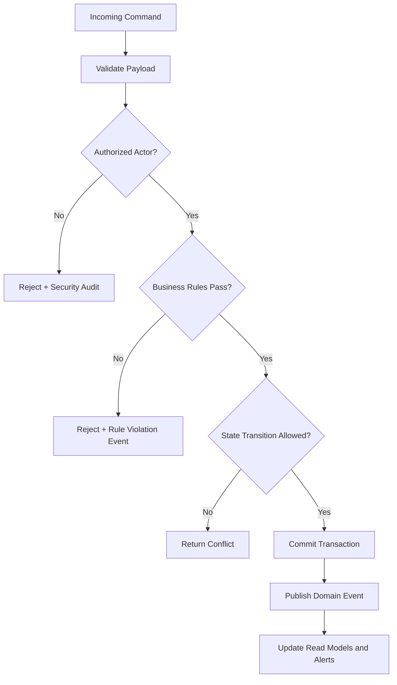

# Business Rules

This document defines enforceable policy rules for **Student Information System** so command processing, asynchronous jobs, and operational actions behave consistently under normal and exceptional conditions.

## Context
- Domain focus: student information workflows.
- Rule categories: lifecycle transitions, authorization, compliance, and resilience.
- Enforcement points: APIs, workflow/state engines, background processors, and administrative consoles.

## Enforceable Rules
1. Every state-changing command must pass authentication, authorization, and schema validation before processing.
2. Lifecycle transitions must follow the configured state graph; invalid transitions are rejected with explicit reason codes.
3. High-impact operations (financial, security, or regulated data actions) require additional approval evidence.
4. Manual overrides must include approver identity, rationale, and expiration timestamp.
5. Retries and compensations must be idempotent and must not create duplicate business effects.

## Rule Evaluation Pipeline

## Exception and Override Handling
- Overrides are restricted to approved exception classes and require dual logging (business + security audit).
- Override windows automatically expire and trigger follow-up verification tasks.
- Repeated override patterns are reviewed for policy redesign and automation improvements.

## Implementation-Ready Addendum for Business Rules

### Purpose in This Artifact
Converts governance into deterministic if/then rules with precedence.

### Scope Focus
- Executable policy rulebook
- Enrollment lifecycle enforcement relevant to this artifact
- Grading/transcript consistency constraints relevant to this artifact
- Role-based and integration concerns at this layer

#### Implementation Rules
- Enrollment lifecycle operations must emit auditable events with correlation IDs and actor scope.
- Grade and transcript actions must preserve immutability through versioned records; no destructive updates.
- RBAC must be combined with context constraints (term, department, assigned section, advisee).
- External integrations must remain contract-first with explicit versioning and backward-compatibility strategy.

#### Acceptance Criteria
1. Business rules are testable and mapped to policy IDs in this artifact.
2. Failure paths (authorization, policy window, downstream sync) are explicitly documented.
3. Data ownership and source-of-truth boundaries are clearly identified.
4. Diagram and narrative remain consistent for the scenarios covered in this file.

