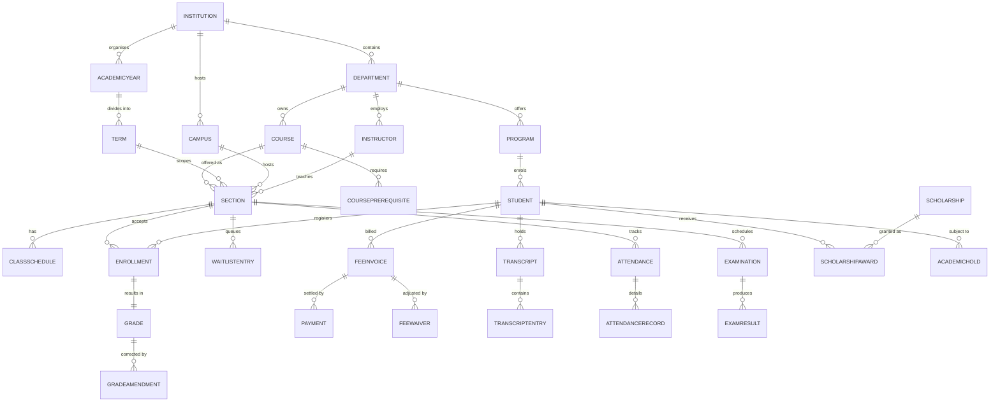

# Data Dictionary

This data dictionary is the canonical reference for the **Student Information System (SIS)**. It defines shared terminology, entity semantics, attribute constraints, and governance controls required to keep student information workflows consistent across all teams and integrated systems.

## Scope and Goals

- Establish a stable, authoritative vocabulary for architecture, API, analytics, and operations teams.
- Define minimum required attributes, data types, and relationship boundaries for all core SIS entities.
- Document data quality, classification, and retention controls needed for production readiness and regulatory compliance.

---

## Core Entities

| Entity | Description | Primary Key | Key Attributes | Relationships |
|---|---|---|---|---|
| Institution | Top-level organizational boundary; owns all configuration | `institution_id` | `name`, `domain`, `grade_scale_id`, `timezone`, `status` | Parent of Campus, Program, AcademicYear |
| Campus | Physical or virtual campus within an institution | `campus_id` | `institution_id`, `name`, `address`, `timezone`, `is_virtual` | Belongs to Institution; hosts Section, Timetable |
| AcademicYear | Named academic year (e.g., 2024–25) | `academic_year_id` | `institution_id`, `label`, `start_date`, `end_date` | Contains many Terms |
| Term | A single teaching period (semester, quarter, trimester) | `term_id` | `academic_year_id`, `name`, `type`, `enrollment_open_at`, `enrollment_lock_at`, `grade_deadline` | Contains Sections; scopes Enrollment |
| Department | Academic department offering courses and programs | `department_id` | `institution_id`, `name`, `code`, `head_instructor_id` | Owns Course, Program, Instructor |
| Program | Degree or certificate program defining graduation requirements | `program_id` | `department_id`, `name`, `type`, `total_credits`, `min_graduation_gpa`, `max_credits_per_term`, `repeat_forgiveness` | Contains ProgramRequirement; enrolls Students |
| Course | Reusable course definition in the catalog | `course_id` | `department_id`, `code`, `title`, `credit_hours`, `delivery_mode`, `is_active` | Has Prerequisites; offered as Sections |
| CoursePrerequisite | Prerequisite relationship between two courses | `prereq_id` | `course_id`, `required_course_id`, `min_grade`, `type (PRE/CO)` | Links Course to required Course |
| Section | A scheduled offering of a course for a specific term | `section_id` | `course_id`, `term_id`, `campus_id`, `instructor_id`, `max_enrollment`, `enrolled_count`, `room`, `status` | Has ClassSchedule; linked to Enrollment, Attendance |
| ClassSchedule | Recurring time slot for a section | `schedule_id` | `section_id`, `day_of_week`, `start_time`, `end_time`, `room`, `effective_from`, `effective_to` | Belongs to Section; informs Timetable conflict checks |
| Instructor | Faculty member who teaches sections | `instructor_id` | `department_id`, `employee_id`, `name`, `email`, `designation`, `status` | Teaches Sections; enters Grades and Attendance |
| Student | Enrolled individual pursuing a program | `student_id` | `institution_id`, `program_id`, `admission_number`, `name`, `email`, `status`, `cgpa`, `total_credits_earned` | Has Enrollments, Grades, Attendance, Fees, Transcripts |
| ParentGuardian | Parent or guardian with read-only portal access | `guardian_id` | `student_id`, `name`, `relationship`, `email`, `phone`, `portal_access_enabled` | Linked to Student (many-to-one) |
| Enrollment | A student's registration in a specific section for a term | `enrollment_id` | `student_id`, `section_id`, `term_id`, `status (ACTIVE/DROPPED/WITHDRAWN/COMPLETED)`, `enrolled_at`, `grade_id` | Links Student to Section; owns Grade |
| WaitlistEntry | Queue entry when a section is full | `waitlist_id` | `student_id`, `section_id`, `term_id`, `position`, `waitlisted_at`, `expires_at`, `status` | Linked to Section; promotes to Enrollment |
| Grade | Final grade awarded for a course enrollment | `grade_id` | `enrollment_id`, `letter_grade`, `grade_points`, `credit_hours`, `posted_by`, `posted_at`, `is_final`, `version` | Belongs to Enrollment; aggregated into Transcript |
| GradeAmendment | Versioned correction to a previously posted grade | `amendment_id` | `grade_id`, `previous_letter`, `new_letter`, `reason_code`, `approved_by`, `effective_at` | Supersedes Grade; logged to AuditEvent |
| GradeBook | Gradebook container for a section's assessment scores | `gradebook_id` | `section_id`, `instructor_id`, `last_updated_at` | Contains GradeBookEntry records |
| GradeBookEntry | Individual student assessment score within a gradebook | `entry_id` | `gradebook_id`, `student_id`, `assessment_name`, `max_score`, `scored`, `weight`, `submitted_at` | Child of GradeBook |
| Transcript | Official or unofficial academic record for a student | `transcript_id` | `student_id`, `type (OFFICIAL/UNOFFICIAL)`, `issued_at`, `issued_by`, `cgpa`, `hash`, `status` | Aggregates TranscriptEntry records |
| TranscriptEntry | One course row on a transcript | `entry_id` | `transcript_id`, `course_code`, `course_title`, `term`, `credit_hours`, `letter_grade`, `grade_points`, `notes` | Child of Transcript |
| Attendance | Attendance summary for a student in a section | `attendance_id` | `student_id`, `section_id`, `sessions_held`, `sessions_attended`, `attendance_pct`, `status` | Aggregates AttendanceRecord |
| AttendanceRecord | Single session attendance mark | `record_id` | `attendance_id`, `session_date`, `status (PRESENT/ABSENT/LATE/EXCUSED)`, `marked_by`, `marked_at` | Child of Attendance |
| FeeCategory | Template category for fee types | `category_id` | `institution_id`, `name`, `code`, `is_recurring`, `amount`, `frequency` | Parent of FeeInvoice |
| FeeInvoice | Term-specific fee invoice issued to a student | `invoice_id` | `student_id`, `term_id`, `category_id`, `amount`, `due_date`, `status (PENDING/PAID/OVERDUE/WAIVED)`, `late_fee_accrued` | Linked to Student, Term; has Payments |
| FeeWaiver | Partial or full waiver applied to a fee invoice | `waiver_id` | `invoice_id`, `reason`, `waived_amount`, `approved_by`, `approved_at` | Applied to FeeInvoice |
| Payment | Payment transaction against an invoice | `payment_id` | `invoice_id`, `amount`, `method`, `transaction_ref`, `status (SUCCESS/FAILED/REFUNDED)`, `paid_at` | Child of FeeInvoice |
| Scholarship | Scholarship award definition | `scholarship_id` | `institution_id`, `name`, `type (MERIT/NEED/SPORTS)`, `amount`, `min_cgpa`, `min_credits`, `renewable` | Linked to ScholarshipAward |
| ScholarshipAward | Active scholarship awarded to a specific student | `award_id` | `scholarship_id`, `student_id`, `term_id`, `amount`, `status (ACTIVE/SUSPENDED/REVOKED)`, `awarded_at` | Links Scholarship to Student |
| AcademicHold | Active hold blocking student actions | `hold_id` | `student_id`, `type (FINANCIAL/ACADEMIC/DISCIPLINARY)`, `placed_at`, `reason`, `placed_by`, `cleared_at` | Linked to Student; enforced in rule pipeline |
| Examination | Scheduled examination event for a section | `exam_id` | `section_id`, `term_id`, `type (MIDTERM/FINAL/SUPPLEMENTAL)`, `date`, `start_time`, `end_time`, `venue`, `status` | Belongs to Section; has ExamResult |
| ExamResult | A student's result for an examination | `result_id` | `exam_id`, `student_id`, `marks_obtained`, `max_marks`, `grade`, `is_absent`, `published_at` | Linked to Examination and Student |

---

## Canonical Relationship Diagram

---

## Attribute Reference

### Student

| Attribute | Type | Nullable | Constraints | Notes |
|---|---|---|---|---|
| `student_id` | UUID | No | PK | System-generated on admission |
| `admission_number` | VARCHAR(20) | No | UNIQUE, NOT NULL | Institution-formatted ID |
| `program_id` | UUID | No | FK → Program | Current enrolled program |
| `status` | ENUM | No | PROSPECT\|APPLICANT\|ADMITTED\|ACTIVE\|LOA\|GRADUATED\|WITHDRAWN\|DISMISSED | Drives access and eligibility |
| `cgpa` | DECIMAL(4,2) | Yes | 0.00–4.00 | Recomputed on each grade post; cached |
| `total_credits_earned` | INTEGER | No | ≥ 0 | Excludes W, I, AU |
| `date_of_birth` | DATE | No | | PII — masked in exports |
| `national_id` | VARCHAR(30) | Yes | | PII — encrypted at rest |
| `email` | VARCHAR(254) | No | UNIQUE, valid format | Primary login and notification address |

### Enrollment

| Attribute | Type | Nullable | Constraints | Notes |
|---|---|---|---|---|
| `enrollment_id` | UUID | No | PK | |
| `student_id` | UUID | No | FK → Student | |
| `section_id` | UUID | No | FK → Section | |
| `term_id` | UUID | No | FK → Term | Denormalised for query performance |
| `status` | ENUM | No | ACTIVE\|DROPPED\|WITHDRAWN\|COMPLETED | |
| `enrolled_at` | TIMESTAMPTZ | No | NOT NULL | Timezone-aware |
| `dropped_at` | TIMESTAMPTZ | Yes | | Null if not dropped |
| `grade_id` | UUID | Yes | FK → Grade | Null until grade posted |

### Grade

| Attribute | Type | Nullable | Constraints | Notes |
|---|---|---|---|---|
| `grade_id` | UUID | No | PK | |
| `enrollment_id` | UUID | No | FK → Enrollment | |
| `letter_grade` | VARCHAR(3) | No | Must match GradeScale | A, A−, B+, B … F, W, I, TR, AU |
| `grade_points` | DECIMAL(3,1) | Yes | 0.0–4.0 | Null for W, I, TR, AU |
| `credit_hours` | DECIMAL(4,1) | No | > 0 | Denormalised from Course |
| `posted_by` | UUID | No | FK → Instructor or Registrar | |
| `posted_at` | TIMESTAMPTZ | No | | |
| `version` | INTEGER | No | ≥ 1; increments on amendment | |
| `supersedes_grade_id` | UUID | Yes | FK → Grade | Null for version 1 |

---

## Data Quality Controls

1. **Required-field validation** is enforced at the API layer and at the database layer via `NOT NULL` constraints and `CHECK` expressions. A field failing validation returns `HTTP 422` with a machine-readable error array.
2. **Referential integrity** for all mandatory foreign keys (e.g., `student_id`, `section_id`, `term_id`) is enforced with `ON DELETE RESTRICT` to prevent orphan records.
3. **Controlled vocabularies** — status fields, grade letters, hold types, attendance statuses — use `ENUM` types or lookup tables; unknown values are rejected at write time.
4. **Natural-key deduplication:** `(student_id, section_id, term_id)` on `Enrollment` is unique; `(student_id, exam_id)` on `ExamResult` is unique. Duplicate inserts return `HTTP 409 CONFLICT`.
5. **PII classification:** Fields tagged `PII_HIGH` (national ID, date of birth, financial data) are encrypted at rest (AES-256) and masked in application logs and API exports unless the caller holds the `pii:read` scope.
6. **Immutable audit trail:** All writes to `Grade`, `Transcript`, `ScholarshipAward`, `AcademicHold`, and `FeeWaiver` emit an append-only `AuditEvent` record containing `actor_id`, `action`, `before_state`, `after_state`, `occurred_at`, and `correlation_id`.
7. **External import provenance:** Batch imports (transfer credits, payment reconciliation, external exam results) must include `source_system`, `source_ref`, and `ingested_at`; import jobs are logged to `ImportBatch`.
8. **Schema migration policy:** Backward-compatible changes (add nullable column, add index) may deploy without a version bump. Breaking changes (rename, drop, change type) require a new schema version and a data migration plan signed off by the platform lead.

---

## Retention and Audit Policy

| Record Type | Online Retention | Archive Tier | Legal Hold Support | Deletion Rule |
|---|---|---|---|---|
| Student academic record (grades, transcripts) | Lifetime of institution | Permanent | Yes | Statutory minimum; no deletion |
| Audit events (grade, transcript, financial) | 7 years active | 10+ years cold | Yes | Immutable; legal-hold overrides |
| Attendance records | 5 years | 10 years cold | No | Per institutional policy |
| Fee invoices and payment records | 7 years | 10 years cold | Yes | Accounting statute |
| Application and admission documents | 5 years post-decision | 7 years cold | No | Per data-minimisation policy |
| Anonymised analytics snapshots | Indefinite | N/A | No | No PII |

Data subject access and deletion requests (DSAR) must preserve all legally required academic records. Non-academic PII (contact details of former students post-record retention) may be redacted per `DSARPolicy.redaction_rules`.
