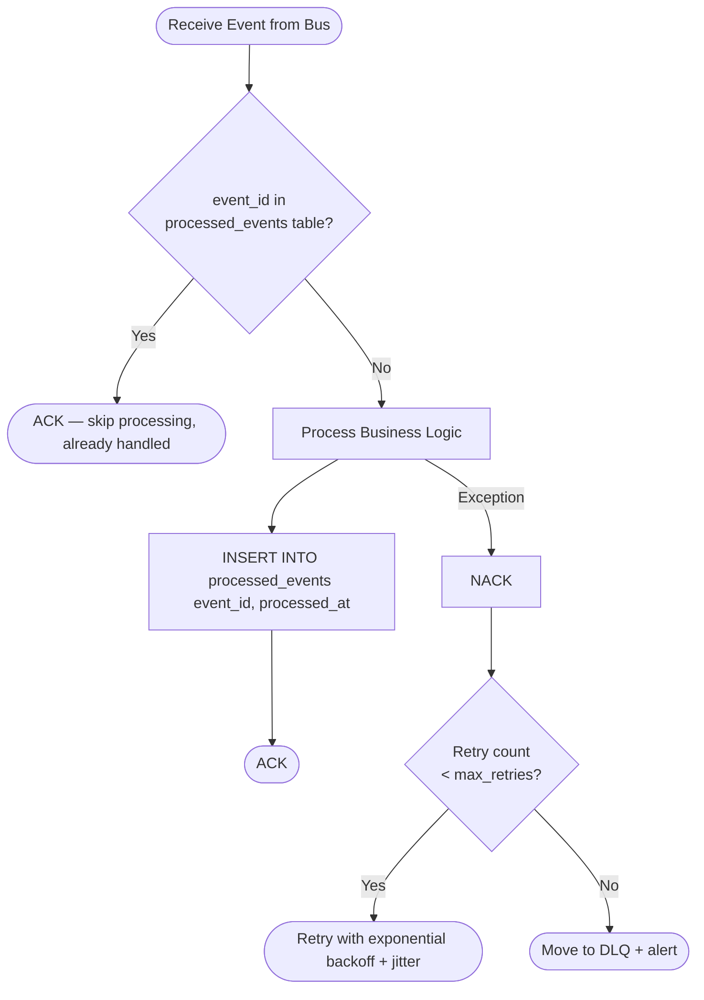

# Event Catalog

This catalog defines the stable, versioned event contracts for the **Student Information System (SIS)**. All domain events are used for event-driven integrations, inter-service choreography, audit trails, and real-time analytics across student information workflows.

---

## Contract Conventions

- **Naming pattern:** `sis.<aggregate>.<action>.v<N>` — e.g., `sis.enrollment.section_enrolled.v1`.
- **Schema format:** JSON Schema Draft 2020-12; published to the internal schema registry at `schema-registry.internal/sis/`.
- **Required envelope fields** (present on every event):

  | Field | Type | Description |
  |---|---|---|
  | `event_id` | UUID | Globally unique event identifier |
  | `event_type` | String | Full event type name including version |
  | `schema_version` | String | Semver of payload schema (e.g., `1.2.0`) |
  | `occurred_at` | ISO 8601 | Timestamp when the business fact occurred |
  | `published_at` | ISO 8601 | Timestamp when event was written to the outbox |
  | `correlation_id` | UUID | Traces a business operation across services |
  | `causation_id` | UUID | ID of the command or event that caused this event |
  | `source_system` | String | `sis-core` or publishing service name |
  | `institution_id` | UUID | Tenant identifier for multi-tenant isolation |

- **Delivery mode:** At-least-once via transactional outbox pattern; consumers must implement idempotency using `event_id`.
- **Ordering guarantee:** Per-aggregate key ordering (e.g., per `student_id`, per `section_id`); no cross-aggregate ordering guarantees.
- **Backward compatibility:** Additive changes (new optional fields) are non-breaking; field removal or type change requires a new version.
- **Deprecation window:** Deprecated event versions remain published for a minimum of one full academic term (≥ 4 months) after the successor version is available.

---

## Domain Events

| Event Name | Version | Payload Fields | Producer | Consumers | SLO (commit-to-publish) |
|---|---|---|---|---|---|
| `sis.student.admitted.v1` | 1.0.0 | `student_id`, `program_id`, `campus_id`, `admission_date`, `admission_type` | Admissions Service | Registrar, LMS, IdP/SCIM, Notification, Analytics | p95 < 10 s |
| `sis.student.enrolled.v1` | 1.1.0 | `student_id`, `term_id`, `program_id`, `enrollment_date`, `academic_status` | Registrar Service | LMS, Fee Engine, Scholarship Engine, Notification, Analytics | p95 < 5 s |
| `sis.enrollment.section_enrolled.v1` | 1.2.0 | `enrollment_id`, `student_id`, `section_id`, `course_id`, `term_id`, `credit_hours`, `enrolled_at` | Enrollment Service | LMS Roster Sync, Timetable, Fee Engine, Attendance Init, Analytics | p95 < 5 s |
| `sis.enrollment.section_dropped.v1` | 1.1.0 | `enrollment_id`, `student_id`, `section_id`, `term_id`, `dropped_at`, `reason_code` | Enrollment Service | LMS Roster Sync, Waitlist Promoter, Fee Engine, Analytics | p95 < 5 s |
| `sis.attendance.marked.v1` | 1.0.0 | `record_id`, `student_id`, `section_id`, `session_date`, `status`, `marked_by`, `marked_at` | Attendance Service | Eligibility Engine, Notification (threshold alerts), Analytics | p95 < 10 s |
| `sis.grade.posted.v1` | 2.0.0 | `grade_id`, `enrollment_id`, `student_id`, `section_id`, `term_id`, `letter_grade`, `grade_points`, `credit_hours`, `posted_by`, `posted_at` | Grade Service | Transcript Engine, GPA Calculator, Scholarship Engine, Standing Evaluator, Prerequisite Cache, Analytics | p95 < 5 s |
| `sis.grade.amended.v1` | 1.1.0 | `amendment_id`, `grade_id`, `student_id`, `previous_grade`, `new_grade`, `reason_code`, `approved_by`, `effective_at` | Registrar Service | Transcript Engine, GPA Calculator, Scholarship Engine, Prereq Cache, Audit, Analytics | p95 < 5 s |
| `sis.transcript.requested.v1` | 1.0.0 | `request_id`, `student_id`, `type (OFFICIAL/UNOFFICIAL)`, `destination`, `requested_at`, `requester_id` | Transcript Service | Registrar Workflow, Notification, Analytics | p95 < 10 s |
| `sis.transcript.issued.v1` | 1.0.0 | `transcript_id`, `student_id`, `type`, `issued_at`, `issued_by`, `hash`, `delivery_method` | Transcript Service | Notification, Audit, Regulatory Reporting | p95 < 10 s |
| `sis.fee.assessed.v1` | 1.0.0 | `invoice_id`, `student_id`, `term_id`, `category_id`, `amount`, `due_date`, `generated_at` | Fee Engine | Payment Service, Notification, Analytics, Financial Aid | p95 < 5 s |
| `sis.payment.recorded.v1` | 1.1.0 | `payment_id`, `invoice_id`, `student_id`, `amount`, `method`, `transaction_ref`, `status`, `paid_at` | Payment Service | Fee Engine (balance update), Hold Evaluator, Notification, Analytics | p95 < 5 s |
| `sis.scholarship.awarded.v1` | 1.0.0 | `award_id`, `scholarship_id`, `student_id`, `term_id`, `amount`, `awarded_at`, `criteria_snapshot` | Scholarship Engine | Fee Engine (credit application), Notification, Financial Aid, Analytics | p95 < 10 s |
| `sis.scholarship.suspended.v1` | 1.0.0 | `award_id`, `scholarship_id`, `student_id`, `term_id`, `reason`, `suspended_at` | Scholarship Engine | Fee Engine, Notification, Financial Aid, Analytics | p95 < 10 s |
| `sis.exam.scheduled.v1` | 1.0.0 | `exam_id`, `section_id`, `term_id`, `type`, `date`, `start_time`, `end_time`, `venue`, `scheduled_by` | Examination Service | Timetable, Notification (students + faculty), Analytics | p95 < 10 s |
| `sis.exam.result_published.v1` | 1.0.0 | `result_id`, `exam_id`, `student_id`, `marks_obtained`, `max_marks`, `grade`, `published_at` | Examination Service | Grade Service, Notification, Analytics | p95 < 5 s |
| `sis.student.graduated.v1` | 1.0.0 | `student_id`, `program_id`, `term_id`, `cgpa`, `total_credits`, `conferred_at`, `degree_type` | Registrar Service | Alumni System, IdP (status update), LMS (revoke access), Notification, Analytics, Regulatory | p95 < 10 s |
| `sis.student.suspended.v1` | 1.0.0 | `student_id`, `hold_id`, `hold_type`, `placed_at`, `placed_by`, `reason`, `expected_cleared_at` | Policy Engine | Enrollment Service (block), Transcript Service (block), Notification, Analytics, Compliance | p95 < 5 s |
| `sis.waitlist.promoted.v1` | 1.0.0 | `waitlist_id`, `student_id`, `section_id`, `term_id`, `promoted_at`, `confirmation_deadline` | Waitlist Service | Notification, Enrollment Service, Analytics | p95 < 5 s |

---

## Key Event Payload Schemas

### `sis.enrollment.section_enrolled.v1`

```json
{
  "event_id": "uuid",
  "event_type": "sis.enrollment.section_enrolled.v1",
  "schema_version": "1.2.0",
  "occurred_at": "2024-08-30T09:15:00Z",
  "correlation_id": "uuid",
  "institution_id": "uuid",
  "payload": {
    "enrollment_id": "uuid",
    "student_id": "uuid",
    "section_id": "uuid",
    "course_id": "uuid",
    "course_code": "CS301",
    "term_id": "uuid",
    "credit_hours": 3.0,
    "enrolled_at": "2024-08-30T09:15:00Z",
    "delivery_mode": "IN_PERSON"
  }
}
```

### `sis.grade.posted.v1`

```json
{
  "event_id": "uuid",
  "event_type": "sis.grade.posted.v1",
  "schema_version": "2.0.0",
  "occurred_at": "2024-12-20T18:00:00Z",
  "correlation_id": "uuid",
  "institution_id": "uuid",
  "payload": {
    "grade_id": "uuid",
    "enrollment_id": "uuid",
    "student_id": "uuid",
    "section_id": "uuid",
    "term_id": "uuid",
    "letter_grade": "B+",
    "grade_points": 3.3,
    "credit_hours": 3.0,
    "posted_by": "uuid",
    "posted_at": "2024-12-20T18:00:00Z",
    "is_final": true,
    "version": 1
  }
}
```

### `sis.fee.assessed.v1`

```json
{
  "event_id": "uuid",
  "event_type": "sis.fee.assessed.v1",
  "schema_version": "1.0.0",
  "occurred_at": "2024-08-01T00:00:00Z",
  "correlation_id": "uuid",
  "institution_id": "uuid",
  "payload": {
    "invoice_id": "uuid",
    "student_id": "uuid",
    "term_id": "uuid",
    "category_id": "uuid",
    "category_name": "Tuition Fee",
    "amount": 45000.00,
    "currency": "USD",
    "due_date": "2024-09-01",
    "generated_at": "2024-08-01T00:00:00Z"
  }
}
```

---

## Publish and Consumption Sequence

The SIS uses the transactional outbox pattern to guarantee that events are only published after their associated database changes are durably committed.

```mermaid
sequenceDiagram
    participant API as SIS Command API
    participant DB as PostgreSQL (write + outbox)
    participant Relay as Outbox Relay (CDC)
    participant Bus as Event Bus (Kafka / SNS)
    participant LMS as LMS Roster Service
    participant Fee as Fee Engine
    participant Notif as Notification Service
    participant DLQ as Dead Letter Queue

    API->>DB: BEGIN TRANSACTION
    API->>DB: INSERT enrollment row (status=ACTIVE)
    API->>DB: INSERT outbox_event row (type=section_enrolled.v1)
    API->>DB: COMMIT
    API-->>API: Return HTTP 201 to client

    Relay->>DB: Poll new outbox rows (CDC or polling)
    Relay->>Bus: Publish sis.enrollment.section_enrolled.v1
    Bus-->>LMS: Deliver event
    Bus-->>Fee: Deliver event
    Bus-->>Notif: Deliver event

    LMS->>LMS: Idempotency check (event_id)
    LMS->>LMS: Add student to course roster

    Fee->>Fee: Idempotency check (event_id)
    Fee->>Fee: Recalculate term fee invoice

    Notif->>Notif: Send enrollment confirmation email

    alt Consumer fails after retries
        Bus->>DLQ: Move to Dead Letter Queue
        DLQ-->>DLQ: Alert on-call engineer (PagerDuty)
    end

    Relay->>DB: Mark outbox row as published
```



---

## Consumer Idempotency Requirements

Each consumer must implement idempotency using `event_id` as the deduplication key:



---

## Operational SLOs

| Metric | Target | Measurement Window | Alert Threshold |
|---|---|---|---|
| Commit-to-publish latency (tier-1 events) | p95 < 5 s | Rolling 5-minute window | p95 > 10 s for 3 min |
| Commit-to-publish latency (tier-2 events) | p95 < 30 s | Rolling 10-minute window | p95 > 60 s for 5 min |
| Consumer processing latency (LMS roster) | p95 < 5 min | Rolling 15-minute window | p95 > 10 min |
| Consumer processing latency (notifications) | p95 < 2 min | Rolling 5-minute window | p95 > 5 min |
| DLQ depth (per topic) | Zero items in steady state | Continuous | ≥ 1 item → PagerDuty |
| DLQ triage acknowledgement | < 15 min | Per incident | Breach triggers SEV-2 |
| Event schema backward-compatibility | 100% within major version | Per deploy | Schema drift blocks deploy |
| Outbox relay uptime | 99.9% | 30-day rolling | < 99.5% → incident |

---

## Tier Classification

| Tier | Definition | Examples |
|---|---|---|
| Tier-1 | Directly affects student access, grades, or money | `section_enrolled`, `grade.posted`, `payment.recorded`, `student.suspended` |
| Tier-2 | Operational workflows with eventual propagation tolerance | `attendance.marked`, `exam.scheduled`, `transcript.requested` |
| Tier-3 | Analytics, reporting, and non-blocking notifications | Read-model projections, dashboard snapshots |

---

## Dead Letter and Error Handling

- **DLQ per topic:** Each Kafka topic has a corresponding `.dlq` topic. Failed messages are routed there after `max_delivery_attempts` (default: 5 with exponential backoff starting at 1 s).
- **DLQ monitoring:** DLQ depth is monitored continuously. Any non-zero depth triggers a PagerDuty alert within 2 minutes.
- **Replay tooling:** An `event-replay` CLI tool allows engineers to re-process DLQ messages after root-cause fixes, with idempotency protection preventing duplicate business effects.
- **Poison message handling:** Messages that repeatedly fail processing are quarantined in a `poison_messages` store with full headers, payload, and stack trace for post-mortem analysis.
- **Schema validation on ingest:** Consumers validate incoming payloads against the schema registry before processing; schema-invalid messages go to a `schema-violation.dlq` topic for triage.
