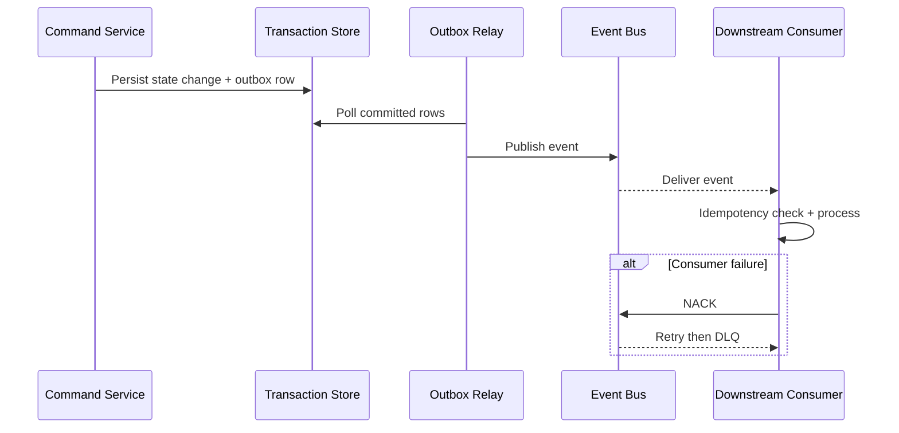

# Event Catalog

This catalog defines stable event contracts for **Student Information System** to support event-driven integrations, auditability, and analytics across student information workflows.

## Contract Conventions
- Event naming: `<domain>.<aggregate>.<action>.v1`.
- Required metadata: `event_id`, `occurred_at`, `correlation_id`, `producer`, `schema_version`, `tenant_context`.
- Delivery mode: at-least-once with mandatory consumer idempotency.
- Ordering guarantee: per aggregate key; no global ordering assumption.

## Domain Events
| Event Name | Payload Highlights | Typical Consumers |
|---|---|---|
| `domain.record.created.v1` | record_id, actor_id, initial_state, occurred_at | orchestration, analytics |
| `domain.record.state_changed.v1` | record_id, old_state, new_state, reason_code | notifications, reporting |
| `domain.record.validation_failed.v1` | record_id, violated_rules, correlation_id | operations, quality dashboards |
| `domain.record.override_applied.v1` | record_id, override_type, approver_id, expires_at | compliance, audit |
| `domain.record.closed.v1` | record_id, terminal_state, closed_at | billing/settlement, archives |

## Publish and Consumption Sequence

## Operational SLOs
- P95 commit-to-publish latency below 5 seconds for tier-1 events.
- DLQ triage acknowledgement within 15 minutes for production incidents.
- Schema changes remain backward compatible within the same major version.

## Implementation-Ready Addendum for Event Catalog

### Purpose in This Artifact
Defines event producers, consumers, payload guarantees, and replay behavior.

### Scope Focus
- Domain event semantics
- Enrollment lifecycle enforcement relevant to this artifact
- Grading/transcript consistency constraints relevant to this artifact
- Role-based and integration concerns at this layer

#### Implementation Rules
- Enrollment lifecycle operations must emit auditable events with correlation IDs and actor scope.
- Grade and transcript actions must preserve immutability through versioned records; no destructive updates.
- RBAC must be combined with context constraints (term, department, assigned section, advisee).
- External integrations must remain contract-first with explicit versioning and backward-compatibility strategy.

#### Acceptance Criteria
1. Business rules are testable and mapped to policy IDs in this artifact.
2. Failure paths (authorization, policy window, downstream sync) are explicitly documented.
3. Data ownership and source-of-truth boundaries are clearly identified.
4. Diagram and narrative remain consistent for the scenarios covered in this file.

