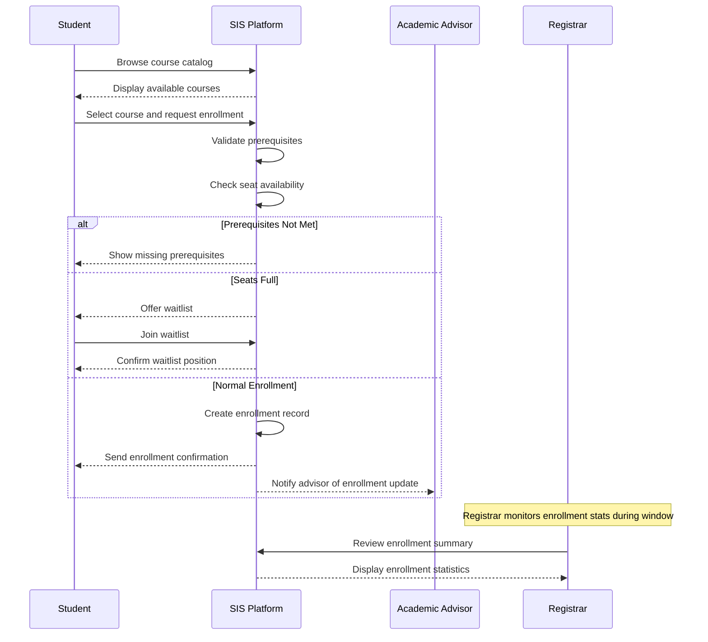
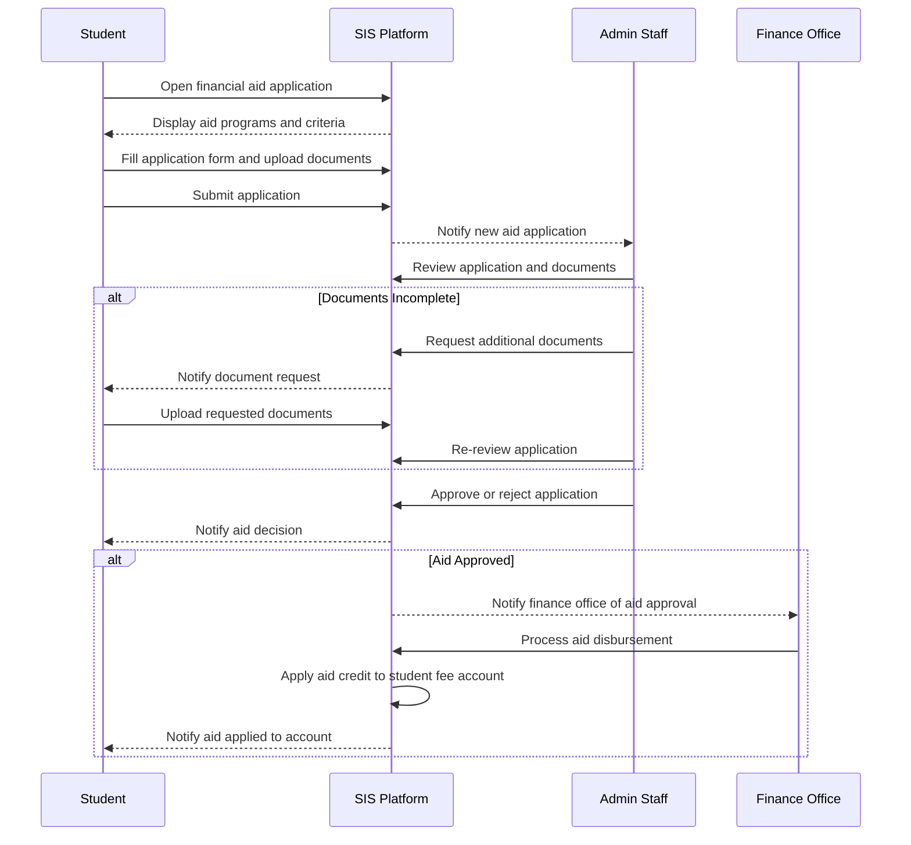
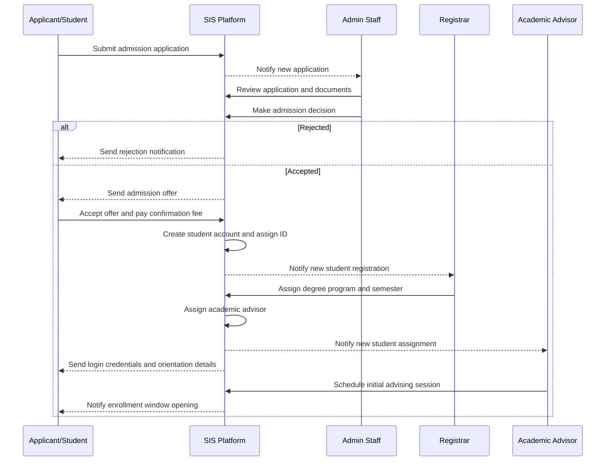
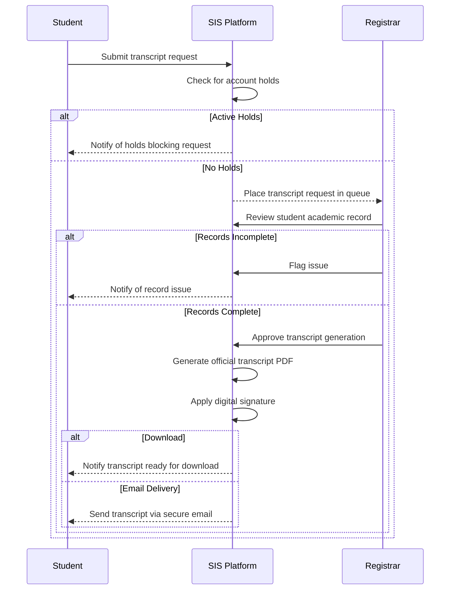
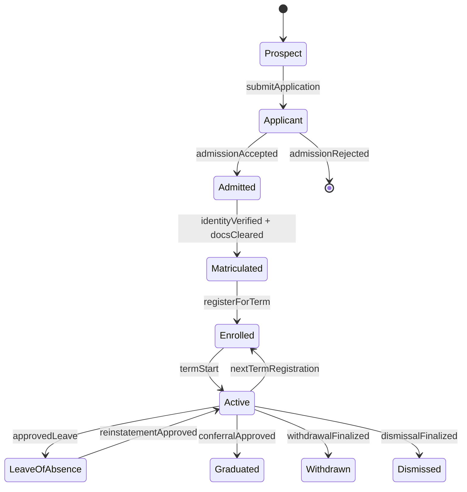
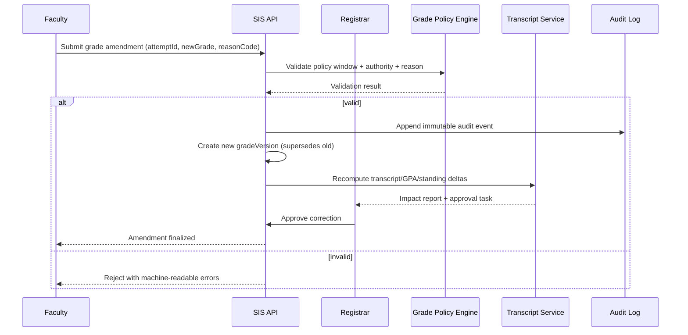
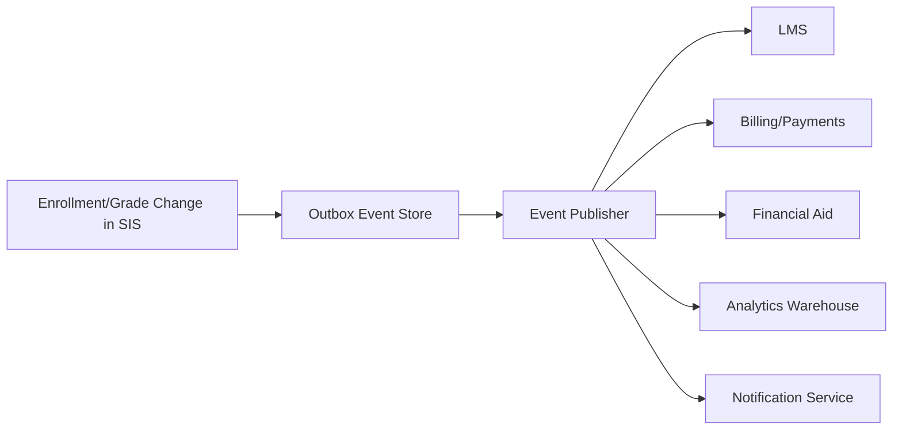

# Swimlane Diagrams

## Overview
Swimlane (BPMN-style) diagrams showing cross-department workflows in the Student Information System.

---

## Course Enrollment Process



---

## Grade Submission and Publication Workflow

```mermaid
sequenceDiagram
    participant FAC as Faculty
    participant SIS as SIS Platform
    participant REG as Registrar
    participant STU as Student
    participant PAR as Parent

    FAC->>SIS: Open grade entry for course
    SIS-->>FAC: Display student roster

    FAC->>SIS: Enter/upload grades
    SIS->>SIS: Validate grade format
    FAC->>SIS: Submit final grades

    SIS-->>REG: Notify grades submitted for review
    REG->>SIS: Review grade sheet

    alt Grades Rejected
        REG->>SIS: Return grades with comments
        SIS-->>FAC: Notify faculty of rejection
        FAC->>SIS: Revise and resubmit grades
    else Grades Approved
        REG->>SIS: Approve grade publication
        SIS->>SIS: Calculate GPA and CGPA
        SIS->>SIS: Update academic standing
        SIS-->>STU: Notify grade publication
        SIS-->>PAR: Notify parent/guardian
    end
```

---

## Attendance Alert and Intervention Workflow

```mermaid
sequenceDiagram
    participant FAC as Faculty
    participant SIS as SIS Platform
    participant STU as Student
    participant PAR as Parent
    participant ADV as Academic Advisor

    FAC->>SIS: Mark class attendance
    SIS->>SIS: Calculate attendance percentage

    alt Below Warning Threshold (below 80%)
        SIS-->>STU: Send attendance warning notification
        SIS-->>PAR: Send alert to parent/guardian
    end

    alt Below Critical Threshold (below 75%)
        SIS-->>STU: Send critical attendance warning
        SIS-->>ADV: Alert academic advisor
        SIS-->>PAR: Alert parent/guardian
        ADV->>SIS: Schedule intervention meeting with student
        ADV->>SIS: Log intervention notes
    end

    alt Exam Block Threshold (below 65%)
        SIS->>SIS: Flag student for exam block
        SIS-->>STU: Notify exam debarment warning
        STU->>SIS: Submit attendance condonation request
        ADV->>SIS: Review and approve/reject condonation
    end
```

---

## Financial Aid Application Workflow



---

## Student Admission and Onboarding Workflow



---

## Transcript Request and Issuance Workflow



---

## Exam Scheduling and Hall Allocation Workflow

```mermaid
sequenceDiagram
    participant ADM as Admin Staff
    participant SIS as SIS Platform
    participant FAC as Faculty
    participant STU as Student
    participant REG as Registrar

    ADM->>SIS: Create exam schedule for semester
    SIS->>SIS: Check for student exam conflicts
    SIS->>SIS: Allocate exam halls and seating

    alt Conflicts Found
        SIS-->>ADM: Show conflict report
        ADM->>SIS: Resolve conflicts and reschedule
    else No Conflicts
        ADM->>SIS: Publish exam schedule
        SIS-->>STU: Send exam schedule notification
        SIS-->>FAC: Notify faculty of invigilation duties
    end

    Note over STU: Student downloads hall ticket
    STU->>SIS: Request hall ticket
    SIS->>SIS: Check attendance eligibility
    alt Attendance Below Threshold
        SIS-->>STU: Block hall ticket; notify of debarment
    else Eligible
        SIS-->>STU: Generate and deliver hall ticket
    end

    REG->>SIS: Finalize exam register
    SIS-->>REG: Confirm all hall tickets issued
```

## Enrollment, Academic Integrity, Access Control, and Integration Contracts (Implementation-Ready)

### 1) Enrollment Lifecycle Rules (Authoritative)

#### 1.1 Lifecycle States and Transitions
| State | Entry Criteria | Exit Criteria | Allowed Actors | Terminal? |
|---|---|---|---|---|
| Prospect | Lead captured or inquiry created | Application submitted | Admissions CRM, Applicant | No |
| Applicant | Complete application + required docs | Admitted or Rejected | Applicant, Admissions Officer | No |
| Admitted | Admission decision = accepted | Matriculated or Offer Expired | Admissions, Registrar | No |
| Matriculated | Identity + eligibility checks passed | Enrolled for a term | Registrar | No |
| Enrolled (Term-Scoped) | Registered in >=1 credit-bearing section | Dropped all sections, Term Completed | Student, Advisor, Registrar | No |
| Active (Institution-Scoped) | Student is not graduated/withdrawn/dismissed | Graduated, Withdrawn, Dismissed | SIS policy engine | No |
| Leave of Absence | Approved leave request in valid window | Reinstated, Withdrawn, Dismissed | Student, Advisor, Registrar | No |
| Graduated | Degree audit complete + conferral approved | N/A | Registrar | Yes |
| Withdrawn | Approved withdrawal workflow complete | Reinstated (rare policy path) | Student, Registrar | Yes* |
| Dismissed | Policy or disciplinary action finalized | Reinstated by exception | Registrar, Academic Board | Yes* |

> *Terminal under normal policy; reinstatement requires exceptional workflow and two-party approval (advisor + registrar/board).

#### 1.2 Deterministic State Machine


#### 1.3 Enrollment/Registration Enforcement Rules
- **EL-001 Window Governance:** add/drop/withdraw windows are configured per term, program, and campus timezone; requests outside windows require override reason code.
- **EL-002 Seat Allocation:** seat release follows deterministic priority `(cohortPriority DESC, waitlistTimestamp ASC, randomTieBreakerSeed ASC)`.
- **EL-003 Prerequisite Resolution:** prerequisite checks run against canonical attempt history with in-progress and transfer-credit handling flags.
- **EL-004 Conflict Detection:** section enrollment is rejected if timetable overlap, credit overload, hold, or missing approval constraints fail.
- **EL-005 Downstream Consistency:** enrollment state changes emit events for LMS roster sync, fee recalculation, attendance eligibility, and aid re-evaluation.
- **EL-006 Re-Enrollment Gate:** reinstatement requires cleared financial/disciplinary holds and advisor + registrar approvals.

### 2) Grading and Transcript Consistency Constraints

#### 2.1 Grade Lifecycle and Versioning
- **GC-001 Immutable Posting:** once a grade version is `POSTED`, it is immutable.
- **GC-002 Amendment Model:** corrections create a new version linked by `supersedesGradeVersionId`; no in-place edits.
- **GC-003 Reason Codes:** every amendment must provide standardized reason (`CALCULATION_ERROR`, `LATE_SUBMISSION_APPROVED`, `INCOMPLETE_RESOLUTION`, etc.).
- **GC-004 Effective Dating:** transcript rendering always uses latest `effective=true` grade version at render time.

#### 2.2 Canonical Consistency Rules
| Rule ID | Constraint | Failure Handling |
|---|---|---|
| TR-001 | Transcript rows derive only from canonical course-attempt + grade-version records | Block issuance and raise registrar task |
| TR-002 | GPA/CGPA computed from policy-bound grade points and repeat/forgiveness rules | Recompute job queued; stale cache invalidated |
| TR-003 | Standing/honors/SAP updates run after each posted or amended grade event | Trigger synchronous policy check + async reconciliation |
| TR-004 | Official transcript issuance requires registrar sign-off + tamper-evident hash | Refuse release if signature or hash missing |
| TR-005 | Retroactive grade changes require impact statements (prereq, audit, aid, standing) | Hold change in `PENDING_IMPACT_REVIEW` |

#### 2.3 Grade Correction Sequence (Required)


### 3) Role-Based Access Specifics (RBAC + ABAC)

#### 3.1 Access Model
- **RBAC baseline** grants capability by role.
- **ABAC overlays** constrain by context attributes: campus, department, term, section assignment, advisee linkage, data sensitivity, legal hold.
- **Break-glass access** is time-bound, ticket-linked, and dual-approved.

#### 3.2 Permission Matrix (Minimum Required)
| Capability | Student | Faculty | Advisor | Registrar/Admin | Notes |
|---|---:|---:|---:|---:|---|
| View own transcript | ✅ | ❌ | ❌ | ✅ | Student self-service allowed |
| Submit final grades | ❌ | ✅* | ❌ | ✅ | *Assigned sections + open window only |
| Amend posted grade | ❌ | Request | ❌ | ✅ | Registrar finalizes amendments |
| Approve overload/waiver petition | ❌ | ❌ | ✅ | ✅ | Program-scoped |
| Release official transcript | ❌ | ❌ | ❌ | ✅ | Requires digital signature policy |
| View disciplinary records | Limited | ❌ | Limited | Scoped | Enhanced logging required |

#### 3.3 Security and Audit Controls
- **AC-001** least privilege defaults; deny-by-default policy on all privileged endpoints.
- **AC-002** MFA required for registrar/admin and any user performing grade or transcript actions.
- **AC-003** field-level masking for PII/financial attributes in UI, exports, and logs.
- **AC-004** all read/write of sensitive records generate audit events with `actorId`, `scope`, `justification`, `requestId`.
- **AC-005** periodic entitlement recertification (at least once per term).

### 4) Integration Contracts for External Systems

#### 4.1 Contract-First Standards
- APIs must publish OpenAPI/AsyncAPI artifacts with JSON Schema references and semantic versions.
- Breaking changes require version increment and migration window policy.
- Event contracts are backward-compatible for at least one full term unless emergency exception approved.

#### 4.2 External Integration Surface
| System | Direction | Contract Type | SLA/SLO | Idempotency Key |
|---|---|---|---|---|
| LMS | Bi-directional | REST + Events | Roster sync < 5 min | `termId:sectionId:studentId:eventType` |
| IdP/SSO | Inbound auth + outbound provisioning | SAML/OIDC + SCIM | Login p95 < 2s | `provisioningRequestId` |
| Payment Gateway | Outbound payment + inbound webhook | REST + Signed Webhooks | Payment callback < 60s | `invoiceId:attemptNo` |
| Financial Aid | Bi-directional | REST + Batch SFTP (optional) | Aid status < 15 min | `aidApplicationId:termId` |
| Library | Bi-directional | REST | Borrowing status < 10 min | `studentId:loanId:eventType` |
| Regulatory Reporting | Outbound | Secure file/API | Deadline-bound batch | `reportPeriod:studentId:recordType` |

#### 4.3 Event Contract Baseline


Required event metadata fields:
- `eventId`, `eventType`, `schemaVersion`, `occurredAt`, `sourceSystem`, `correlationId`, `idempotencyKey`
- domain IDs: `studentId`, `termId`, `courseOfferingId`, `attemptId`, `gradeVersionId` (as applicable)

#### 4.4 Reliability, Security, and Drift Controls
- **IC-001** retries use exponential backoff + jitter; dead-letter queues mandatory.
- **IC-002** all webhook callbacks must be signed and timestamp-validated.
- **IC-003** encryption in transit (TLS 1.2+) and at rest for replicated payload stores.
- **IC-004** contract tests + sandbox certification are release gates for enrollment/grade/transcript/billing changes.
- **IC-005** schema drift detection runs continuously and blocks incompatible deploys.

### 5) Operational Readiness and Acceptance Criteria

#### 5.1 Observability and SLOs
- Enrollment action API p95 latency <= 400ms during peak registration.
- Grade posting-to-transcript consistency <= 2 minutes (p99).
- LMS roster propagation <= 5 minutes (p99).
- Audit event durability >= 99.999% persisted write success.

#### 5.2 Data Retention and Compliance
- Grade versions and transcript issuance records are retained per institutional and statutory policy (minimum 7 years where applicable).
- Audit logs for sensitive operations retained in immutable storage tier with legal hold support.
- Data subject access/deletion requests must preserve legally required academic records with redaction-by-policy.

#### 5.3 Implementation-Ready Test Scenarios
1. Waitlist promotion tie-breaker determinism under concurrent seat release.
2. Retroactive grade correction impact on prerequisites and degree audit.
3. Unauthorized faculty grade amendment blocked with explicit error code.
4. Payment webhook replay handled idempotently without duplicate ledger entries.
5. Transcript signature/hash verification fails on tampered artifact.
6. Re-enrollment blocked when financial hold exists; succeeds after hold clearance.

