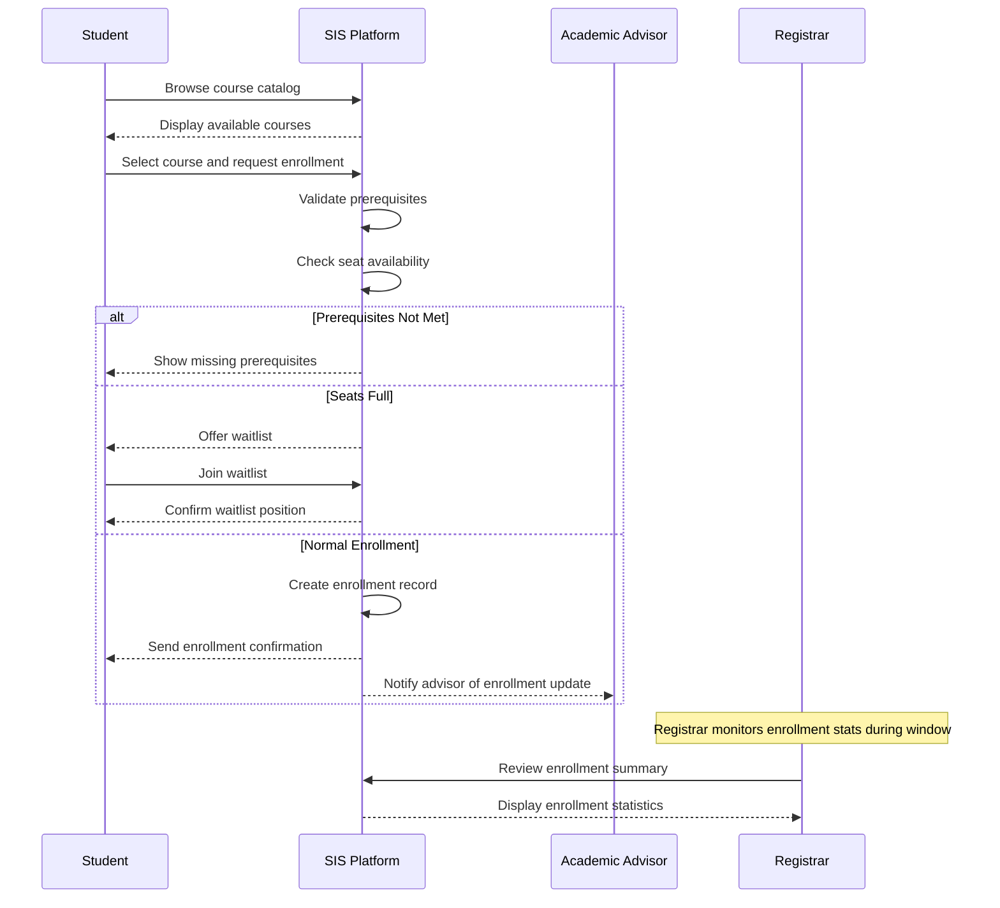
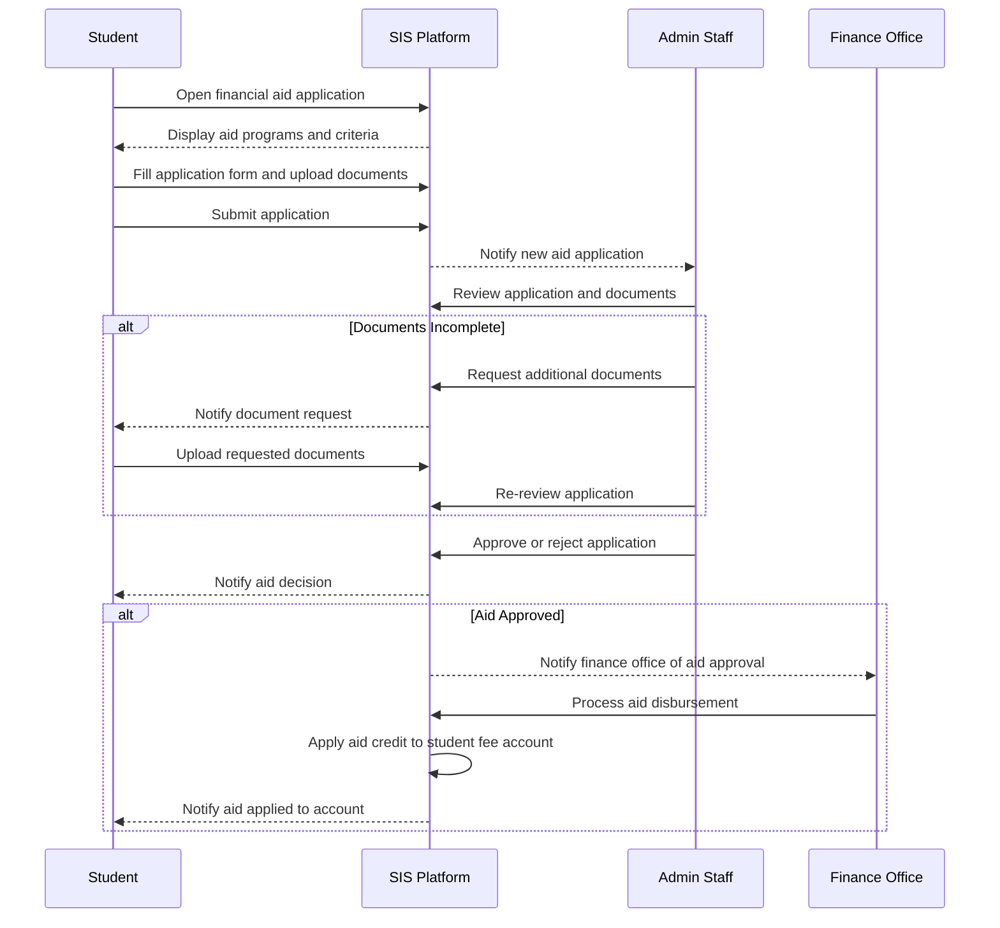
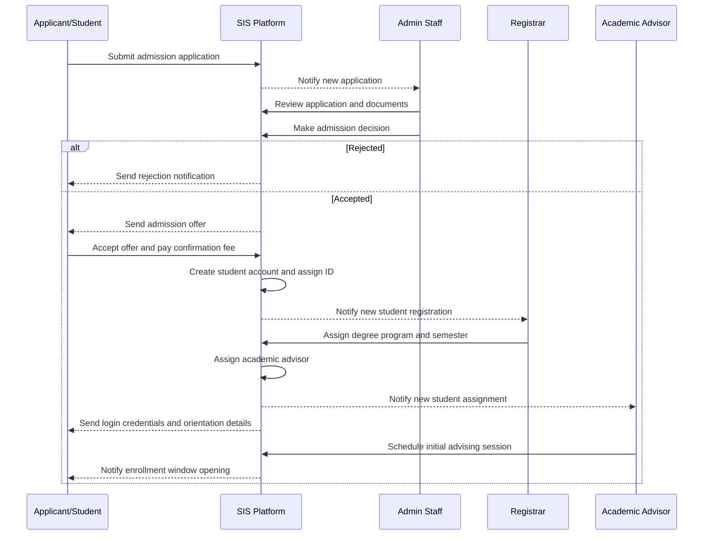
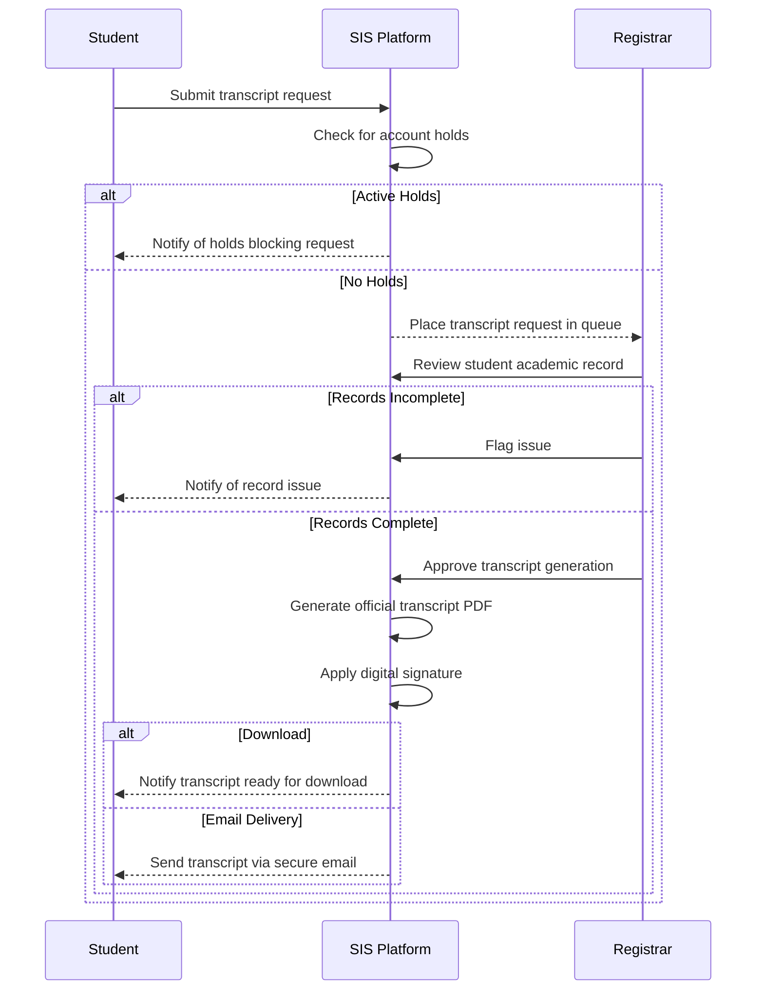

# Swimlane Diagrams

## Overview
Swimlane (BPMN-style) diagrams showing cross-department workflows in the Student Information System.

---

## Course Enrollment Process



---

## Grade Submission and Publication Workflow

```mermaid
sequenceDiagram
    participant FAC as Faculty
    participant SIS as SIS Platform
    participant REG as Registrar
    participant STU as Student
    participant PAR as Parent

    FAC->>SIS: Open grade entry for course
    SIS-->>FAC: Display student roster

    FAC->>SIS: Enter/upload grades
    SIS->>SIS: Validate grade format
    FAC->>SIS: Submit final grades

    SIS-->>REG: Notify grades submitted for review
    REG->>SIS: Review grade sheet

    alt Grades Rejected
        REG->>SIS: Return grades with comments
        SIS-->>FAC: Notify faculty of rejection
        FAC->>SIS: Revise and resubmit grades
    else Grades Approved
        REG->>SIS: Approve grade publication
        SIS->>SIS: Calculate GPA and CGPA
        SIS->>SIS: Update academic standing
        SIS-->>STU: Notify grade publication
        SIS-->>PAR: Notify parent/guardian
    end
```

---

## Attendance Alert and Intervention Workflow

```mermaid
sequenceDiagram
    participant FAC as Faculty
    participant SIS as SIS Platform
    participant STU as Student
    participant PAR as Parent
    participant ADV as Academic Advisor

    FAC->>SIS: Mark class attendance
    SIS->>SIS: Calculate attendance percentage

    alt Below Warning Threshold (below 80%)
        SIS-->>STU: Send attendance warning notification
        SIS-->>PAR: Send alert to parent/guardian
    end

    alt Below Critical Threshold (below 75%)
        SIS-->>STU: Send critical attendance warning
        SIS-->>ADV: Alert academic advisor
        SIS-->>PAR: Alert parent/guardian
        ADV->>SIS: Schedule intervention meeting with student
        ADV->>SIS: Log intervention notes
    end

    alt Exam Block Threshold (below 65%)
        SIS->>SIS: Flag student for exam block
        SIS-->>STU: Notify exam debarment warning
        STU->>SIS: Submit attendance condonation request
        ADV->>SIS: Review and approve/reject condonation
    end
```

---

## Financial Aid Application Workflow



---

## Student Admission and Onboarding Workflow



---

## Transcript Request and Issuance Workflow



---

## Exam Scheduling and Hall Allocation Workflow

```mermaid
sequenceDiagram
    participant ADM as Admin Staff
    participant SIS as SIS Platform
    participant FAC as Faculty
    participant STU as Student
    participant REG as Registrar

    ADM->>SIS: Create exam schedule for semester
    SIS->>SIS: Check for student exam conflicts
    SIS->>SIS: Allocate exam halls and seating

    alt Conflicts Found
        SIS-->>ADM: Show conflict report
        ADM->>SIS: Resolve conflicts and reschedule
    else No Conflicts
        ADM->>SIS: Publish exam schedule
        SIS-->>STU: Send exam schedule notification
        SIS-->>FAC: Notify faculty of invigilation duties
    end

    Note over STU: Student downloads hall ticket
    STU->>SIS: Request hall ticket
    SIS->>SIS: Check attendance eligibility
    alt Attendance Below Threshold
        SIS-->>STU: Block hall ticket; notify of debarment
    else Eligible
        SIS-->>STU: Generate and deliver hall ticket
    end

    REG->>SIS: Finalize exam register
    SIS-->>REG: Confirm all hall tickets issued
```

## Implementation-Ready Addendum for Swimlane Diagrams

### Purpose in This Artifact
Clarifies ownership handoffs between student, faculty, advisor, registrar, finance, and LMS.

### Scope Focus
- Cross-team swimlane constraints
- Enrollment lifecycle enforcement relevant to this artifact
- Grading/transcript consistency constraints relevant to this artifact
- Role-based and integration concerns at this layer

#### Implementation Rules
- Enrollment lifecycle operations must emit auditable events with correlation IDs and actor scope.
- Grade and transcript actions must preserve immutability through versioned records; no destructive updates.
- RBAC must be combined with context constraints (term, department, assigned section, advisee).
- External integrations must remain contract-first with explicit versioning and backward-compatibility strategy.

#### Acceptance Criteria
1. Business rules are testable and mapped to policy IDs in this artifact.
2. Failure paths (authorization, policy window, downstream sync) are explicitly documented.
3. Data ownership and source-of-truth boundaries are clearly identified.
4. Diagram and narrative remain consistent for the scenarios covered in this file.

