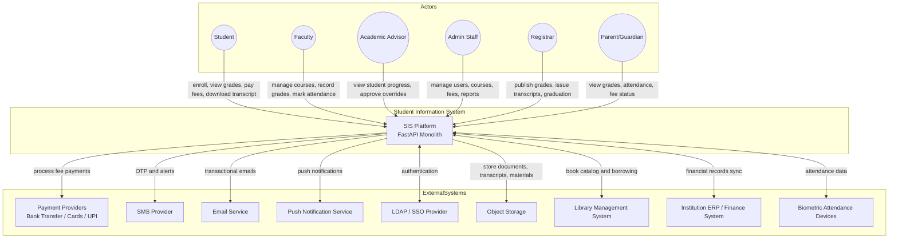
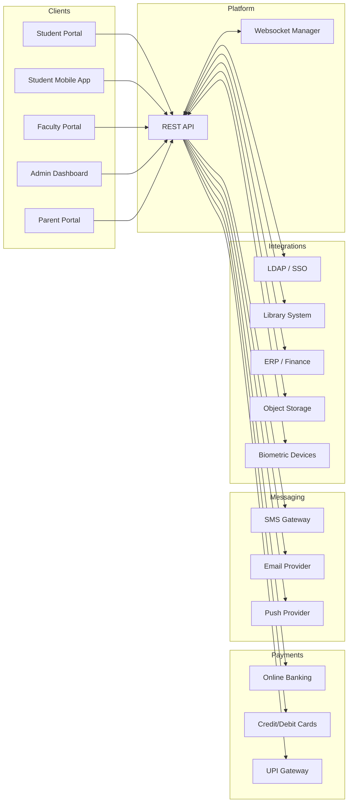
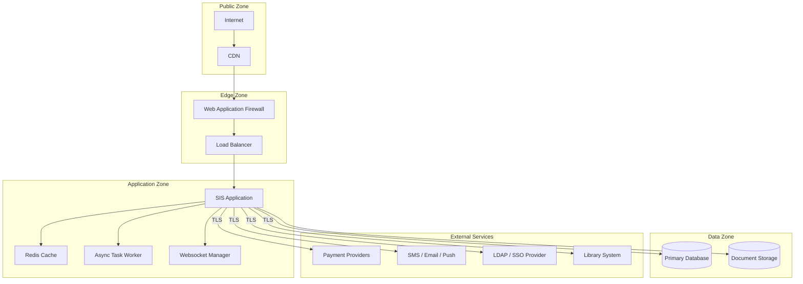

# System Context Diagram

## Overview
The system context diagram shows the Student Information System boundaries, its primary actors, and all external systems it interacts with.

---

## Main System Context Diagram

---

## Detailed Context With Data Flows

---

## Security Boundaries

---

## External Dependency Notes

| System | Purpose | Integration Type |
|--------|---------|-----------------|
| Payment providers | Fee collection and refunds | API integration |
| SMS / Email / Push | OTP, alerts, notifications | Third-party providers |
| LDAP / SSO | Institutional authentication | Directory service |
| Object storage | Documents, transcripts, materials | Cloud storage |
| Library system | Book catalog and borrowing | REST API sync |
| ERP / Finance | Fee reconciliation and financial records | Bidirectional sync |
| Biometric devices | Automated attendance capture | Device API / SDK |

## Implementation-Ready Addendum for System Context Diagram

### Purpose in This Artifact
Specifies inbound/outbound trust boundaries and data classifications.

### Scope Focus
- Boundary and trust-zone refinement
- Enrollment lifecycle enforcement relevant to this artifact
- Grading/transcript consistency constraints relevant to this artifact
- Role-based and integration concerns at this layer

#### Implementation Rules
- Enrollment lifecycle operations must emit auditable events with correlation IDs and actor scope.
- Grade and transcript actions must preserve immutability through versioned records; no destructive updates.
- RBAC must be combined with context constraints (term, department, assigned section, advisee).
- External integrations must remain contract-first with explicit versioning and backward-compatibility strategy.

#### Acceptance Criteria
1. Business rules are testable and mapped to policy IDs in this artifact.
2. Failure paths (authorization, policy window, downstream sync) are explicitly documented.
3. Data ownership and source-of-truth boundaries are clearly identified.
4. Diagram and narrative remain consistent for the scenarios covered in this file.

