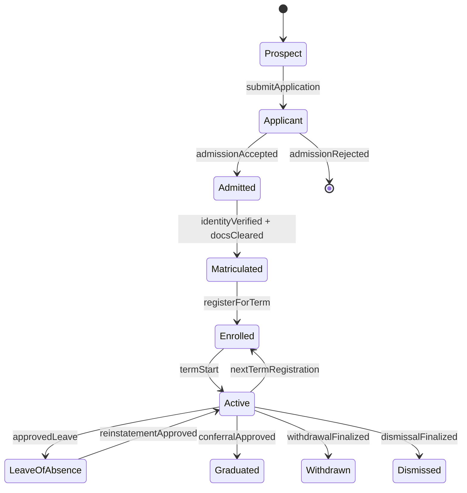
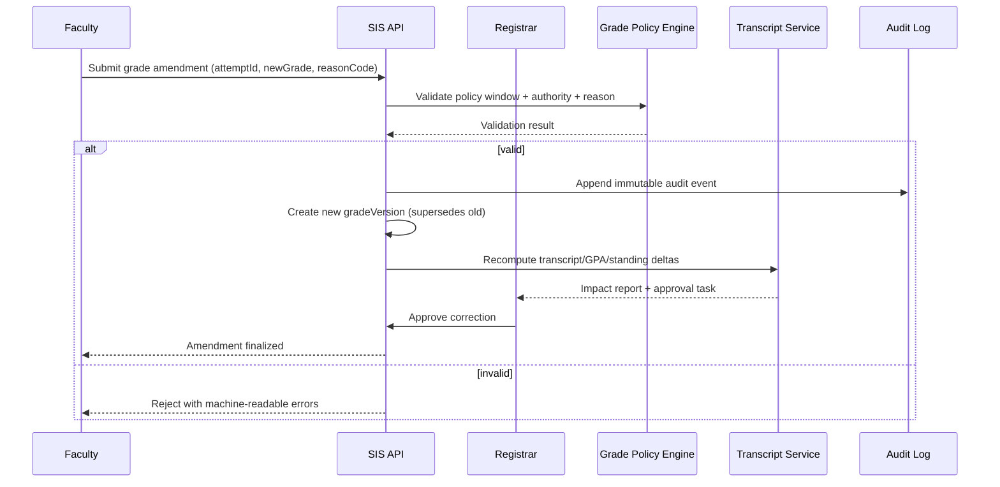
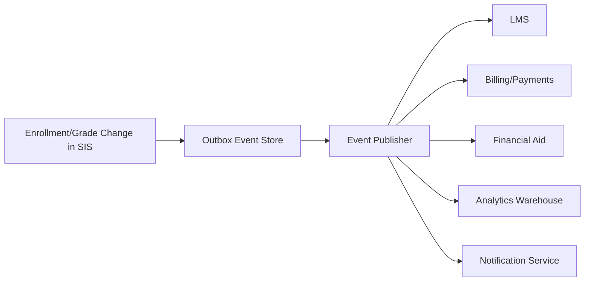

# Use Case Descriptions

## Overview
Detailed descriptions for the primary use cases in the Student Information System.

---

## UC-01: Enroll in Course

| Field | Detail |
|-------|--------|
| **Use Case ID** | UC-01 |
| **Use Case Name** | Enroll in Course |
| **Actor** | Student |
| **Preconditions** | Student is authenticated; enrollment window is open |
| **Postconditions** | Student is enrolled in the course; seat count decremented |
| **Trigger** | Student selects a course and clicks "Enroll" |

### Main Flow
1. Student browses the course catalog
2. Student selects a desired course section
3. System checks enrollment window status
4. System validates student's prerequisites
5. System checks seat availability
6. System creates enrollment record
7. System decrements available seat count
8. System sends enrollment confirmation email
9. System updates student's timetable

### Alternative Flows
- **4a. Prerequisites Not Met**: System displays missing prerequisites; enrollment blocked
- **5a. Course Full**: System offers waitlist option; student joins waitlist
- **3a. Window Closed**: System displays registration window dates; enrollment blocked

### Exception Flows
- **System Unavailable**: Display maintenance message; enrollment not processed

---

## UC-02: Record Grades

| Field | Detail |
|-------|--------|
| **Use Case ID** | UC-02 |
| **Use Case Name** | Record Grades |
| **Actor** | Faculty |
| **Preconditions** | Faculty is authenticated; grade entry window is open |
| **Postconditions** | Grades saved in system; GPA recalculated |
| **Trigger** | Faculty opens grade entry for a course |

### Main Flow
1. Faculty navigates to their course roster
2. Faculty selects "Enter Grades" for the course
3. System displays the student list with grade entry fields
4. Faculty enters grades for each student
5. Faculty saves draft grades
6. Faculty reviews and submits final grades
7. System validates grade format and completeness
8. System saves grades and triggers GPA recalculation
9. System notifies students of grade publication

### Alternative Flows
- **4a. Bulk Import**: Faculty uploads CSV file with student IDs and grades
- **6a. Incomplete Grades**: System warns about missing entries before submission
- **5a. Save Draft**: System saves partial grades without publishing

### Exception Flows
- **7a. Validation Error**: System highlights invalid grade entries; faculty corrects them

---

## UC-03: Mark Attendance

| Field | Detail |
|-------|--------|
| **Use Case ID** | UC-03 |
| **Use Case Name** | Mark Attendance |
| **Actor** | Faculty |
| **Preconditions** | Faculty is authenticated; class session exists for today |
| **Postconditions** | Attendance recorded; low-attendance alerts sent if threshold breached |
| **Trigger** | Faculty opens attendance marking for a class session |

### Main Flow
1. Faculty selects course and session date
2. System displays enrolled student list
3. Faculty marks each student as Present, Absent, or Late
4. System saves attendance records
5. System calculates updated attendance percentage per student
6. System checks against minimum attendance threshold (75%)
7. System sends alerts for students below threshold
8. System updates parent/guardian if alert triggered

### Alternative Flows
- **3a. QR Code Mode**: Students scan QR code to self-mark; faculty reviews and confirms
- **3b. Biometric Integration**: System reads biometric data for automated attendance

---

## UC-04: Pay Fees

| Field | Detail |
|-------|--------|
| **Use Case ID** | UC-04 |
| **Use Case Name** | Pay Fees |
| **Actor** | Student |
| **Preconditions** | Student is authenticated; fee invoice exists for current semester |
| **Postconditions** | Payment recorded; receipt generated; invoice marked paid |
| **Trigger** | Student navigates to fee payment section |

### Main Flow
1. Student views outstanding fee invoice
2. Student selects "Pay Now"
3. System displays payment amount and breakdown
4. Student selects payment method (card, net banking, UPI)
5. System redirects to payment gateway
6. Student completes payment on gateway
7. Payment gateway sends callback to system
8. System verifies payment status
9. System updates invoice to "Paid"
10. System generates payment receipt
11. System sends confirmation email and SMS to student

### Alternative Flows
- **4a. Installment Plan**: Student selects partial payment; system applies to plan
- **7a. Payment Failed**: System displays failure reason; student retries

---

## UC-05: Issue Transcript

| Field | Detail |
|-------|--------|
| **Use Case ID** | UC-05 |
| **Use Case Name** | Issue Transcript |
| **Actor** | Registrar, Student |
| **Preconditions** | Student has completed at least one semester; all grades are published |
| **Postconditions** | Official transcript generated and delivered |
| **Trigger** | Student submits transcript request |

### Main Flow
1. Student submits transcript request with purpose and delivery method
2. System checks for any holds (fee dues, grade locks)
3. System queues the request for registrar review
4. Registrar reviews student record completeness
5. Registrar approves the transcript request
6. System generates PDF transcript with all academic records
7. System applies registrar's digital signature
8. System delivers transcript via selected method (download/email)
9. System logs the transcript issuance in student record

### Alternative Flows
- **2a. Account Hold**: System notifies student of hold; transcript blocked until resolved
- **8a. Physical Copy**: System queues for physical printing and postal delivery

---

## UC-06: Process Degree Audit

| Field | Detail |
|-------|--------|
| **Use Case ID** | UC-06 |
| **Use Case Name** | Process Degree Audit |
| **Actor** | Student, Academic Advisor |
| **Preconditions** | Student is enrolled in a degree program |
| **Postconditions** | Degree audit report generated showing progress toward graduation |
| **Trigger** | Student or advisor requests degree audit |

### Main Flow
1. Student or advisor navigates to degree audit
2. System retrieves student's degree program requirements
3. System maps completed courses to degree requirements
4. System identifies fulfilled and unfulfilled requirements
5. System calculates remaining credit hours
6. System projects estimated graduation date
7. System generates degree audit report
8. Student and advisor can view and download the report

---

## UC-07: Apply for Financial Aid

| Field | Detail |
|-------|--------|
| **Use Case ID** | UC-07 |
| **Use Case Name** | Apply for Financial Aid |
| **Actor** | Student, Admin |
| **Preconditions** | Student is authenticated; financial aid window is open |
| **Postconditions** | Aid application submitted; student notified of status |
| **Trigger** | Student selects "Apply for Financial Aid" |

### Main Flow
1. Student opens financial aid application
2. System displays available aid programs with eligibility criteria
3. Student selects applicable aid type
4. Student fills in financial details and uploads supporting documents
5. Student submits application
6. System assigns application to admin review queue
7. Admin reviews application and documents
8. Admin approves or rejects with comments
9. System notifies student of decision
10. System applies approved aid to student fee account

---

## UC-08: Publish Grades

| Field | Detail |
|-------|--------|
| **Use Case ID** | UC-08 |
| **Use Case Name** | Publish Grades |
| **Actor** | Registrar |
| **Preconditions** | Faculty has submitted grades; grade review period is complete |
| **Postconditions** | Grades published; students and parents notified |
| **Trigger** | Registrar initiates grade publication for the semester |

### Main Flow
1. Registrar opens grade review dashboard
2. System displays courses with submitted grades
3. Registrar verifies completeness and validity of all grades
4. Registrar approves grades for publication
5. System marks grades as published
6. System calculates semester GPA and updates CGPA
7. System updates academic standing for all students
8. System sends grade publication notifications to students and parents
9. System makes grades visible in student portals

## Enrollment, Academic Integrity, Access Control, and Integration Contracts (Implementation-Ready)

### 1) Enrollment Lifecycle Rules (Authoritative)

#### 1.1 Lifecycle States and Transitions
| State | Entry Criteria | Exit Criteria | Allowed Actors | Terminal? |
|---|---|---|---|---|
| Prospect | Lead captured or inquiry created | Application submitted | Admissions CRM, Applicant | No |
| Applicant | Complete application + required docs | Admitted or Rejected | Applicant, Admissions Officer | No |
| Admitted | Admission decision = accepted | Matriculated or Offer Expired | Admissions, Registrar | No |
| Matriculated | Identity + eligibility checks passed | Enrolled for a term | Registrar | No |
| Enrolled (Term-Scoped) | Registered in >=1 credit-bearing section | Dropped all sections, Term Completed | Student, Advisor, Registrar | No |
| Active (Institution-Scoped) | Student is not graduated/withdrawn/dismissed | Graduated, Withdrawn, Dismissed | SIS policy engine | No |
| Leave of Absence | Approved leave request in valid window | Reinstated, Withdrawn, Dismissed | Student, Advisor, Registrar | No |
| Graduated | Degree audit complete + conferral approved | N/A | Registrar | Yes |
| Withdrawn | Approved withdrawal workflow complete | Reinstated (rare policy path) | Student, Registrar | Yes* |
| Dismissed | Policy or disciplinary action finalized | Reinstated by exception | Registrar, Academic Board | Yes* |

> *Terminal under normal policy; reinstatement requires exceptional workflow and two-party approval (advisor + registrar/board).

#### 1.2 Deterministic State Machine

#### 1.3 Enrollment/Registration Enforcement Rules
- **EL-001 Window Governance:** add/drop/withdraw windows are configured per term, program, and campus timezone; requests outside windows require override reason code.
- **EL-002 Seat Allocation:** seat release follows deterministic priority `(cohortPriority DESC, waitlistTimestamp ASC, randomTieBreakerSeed ASC)`.
- **EL-003 Prerequisite Resolution:** prerequisite checks run against canonical attempt history with in-progress and transfer-credit handling flags.
- **EL-004 Conflict Detection:** section enrollment is rejected if timetable overlap, credit overload, hold, or missing approval constraints fail.
- **EL-005 Downstream Consistency:** enrollment state changes emit events for LMS roster sync, fee recalculation, attendance eligibility, and aid re-evaluation.
- **EL-006 Re-Enrollment Gate:** reinstatement requires cleared financial/disciplinary holds and advisor + registrar approvals.

### 2) Grading and Transcript Consistency Constraints

#### 2.1 Grade Lifecycle and Versioning
- **GC-001 Immutable Posting:** once a grade version is `POSTED`, it is immutable.
- **GC-002 Amendment Model:** corrections create a new version linked by `supersedesGradeVersionId`; no in-place edits.
- **GC-003 Reason Codes:** every amendment must provide standardized reason (`CALCULATION_ERROR`, `LATE_SUBMISSION_APPROVED`, `INCOMPLETE_RESOLUTION`, etc.).
- **GC-004 Effective Dating:** transcript rendering always uses latest `effective=true` grade version at render time.

#### 2.2 Canonical Consistency Rules
| Rule ID | Constraint | Failure Handling |
|---|---|---|
| TR-001 | Transcript rows derive only from canonical course-attempt + grade-version records | Block issuance and raise registrar task |
| TR-002 | GPA/CGPA computed from policy-bound grade points and repeat/forgiveness rules | Recompute job queued; stale cache invalidated |
| TR-003 | Standing/honors/SAP updates run after each posted or amended grade event | Trigger synchronous policy check + async reconciliation |
| TR-004 | Official transcript issuance requires registrar sign-off + tamper-evident hash | Refuse release if signature or hash missing |
| TR-005 | Retroactive grade changes require impact statements (prereq, audit, aid, standing) | Hold change in `PENDING_IMPACT_REVIEW` |

#### 2.3 Grade Correction Sequence (Required)

### 3) Role-Based Access Specifics (RBAC + ABAC)

#### 3.1 Access Model
- **RBAC baseline** grants capability by role.
- **ABAC overlays** constrain by context attributes: campus, department, term, section assignment, advisee linkage, data sensitivity, legal hold.
- **Break-glass access** is time-bound, ticket-linked, and dual-approved.

#### 3.2 Permission Matrix (Minimum Required)
| Capability | Student | Faculty | Advisor | Registrar/Admin | Notes |
|---|---:|---:|---:|---:|---|
| View own transcript | ✅ | ❌ | ❌ | ✅ | Student self-service allowed |
| Submit final grades | ❌ | ✅* | ❌ | ✅ | *Assigned sections + open window only |
| Amend posted grade | ❌ | Request | ❌ | ✅ | Registrar finalizes amendments |
| Approve overload/waiver petition | ❌ | ❌ | ✅ | ✅ | Program-scoped |
| Release official transcript | ❌ | ❌ | ❌ | ✅ | Requires digital signature policy |
| View disciplinary records | Limited | ❌ | Limited | Scoped | Enhanced logging required |

#### 3.3 Security and Audit Controls
- **AC-001** least privilege defaults; deny-by-default policy on all privileged endpoints.
- **AC-002** MFA required for registrar/admin and any user performing grade or transcript actions.
- **AC-003** field-level masking for PII/financial attributes in UI, exports, and logs.
- **AC-004** all read/write of sensitive records generate audit events with `actorId`, `scope`, `justification`, `requestId`.
- **AC-005** periodic entitlement recertification (at least once per term).

### 4) Integration Contracts for External Systems

#### 4.1 Contract-First Standards
- APIs must publish OpenAPI/AsyncAPI artifacts with JSON Schema references and semantic versions.
- Breaking changes require version increment and migration window policy.
- Event contracts are backward-compatible for at least one full term unless emergency exception approved.

#### 4.2 External Integration Surface
| System | Direction | Contract Type | SLA/SLO | Idempotency Key |
|---|---|---|---|---|
| LMS | Bi-directional | REST + Events | Roster sync < 5 min | `termId:sectionId:studentId:eventType` |
| IdP/SSO | Inbound auth + outbound provisioning | SAML/OIDC + SCIM | Login p95 < 2s | `provisioningRequestId` |
| Payment Gateway | Outbound payment + inbound webhook | REST + Signed Webhooks | Payment callback < 60s | `invoiceId:attemptNo` |
| Financial Aid | Bi-directional | REST + Batch SFTP (optional) | Aid status < 15 min | `aidApplicationId:termId` |
| Library | Bi-directional | REST | Borrowing status < 10 min | `studentId:loanId:eventType` |
| Regulatory Reporting | Outbound | Secure file/API | Deadline-bound batch | `reportPeriod:studentId:recordType` |

#### 4.3 Event Contract Baseline

Required event metadata fields:
- `eventId`, `eventType`, `schemaVersion`, `occurredAt`, `sourceSystem`, `correlationId`, `idempotencyKey`
- domain IDs: `studentId`, `termId`, `courseOfferingId`, `attemptId`, `gradeVersionId` (as applicable)

#### 4.4 Reliability, Security, and Drift Controls
- **IC-001** retries use exponential backoff + jitter; dead-letter queues mandatory.
- **IC-002** all webhook callbacks must be signed and timestamp-validated.
- **IC-003** encryption in transit (TLS 1.2+) and at rest for replicated payload stores.
- **IC-004** contract tests + sandbox certification are release gates for enrollment/grade/transcript/billing changes.
- **IC-005** schema drift detection runs continuously and blocks incompatible deploys.

### 5) Operational Readiness and Acceptance Criteria

#### 5.1 Observability and SLOs
- Enrollment action API p95 latency <= 400ms during peak registration.
- Grade posting-to-transcript consistency <= 2 minutes (p99).
- LMS roster propagation <= 5 minutes (p99).
- Audit event durability >= 99.999% persisted write success.

#### 5.2 Data Retention and Compliance
- Grade versions and transcript issuance records are retained per institutional and statutory policy (minimum 7 years where applicable).
- Audit logs for sensitive operations retained in immutable storage tier with legal hold support.
- Data subject access/deletion requests must preserve legally required academic records with redaction-by-policy.

#### 5.3 Implementation-Ready Test Scenarios
1. Waitlist promotion tie-breaker determinism under concurrent seat release.
2. Retroactive grade correction impact on prerequisites and degree audit.
3. Unauthorized faculty grade amendment blocked with explicit error code.
4. Payment webhook replay handled idempotently without duplicate ledger entries.
5. Transcript signature/hash verification fails on tampered artifact.
6. Re-enrollment blocked when financial hold exists; succeeds after hold clearance.

