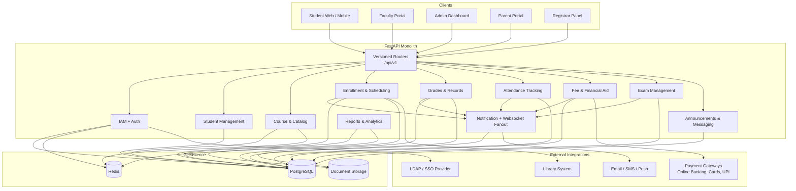

# API Design

## Overview
This document describes the Student Information System (SIS) backend API. The system is a FastAPI monolith with versioned routers under `/api/v1`, JWT-based authentication, SSO/LDAP integration, and async notifications.

---

## API Architecture

---

## API Conventions

| Convention | Behavior |
|-----------|----------|
| Versioning | All routes under `/api/v1` |
| Authentication | JWT bearer tokens; SSO/LDAP integration for institutional accounts |
| Authorization | Role-based access control per endpoint |
| Idempotency | Fee payment and enrollment mutations support idempotency keys |
| Notifications | Grade publication, attendance alerts, fee reminders, and exam events create persisted notifications and websocket events |

---

## Authentication API

### Endpoints

| Method | Endpoint | Description |
|--------|----------|-------------|
| POST | `/auth/signup` | Register a new user account |
| POST | `/auth/login` | Login with credentials |
| POST | `/auth/sso` | SSO/LDAP authentication |
| POST | `/auth/logout` | Logout current session |
| POST | `/auth/refresh` | Refresh access token |
| POST | `/auth/otp/enable` | Start OTP setup |
| POST | `/auth/otp/verify` | Verify OTP and enable |
| POST | `/auth/otp/disable` | Disable OTP |
| POST | `/auth/password/reset` | Request password reset |

---

## Student API

### Endpoints

| Method | Endpoint | Description |
|--------|----------|-------------|
| GET | `/students/me` | Get authenticated student profile |
| PATCH | `/students/me` | Update student profile |
| GET | `/students/me/enrollments` | List current and past enrollments |
| GET | `/students/me/grades` | Get all grades with GPA summary |
| GET | `/students/me/gpa` | Get CGPA and semester-wise GPA |
| GET | `/students/me/attendance` | Get attendance records across courses |
| GET | `/students/me/degree-audit` | Get degree audit report |
| GET | `/students/me/timetable` | Get current semester timetable |
| POST | `/students/me/guardian` | Link parent/guardian account |
| GET | `/admin/students` | List all students (admin only) |
| GET | `/admin/students/{id}` | Get student details (admin/registrar) |
| PATCH | `/admin/students/{id}/status` | Update student status |

---

## Course and Enrollment API

### Endpoints

| Method | Endpoint | Description |
|--------|----------|-------------|
| GET | `/courses` | List course catalog with filters |
| GET | `/courses/{id}` | Get course details including prerequisites |
| GET | `/courses/{id}/sections` | List sections for a course |
| GET | `/sections/{id}` | Get section details including schedule |
| POST | `/enrollments` | Enroll in a course section |
| DELETE | `/enrollments/{id}` | Drop an enrolled course |
| GET | `/enrollments` | List student's enrollments |
| POST | `/waitlists` | Join waitlist for a full section |
| DELETE | `/waitlists/{id}` | Leave waitlist |
| GET | `/enrollment-windows` | Get current enrollment window status |
| POST | `/admin/courses` | Create a new course |
| PATCH | `/admin/courses/{id}` | Update course |
| POST | `/admin/sections` | Create a course section |
| PATCH | `/admin/sections/{id}` | Update section |
| POST | `/admin/enrollment-windows` | Open or close enrollment window |

### Course Query Parameters

| Parameter | Type | Description |
|-----------|------|-------------|
| `q` | string | Search by course name or code |
| `department` | string | Filter by department |
| `semester` | integer | Filter by semester |
| `credits` | integer | Filter by credit hours |
| `level` | string | Filter by course level |
| `available` | boolean | Filter sections with available seats |

---

## Grades and Academic Records API

### Endpoints

| Method | Endpoint | Description |
|--------|----------|-------------|
| GET | `/faculty/courses/{section_id}/grades` | Get grade sheet for a section |
| POST | `/faculty/courses/{section_id}/grades` | Bulk submit grades |
| PATCH | `/faculty/grades/{grade_id}` | Update a single grade |
| POST | `/faculty/grades/{grade_id}/submit` | Submit grades for registrar review |
| POST | `/faculty/grades/{grade_id}/amend` | Request grade amendment |
| GET | `/registrar/grades/pending` | List grade sheets pending review |
| POST | `/registrar/grades/{section_id}/publish` | Publish approved grades |
| POST | `/registrar/grade-amendments/{id}/approve` | Approve grade amendment |
| POST | `/registrar/grade-amendments/{id}/reject` | Reject grade amendment |
| GET | `/students/me/transcripts` | List transcript requests |
| POST | `/students/me/transcripts` | Submit transcript request |
| GET | `/students/me/transcripts/{id}` | Get transcript download URL |
| POST | `/registrar/transcripts/{id}/issue` | Issue official transcript |

---

## Attendance API

### Endpoints

| Method | Endpoint | Description |
|--------|----------|-------------|
| GET | `/faculty/courses/{section_id}/sessions` | List attendance sessions |
| POST | `/faculty/courses/{section_id}/sessions` | Create a new session |
| POST | `/faculty/sessions/{session_id}/attendance` | Mark attendance for session |
| GET | `/faculty/sessions/{session_id}/attendance` | Get attendance for a session |
| GET | `/faculty/courses/{section_id}/attendance-summary` | Attendance summary by student |
| GET | `/students/me/attendance` | Student's attendance records |
| POST | `/students/me/leaves` | Submit leave application |
| GET | `/students/me/leaves` | List leave applications |
| GET | `/faculty/leaves/pending` | Faculty: list pending leave requests |
| POST | `/faculty/leaves/{id}/approve` | Approve leave request |
| POST | `/faculty/leaves/{id}/reject` | Reject leave request |

---

## Fee Management API

### Endpoints

| Method | Endpoint | Description |
|--------|----------|-------------|
| GET | `/students/me/invoices` | List fee invoices |
| GET | `/students/me/invoices/{id}` | Get invoice details |
| POST | `/fees/payments/initiate` | Initiate fee payment |
| POST | `/fees/payments/verify` | Verify payment after gateway callback |
| GET | `/fees/payments/{id}` | Get payment status |
| POST | `/fees/payments/webhooks/{gateway}` | Payment gateway webhook |
| GET | `/students/me/invoices/{id}/receipt` | Download payment receipt |
| GET | `/aid-programs` | List available financial aid programs |
| POST | `/aid-applications` | Submit financial aid application |
| GET | `/aid-applications/{id}` | Get aid application status |
| GET | `/admin/aid-applications/pending` | List pending aid applications |
| POST | `/admin/aid-applications/{id}/approve` | Approve financial aid |
| POST | `/admin/aid-applications/{id}/reject` | Reject financial aid |
| GET | `/admin/fees/collection-report` | View fee collection report |
| POST | `/admin/fee-structures` | Create fee structure |

---

## Exam Management API

### Endpoints

| Method | Endpoint | Description |
|--------|----------|-------------|
| GET | `/exams` | List upcoming exams for authenticated user |
| GET | `/exams/{id}` | Get exam details |
| GET | `/students/me/hall-tickets` | List hall tickets |
| GET | `/students/me/hall-tickets/{id}` | Download hall ticket |
| POST | `/admin/exams` | Create exam schedule |
| PATCH | `/admin/exams/{id}` | Update exam details |
| POST | `/admin/exams/{id}/publish` | Publish exam schedule |
| POST | `/admin/exams/{id}/allocate-halls` | Generate hall and seat allocations |

---

## Reporting and Analytics API

### Endpoints

| Method | Endpoint | Description |
|--------|----------|-------------|
| GET | `/admin/dashboard` | Institution-wide KPI dashboard |
| GET | `/admin/reports/enrollment` | Enrollment statistics report |
| GET | `/admin/reports/grades` | Grade distribution report |
| GET | `/admin/reports/attendance` | Attendance summary report |
| GET | `/admin/reports/fees` | Fee collection report |
| POST | `/admin/reports/export` | Export report to CSV/PDF |
| GET | `/faculty/reports/course/{section_id}` | Course performance report |

---

## Cross-Cutting Behavior

### Notifications

The system emits persisted notifications and websocket events automatically for:

- Student enrollment confirmed, dropped, or waitlisted
- Grade published or amended
- Attendance below threshold (warning and critical)
- Fee invoice generated and payment received
- Transcript issued
- Exam schedule published and hall ticket ready
- Financial aid application approved or rejected
- Leave application approved or rejected

### Role-Based Access

| Role | API Access Scope |
|------|-----------------|
| Student | Own profile, enrollments, grades, attendance, fees, transcripts |
| Parent | Read-only access to linked student's grades, attendance, fees |
| Faculty | Assigned courses, grade entry, attendance marking, leave approvals |
| Academic Advisor | Assigned students, enrollment overrides, improvement plans |
| Admin Staff | All management endpoints, user and course administration |
| Registrar | Grade publication, transcript issuance, graduation management |
