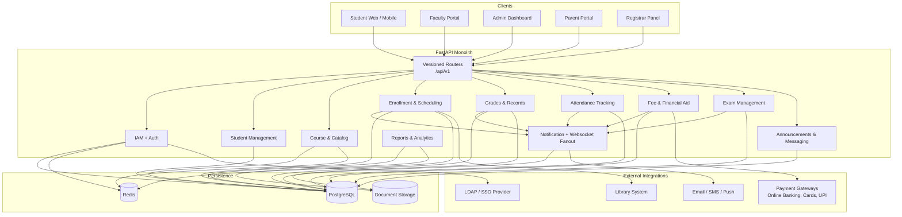
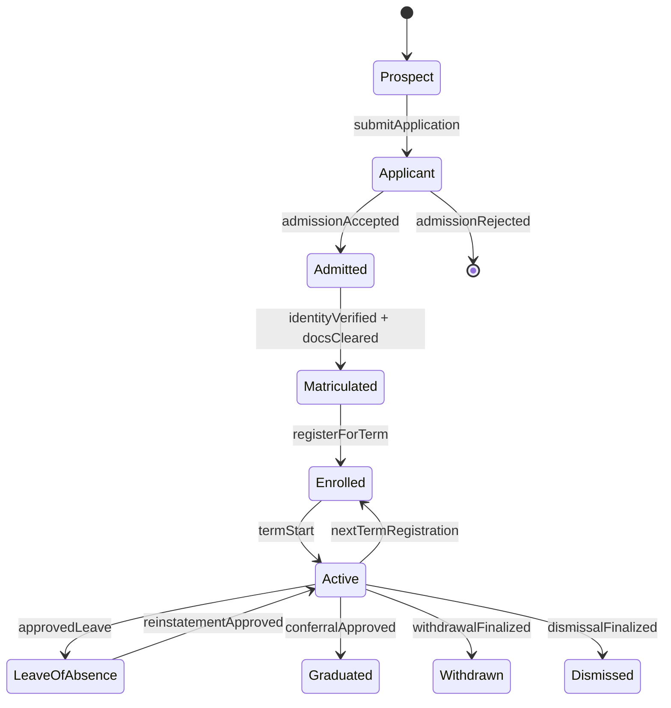
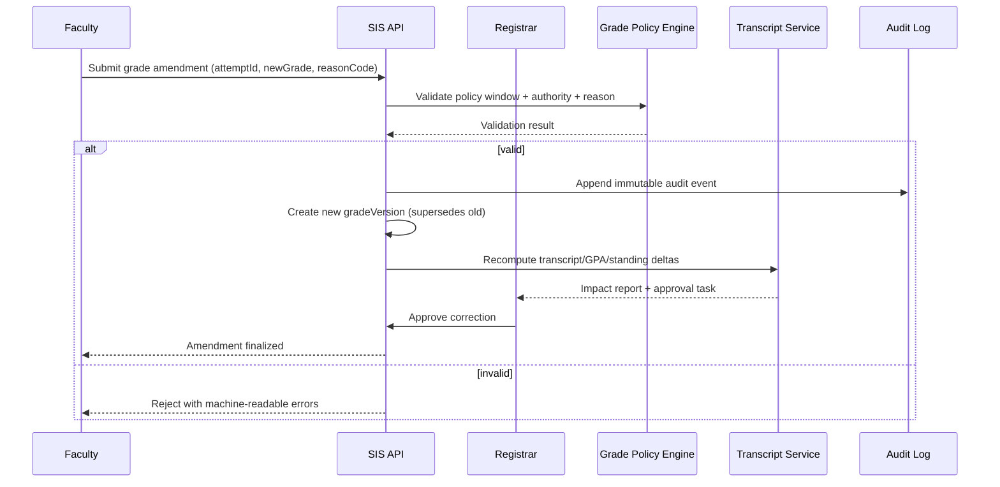
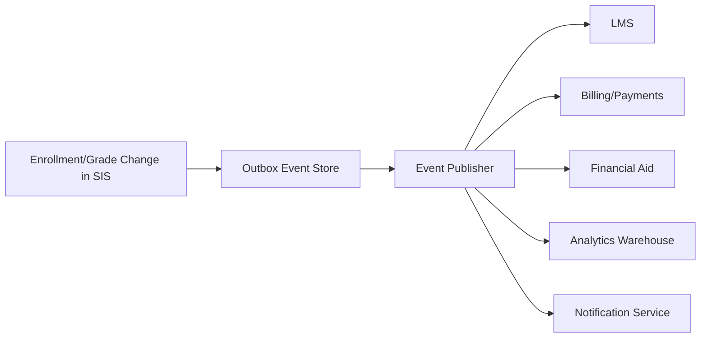

# API Design

## Overview
This document describes the Student Information System (SIS) backend API. The system is a FastAPI monolith with versioned routers under `/api/v1`, JWT-based authentication, SSO/LDAP integration, and async notifications.

---

## API Architecture

---

## API Conventions

| Convention | Behavior |
|-----------|----------|
| Versioning | All routes under `/api/v1` |
| Authentication | JWT bearer tokens; SSO/LDAP integration for institutional accounts |
| Authorization | Role-based access control per endpoint |
| Idempotency | Fee payment and enrollment mutations support idempotency keys |
| Notifications | Grade publication, attendance alerts, fee reminders, and exam events create persisted notifications and websocket events |

---

## Authentication API

### Endpoints

| Method | Endpoint | Description |
|--------|----------|-------------|
| POST | `/auth/signup` | Register a new user account |
| POST | `/auth/login` | Login with credentials |
| POST | `/auth/sso` | SSO/LDAP authentication |
| POST | `/auth/logout` | Logout current session |
| POST | `/auth/refresh` | Refresh access token |
| POST | `/auth/otp/enable` | Start OTP setup |
| POST | `/auth/otp/verify` | Verify OTP and enable |
| POST | `/auth/otp/disable` | Disable OTP |
| POST | `/auth/password/reset` | Request password reset |

---

## Student API

### Endpoints

| Method | Endpoint | Description |
|--------|----------|-------------|
| GET | `/students/me` | Get authenticated student profile |
| PATCH | `/students/me` | Update student profile |
| GET | `/students/me/enrollments` | List current and past enrollments |
| GET | `/students/me/grades` | Get all grades with GPA summary |
| GET | `/students/me/gpa` | Get CGPA and semester-wise GPA |
| GET | `/students/me/attendance` | Get attendance records across courses |
| GET | `/students/me/degree-audit` | Get degree audit report |
| GET | `/students/me/timetable` | Get current semester timetable |
| POST | `/students/me/guardian` | Link parent/guardian account |
| GET | `/admin/students` | List all students (admin only) |
| GET | `/admin/students/{id}` | Get student details (admin/registrar) |
| PATCH | `/admin/students/{id}/status` | Update student status |

---

## Course and Enrollment API

### Endpoints

| Method | Endpoint | Description |
|--------|----------|-------------|
| GET | `/courses` | List course catalog with filters |
| GET | `/courses/{id}` | Get course details including prerequisites |
| GET | `/courses/{id}/sections` | List sections for a course |
| GET | `/sections/{id}` | Get section details including schedule |
| POST | `/enrollments` | Enroll in a course section |
| DELETE | `/enrollments/{id}` | Drop an enrolled course |
| GET | `/enrollments` | List student's enrollments |
| POST | `/waitlists` | Join waitlist for a full section |
| DELETE | `/waitlists/{id}` | Leave waitlist |
| GET | `/enrollment-windows` | Get current enrollment window status |
| POST | `/admin/courses` | Create a new course |
| PATCH | `/admin/courses/{id}` | Update course |
| POST | `/admin/sections` | Create a course section |
| PATCH | `/admin/sections/{id}` | Update section |
| POST | `/admin/enrollment-windows` | Open or close enrollment window |

### Course Query Parameters

| Parameter | Type | Description |
|-----------|------|-------------|
| `q` | string | Search by course name or code |
| `department` | string | Filter by department |
| `semester` | integer | Filter by semester |
| `credits` | integer | Filter by credit hours |
| `level` | string | Filter by course level |
| `available` | boolean | Filter sections with available seats |

---

## Grades and Academic Records API

### Endpoints

| Method | Endpoint | Description |
|--------|----------|-------------|
| GET | `/faculty/courses/{section_id}/grades` | Get grade sheet for a section |
| POST | `/faculty/courses/{section_id}/grades` | Bulk submit grades |
| PATCH | `/faculty/grades/{grade_id}` | Update a single grade |
| POST | `/faculty/grades/{grade_id}/submit` | Submit grades for registrar review |
| POST | `/faculty/grades/{grade_id}/amend` | Request grade amendment |
| GET | `/registrar/grades/pending` | List grade sheets pending review |
| POST | `/registrar/grades/{section_id}/publish` | Publish approved grades |
| POST | `/registrar/grade-amendments/{id}/approve` | Approve grade amendment |
| POST | `/registrar/grade-amendments/{id}/reject` | Reject grade amendment |
| GET | `/students/me/transcripts` | List transcript requests |
| POST | `/students/me/transcripts` | Submit transcript request |
| GET | `/students/me/transcripts/{id}` | Get transcript download URL |
| POST | `/registrar/transcripts/{id}/issue` | Issue official transcript |

---

## Attendance API

### Endpoints

| Method | Endpoint | Description |
|--------|----------|-------------|
| GET | `/faculty/courses/{section_id}/sessions` | List attendance sessions |
| POST | `/faculty/courses/{section_id}/sessions` | Create a new session |
| POST | `/faculty/sessions/{session_id}/attendance` | Mark attendance for session |
| GET | `/faculty/sessions/{session_id}/attendance` | Get attendance for a session |
| GET | `/faculty/courses/{section_id}/attendance-summary` | Attendance summary by student |
| GET | `/students/me/attendance` | Student's attendance records |
| POST | `/students/me/leaves` | Submit leave application |
| GET | `/students/me/leaves` | List leave applications |
| GET | `/faculty/leaves/pending` | Faculty: list pending leave requests |
| POST | `/faculty/leaves/{id}/approve` | Approve leave request |
| POST | `/faculty/leaves/{id}/reject` | Reject leave request |

---

## Fee Management API

### Endpoints

| Method | Endpoint | Description |
|--------|----------|-------------|
| GET | `/students/me/invoices` | List fee invoices |
| GET | `/students/me/invoices/{id}` | Get invoice details |
| POST | `/fees/payments/initiate` | Initiate fee payment |
| POST | `/fees/payments/verify` | Verify payment after gateway callback |
| GET | `/fees/payments/{id}` | Get payment status |
| POST | `/fees/payments/webhooks/{gateway}` | Payment gateway webhook |
| GET | `/students/me/invoices/{id}/receipt` | Download payment receipt |
| GET | `/aid-programs` | List available financial aid programs |
| POST | `/aid-applications` | Submit financial aid application |
| GET | `/aid-applications/{id}` | Get aid application status |
| GET | `/admin/aid-applications/pending` | List pending aid applications |
| POST | `/admin/aid-applications/{id}/approve` | Approve financial aid |
| POST | `/admin/aid-applications/{id}/reject` | Reject financial aid |
| GET | `/admin/fees/collection-report` | View fee collection report |
| POST | `/admin/fee-structures` | Create fee structure |

---

## Exam Management API

### Endpoints

| Method | Endpoint | Description |
|--------|----------|-------------|
| GET | `/exams` | List upcoming exams for authenticated user |
| GET | `/exams/{id}` | Get exam details |
| GET | `/students/me/hall-tickets` | List hall tickets |
| GET | `/students/me/hall-tickets/{id}` | Download hall ticket |
| POST | `/admin/exams` | Create exam schedule |
| PATCH | `/admin/exams/{id}` | Update exam details |
| POST | `/admin/exams/{id}/publish` | Publish exam schedule |
| POST | `/admin/exams/{id}/allocate-halls` | Generate hall and seat allocations |

---

## Reporting and Analytics API

### Endpoints

| Method | Endpoint | Description |
|--------|----------|-------------|
| GET | `/admin/dashboard` | Institution-wide KPI dashboard |
| GET | `/admin/reports/enrollment` | Enrollment statistics report |
| GET | `/admin/reports/grades` | Grade distribution report |
| GET | `/admin/reports/attendance` | Attendance summary report |
| GET | `/admin/reports/fees` | Fee collection report |
| POST | `/admin/reports/export` | Export report to CSV/PDF |
| GET | `/faculty/reports/course/{section_id}` | Course performance report |

---

## Cross-Cutting Behavior

### Notifications

The system emits persisted notifications and websocket events automatically for:

- Student enrollment confirmed, dropped, or waitlisted
- Grade published or amended
- Attendance below threshold (warning and critical)
- Fee invoice generated and payment received
- Transcript issued
- Exam schedule published and hall ticket ready
- Financial aid application approved or rejected
- Leave application approved or rejected

### Role-Based Access

| Role | API Access Scope |
|------|-----------------|
| Student | Own profile, enrollments, grades, attendance, fees, transcripts |
| Parent | Read-only access to linked student's grades, attendance, fees |
| Faculty | Assigned courses, grade entry, attendance marking, leave approvals |
| Academic Advisor | Assigned students, enrollment overrides, improvement plans |
| Admin Staff | All management endpoints, user and course administration |
| Registrar | Grade publication, transcript issuance, graduation management |

## Enrollment, Academic Integrity, Access Control, and Integration Contracts (Implementation-Ready)

### 1) Enrollment Lifecycle Rules (Authoritative)

#### 1.1 Lifecycle States and Transitions
| State | Entry Criteria | Exit Criteria | Allowed Actors | Terminal? |
|---|---|---|---|---|
| Prospect | Lead captured or inquiry created | Application submitted | Admissions CRM, Applicant | No |
| Applicant | Complete application + required docs | Admitted or Rejected | Applicant, Admissions Officer | No |
| Admitted | Admission decision = accepted | Matriculated or Offer Expired | Admissions, Registrar | No |
| Matriculated | Identity + eligibility checks passed | Enrolled for a term | Registrar | No |
| Enrolled (Term-Scoped) | Registered in >=1 credit-bearing section | Dropped all sections, Term Completed | Student, Advisor, Registrar | No |
| Active (Institution-Scoped) | Student is not graduated/withdrawn/dismissed | Graduated, Withdrawn, Dismissed | SIS policy engine | No |
| Leave of Absence | Approved leave request in valid window | Reinstated, Withdrawn, Dismissed | Student, Advisor, Registrar | No |
| Graduated | Degree audit complete + conferral approved | N/A | Registrar | Yes |
| Withdrawn | Approved withdrawal workflow complete | Reinstated (rare policy path) | Student, Registrar | Yes* |
| Dismissed | Policy or disciplinary action finalized | Reinstated by exception | Registrar, Academic Board | Yes* |

> *Terminal under normal policy; reinstatement requires exceptional workflow and two-party approval (advisor + registrar/board).

#### 1.2 Deterministic State Machine

#### 1.3 Enrollment/Registration Enforcement Rules
- **EL-001 Window Governance:** add/drop/withdraw windows are configured per term, program, and campus timezone; requests outside windows require override reason code.
- **EL-002 Seat Allocation:** seat release follows deterministic priority `(cohortPriority DESC, waitlistTimestamp ASC, randomTieBreakerSeed ASC)`.
- **EL-003 Prerequisite Resolution:** prerequisite checks run against canonical attempt history with in-progress and transfer-credit handling flags.
- **EL-004 Conflict Detection:** section enrollment is rejected if timetable overlap, credit overload, hold, or missing approval constraints fail.
- **EL-005 Downstream Consistency:** enrollment state changes emit events for LMS roster sync, fee recalculation, attendance eligibility, and aid re-evaluation.
- **EL-006 Re-Enrollment Gate:** reinstatement requires cleared financial/disciplinary holds and advisor + registrar approvals.

### 2) Grading and Transcript Consistency Constraints

#### 2.1 Grade Lifecycle and Versioning
- **GC-001 Immutable Posting:** once a grade version is `POSTED`, it is immutable.
- **GC-002 Amendment Model:** corrections create a new version linked by `supersedesGradeVersionId`; no in-place edits.
- **GC-003 Reason Codes:** every amendment must provide standardized reason (`CALCULATION_ERROR`, `LATE_SUBMISSION_APPROVED`, `INCOMPLETE_RESOLUTION`, etc.).
- **GC-004 Effective Dating:** transcript rendering always uses latest `effective=true` grade version at render time.

#### 2.2 Canonical Consistency Rules
| Rule ID | Constraint | Failure Handling |
|---|---|---|
| TR-001 | Transcript rows derive only from canonical course-attempt + grade-version records | Block issuance and raise registrar task |
| TR-002 | GPA/CGPA computed from policy-bound grade points and repeat/forgiveness rules | Recompute job queued; stale cache invalidated |
| TR-003 | Standing/honors/SAP updates run after each posted or amended grade event | Trigger synchronous policy check + async reconciliation |
| TR-004 | Official transcript issuance requires registrar sign-off + tamper-evident hash | Refuse release if signature or hash missing |
| TR-005 | Retroactive grade changes require impact statements (prereq, audit, aid, standing) | Hold change in `PENDING_IMPACT_REVIEW` |

#### 2.3 Grade Correction Sequence (Required)

### 3) Role-Based Access Specifics (RBAC + ABAC)

#### 3.1 Access Model
- **RBAC baseline** grants capability by role.
- **ABAC overlays** constrain by context attributes: campus, department, term, section assignment, advisee linkage, data sensitivity, legal hold.
- **Break-glass access** is time-bound, ticket-linked, and dual-approved.

#### 3.2 Permission Matrix (Minimum Required)
| Capability | Student | Faculty | Advisor | Registrar/Admin | Notes |
|---|---:|---:|---:|---:|---|
| View own transcript | ✅ | ❌ | ❌ | ✅ | Student self-service allowed |
| Submit final grades | ❌ | ✅* | ❌ | ✅ | *Assigned sections + open window only |
| Amend posted grade | ❌ | Request | ❌ | ✅ | Registrar finalizes amendments |
| Approve overload/waiver petition | ❌ | ❌ | ✅ | ✅ | Program-scoped |
| Release official transcript | ❌ | ❌ | ❌ | ✅ | Requires digital signature policy |
| View disciplinary records | Limited | ❌ | Limited | Scoped | Enhanced logging required |

#### 3.3 Security and Audit Controls
- **AC-001** least privilege defaults; deny-by-default policy on all privileged endpoints.
- **AC-002** MFA required for registrar/admin and any user performing grade or transcript actions.
- **AC-003** field-level masking for PII/financial attributes in UI, exports, and logs.
- **AC-004** all read/write of sensitive records generate audit events with `actorId`, `scope`, `justification`, `requestId`.
- **AC-005** periodic entitlement recertification (at least once per term).

### 4) Integration Contracts for External Systems

#### 4.1 Contract-First Standards
- APIs must publish OpenAPI/AsyncAPI artifacts with JSON Schema references and semantic versions.
- Breaking changes require version increment and migration window policy.
- Event contracts are backward-compatible for at least one full term unless emergency exception approved.

#### 4.2 External Integration Surface
| System | Direction | Contract Type | SLA/SLO | Idempotency Key |
|---|---|---|---|---|
| LMS | Bi-directional | REST + Events | Roster sync < 5 min | `termId:sectionId:studentId:eventType` |
| IdP/SSO | Inbound auth + outbound provisioning | SAML/OIDC + SCIM | Login p95 < 2s | `provisioningRequestId` |
| Payment Gateway | Outbound payment + inbound webhook | REST + Signed Webhooks | Payment callback < 60s | `invoiceId:attemptNo` |
| Financial Aid | Bi-directional | REST + Batch SFTP (optional) | Aid status < 15 min | `aidApplicationId:termId` |
| Library | Bi-directional | REST | Borrowing status < 10 min | `studentId:loanId:eventType` |
| Regulatory Reporting | Outbound | Secure file/API | Deadline-bound batch | `reportPeriod:studentId:recordType` |

#### 4.3 Event Contract Baseline

Required event metadata fields:
- `eventId`, `eventType`, `schemaVersion`, `occurredAt`, `sourceSystem`, `correlationId`, `idempotencyKey`
- domain IDs: `studentId`, `termId`, `courseOfferingId`, `attemptId`, `gradeVersionId` (as applicable)

#### 4.4 Reliability, Security, and Drift Controls
- **IC-001** retries use exponential backoff + jitter; dead-letter queues mandatory.
- **IC-002** all webhook callbacks must be signed and timestamp-validated.
- **IC-003** encryption in transit (TLS 1.2+) and at rest for replicated payload stores.
- **IC-004** contract tests + sandbox certification are release gates for enrollment/grade/transcript/billing changes.
- **IC-005** schema drift detection runs continuously and blocks incompatible deploys.

### 5) Operational Readiness and Acceptance Criteria

#### 5.1 Observability and SLOs
- Enrollment action API p95 latency <= 400ms during peak registration.
- Grade posting-to-transcript consistency <= 2 minutes (p99).
- LMS roster propagation <= 5 minutes (p99).
- Audit event durability >= 99.999% persisted write success.

#### 5.2 Data Retention and Compliance
- Grade versions and transcript issuance records are retained per institutional and statutory policy (minimum 7 years where applicable).
- Audit logs for sensitive operations retained in immutable storage tier with legal hold support.
- Data subject access/deletion requests must preserve legally required academic records with redaction-by-policy.

#### 5.3 Implementation-Ready Test Scenarios
1. Waitlist promotion tie-breaker determinism under concurrent seat release.
2. Retroactive grade correction impact on prerequisites and degree audit.
3. Unauthorized faculty grade amendment blocked with explicit error code.
4. Payment webhook replay handled idempotently without duplicate ledger entries.
5. Transcript signature/hash verification fails on tampered artifact.
6. Re-enrollment blocked when financial hold exists; succeeds after hold clearance.

