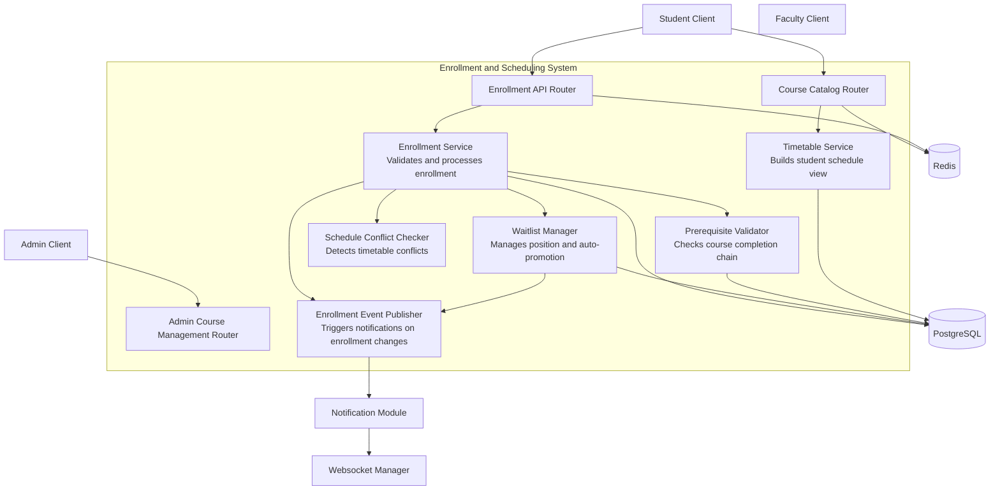
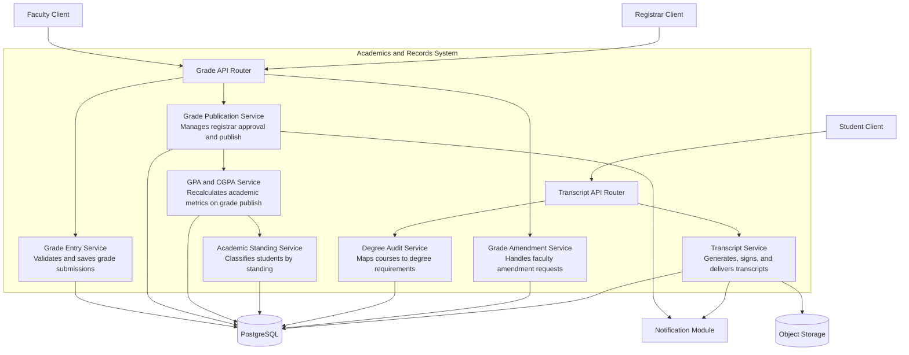
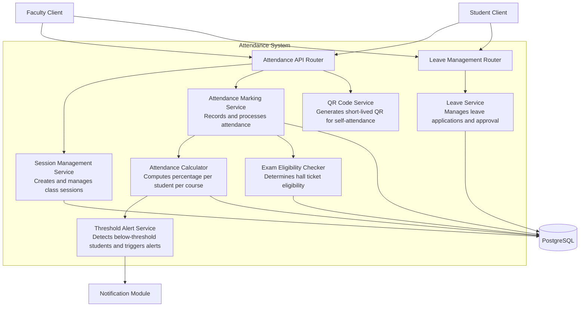
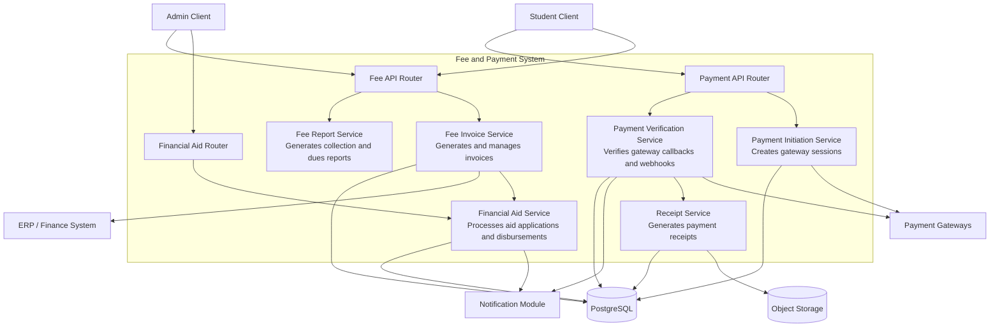

# C4 Component Diagram

## Overview
Detailed C4 Level 3 component diagrams for core subsystems of the Student Information System.

---

## C4 Component Diagram - Enrollment and Scheduling Core

---

## C4 Component Diagram - Academics and Records

---

## C4 Component Diagram - Attendance System

---

## C4 Component Diagram - Fee and Payment System

