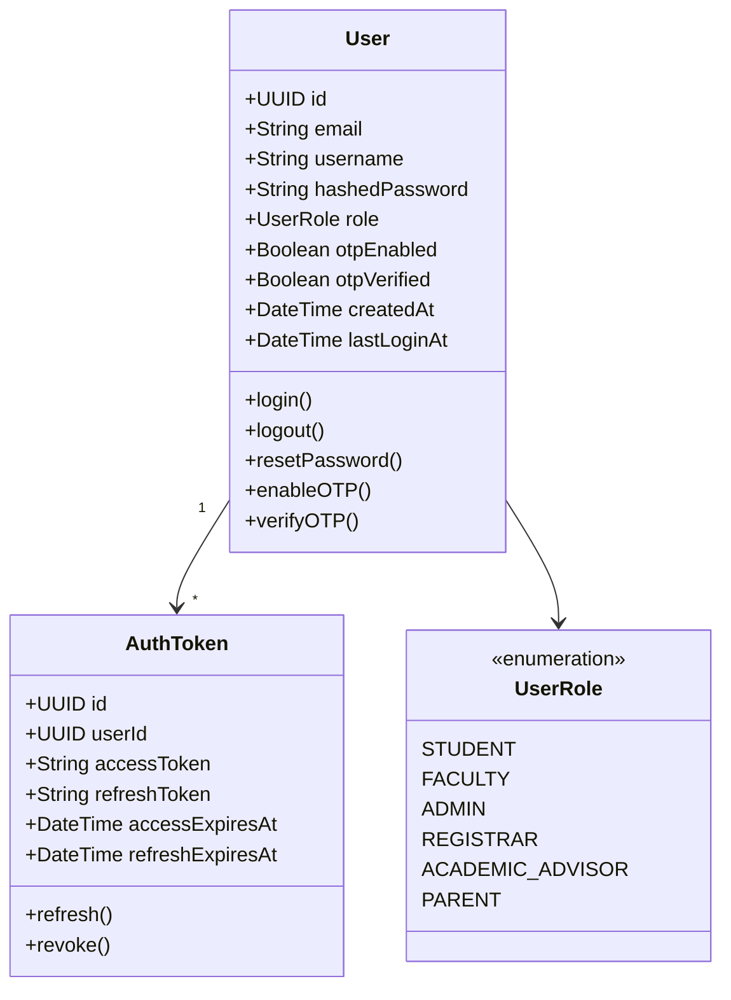
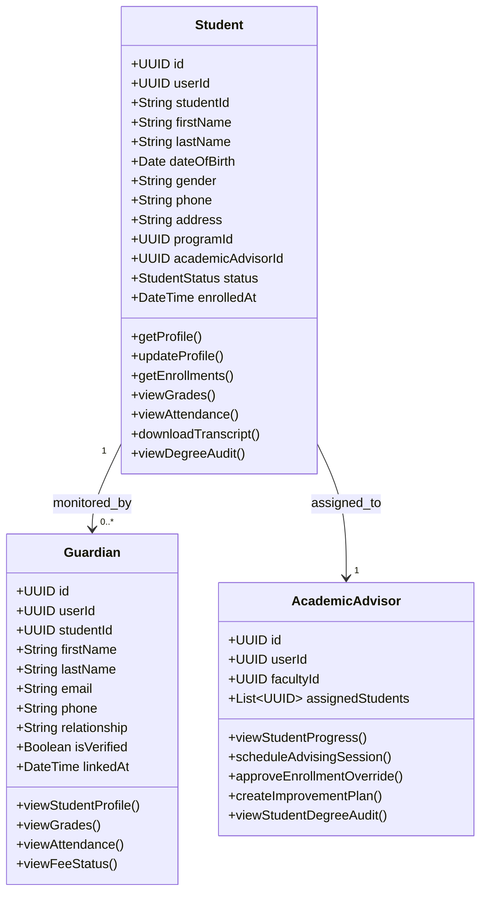
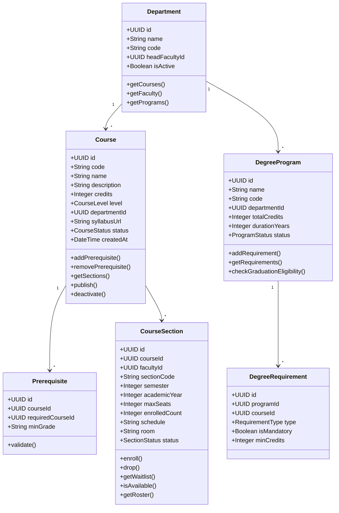
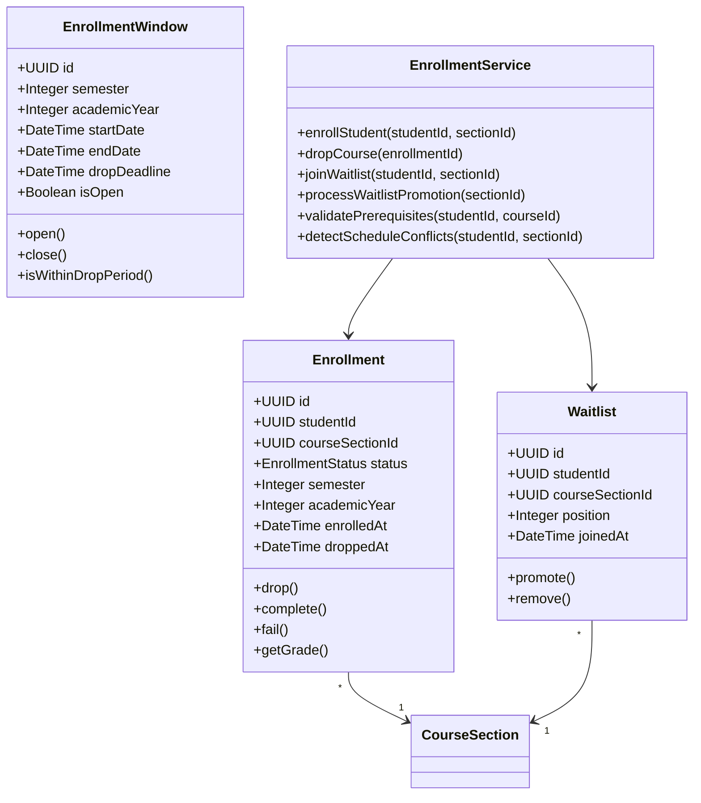
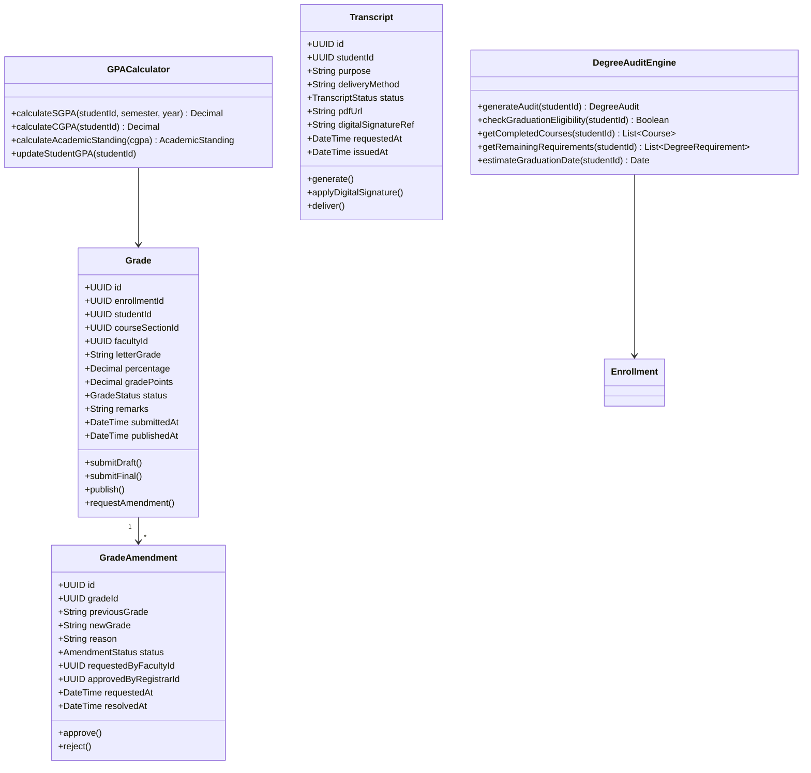
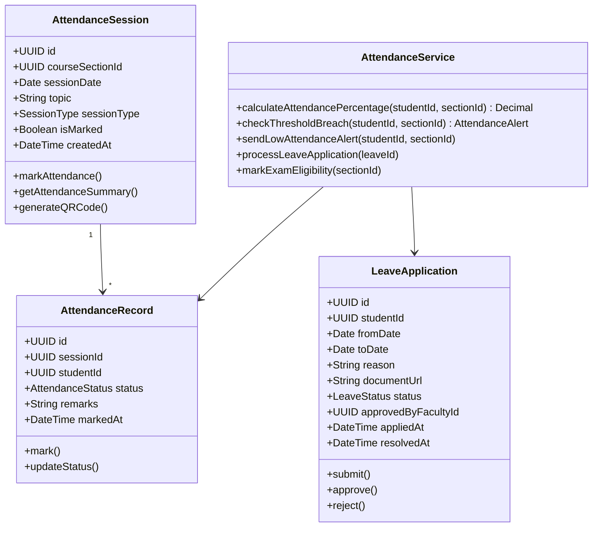
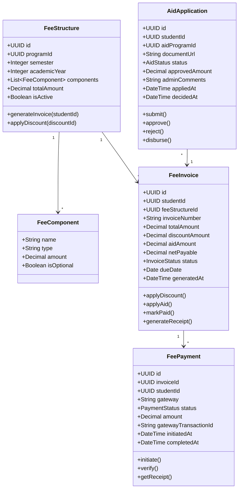

# Class Diagrams

## Overview
Detailed class diagrams for all major domain modules in the Student Information System.

---

## User and Authentication Classes

---

## Student Management Classes

---

## Course and Curriculum Classes

---

## Enrollment Classes

---

## Grade Management Classes

---

## Attendance Classes

---

## Fee Management Classes

