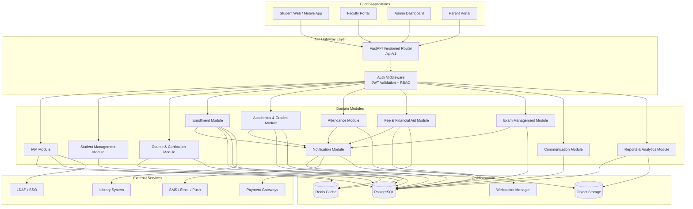
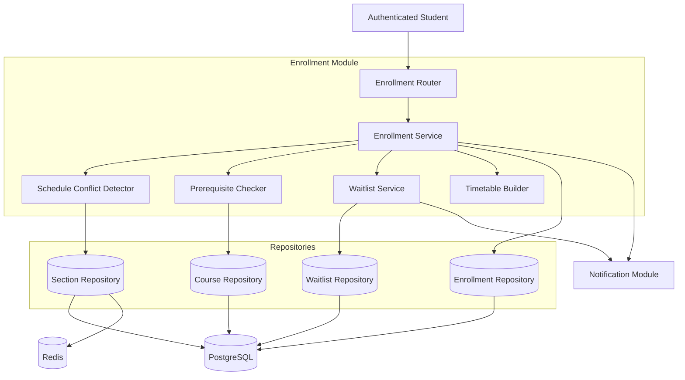
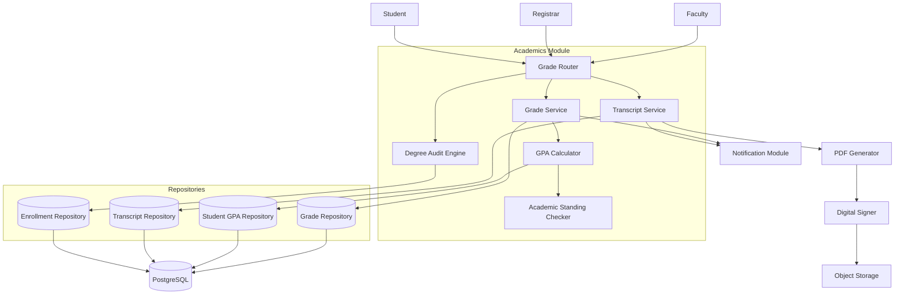
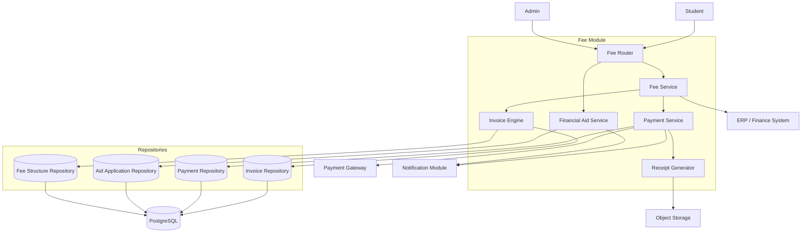

# Component Diagrams

## Overview
Component diagrams showing the software module structure and dependencies within the Student Information System.

---

## Overall System Component Diagram

---

## Enrollment Module Component Diagram

---

## Academic Records Module Component Diagram

---

## Fee and Financial Aid Module Component Diagram

