# ERD / Database Schema

## Overview
This ERD reflects the database design for the Student Information System, covering student records, courses, enrollment, grades, attendance, fees, exams, and communication.

---

## Full Database ERD

```mermaid
erDiagram
    users {
        int id PK
        varchar email
        varchar username
        varchar hashed_password
        varchar role
        boolean otp_enabled
        boolean otp_verified
        datetime created_at
        datetime updated_at
    }

    students {
        int id PK
        int user_id FK
        varchar student_id
        varchar first_name
        varchar last_name
        date date_of_birth
        varchar gender
        varchar phone
        text address
        int program_id FK
        int academic_advisor_id FK
        varchar status
        datetime enrolled_at
    }

    guardians {
        int id PK
        int student_id FK
        varchar first_name
        varchar last_name
        varchar email
        varchar phone
        varchar relationship
        boolean is_verified
        datetime linked_at
    }

    faculty {
        int id PK
        int user_id FK
        varchar first_name
        varchar last_name
        varchar employee_id
        int department_id FK
        varchar designation
        varchar qualification
        varchar specialization
        varchar office_hours
        datetime joined_at
    }

    departments {
        int id PK
        varchar name
        varchar code
        int head_faculty_id FK
        boolean is_active
    }

    degree_programs {
        int id PK
        varchar name
        varchar code
        int department_id FK
        int total_credits
        int duration_years
        varchar status
    }

    degree_requirements {
        int id PK
        int program_id FK
        int course_id FK
        varchar requirement_type
        boolean is_mandatory
        int min_credits
    }

    courses {
        int id PK
        varchar code
        varchar name
        text description
        int credits
        varchar level
        int department_id FK
        varchar syllabus_url
        varchar status
        datetime created_at
    }

    course_prerequisites {
        int id PK
        int course_id FK
        int required_course_id FK
        varchar min_grade
    }

    course_sections {
        int id PK
        int course_id FK
        int faculty_id FK
        varchar section_code
        int semester
        int academic_year
        int max_seats
        int enrolled_count
        varchar schedule
        varchar room
        varchar status
    }

    enrollment_windows {
        int id PK
        int semester
        int academic_year
        datetime start_date
        datetime end_date
        datetime drop_deadline
        boolean is_open
    }

    enrollments {
        int id PK
        int student_id FK
        int course_section_id FK
        varchar status
        int semester
        int academic_year
        datetime enrolled_at
        datetime dropped_at
    }

    waitlists {
        int id PK
        int student_id FK
        int course_section_id FK
        int position
        datetime joined_at
    }

    grades {
        int id PK
        int enrollment_id FK
        int student_id FK
        int course_section_id FK
        int faculty_id FK
        varchar letter_grade
        decimal percentage
        decimal grade_points
        varchar status
        text remarks
        datetime submitted_at
        datetime published_at
    }

    grade_amendments {
        int id PK
        int grade_id FK
        varchar previous_grade
        varchar new_grade
        text reason
        varchar status
        int requested_by_faculty_id FK
        int approved_by_registrar_id FK
        datetime requested_at
        datetime resolved_at
    }

    student_gpas {
        int id PK
        int student_id FK
        int semester
        int academic_year
        decimal sgpa
        decimal cgpa
        varchar academic_standing
        datetime calculated_at
    }

    attendance_sessions {
        int id PK
        int course_section_id FK
        date session_date
        varchar topic
        varchar session_type
        boolean is_marked
        datetime created_at
    }

    attendance_records {
        int id PK
        int session_id FK
        int student_id FK
        varchar status
        text remarks
        datetime marked_at
    }

    leave_applications {
        int id PK
        int student_id FK
        date from_date
        date to_date
        text reason
        varchar document_url
        varchar status
        int approved_by_faculty_id FK
        datetime applied_at
        datetime resolved_at
    }

    fee_structures {
        int id PK
        int program_id FK
        int semester
        int academic_year
        decimal total_amount
        json components_json
        boolean is_active
    }

    fee_invoices {
        int id PK
        int student_id FK
        int fee_structure_id FK
        varchar invoice_number
        decimal total_amount
        decimal discount_amount
        decimal aid_amount
        decimal net_payable
        varchar status
        date due_date
        datetime generated_at
    }

    payments {
        int id PK
        int invoice_id FK
        int student_id FK
        varchar gateway
        varchar status
        decimal amount
        varchar gateway_transaction_id
        datetime initiated_at
        datetime completed_at
    }

    aid_programs {
        int id PK
        varchar name
        varchar type
        text criteria
        decimal max_amount
        boolean is_active
    }

    aid_applications {
        int id PK
        int student_id FK
        int aid_program_id FK
        varchar document_url
        varchar status
        decimal approved_amount
        text admin_comments
        datetime applied_at
        datetime decided_at
    }

    transcripts {
        int id PK
        int student_id FK
        varchar purpose
        varchar delivery_method
        varchar status
        varchar pdf_url
        varchar digital_signature_ref
        datetime requested_at
        datetime issued_at
    }

    exams {
        int id PK
        int course_section_id FK
        varchar exam_type
        date exam_date
        varchar start_time
        varchar end_time
        varchar room
        varchar status
        datetime created_at
    }

    exam_hall_allocations {
        int id PK
        int exam_id FK
        int student_id FK
        varchar hall
        varchar seat_number
        datetime allocated_at
    }

    hall_tickets {
        int id PK
        int student_id FK
        int exam_id FK
        varchar ticket_url
        boolean is_eligible
        datetime generated_at
    }

    announcements {
        int id PK
        int created_by_user_id FK
        varchar title
        text body
        varchar target_group
        varchar category
        boolean is_published
        datetime published_at
    }

    messages {
        int id PK
        int sender_id FK
        int recipient_id FK
        text body
        boolean is_read
        datetime sent_at
    }

    notifications {
        int id PK
        int user_id FK
        varchar event_type
        varchar title
        text body
        boolean is_read
        json payload_json
        datetime created_at
    }

    users ||--o{ students : has
    users ||--o{ faculty : is
    students ||--o{ guardians : monitored_by
    students }o--|| degree_programs : enrolled_in
    students }o--o| faculty : advised_by

    departments ||--o{ courses : offers
    departments ||--o{ degree_programs : owns
    departments ||--o{ faculty : employs

    courses ||--o{ course_prerequisites : requires
    courses ||--o{ course_sections : has
    degree_programs ||--o{ degree_requirements : specifies

    course_sections ||--o{ enrollments : contains
    course_sections ||--o{ waitlists : has
    course_sections ||--o{ attendance_sessions : generates
    course_sections ||--o{ exams : has

    enrollments ||--o{ grades : produces
    grades ||--o{ grade_amendments : amended_by

    students ||--o{ student_gpas : tracks
    students ||--o{ transcripts : requests
    students ||--o{ leave_applications : submits
    students ||--o{ attendance_records : has
    students ||--o{ fee_invoices : billed
    students ||--o{ aid_applications : applies

    attendance_sessions ||--o{ attendance_records : records

    fee_structures ||--o{ fee_invoices : generates
    fee_invoices ||--o{ payments : paid_by
    aid_programs ||--o{ aid_applications : receives

    exams ||--o{ exam_hall_allocations : allocates
    exams ||--o{ hall_tickets : issues
```

---

## Key Design Notes

| Area | Design Decision |
|------|----------------|
| User identity | Single `users` table with role-based separation into `students` and `faculty` |
| Enrollment | Tracks semester and year for historical records |
| Grades | Separate `grade_amendments` table with registrar approval workflow |
| GPA | Pre-calculated and stored in `student_gpas` for performance; recalculated on grade publish |
| Attendance | Session-level granularity supports per-session tracking and leave matching |
| Fees | JSON `components_json` in fee structure supports flexible fee component definitions |
| Transcripts | PDF stored in object storage; reference URL and signature stored in DB |
| Notifications | Persisted in `notifications` table for inbox and websocket fanout |

## Implementation-Ready Addendum for Erd Database Schema

### Purpose in This Artifact
Adds unique keys, FK rules, and audit trail retention columns.

### Scope Focus
- Schema constraints and indexes
- Enrollment lifecycle enforcement relevant to this artifact
- Grading/transcript consistency constraints relevant to this artifact
- Role-based and integration concerns at this layer

#### Implementation Rules
- Enrollment lifecycle operations must emit auditable events with correlation IDs and actor scope.
- Grade and transcript actions must preserve immutability through versioned records; no destructive updates.
- RBAC must be combined with context constraints (term, department, assigned section, advisee).
- External integrations must remain contract-first with explicit versioning and backward-compatibility strategy.

#### Acceptance Criteria
1. Business rules are testable and mapped to policy IDs in this artifact.
2. Failure paths (authorization, policy window, downstream sync) are explicitly documented.
3. Data ownership and source-of-truth boundaries are clearly identified.
4. Diagram and narrative remain consistent for the scenarios covered in this file.

