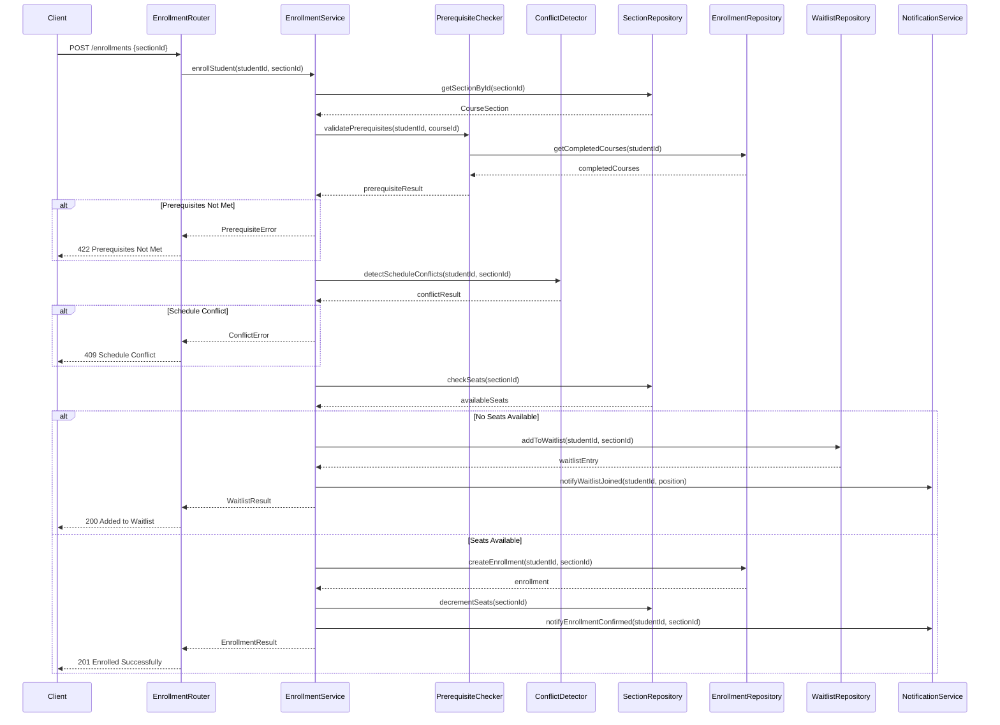
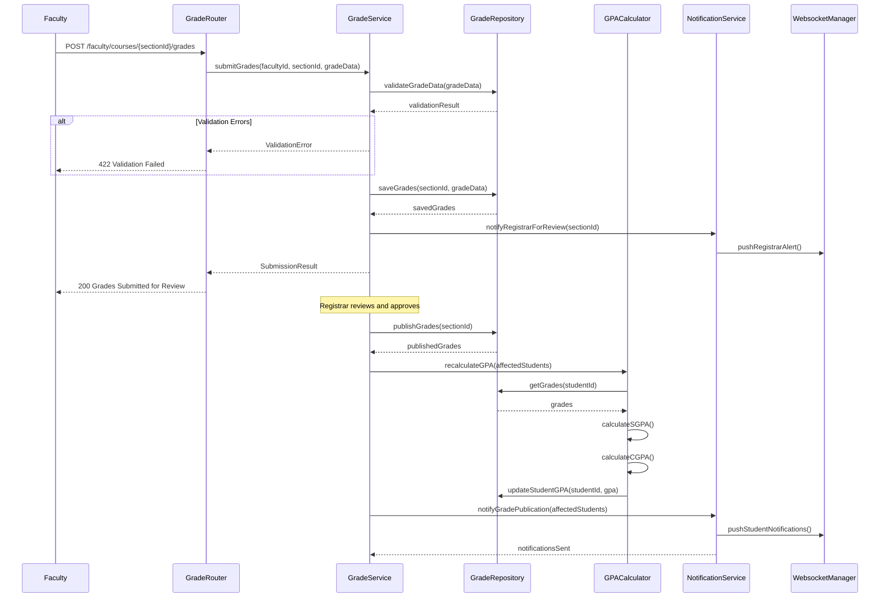
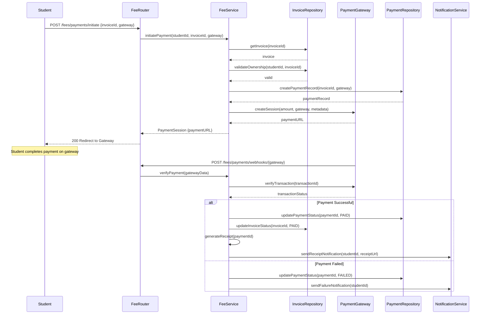
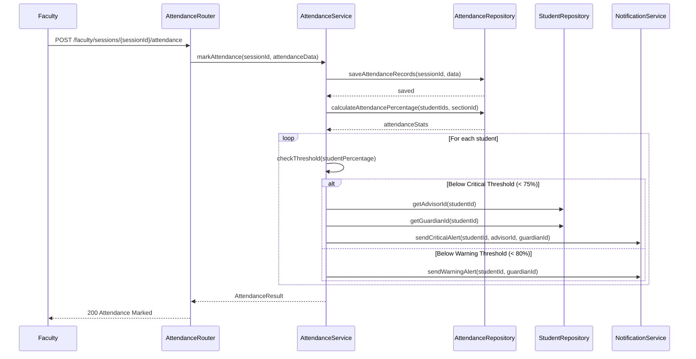
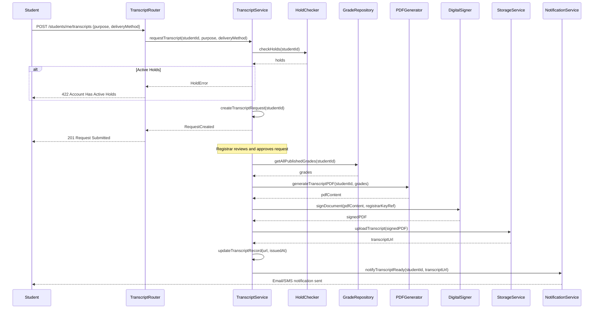

# Sequence Diagrams

## Overview
Detailed internal sequence diagrams showing object interactions within the Student Information System for key operations.

---

## Course Enrollment Internal Sequence

---

## Grade Submission Internal Sequence

---

## Fee Payment Internal Sequence

---

## Attendance Alert Internal Sequence

---

## Transcript Generation Internal Sequence

