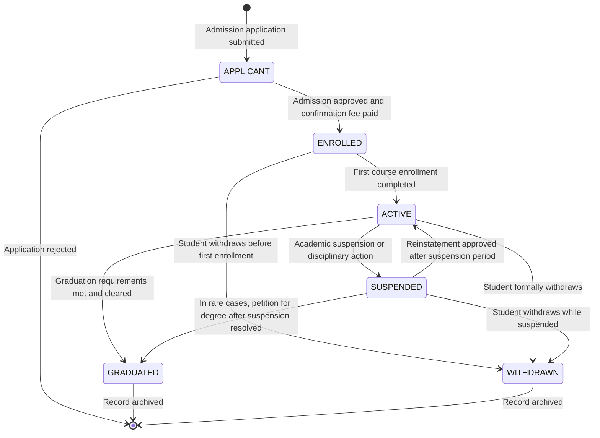
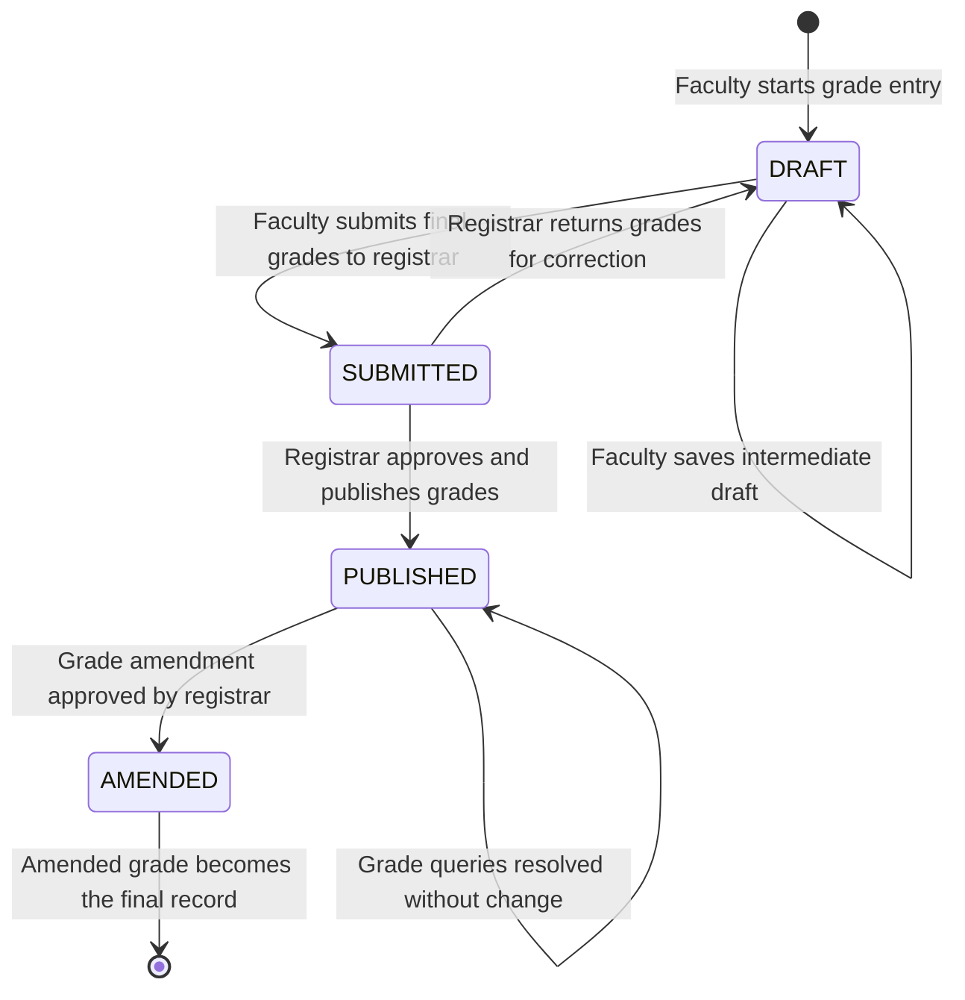
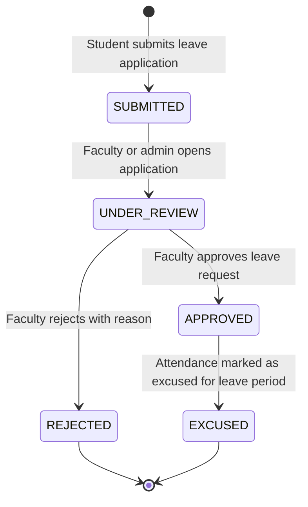
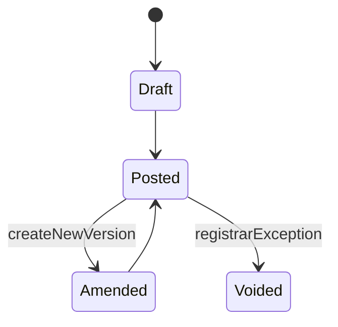

# State Machine Diagrams

## Overview
State machine diagrams showing the lifecycle and state transitions for key entities in the Student Information System.

---

## Student Status State Machine



---

## Enrollment Status State Machine

```mermaid
stateDiagram-v2
    [*] --> PENDING : Student submits enrollment request

    PENDING --> ENROLLED : Enrollment validated (prerequisites met, seat available, no conflict)
    PENDING --> WAITLISTED : Section is full; student joins waitlist
    PENDING --> REJECTED : Validation fails (missing prerequisite, conflict)

    WAITLISTED --> ENROLLED : Seat opens; auto-enrollment triggered
    WAITLISTED --> REMOVED : Student manually removes from waitlist

    ENROLLED --> DROPPED : Student drops course within drop deadline
    ENROLLED --> COMPLETED : Semester ends; student passes course
    ENROLLED --> FAILED : Semester ends; student fails course

    DROPPED --> [*]
    COMPLETED --> [*]
    FAILED --> [*]
    REJECTED --> [*]
    REMOVED --> [*]
```

---

## Grade Status State Machine



---

## Attendance Session State Machine

```mermaid
stateDiagram-v2
    [*] --> SCHEDULED : Session created for a class date

    SCHEDULED --> IN_PROGRESS : Class session begins; faculty opens attendance

    IN_PROGRESS --> MARKED : Faculty submits attendance for all students
    IN_PROGRESS --> CANCELLED : Session cancelled (faculty absent, holiday etc.)

    MARKED --> MARKED : Faculty updates individual attendance record (within allowed window)
    MARKED --> CLOSED : Edit window closes; attendance finalized

    CANCELLED --> [*]
    CLOSED --> [*]
```



---

## Fee Invoice State Machine

```mermaid
stateDiagram-v2
    [*] --> GENERATED : Invoice created at start of semester

    GENERATED --> PENDING : Invoice sent to student; awaiting payment
    GENERATED --> WAIVED : Invoice fully waived by admin

    PENDING --> PARTIALLY_PAID : Partial installment received
    PENDING --> PAID : Full payment received
    PENDING --> OVERDUE : Due date passes without payment

    PARTIALLY_PAID --> PAID : Remaining balance paid
    PARTIALLY_PAID --> OVERDUE : Due date passes with outstanding balance

    OVERDUE --> PAID : Late payment received
    OVERDUE --> WAIVED : Admin waives overdue dues

    PAID --> [*]
    WAIVED --> [*]
```



---

## Transcript Request State Machine

```mermaid
stateDiagram-v2
    [*] --> REQUESTED : Student submits transcript request

    REQUESTED --> ON_HOLD : Active account holds detected
    REQUESTED --> PENDING_REVIEW : No holds; sent to registrar queue

    ON_HOLD --> PENDING_REVIEW : Student resolves all holds

    PENDING_REVIEW --> GENERATING : Registrar approves request
    PENDING_REVIEW --> REJECTED : Registrar rejects request (incomplete records)

    GENERATING --> ISSUED : PDF generated, signed, and delivered

    ISSUED --> [*]
    REJECTED --> [*]
```



---

## Leave Application State Machine



---

## Financial Aid Application State Machine

```mermaid
stateDiagram-v2
    [*] --> SUBMITTED : Student submits financial aid application

    SUBMITTED --> DOCUMENTS_PENDING : Admin requests additional documents
    SUBMITTED --> UNDER_REVIEW : Application complete; admin reviewing

    DOCUMENTS_PENDING --> UNDER_REVIEW : Student uploads requested documents

    UNDER_REVIEW --> APPROVED : Admin approves aid
    UNDER_REVIEW --> REJECTED : Admin rejects with reason

    APPROVED --> DISBURSED : Aid credited to student fee account

    DISBURSED --> [*]
    REJECTED --> [*]
```



## Implementation-Ready Addendum for State Machine Diagrams

### Purpose in This Artifact
Adds legal transitions and forbidden transitions with reason codes.

### Scope Focus
- Formal lifecycle state machines
- Enrollment lifecycle enforcement relevant to this artifact
- Grading/transcript consistency constraints relevant to this artifact
- Role-based and integration concerns at this layer

### Supplemental Mermaid (Artifact-Specific)


#### Implementation Rules
- Enrollment lifecycle operations must emit auditable events with correlation IDs and actor scope.
- Grade and transcript actions must preserve immutability through versioned records; no destructive updates.
- RBAC must be combined with context constraints (term, department, assigned section, advisee).
- External integrations must remain contract-first with explicit versioning and backward-compatibility strategy.

#### Acceptance Criteria
1. Business rules are testable and mapped to policy IDs in this artifact.
2. Failure paths (authorization, policy window, downstream sync) are explicitly documented.
3. Data ownership and source-of-truth boundaries are clearly identified.
4. Diagram and narrative remain consistent for the scenarios covered in this file.

