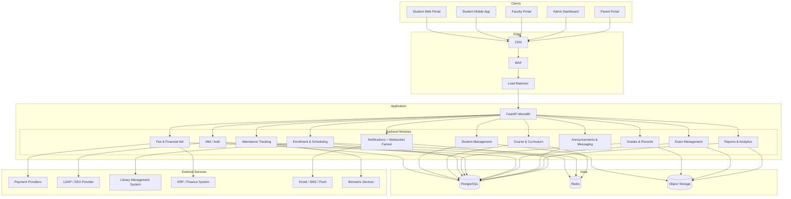
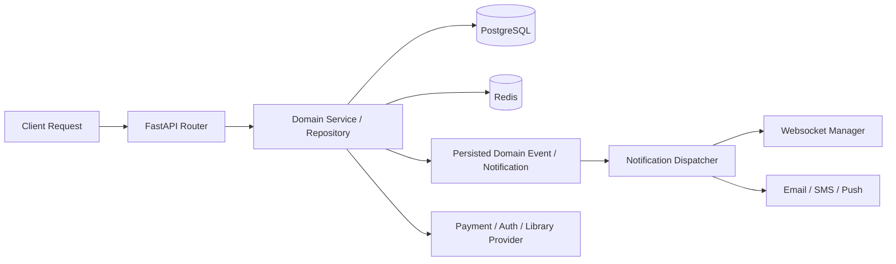

# High-Level Architecture Diagram

## Overview
This document describes the high-level architecture for the Student Information System (SIS). The system is designed as a modular monolith with clear domain boundaries, REST API, async notification tasks, websocket fanout, and integrations with external payment, identity, library, and communication providers.

---

## System Architecture Overview

---

## Runtime Interaction Model

---

## Key Backend Responsibilities

| Module | Main Responsibilities |
|--------|-----------------------|
| IAM | JWT auth, SSO/LDAP integration, OTP, role-based access control |
| Student Management | Student profiles, admission workflow, parent account linking |
| Course & Curriculum | Course catalog, departments, degree programs, prerequisites |
| Enrollment & Scheduling | Course registration, waitlists, timetable generation, conflict detection |
| Grades & Records | Grade entry, GPA/CGPA calculation, academic standing, degree audit |
| Attendance Tracking | Session attendance, biometric integration, leave management, alerts |
| Fee & Financial Aid | Fee structures, invoicing, payment processing, scholarship management |
| Exam Management | Exam scheduling, hall allocation, hall tickets, seating plans |
| Announcements & Messaging | Announcements, internal messaging, event management |
| Reports & Analytics | Enrollment, grade, attendance, and financial reports; dashboards |
| Notifications | Persisted notifications, websocket fanout, email/SMS/push delivery |

---

## Current Design Decisions

- The system is documented as a modular monolith with clear domain module separation
- Authentication supports both local credentials and LDAP/SSO for institutional identity
- Attendance supports both manual marking and biometric/QR-code based automation
- Notification fanout covers grade publication, attendance alerts, fee reminders, and exam events

## Implementation-Ready Addendum for Architecture Diagram

### Purpose in This Artifact
Maps policy engines and eventing components to runtime architecture.

### Scope Focus
- Architecture policy binding
- Enrollment lifecycle enforcement relevant to this artifact
- Grading/transcript consistency constraints relevant to this artifact
- Role-based and integration concerns at this layer

#### Implementation Rules
- Enrollment lifecycle operations must emit auditable events with correlation IDs and actor scope.
- Grade and transcript actions must preserve immutability through versioned records; no destructive updates.
- RBAC must be combined with context constraints (term, department, assigned section, advisee).
- External integrations must remain contract-first with explicit versioning and backward-compatibility strategy.

#### Acceptance Criteria
1. Business rules are testable and mapped to policy IDs in this artifact.
2. Failure paths (authorization, policy window, downstream sync) are explicitly documented.
3. Data ownership and source-of-truth boundaries are clearly identified.
4. Diagram and narrative remain consistent for the scenarios covered in this file.

