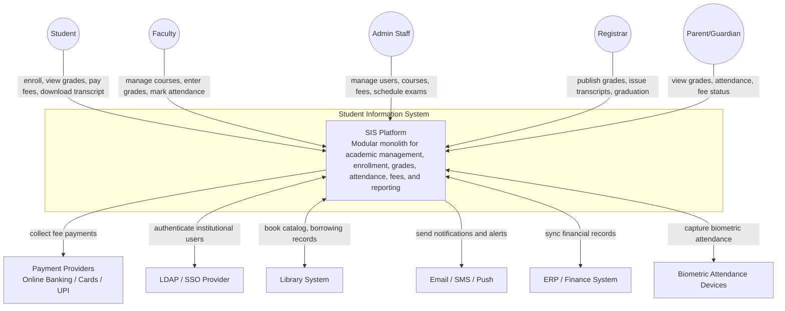
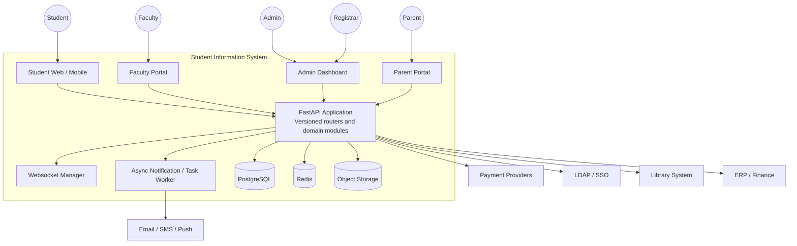
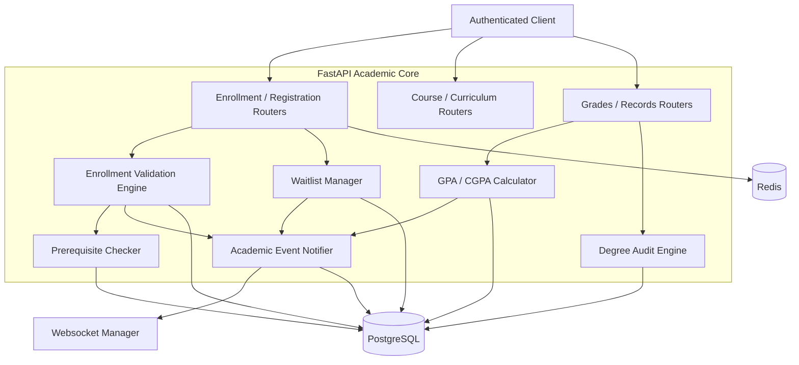
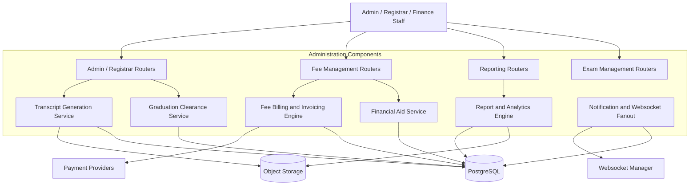

# C4 Diagrams

## Overview
These C4 diagrams describe the Student Information System architecture at multiple levels: context, container, and component.

---

## Level 1: System Context Diagram

---

## Level 2: Container Diagram

---

## Level 3: Component Diagram - Academic Core

---

## Level 3: Component Diagram - Administration and Fees

---

## Architecture Boundary Summary

| Area | Current Design |
|------|----------------|
| Architecture | Modular monolith |
| Authentication | Local JWT + LDAP/SSO integration |
| Notifications | Persisted notifications + websocket fanout |
| Payments | Online banking, cards, UPI |
| Attendance | Manual, QR code, and biometric integration |
| Transcripts | PDF generation with digital signature |
