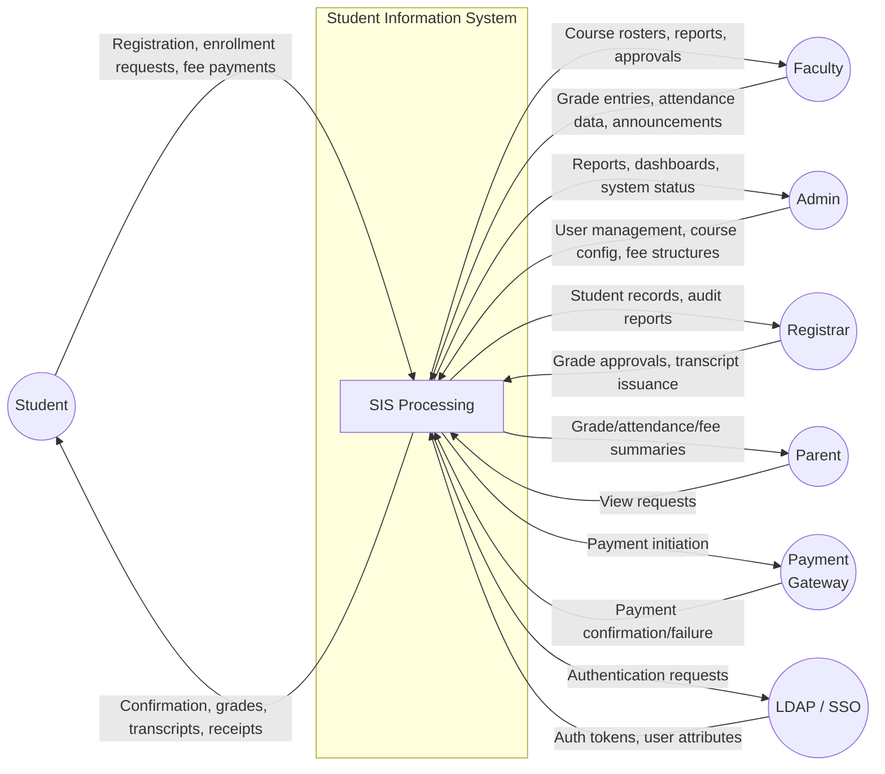
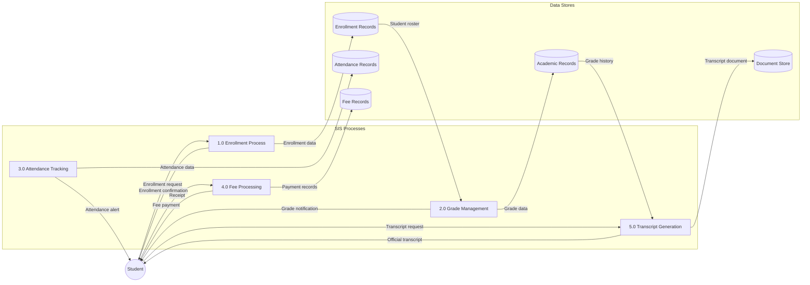
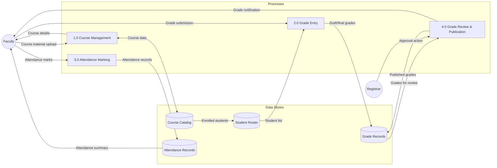
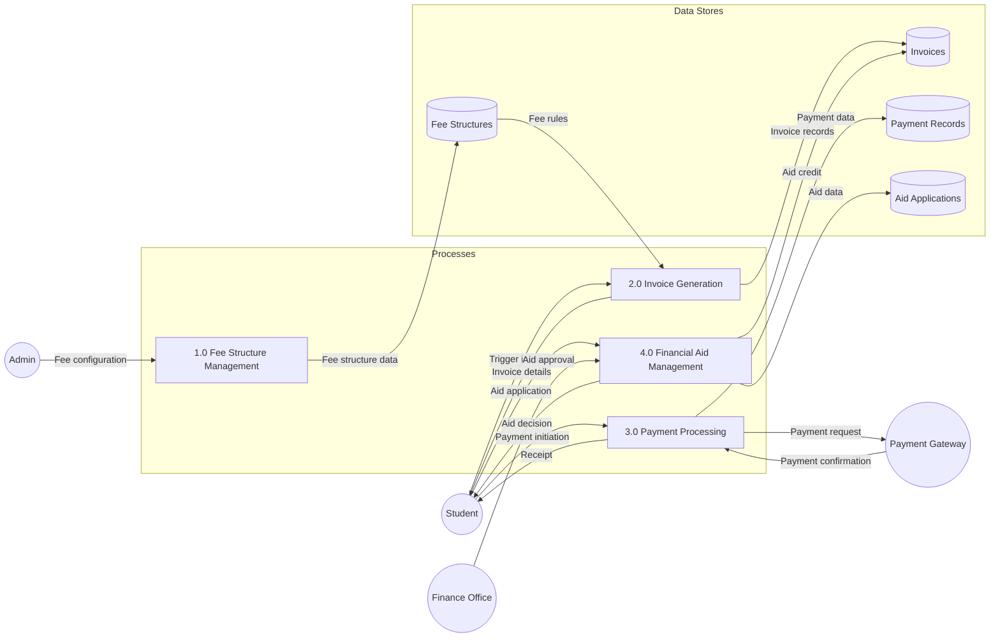
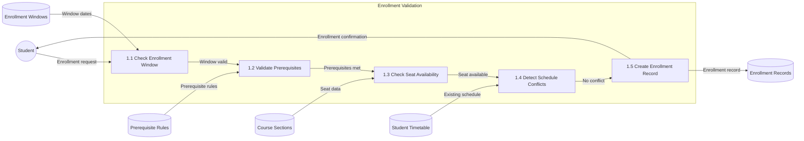

# Data Flow Diagrams

## Overview
Data flow diagrams showing how data moves through the Student Information System.

---

## Level 0: Context DFD (System Overview)

---

## Level 1: DFD - Student Academic Workflow

---

## Level 1: DFD - Faculty and Academic Operations

---

## Level 1: DFD - Fee and Financial Operations

---

## Level 2: DFD - Enrollment Validation Sub-Process

## Implementation-Ready Addendum for Data Flow Diagrams

### Purpose in This Artifact
Documents authoritative source of truth and anti-corruption boundaries.

### Scope Focus
- Data lineage controls
- Enrollment lifecycle enforcement relevant to this artifact
- Grading/transcript consistency constraints relevant to this artifact
- Role-based and integration concerns at this layer

#### Implementation Rules
- Enrollment lifecycle operations must emit auditable events with correlation IDs and actor scope.
- Grade and transcript actions must preserve immutability through versioned records; no destructive updates.
- RBAC must be combined with context constraints (term, department, assigned section, advisee).
- External integrations must remain contract-first with explicit versioning and backward-compatibility strategy.

#### Acceptance Criteria
1. Business rules are testable and mapped to policy IDs in this artifact.
2. Failure paths (authorization, policy window, downstream sync) are explicitly documented.
3. Data ownership and source-of-truth boundaries are clearly identified.
4. Diagram and narrative remain consistent for the scenarios covered in this file.

