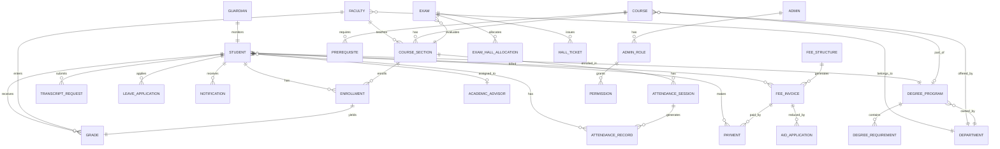
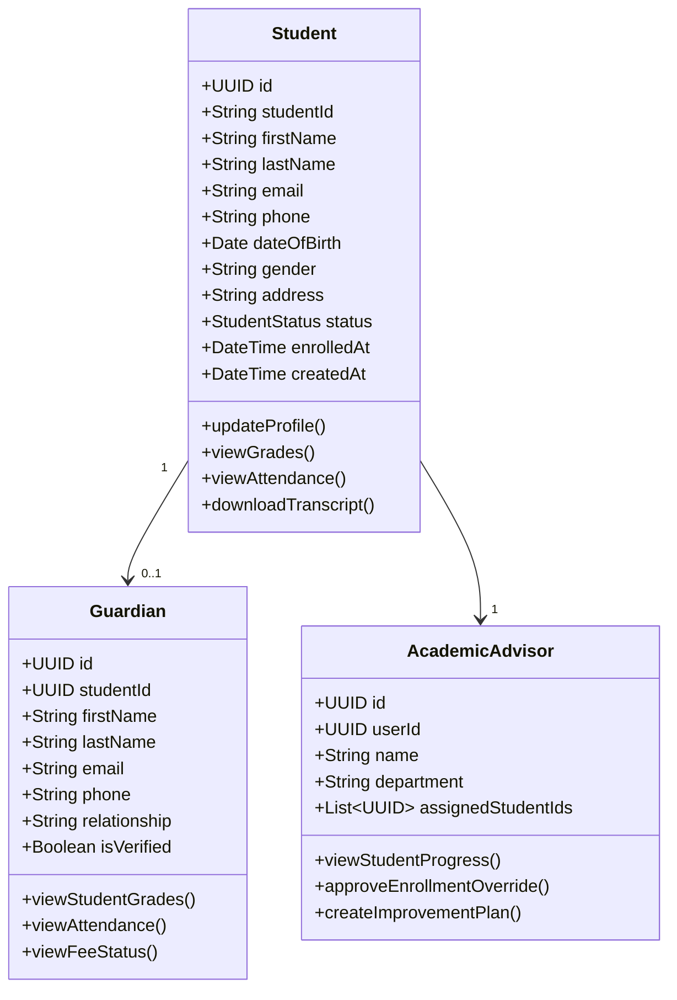
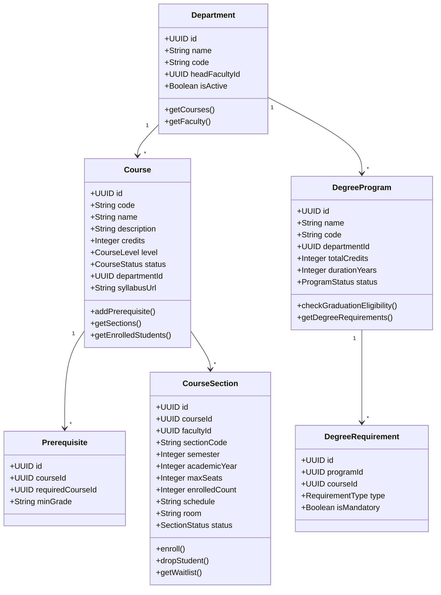
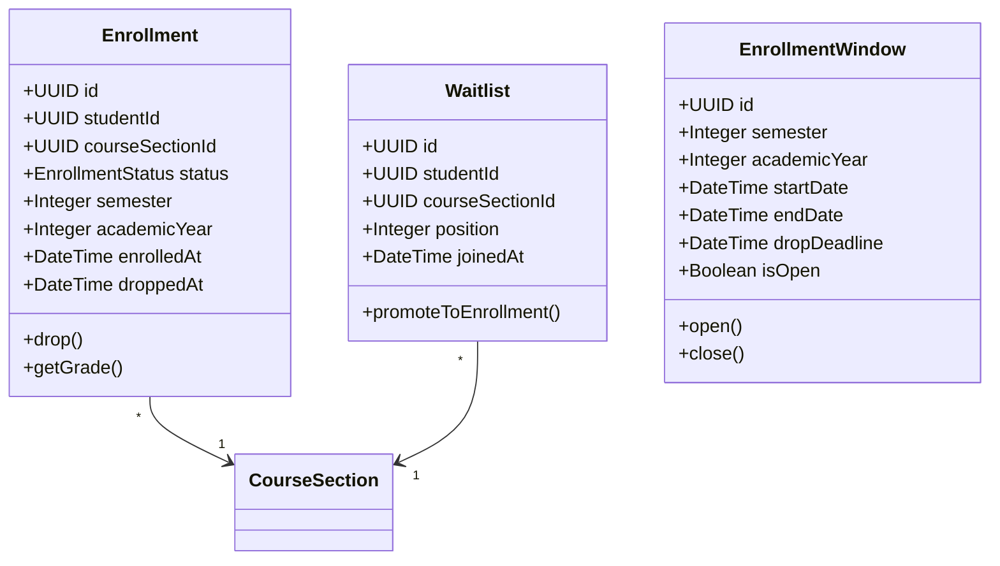
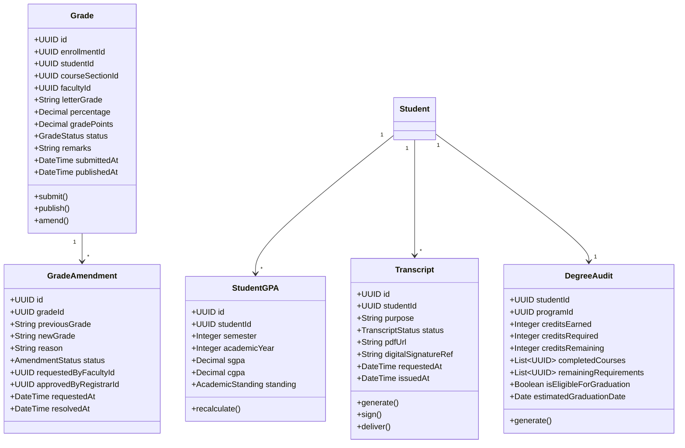
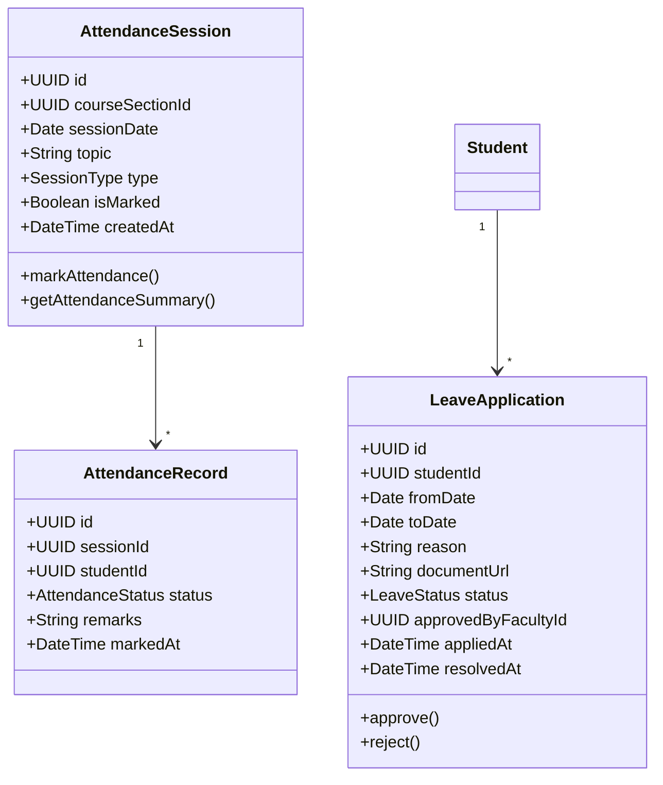
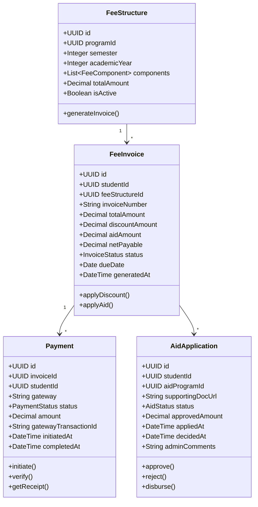
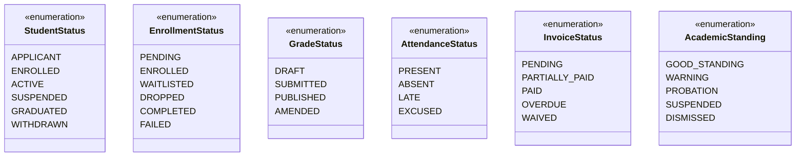

# Domain Model

## Overview
The Domain Model shows the key business entities and their relationships in the Student Information System.

---

## Complete Domain Model

---

## Student Domain

---

## Course Domain

---

## Enrollment Domain

---

## Academics Domain

---

## Attendance Domain

---

## Fee Domain

---

## Enumeration Types

## Implementation-Ready Addendum for Domain Model

### Purpose in This Artifact
Adds aggregate invariants for enrollment attempts and grade versions.

### Scope Focus
- Domain invariants and aggregates
- Enrollment lifecycle enforcement relevant to this artifact
- Grading/transcript consistency constraints relevant to this artifact
- Role-based and integration concerns at this layer

#### Implementation Rules
- Enrollment lifecycle operations must emit auditable events with correlation IDs and actor scope.
- Grade and transcript actions must preserve immutability through versioned records; no destructive updates.
- RBAC must be combined with context constraints (term, department, assigned section, advisee).
- External integrations must remain contract-first with explicit versioning and backward-compatibility strategy.

#### Acceptance Criteria
1. Business rules are testable and mapped to policy IDs in this artifact.
2. Failure paths (authorization, policy window, downstream sync) are explicitly documented.
3. Data ownership and source-of-truth boundaries are clearly identified.
4. Diagram and narrative remain consistent for the scenarios covered in this file.

