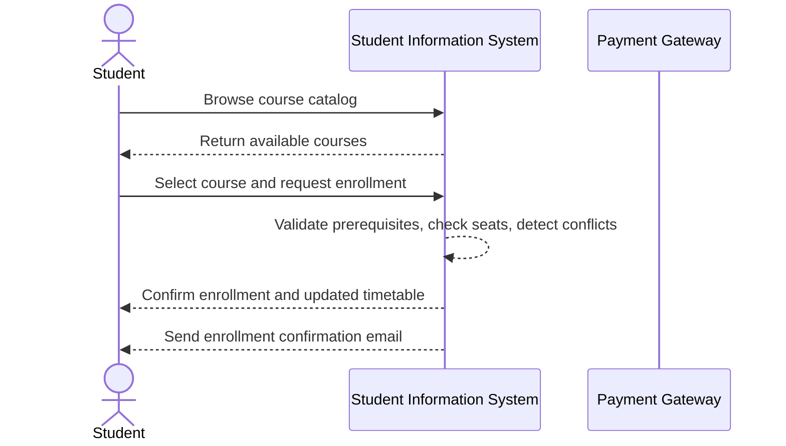
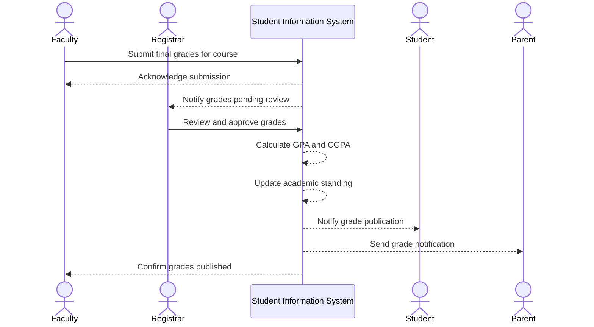
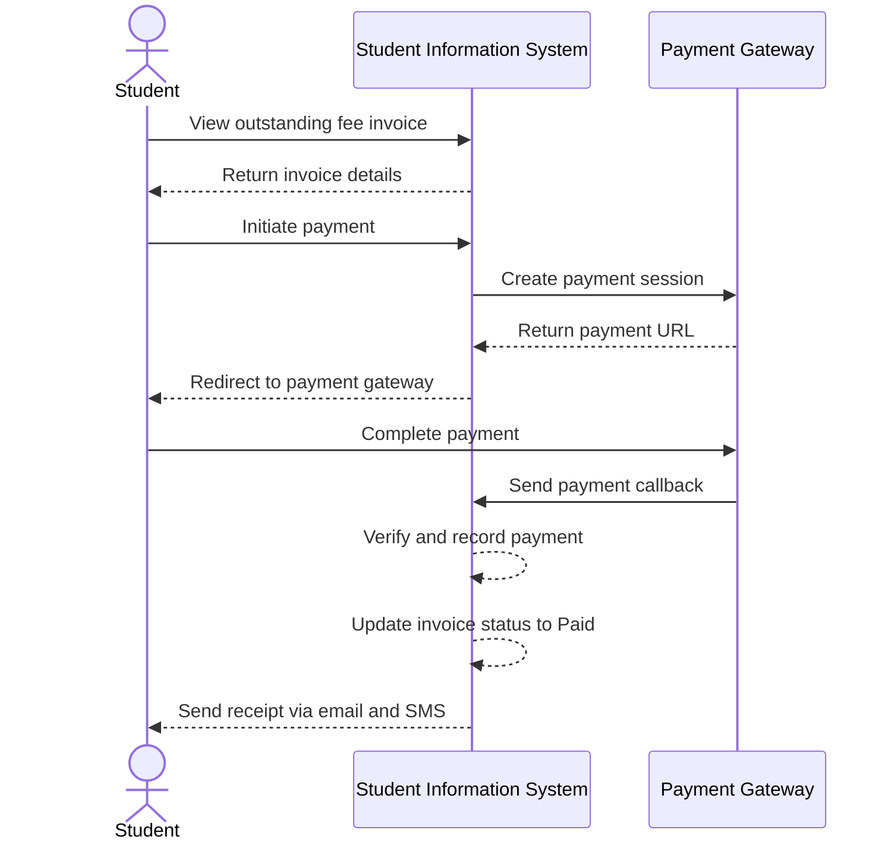
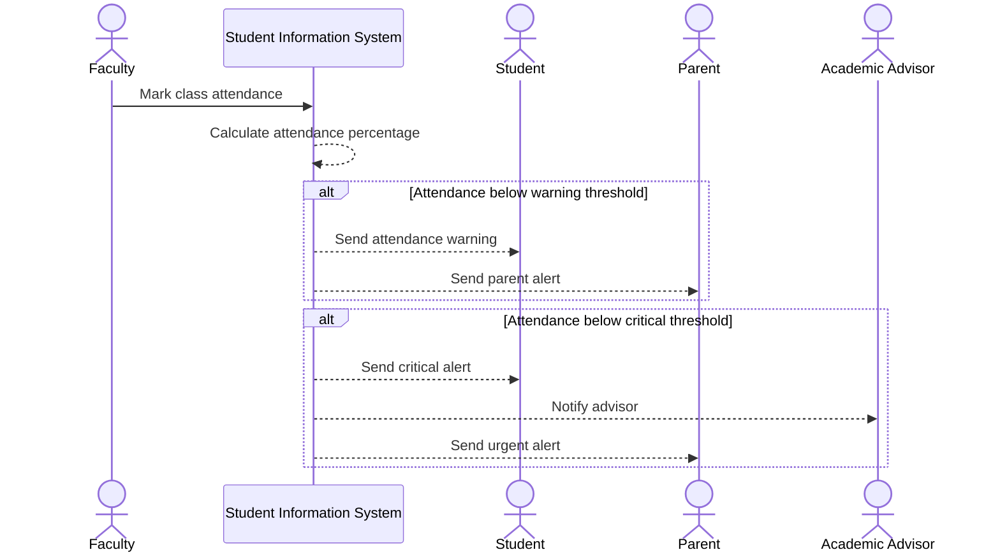
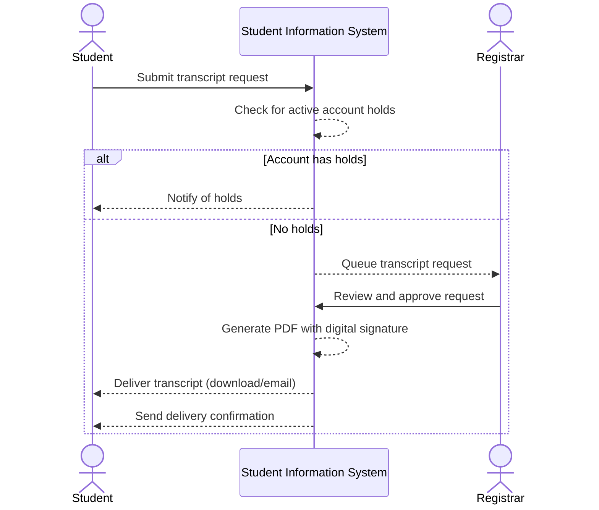
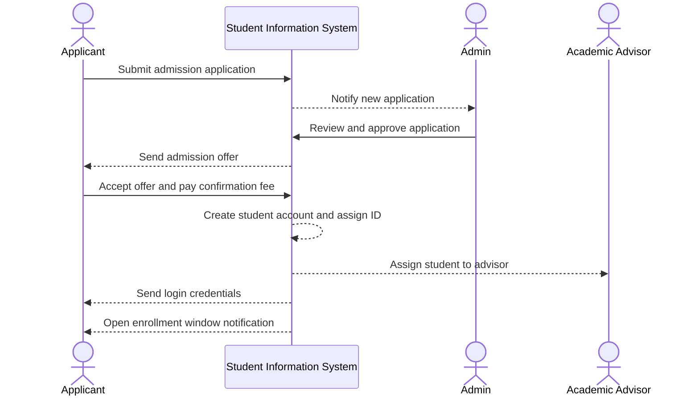
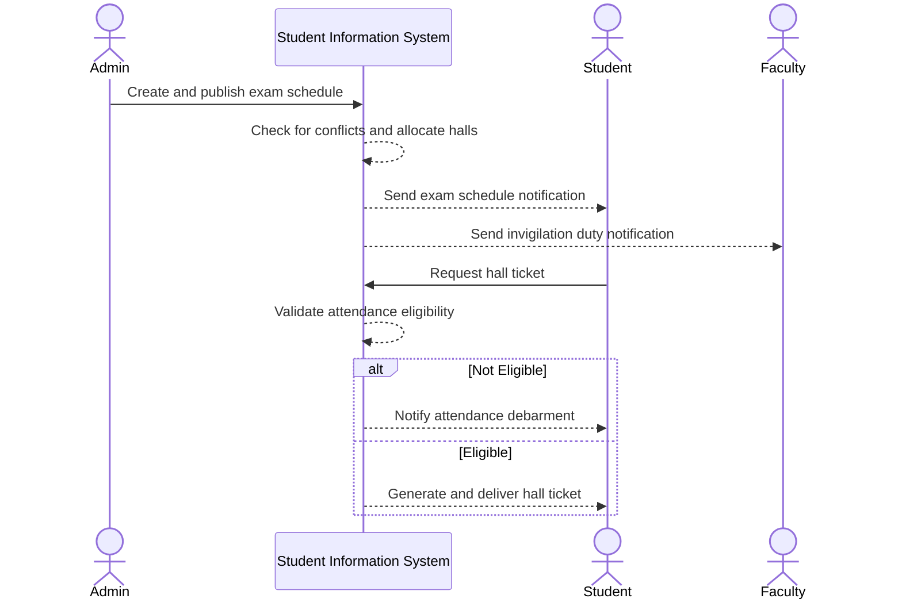

# System Sequence Diagrams

## Overview
System-level sequence diagrams showing black-box interactions between actors and the Student Information System for key business scenarios.

---

## Course Enrollment Sequence

---

## Grade Submission and Publication Sequence

---

## Fee Payment Sequence

---

## Attendance Alert Sequence

---

## Transcript Request Sequence

---

## Student Admission Sequence

---

## Exam Schedule and Hall Ticket Sequence

