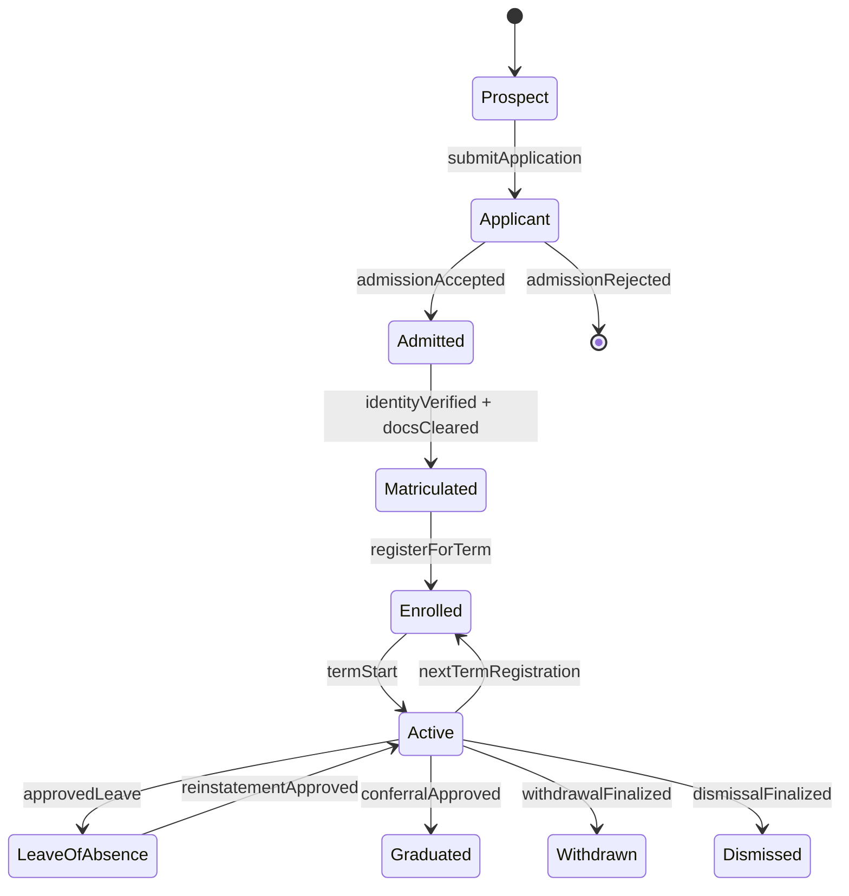
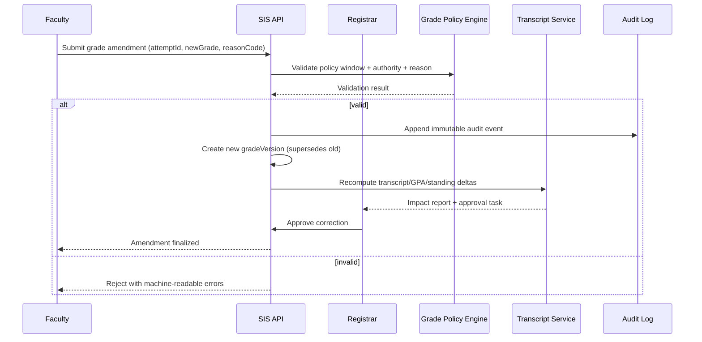
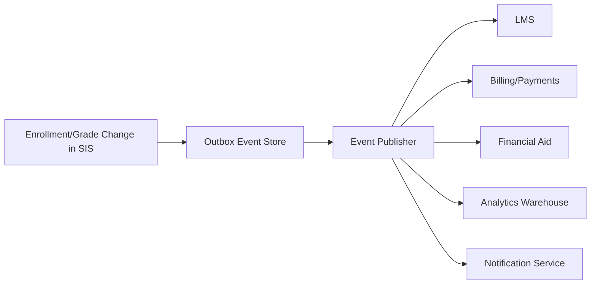

# Backend Status Matrix

## Overview
This matrix tracks the implementation status of all key SIS backend capabilities across domain modules.

---

## Authentication and Identity Module

| Feature | Status | Notes |
|---------|--------|-------|
| JWT authentication | ✅ Implemented | Access and refresh token flow |
| SSO / LDAP integration | ✅ Implemented | Institutional login support |
| OTP enable/verify/disable | ✅ Implemented | For admin and registrar accounts |
| Role-based access control | ✅ Implemented | Student, Faculty, Admin, Registrar, Advisor, Parent |
| Password reset via email | ✅ Implemented | Expiring reset link |
| Parent account linking | ✅ Implemented | Requires student approval |

---

## Student Management Module

| Feature | Status | Notes |
|---------|--------|-------|
| Student registration and profile | ✅ Implemented | Includes document upload |
| Student status lifecycle | ✅ Implemented | Applicant → Active → Graduated/Withdrawn |
| Academic advisor assignment | ✅ Implemented | Admin assigns advisor during onboarding |
| Parent/guardian portal | ✅ Implemented | Read-only access to grades, attendance, fees |
| Student search and filtering | ✅ Implemented | Admin and advisor access |

---

## Course and Curriculum Module

| Feature | Status | Notes |
|---------|--------|-------|
| Course catalog management | ✅ Implemented | Admin CRUD with department and level |
| Prerequisite configuration | ✅ Implemented | Multi-level prerequisite chains supported |
| Department and program management | ✅ Implemented | Department head assignment included |
| Degree program requirements | ✅ Implemented | Mandatory and elective requirement types |
| Course section scheduling | ✅ Implemented | Semester-year based sections with room and schedule |
| Syllabus upload | ✅ Implemented | Stored in object storage |

---

## Enrollment Module

| Feature | Status | Notes |
|---------|--------|-------|
| Enrollment window management | ✅ Implemented | Admin-controlled open/close with drop deadline |
| Prerequisite validation at enrollment | ✅ Implemented | Blocks enrollment if prerequisites not met |
| Seat availability check | ✅ Implemented | Real-time seat count management |
| Schedule conflict detection | ✅ Implemented | Detects overlapping section schedules |
| Course drop within deadline | ✅ Implemented | Within enrollment window drop period |
| Waitlist management | ✅ Implemented | Auto-promotion on seat availability |
| Waitlist notifications | ✅ Implemented | Position updates and auto-enrollment alerts |
| Enrollment override by advisor | ✅ Implemented | Advisor-approved exception handling |

---

## Grades and Academic Records Module

| Feature | Status | Notes |
|---------|--------|-------|
| Grade entry by faculty | ✅ Implemented | Manual and bulk CSV import |
| Draft and final grade submission | ✅ Implemented | Faculty saves draft before submitting |
| Registrar grade review and publish | ✅ Implemented | Approval workflow with return-for-correction |
| GPA and CGPA calculation | ✅ Implemented | Recalculated on each grade publication |
| Academic standing classification | ✅ Implemented | Good Standing / Warning / Probation / Suspended |
| Grade amendment workflow | ✅ Implemented | Faculty request + registrar approval |
| Degree audit generation | ✅ Implemented | Maps completed courses to program requirements |
| Transcript request and generation | ✅ Implemented | PDF with digital signature |
| Transcript delivery (download/email) | ✅ Implemented | Secure link with expiry |

---

## Attendance Module

| Feature | Status | Notes |
|---------|--------|-------|
| Session creation and attendance marking | ✅ Implemented | Per class session with Present/Absent/Late |
| Attendance percentage calculation | ✅ Implemented | Per course per student |
| Low attendance alerts to student | ✅ Implemented | Below 80% warning and below 75% critical |
| Low attendance alerts to parent/advisor | ✅ Implemented | Triggered on critical threshold breach |
| QR code attendance | ✅ Implemented | Session-specific short-lived QR code |
| Biometric attendance integration | 🔜 Planned | External device API integration pending |
| Leave application and approval | ✅ Implemented | Faculty approval with excused absence marking |
| Exam eligibility based on attendance | ✅ Implemented | Hall ticket blocked below threshold |

---

## Fee and Financial Aid Module

| Feature | Status | Notes |
|---------|--------|-------|
| Fee structure definition | ✅ Implemented | Per program, semester, and year |
| Automated fee invoice generation | ✅ Implemented | Generated on semester start |
| Online fee payment | ✅ Implemented | Bank transfer, cards, UPI via gateway |
| Installment payment plans | ✅ Implemented | Configurable partial payment |
| Payment receipt generation | ✅ Implemented | PDF receipt stored and emailed |
| Financial aid application | ✅ Implemented | Student applies; admin reviews and approves |
| Aid disbursement to invoice | ✅ Implemented | Approved aid credited to net payable |
| Fee collection reports | ✅ Implemented | Admin dashboard with export |
| ERP / finance sync | 🔜 Planned | External finance system integration pending |

---

## Exam Management Module

| Feature | Status | Notes |
|---------|--------|-------|
| Exam schedule creation | ✅ Implemented | Admin creates per course section |
| Conflict detection for student exams | ✅ Implemented | Prevents overlapping exam assignments |
| Hall allocation and seating | ✅ Implemented | Auto-assigned hall and seat number |
| Exam schedule publication | ✅ Implemented | Triggers student and faculty notifications |
| Hall ticket generation | ✅ Implemented | PDF with eligibility check |
| Exam eligibility validation | ✅ Implemented | Blocks ineligible students from hall ticket |

---

## Communication and Notification Module

| Feature | Status | Notes |
|---------|--------|-------|
| Announcements with target groups | ✅ Implemented | Course, department, or all-college |
| Internal messaging | ✅ Implemented | Threaded messaging between users |
| Email notifications | ✅ Implemented | SES-based transactional emails |
| SMS notifications | ✅ Implemented | Critical alerts and OTP |
| Push notifications | ✅ Implemented | FCM/APNs via student mobile app |
| Websocket live updates | ✅ Implemented | Grade publication, enrollment changes, alerts |
| Notification preferences | ✅ Implemented | Student-managed channel preferences |

---

## Reports and Analytics Module

| Feature | Status | Notes |
|---------|--------|-------|
| Institution dashboard | ✅ Implemented | Enrollment, fee, and academic KPIs |
| Enrollment statistics report | ✅ Implemented | By department, program, semester |
| Grade distribution report | ✅ Implemented | Per course, section, and faculty |
| Attendance summary report | ✅ Implemented | Per course with at-risk student list |
| Fee collection report | ✅ Implemented | Paid, pending, and overdue breakdown |
| Custom report export (CSV/PDF) | ✅ Implemented | Admin and faculty export |
| Scheduled report generation | 🔜 Planned | Automated periodic report delivery |

## Enrollment, Academic Integrity, Access Control, and Integration Contracts (Implementation-Ready)

### 1) Enrollment Lifecycle Rules (Authoritative)

#### 1.1 Lifecycle States and Transitions
| State | Entry Criteria | Exit Criteria | Allowed Actors | Terminal? |
|---|---|---|---|---|
| Prospect | Lead captured or inquiry created | Application submitted | Admissions CRM, Applicant | No |
| Applicant | Complete application + required docs | Admitted or Rejected | Applicant, Admissions Officer | No |
| Admitted | Admission decision = accepted | Matriculated or Offer Expired | Admissions, Registrar | No |
| Matriculated | Identity + eligibility checks passed | Enrolled for a term | Registrar | No |
| Enrolled (Term-Scoped) | Registered in >=1 credit-bearing section | Dropped all sections, Term Completed | Student, Advisor, Registrar | No |
| Active (Institution-Scoped) | Student is not graduated/withdrawn/dismissed | Graduated, Withdrawn, Dismissed | SIS policy engine | No |
| Leave of Absence | Approved leave request in valid window | Reinstated, Withdrawn, Dismissed | Student, Advisor, Registrar | No |
| Graduated | Degree audit complete + conferral approved | N/A | Registrar | Yes |
| Withdrawn | Approved withdrawal workflow complete | Reinstated (rare policy path) | Student, Registrar | Yes* |
| Dismissed | Policy or disciplinary action finalized | Reinstated by exception | Registrar, Academic Board | Yes* |

> *Terminal under normal policy; reinstatement requires exceptional workflow and two-party approval (advisor + registrar/board).

#### 1.2 Deterministic State Machine

#### 1.3 Enrollment/Registration Enforcement Rules
- **EL-001 Window Governance:** add/drop/withdraw windows are configured per term, program, and campus timezone; requests outside windows require override reason code.
- **EL-002 Seat Allocation:** seat release follows deterministic priority `(cohortPriority DESC, waitlistTimestamp ASC, randomTieBreakerSeed ASC)`.
- **EL-003 Prerequisite Resolution:** prerequisite checks run against canonical attempt history with in-progress and transfer-credit handling flags.
- **EL-004 Conflict Detection:** section enrollment is rejected if timetable overlap, credit overload, hold, or missing approval constraints fail.
- **EL-005 Downstream Consistency:** enrollment state changes emit events for LMS roster sync, fee recalculation, attendance eligibility, and aid re-evaluation.
- **EL-006 Re-Enrollment Gate:** reinstatement requires cleared financial/disciplinary holds and advisor + registrar approvals.

### 2) Grading and Transcript Consistency Constraints

#### 2.1 Grade Lifecycle and Versioning
- **GC-001 Immutable Posting:** once a grade version is `POSTED`, it is immutable.
- **GC-002 Amendment Model:** corrections create a new version linked by `supersedesGradeVersionId`; no in-place edits.
- **GC-003 Reason Codes:** every amendment must provide standardized reason (`CALCULATION_ERROR`, `LATE_SUBMISSION_APPROVED`, `INCOMPLETE_RESOLUTION`, etc.).
- **GC-004 Effective Dating:** transcript rendering always uses latest `effective=true` grade version at render time.

#### 2.2 Canonical Consistency Rules
| Rule ID | Constraint | Failure Handling |
|---|---|---|
| TR-001 | Transcript rows derive only from canonical course-attempt + grade-version records | Block issuance and raise registrar task |
| TR-002 | GPA/CGPA computed from policy-bound grade points and repeat/forgiveness rules | Recompute job queued; stale cache invalidated |
| TR-003 | Standing/honors/SAP updates run after each posted or amended grade event | Trigger synchronous policy check + async reconciliation |
| TR-004 | Official transcript issuance requires registrar sign-off + tamper-evident hash | Refuse release if signature or hash missing |
| TR-005 | Retroactive grade changes require impact statements (prereq, audit, aid, standing) | Hold change in `PENDING_IMPACT_REVIEW` |

#### 2.3 Grade Correction Sequence (Required)

### 3) Role-Based Access Specifics (RBAC + ABAC)

#### 3.1 Access Model
- **RBAC baseline** grants capability by role.
- **ABAC overlays** constrain by context attributes: campus, department, term, section assignment, advisee linkage, data sensitivity, legal hold.
- **Break-glass access** is time-bound, ticket-linked, and dual-approved.

#### 3.2 Permission Matrix (Minimum Required)
| Capability | Student | Faculty | Advisor | Registrar/Admin | Notes |
|---|---:|---:|---:|---:|---|
| View own transcript | ✅ | ❌ | ❌ | ✅ | Student self-service allowed |
| Submit final grades | ❌ | ✅* | ❌ | ✅ | *Assigned sections + open window only |
| Amend posted grade | ❌ | Request | ❌ | ✅ | Registrar finalizes amendments |
| Approve overload/waiver petition | ❌ | ❌ | ✅ | ✅ | Program-scoped |
| Release official transcript | ❌ | ❌ | ❌ | ✅ | Requires digital signature policy |
| View disciplinary records | Limited | ❌ | Limited | Scoped | Enhanced logging required |

#### 3.3 Security and Audit Controls
- **AC-001** least privilege defaults; deny-by-default policy on all privileged endpoints.
- **AC-002** MFA required for registrar/admin and any user performing grade or transcript actions.
- **AC-003** field-level masking for PII/financial attributes in UI, exports, and logs.
- **AC-004** all read/write of sensitive records generate audit events with `actorId`, `scope`, `justification`, `requestId`.
- **AC-005** periodic entitlement recertification (at least once per term).

### 4) Integration Contracts for External Systems

#### 4.1 Contract-First Standards
- APIs must publish OpenAPI/AsyncAPI artifacts with JSON Schema references and semantic versions.
- Breaking changes require version increment and migration window policy.
- Event contracts are backward-compatible for at least one full term unless emergency exception approved.

#### 4.2 External Integration Surface
| System | Direction | Contract Type | SLA/SLO | Idempotency Key |
|---|---|---|---|---|
| LMS | Bi-directional | REST + Events | Roster sync < 5 min | `termId:sectionId:studentId:eventType` |
| IdP/SSO | Inbound auth + outbound provisioning | SAML/OIDC + SCIM | Login p95 < 2s | `provisioningRequestId` |
| Payment Gateway | Outbound payment + inbound webhook | REST + Signed Webhooks | Payment callback < 60s | `invoiceId:attemptNo` |
| Financial Aid | Bi-directional | REST + Batch SFTP (optional) | Aid status < 15 min | `aidApplicationId:termId` |
| Library | Bi-directional | REST | Borrowing status < 10 min | `studentId:loanId:eventType` |
| Regulatory Reporting | Outbound | Secure file/API | Deadline-bound batch | `reportPeriod:studentId:recordType` |

#### 4.3 Event Contract Baseline

Required event metadata fields:
- `eventId`, `eventType`, `schemaVersion`, `occurredAt`, `sourceSystem`, `correlationId`, `idempotencyKey`
- domain IDs: `studentId`, `termId`, `courseOfferingId`, `attemptId`, `gradeVersionId` (as applicable)

#### 4.4 Reliability, Security, and Drift Controls
- **IC-001** retries use exponential backoff + jitter; dead-letter queues mandatory.
- **IC-002** all webhook callbacks must be signed and timestamp-validated.
- **IC-003** encryption in transit (TLS 1.2+) and at rest for replicated payload stores.
- **IC-004** contract tests + sandbox certification are release gates for enrollment/grade/transcript/billing changes.
- **IC-005** schema drift detection runs continuously and blocks incompatible deploys.

### 5) Operational Readiness and Acceptance Criteria

#### 5.1 Observability and SLOs
- Enrollment action API p95 latency <= 400ms during peak registration.
- Grade posting-to-transcript consistency <= 2 minutes (p99).
- LMS roster propagation <= 5 minutes (p99).
- Audit event durability >= 99.999% persisted write success.

#### 5.2 Data Retention and Compliance
- Grade versions and transcript issuance records are retained per institutional and statutory policy (minimum 7 years where applicable).
- Audit logs for sensitive operations retained in immutable storage tier with legal hold support.
- Data subject access/deletion requests must preserve legally required academic records with redaction-by-policy.

#### 5.3 Implementation-Ready Test Scenarios
1. Waitlist promotion tie-breaker determinism under concurrent seat release.
2. Retroactive grade correction impact on prerequisites and degree audit.
3. Unauthorized faculty grade amendment blocked with explicit error code.
4. Payment webhook replay handled idempotently without duplicate ledger entries.
5. Transcript signature/hash verification fails on tampered artifact.
6. Re-enrollment blocked when financial hold exists; succeeds after hold clearance.

