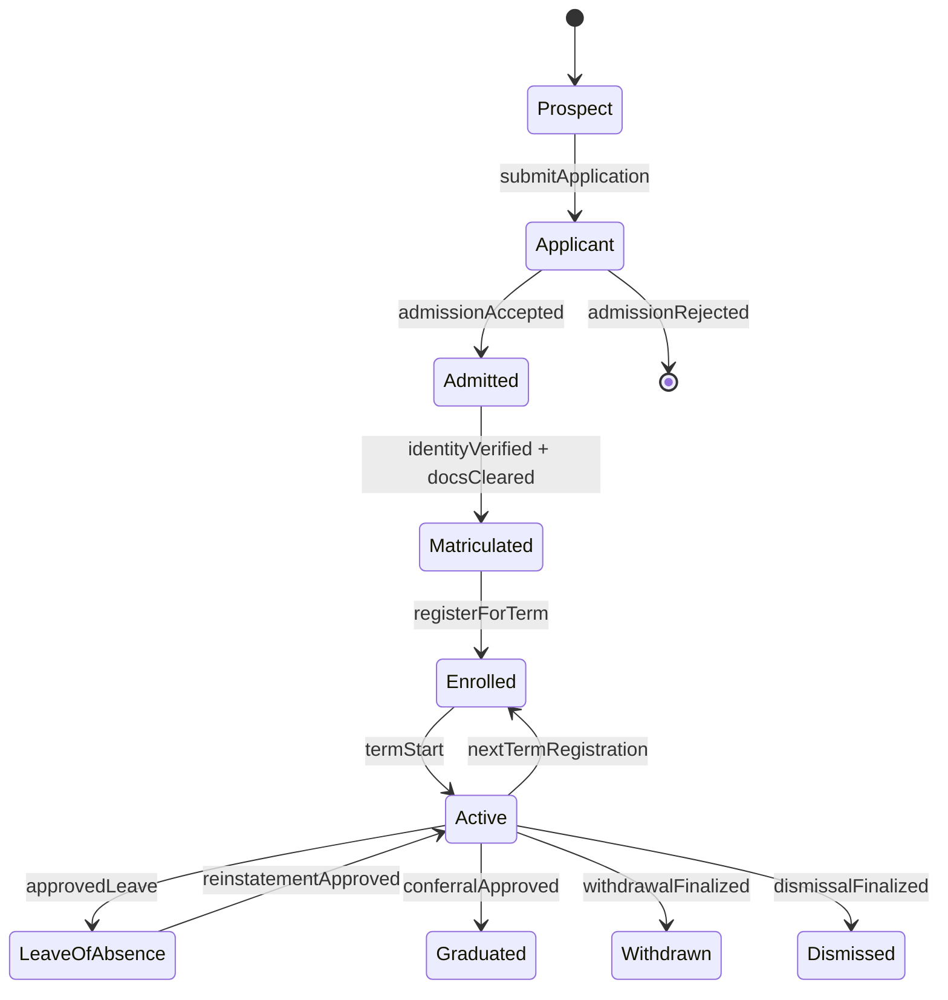
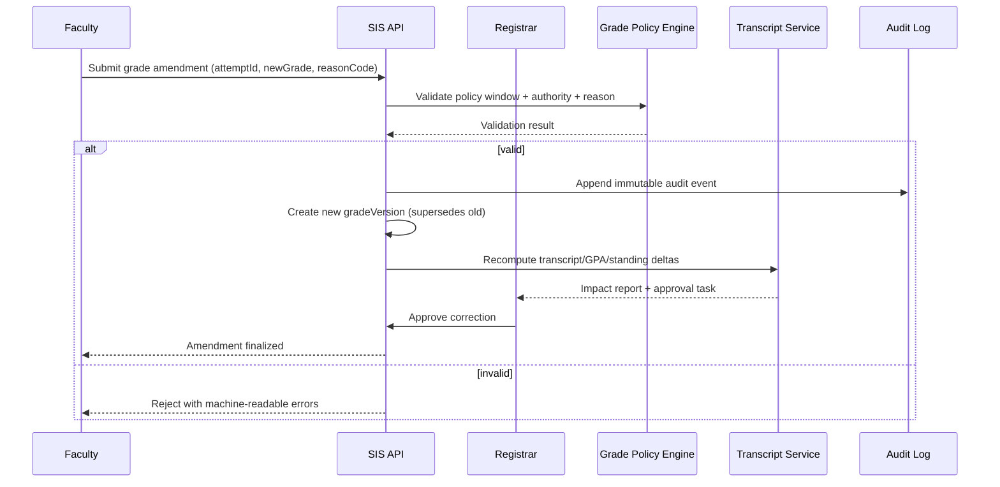
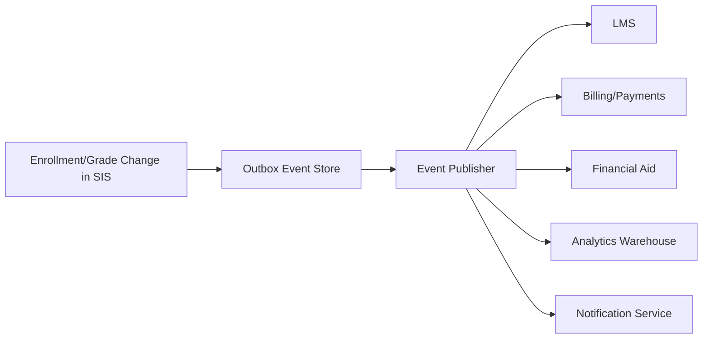

# Implementation Guidelines

## Overview
This document provides implementation guidelines and best practices for building the Student Information System backend.

---

## Technology Stack

| Layer | Technology | Rationale |
|-------|-----------|-----------|
| API Framework | FastAPI (Python) | Async support, automatic OpenAPI docs, type-safe |
| Database | PostgreSQL | Relational data, strong ACID compliance for academic records |
| ORM | SQLAlchemy + Alembic | Mature ORM with migration management |
| Cache | Redis | Session caching, enrollment window state, waitlist management |
| Object Storage | AWS S3 | Transcripts, documents, course materials |
| Task Queue | Celery + Redis | Async notification dispatch and report generation |
| Auth | JWT (PyJWT) | Stateless authentication with refresh token rotation |
| SSO/LDAP | python-ldap / authlib | Institutional identity integration |
| PDF Generation | ReportLab / WeasyPrint | Transcript and receipt generation |
| Email | Amazon SES / SMTP | Transactional email delivery |
| SMS | Amazon SNS / Twilio | OTP and critical alerts |
| Push | FCM / APNs | Mobile push notifications |
| Testing | pytest + httpx | Unit and integration tests |
| Containerization | Docker + Kubernetes | Cloud-native deployment |

---

## Project Structure

```
sis-backend/
├── app/
│   ├── core/
│   │   ├── config.py          # Environment and app settings
│   │   ├── security.py        # JWT and auth helpers
│   │   ├── database.py        # DB session management
│   │   └── redis.py           # Redis connection
│   ├── modules/
│   │   ├── auth/              # Authentication and IAM
│   │   ├── students/          # Student management
│   │   ├── faculty/           # Faculty management
│   │   ├── courses/           # Course catalog and curriculum
│   │   ├── enrollment/        # Enrollment and scheduling
│   │   ├── grades/            # Grades and academic records
│   │   ├── attendance/        # Attendance tracking
│   │   ├── fees/              # Fee management and payments
│   │   ├── exams/             # Exam management
│   │   ├── communication/     # Announcements and messaging
│   │   ├── reports/           # Reports and analytics
│   │   └── notifications/     # Notification service
│   ├── models/                # SQLAlchemy ORM models
│   ├── schemas/               # Pydantic request/response schemas
│   ├── repositories/          # Database access layer
│   └── main.py                # FastAPI app entry point
├── migrations/                # Alembic migration files
├── tests/                     # Test suite
├── docker/                    # Docker and compose files
└── requirements.txt
```

---

## Coding Conventions

### API Endpoint Naming

- Use plural nouns for resources: `/students`, `/courses`, `/enrollments`
- Use sub-resources for nested relationships: `/students/me/grades`, `/faculty/courses/{id}/grades`
- Use verbs for actions: `/auth/login`, `/auth/otp/enable`, `/grades/{id}/submit`
- Prefix admin routes: `/admin/students`, `/admin/reports/enrollment`
- Prefix faculty routes: `/faculty/courses/{id}/attendance`
- Prefix registrar routes: `/registrar/grades/pending`

### Response Format

```python
# Standard success response
{
    "success": True,
    "data": { ... },
    "message": "Enrollment confirmed"
}

# Paginated list response
{
    "success": True,
    "data": [ ... ],
    "pagination": {
        "page": 1,
        "perPage": 20,
        "total": 150,
        "totalPages": 8
    }
}

# Error response
{
    "success": False,
    "error": {
        "code": "PREREQUISITE_NOT_MET",
        "message": "You must complete CS101 before enrolling in CS201",
        "details": { "missingCourses": ["CS101"] }
    }
}
```

### Authentication and Authorization

```python
from app.core.security import require_role, get_current_user

# Protect route by role
@router.get("/admin/students")
async def list_students(
    current_user: User = Depends(require_role(UserRole.ADMIN))
):
    ...

# Allow multiple roles
@router.get("/courses/{id}/grades")
async def get_grades(
    current_user: User = Depends(require_roles([UserRole.FACULTY, UserRole.ADMIN]))
):
    ...
```

### Database Session Management

```python
from app.core.database import get_db
from sqlalchemy.ext.asyncio import AsyncSession

@router.post("/enrollments")
async def enroll(
    enrollment_data: EnrollmentCreate,
    db: AsyncSession = Depends(get_db),
    current_user: User = Depends(get_current_student)
):
    service = EnrollmentService(db)
    result = await service.enroll_student(current_user.student_id, enrollment_data.section_id)
    return success_response(result)
```

---

## Enrollment Window Enforcement

The enrollment window is a critical business rule. All enrollment mutations must validate that the window is open before processing.

```python
class EnrollmentService:
    async def enroll_student(self, student_id: UUID, section_id: UUID):
        # Always check enrollment window first
        window = await self.window_repo.get_active_window()
        if not window or not window.is_open:
            raise EnrollmentWindowClosed("Enrollment is not currently open")

        # Proceed with validation chain
        await self.validate_prerequisites(student_id, section_id)
        await self.check_conflicts(student_id, section_id)
        await self.check_seats(section_id)
        ...
```

---

## GPA Calculation Rules

| Grade | Grade Points |
|-------|-------------|
| A+ | 10.0 |
| A | 9.0 |
| B+ | 8.0 |
| B | 7.0 |
| C+ | 6.0 |
| C | 5.0 |
| D | 4.0 |
| F | 0.0 |

**SGPA Formula:**
```
SGPA = Σ(Credit Hours × Grade Points) / Σ(Credit Hours)
```

**CGPA Formula:**
```
CGPA = Σ(All Semester SGPA × Semester Credits) / Σ(All Semester Credits)
```

**Academic Standing Classification:**

| CGPA Range | Standing |
|-----------|----------|
| ≥ 7.0 | Good Standing |
| 5.0 – 6.99 | Warning |
| 4.0 – 4.99 | Probation |
| < 4.0 | Suspended |

---

## Attendance Threshold Rules

| Threshold | Action |
|-----------|--------|
| < 80% | Send warning to student and parent |
| < 75% | Send critical alert; notify academic advisor |
| < 65% | Flag for exam debarment; block hall ticket |

Attendance percentage is calculated per course section per student:

```
Attendance % = (Sessions Present + Sessions Late × 0.5 + Excused Sessions) / Total Sessions × 100
```

---

## Notification Events

All domain events that trigger notifications must be published through the `NotificationService`. Do not send notifications directly from business logic services.

| Event | Channels | Recipients |
|-------|---------|-----------|
| Enrollment confirmed | Email, push | Student |
| Enrollment waitlisted | Email, push | Student |
| Grade published | Email, push, websocket | Student, Parent |
| Attendance warning | Email, SMS, push | Student, Parent |
| Attendance critical | Email, SMS, push | Student, Parent, Advisor |
| Fee invoice generated | Email | Student, Parent |
| Fee payment confirmed | Email, SMS | Student |
| Transcript ready | Email, push | Student |
| Exam schedule published | Email, push | Student, Faculty |
| Financial aid decision | Email, push | Student |

---

## Error Handling

Use domain-specific exception classes. Never expose raw database or internal errors to API responses.

```python
# Domain exceptions
class EnrollmentWindowClosed(SISException): ...
class PrerequisiteNotMet(SISException): ...
class SectionFull(SISException): ...
class ScheduleConflict(SISException): ...
class GradeNotPublished(SISException): ...
class AccountHold(SISException): ...

# Global exception handler in main.py
@app.exception_handler(SISException)
async def sis_exception_handler(request, exc: SISException):
    return JSONResponse(
        status_code=exc.status_code,
        content=error_response(exc.code, exc.message, exc.details)
    )
```

---

## Security Guidelines

1. **Input Validation**: Use Pydantic models for all request body and query parameter validation
2. **SQL Injection**: Use SQLAlchemy parameterized queries; never raw SQL with user input
3. **File Upload**: Validate file type and size; store in S3 with server-side encryption
4. **Rate Limiting**: Apply rate limiting to auth endpoints (login, OTP) and public APIs
5. **Sensitive Data**: Never log student ID numbers, grades, or financial data in plain text
6. **JWT Tokens**: Use short-lived access tokens (15 min) and longer refresh tokens (7 days)
7. **Document Access**: Transcripts and receipts should be served via time-limited signed URLs
8. **FERPA Compliance**: Enforce role-based data access; log all accesses to sensitive student records

---

## Testing Strategy

```
tests/
├── unit/
│   ├── test_gpa_calculator.py
│   ├── test_prerequisite_validator.py
│   ├── test_attendance_threshold.py
│   └── test_fee_invoice_engine.py
├── integration/
│   ├── test_enrollment_api.py
│   ├── test_grade_submission_api.py
│   ├── test_fee_payment_api.py
│   └── test_transcript_api.py
└── e2e/
    ├── test_student_journey.py
    └── test_faculty_grade_flow.py
```

All critical calculations (GPA, attendance percentage, fee invoicing) must have comprehensive unit tests covering edge cases including zero-credit courses, failed grades, excused absences, and partial aid applications.

## Enrollment, Academic Integrity, Access Control, and Integration Contracts (Implementation-Ready)

### 1) Enrollment Lifecycle Rules (Authoritative)

#### 1.1 Lifecycle States and Transitions
| State | Entry Criteria | Exit Criteria | Allowed Actors | Terminal? |
|---|---|---|---|---|
| Prospect | Lead captured or inquiry created | Application submitted | Admissions CRM, Applicant | No |
| Applicant | Complete application + required docs | Admitted or Rejected | Applicant, Admissions Officer | No |
| Admitted | Admission decision = accepted | Matriculated or Offer Expired | Admissions, Registrar | No |
| Matriculated | Identity + eligibility checks passed | Enrolled for a term | Registrar | No |
| Enrolled (Term-Scoped) | Registered in >=1 credit-bearing section | Dropped all sections, Term Completed | Student, Advisor, Registrar | No |
| Active (Institution-Scoped) | Student is not graduated/withdrawn/dismissed | Graduated, Withdrawn, Dismissed | SIS policy engine | No |
| Leave of Absence | Approved leave request in valid window | Reinstated, Withdrawn, Dismissed | Student, Advisor, Registrar | No |
| Graduated | Degree audit complete + conferral approved | N/A | Registrar | Yes |
| Withdrawn | Approved withdrawal workflow complete | Reinstated (rare policy path) | Student, Registrar | Yes* |
| Dismissed | Policy or disciplinary action finalized | Reinstated by exception | Registrar, Academic Board | Yes* |

> *Terminal under normal policy; reinstatement requires exceptional workflow and two-party approval (advisor + registrar/board).

#### 1.2 Deterministic State Machine


#### 1.3 Enrollment/Registration Enforcement Rules
- **EL-001 Window Governance:** add/drop/withdraw windows are configured per term, program, and campus timezone; requests outside windows require override reason code.
- **EL-002 Seat Allocation:** seat release follows deterministic priority `(cohortPriority DESC, waitlistTimestamp ASC, randomTieBreakerSeed ASC)`.
- **EL-003 Prerequisite Resolution:** prerequisite checks run against canonical attempt history with in-progress and transfer-credit handling flags.
- **EL-004 Conflict Detection:** section enrollment is rejected if timetable overlap, credit overload, hold, or missing approval constraints fail.
- **EL-005 Downstream Consistency:** enrollment state changes emit events for LMS roster sync, fee recalculation, attendance eligibility, and aid re-evaluation.
- **EL-006 Re-Enrollment Gate:** reinstatement requires cleared financial/disciplinary holds and advisor + registrar approvals.

### 2) Grading and Transcript Consistency Constraints

#### 2.1 Grade Lifecycle and Versioning
- **GC-001 Immutable Posting:** once a grade version is `POSTED`, it is immutable.
- **GC-002 Amendment Model:** corrections create a new version linked by `supersedesGradeVersionId`; no in-place edits.
- **GC-003 Reason Codes:** every amendment must provide standardized reason (`CALCULATION_ERROR`, `LATE_SUBMISSION_APPROVED`, `INCOMPLETE_RESOLUTION`, etc.).
- **GC-004 Effective Dating:** transcript rendering always uses latest `effective=true` grade version at render time.

#### 2.2 Canonical Consistency Rules
| Rule ID | Constraint | Failure Handling |
|---|---|---|
| TR-001 | Transcript rows derive only from canonical course-attempt + grade-version records | Block issuance and raise registrar task |
| TR-002 | GPA/CGPA computed from policy-bound grade points and repeat/forgiveness rules | Recompute job queued; stale cache invalidated |
| TR-003 | Standing/honors/SAP updates run after each posted or amended grade event | Trigger synchronous policy check + async reconciliation |
| TR-004 | Official transcript issuance requires registrar sign-off + tamper-evident hash | Refuse release if signature or hash missing |
| TR-005 | Retroactive grade changes require impact statements (prereq, audit, aid, standing) | Hold change in `PENDING_IMPACT_REVIEW` |

#### 2.3 Grade Correction Sequence (Required)


### 3) Role-Based Access Specifics (RBAC + ABAC)

#### 3.1 Access Model
- **RBAC baseline** grants capability by role.
- **ABAC overlays** constrain by context attributes: campus, department, term, section assignment, advisee linkage, data sensitivity, legal hold.
- **Break-glass access** is time-bound, ticket-linked, and dual-approved.

#### 3.2 Permission Matrix (Minimum Required)
| Capability | Student | Faculty | Advisor | Registrar/Admin | Notes |
|---|---:|---:|---:|---:|---|
| View own transcript | ✅ | ❌ | ❌ | ✅ | Student self-service allowed |
| Submit final grades | ❌ | ✅* | ❌ | ✅ | *Assigned sections + open window only |
| Amend posted grade | ❌ | Request | ❌ | ✅ | Registrar finalizes amendments |
| Approve overload/waiver petition | ❌ | ❌ | ✅ | ✅ | Program-scoped |
| Release official transcript | ❌ | ❌ | ❌ | ✅ | Requires digital signature policy |
| View disciplinary records | Limited | ❌ | Limited | Scoped | Enhanced logging required |

#### 3.3 Security and Audit Controls
- **AC-001** least privilege defaults; deny-by-default policy on all privileged endpoints.
- **AC-002** MFA required for registrar/admin and any user performing grade or transcript actions.
- **AC-003** field-level masking for PII/financial attributes in UI, exports, and logs.
- **AC-004** all read/write of sensitive records generate audit events with `actorId`, `scope`, `justification`, `requestId`.
- **AC-005** periodic entitlement recertification (at least once per term).

### 4) Integration Contracts for External Systems

#### 4.1 Contract-First Standards
- APIs must publish OpenAPI/AsyncAPI artifacts with JSON Schema references and semantic versions.
- Breaking changes require version increment and migration window policy.
- Event contracts are backward-compatible for at least one full term unless emergency exception approved.

#### 4.2 External Integration Surface
| System | Direction | Contract Type | SLA/SLO | Idempotency Key |
|---|---|---|---|---|
| LMS | Bi-directional | REST + Events | Roster sync < 5 min | `termId:sectionId:studentId:eventType` |
| IdP/SSO | Inbound auth + outbound provisioning | SAML/OIDC + SCIM | Login p95 < 2s | `provisioningRequestId` |
| Payment Gateway | Outbound payment + inbound webhook | REST + Signed Webhooks | Payment callback < 60s | `invoiceId:attemptNo` |
| Financial Aid | Bi-directional | REST + Batch SFTP (optional) | Aid status < 15 min | `aidApplicationId:termId` |
| Library | Bi-directional | REST | Borrowing status < 10 min | `studentId:loanId:eventType` |
| Regulatory Reporting | Outbound | Secure file/API | Deadline-bound batch | `reportPeriod:studentId:recordType` |

#### 4.3 Event Contract Baseline


Required event metadata fields:
- `eventId`, `eventType`, `schemaVersion`, `occurredAt`, `sourceSystem`, `correlationId`, `idempotencyKey`
- domain IDs: `studentId`, `termId`, `courseOfferingId`, `attemptId`, `gradeVersionId` (as applicable)

#### 4.4 Reliability, Security, and Drift Controls
- **IC-001** retries use exponential backoff + jitter; dead-letter queues mandatory.
- **IC-002** all webhook callbacks must be signed and timestamp-validated.
- **IC-003** encryption in transit (TLS 1.2+) and at rest for replicated payload stores.
- **IC-004** contract tests + sandbox certification are release gates for enrollment/grade/transcript/billing changes.
- **IC-005** schema drift detection runs continuously and blocks incompatible deploys.

### 5) Operational Readiness and Acceptance Criteria

#### 5.1 Observability and SLOs
- Enrollment action API p95 latency <= 400ms during peak registration.
- Grade posting-to-transcript consistency <= 2 minutes (p99).
- LMS roster propagation <= 5 minutes (p99).
- Audit event durability >= 99.999% persisted write success.

#### 5.2 Data Retention and Compliance
- Grade versions and transcript issuance records are retained per institutional and statutory policy (minimum 7 years where applicable).
- Audit logs for sensitive operations retained in immutable storage tier with legal hold support.
- Data subject access/deletion requests must preserve legally required academic records with redaction-by-policy.

#### 5.3 Implementation-Ready Test Scenarios
1. Waitlist promotion tie-breaker determinism under concurrent seat release.
2. Retroactive grade correction impact on prerequisites and degree audit.
3. Unauthorized faculty grade amendment blocked with explicit error code.
4. Payment webhook replay handled idempotently without duplicate ledger entries.
5. Transcript signature/hash verification fails on tampered artifact.
6. Re-enrollment blocked when financial hold exists; succeeds after hold clearance.

