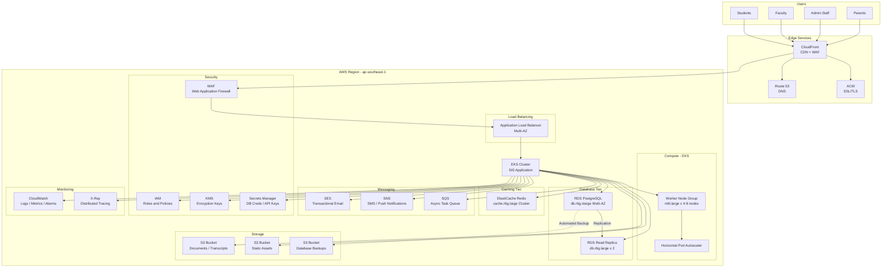
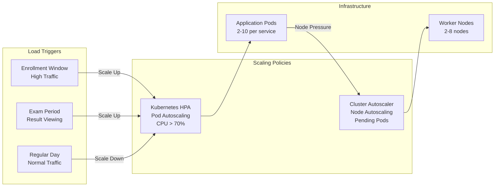
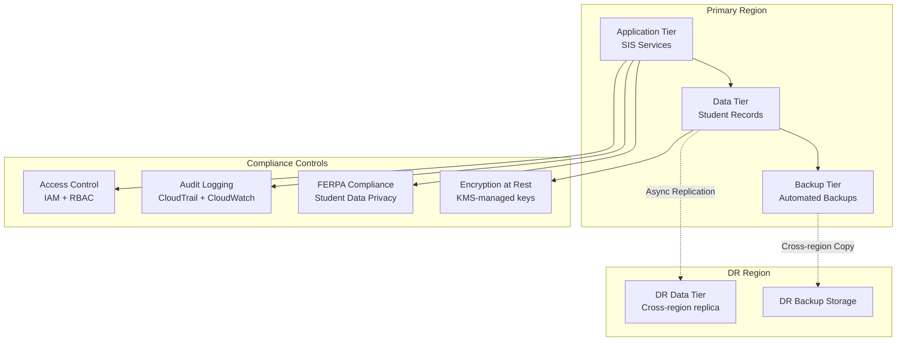
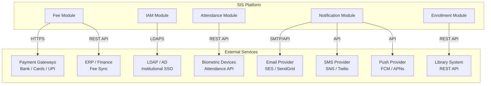

# Cloud Architecture

## Overview
Cloud architecture diagrams showing the AWS infrastructure design for the Student Information System, including compute, storage, databases, networking, and managed services.

---

## AWS Cloud Architecture Overview

---

## Auto-Scaling Architecture

---

## Data Residency and Compliance Architecture

---

## External Integration Architecture

---

## Cloud Cost Optimization Strategy

| Service | Strategy | Expected Saving |
|---------|----------|----------------|
| EKS Nodes | Reserved instances for baseline; Spot for burst | 30-40% |
| RDS | Reserved instances with 1-year commitment | 35-40% |
| ElastiCache | Reserved nodes | 30-35% |
| S3 | Intelligent-Tiering for infrequent documents | 15-20% |
| CloudFront | Cache optimization for static assets | Reduced origin costs |
| SQS/SNS | On-demand; low base cost | Pay-per-use |
