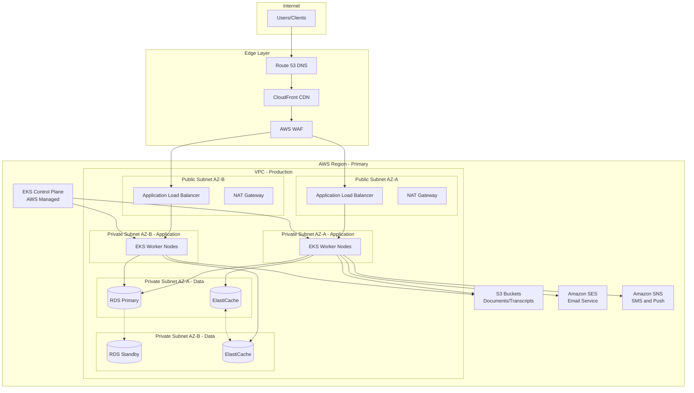
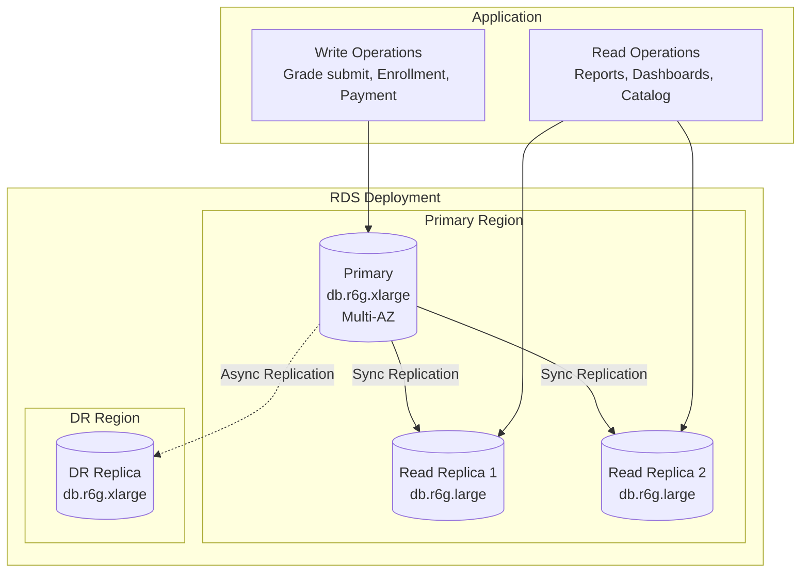
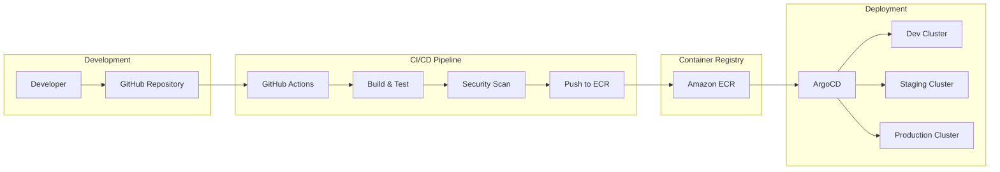

# Deployment Diagram

## Overview
Deployment diagrams showing the mapping of software components to hardware and infrastructure for the Student Information System.

---

## Production Deployment Architecture



---

## Kubernetes Deployment

```mermaid
graph TB
    subgraph "EKS Cluster"
        subgraph "Ingress"
            Ingress[NGINX Ingress Controller]
        end

        subgraph "API Layer"
            Gateway[Kong API Gateway<br>2 replicas]
        end

        subgraph "Services Namespace"
            subgraph "Auth Domain"
                AuthSvc[Auth Service<br>2 replicas]
            end

            subgraph "Student Domain"
                StudentSvc[Student Service<br>3 replicas]
                AdvisorSvc[Advisor Service<br>2 replicas]
            end

            subgraph "Academic Domain"
                CourseSvc[Course Service<br>3 replicas]
                EnrollSvc[Enrollment Service<br>3 replicas]
                GradeSvc[Grade Service<br>3 replicas]
            end

            subgraph "Attendance Domain"
                AttendanceSvc[Attendance Service<br>2 replicas]
            end

            subgraph "Fee Domain"
                FeeSvc[Fee Service<br>2 replicas]
                PaymentSvc[Payment Service<br>2 replicas]
            end

            subgraph "Communication Domain"
                NotifSvc[Notification Service<br>2 replicas]
                MsgSvc[Messaging Service<br>2 replicas]
            end

            subgraph "Reporting Domain"
                ReportSvc[Report Service<br>2 replicas]
            end
        end

        subgraph "Workers Namespace"
            NotifWorker[Notification Worker<br>2 replicas]
            ReportWorker[Report Worker<br>2 replicas]
        end

        subgraph "Monitoring Namespace"
            Prometheus[Prometheus]
            Grafana[Grafana]
            Jaeger[Jaeger]
        end
    end

    Ingress --> Gateway
    Gateway --> AuthSvc
    Gateway --> StudentSvc
    Gateway --> CourseSvc
    Gateway --> EnrollSvc
    Gateway --> GradeSvc
    Gateway --> AttendanceSvc
    Gateway --> FeeSvc
    Gateway --> PaymentSvc
    Gateway --> NotifSvc
    Gateway --> ReportSvc
```

---

## Service Deployment Specifications

### Deployment YAML Example

```yaml
apiVersion: apps/v1
kind: Deployment
metadata:
  name: enrollment-service
  namespace: services
spec:
  replicas: 3
  selector:
    matchLabels:
      app: enrollment-service
  template:
    metadata:
      labels:
        app: enrollment-service
    spec:
      containers:
      - name: enrollment-service
        image: ecr.aws/sis/enrollment-service:v1.0.0
        ports:
        - containerPort: 8000
        resources:
          requests:
            memory: "512Mi"
            cpu: "250m"
          limits:
            memory: "1Gi"
            cpu: "500m"
        livenessProbe:
          httpGet:
            path: /health
            port: 8000
          initialDelaySeconds: 30
          periodSeconds: 10
        readinessProbe:
          httpGet:
            path: /ready
            port: 8000
          initialDelaySeconds: 5
          periodSeconds: 5
        env:
        - name: DATABASE_URL
          valueFrom:
            secretKeyRef:
              name: db-credentials
              key: url
        - name: REDIS_URL
          valueFrom:
            configMapKeyRef:
              name: service-config
              key: redis-url
```

---

## Deployment Environment Matrix

| Service | Dev | Staging | Production |
|---------|-----|---------|------------|
| Auth Service | 1 replica | 2 replicas | 2 replicas |
| Student Service | 1 replica | 2 replicas | 3 replicas |
| Course Service | 1 replica | 2 replicas | 3 replicas |
| Enrollment Service | 1 replica | 2 replicas | 3 replicas |
| Grade Service | 1 replica | 2 replicas | 3 replicas |
| Attendance Service | 1 replica | 1 replica | 2 replicas |
| Fee Service | 1 replica | 1 replica | 2 replicas |
| Payment Service | 1 replica | 2 replicas | 2 replicas |
| Notification Service | 1 replica | 2 replicas | 2 replicas |
| Report Service | 1 replica | 1 replica | 2 replicas |

---

## Database Deployment



---

## CI/CD Pipeline



---

## Resource Allocation

| Component | Instance Type | vCPU | Memory | Storage |
|-----------|---------------|------|--------|---------|
| EKS Worker (App) | m6i.large | 2 | 8 GB | 50 GB |
| EKS Worker (Workers) | m6i.medium | 1 | 4 GB | 30 GB |
| RDS Primary | db.r6g.xlarge | 4 | 32 GB | 500 GB |
| RDS Replica | db.r6g.large | 2 | 16 GB | 500 GB |
| ElastiCache | cache.r6g.large | 2 | 13 GB | - |
| S3 (Documents/Transcripts) | Standard | - | - | Unlimited |

## Implementation-Ready Addendum for Deployment Diagram

### Purpose in This Artifact
Defines HA zones, rollback strategy, and dependency placement.

### Scope Focus
- Deployment topology and reliability
- Enrollment lifecycle enforcement relevant to this artifact
- Grading/transcript consistency constraints relevant to this artifact
- Role-based and integration concerns at this layer

#### Implementation Rules
- Enrollment lifecycle operations must emit auditable events with correlation IDs and actor scope.
- Grade and transcript actions must preserve immutability through versioned records; no destructive updates.
- RBAC must be combined with context constraints (term, department, assigned section, advisee).
- External integrations must remain contract-first with explicit versioning and backward-compatibility strategy.

#### Acceptance Criteria
1. Business rules are testable and mapped to policy IDs in this artifact.
2. Failure paths (authorization, policy window, downstream sync) are explicitly documented.
3. Data ownership and source-of-truth boundaries are clearly identified.
4. Diagram and narrative remain consistent for the scenarios covered in this file.

