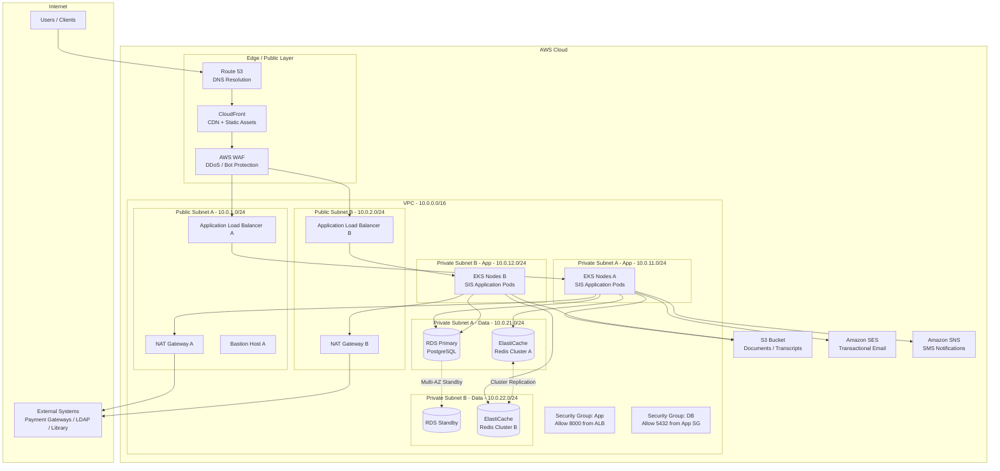
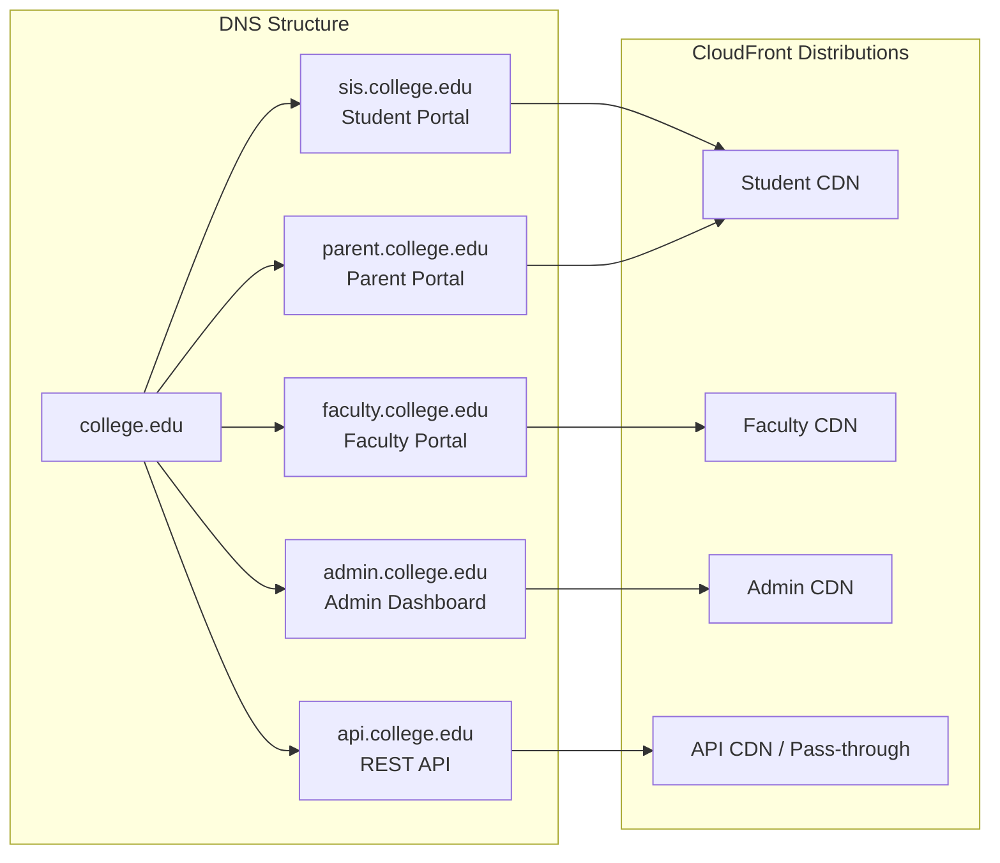
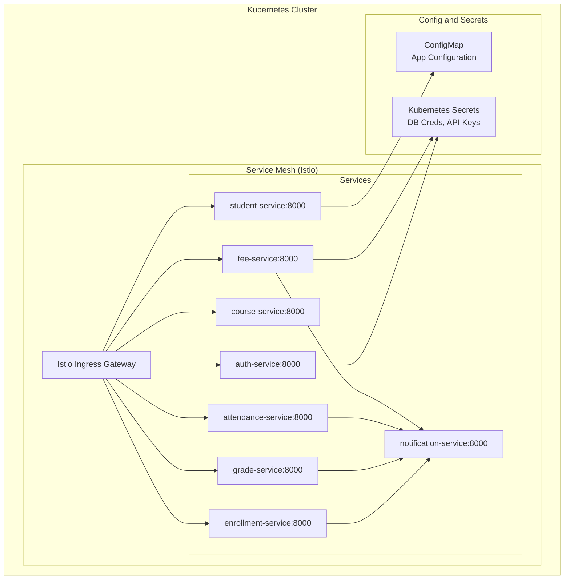
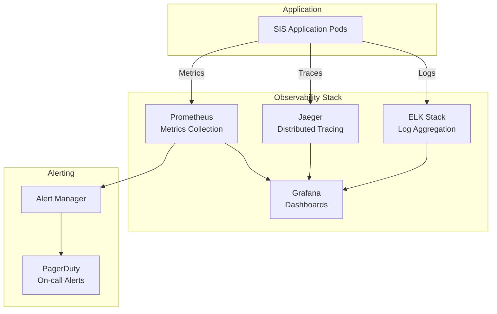

# Network Infrastructure

## Overview
Network and infrastructure diagrams showing the network topology, security zones, and connectivity for the Student Information System.

---

## Network Topology Diagram

---

## Security Group Rules

### Application Layer Security Group

| Rule | Protocol | Port | Source | Purpose |
|------|----------|------|--------|---------|
| Inbound | HTTPS | 443 | ALB Security Group | API traffic |
| Inbound | HTTP | 8000 | ALB Security Group | Internal API |
| Outbound | TCP | 5432 | DB Security Group | PostgreSQL |
| Outbound | TCP | 6379 | Cache Security Group | Redis |
| Outbound | HTTPS | 443 | 0.0.0.0/0 via NAT | External services |

### Database Layer Security Group

| Rule | Protocol | Port | Source | Purpose |
|------|----------|------|--------|---------|
| Inbound | TCP | 5432 | App Security Group | PostgreSQL connections |
| Outbound | None | - | - | No outbound required |

---

## DNS and Routing

---

## Internal Service Mesh

---

## Monitoring and Observability

---

## Backup and Disaster Recovery

| Component | Backup Strategy | RPO | RTO |
|-----------|----------------|-----|-----|
| PostgreSQL | Hourly incremental + daily full; Multi-AZ standby | 1 hour | 30 minutes |
| Redis | Multi-node cluster; point-in-time snapshots | 15 minutes | 15 minutes |
| S3 (Documents) | Cross-region replication; versioning enabled | Near-zero | Near-zero |
| Application Config | Git-managed; ArgoCD reconciliation | Minutes | Minutes |
