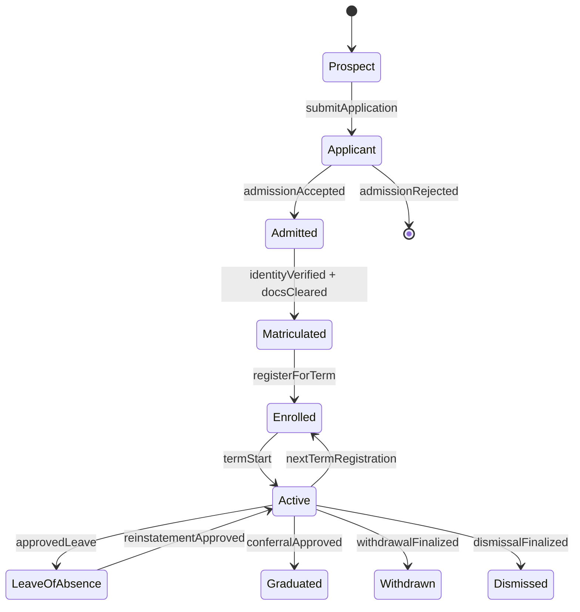
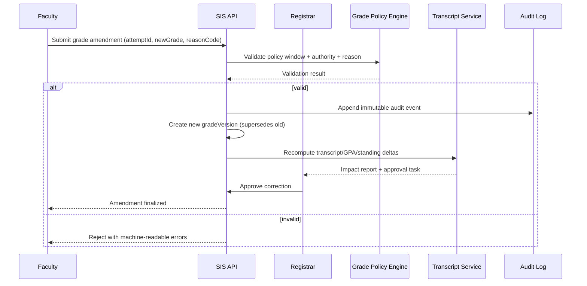
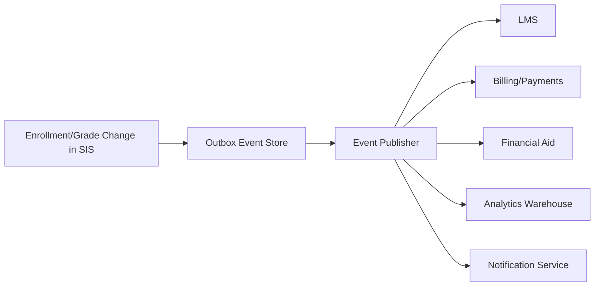

# Requirements Document

## 1. Introduction

### 1.1 Purpose
This document defines the functional and non-functional requirements for a Student Information System (SIS) for a college that organizes and manages all student details including enrollment, academics, attendance, grades, fees, and administrative operations.

### 1.2 Scope
The system will support:
- Student enrollment and lifecycle management
- Course catalog, scheduling, and registration
- Grade and academic performance management
- Attendance tracking and reporting
- Fee billing and financial aid management
- Faculty and staff management
- Academic calendar and event management
- Communication and notification services
- Analytics, reporting, and transcript generation

### 1.3 Definitions

| Term | Definition |
|------|------------|
| **SIS** | Student Information System — the central platform for managing college records |
| **Enrollment** | The process of formally registering a student for courses in a semester |
| **GPA** | Grade Point Average — a cumulative measure of academic performance |
| **Credit Hour** | A unit measuring course workload and degree progress |
| **Transcript** | An official academic record showing all courses and grades |
| **Academic Advisor** | A staff member who guides students in planning their academic path |
| **Registrar** | The office responsible for maintaining official academic records |
| **CGPA** | Cumulative Grade Point Average across all completed semesters |

---

## 2. Functional Requirements

### 2.1 User Management Module

#### FR-UM-001: Student Registration
- System shall allow new students to register with personal and academic details
- System shall verify student identity via official email and document upload
- System shall assign unique student ID upon successful registration
- System shall support student profile photo upload

#### FR-UM-002: Faculty Registration
- System shall allow faculty registration with academic credentials and department assignment
- System shall require document verification (qualification, employment letter)
- System shall support faculty profile management including specialization and office hours

#### FR-UM-003: Admin and Staff Management
- System shall support role-based access control (RBAC) for all staff roles
- System shall maintain audit logs for all administrative actions
- System shall support 2FA for admin and registrar accounts

#### FR-UM-004: Authentication
- System shall implement JWT-based authentication
- System shall support SSO/LDAP integration for institutional accounts
- System shall enforce password policies and session management
- System shall support OTP-based login for sensitive operations

#### FR-UM-005: Parent/Guardian Portal
- System shall allow parents to register and link to their ward's account
- Parents shall have read-only access to grades, attendance, and fee status
- System shall require student approval before parent account is linked

---

### 2.2 Course Management Module

#### FR-CM-001: Course Catalog
- System shall maintain a comprehensive catalog of all offered courses
- Courses shall have code, name, credits, prerequisites, and syllabus
- Admin shall create, edit, and deactivate courses
- Courses shall be organized by department and academic level

#### FR-CM-002: Course Scheduling
- System shall allow creation of class schedules for each semester
- System shall detect and prevent scheduling conflicts for faculty and rooms
- System shall support lab, lecture, and tutorial session types
- System shall manage classroom and resource allocation

#### FR-CM-003: Course Enrollment
- Students shall enroll in courses during defined registration windows
- System shall enforce prerequisite validation before enrollment
- System shall enforce maximum seat limits per course section
- Students shall be able to add/drop courses within the allowed period

#### FR-CM-004: Waitlist Management
- System shall maintain waitlists for full course sections
- System shall automatically enroll waitlisted students when seats open
- Students shall receive notifications on waitlist position changes

---

### 2.3 Academic Records Module

#### FR-AR-001: Grade Management
- Faculty shall enter grades for students in their courses
- System shall support letter grades, percentage, and grade points
- System shall calculate GPA and CGPA automatically
- System shall allow grade amendment with registrar approval

#### FR-AR-002: Transcript Generation
- System shall generate official transcripts on demand
- Transcripts shall include all enrolled courses, grades, and CGPA
- System shall support official digital and printable transcript formats
- Registrar shall verify and digitally sign transcripts

#### FR-AR-003: Academic Standing
- System shall calculate and update academic standing each semester
- System shall flag students on probation or academic risk
- System shall generate academic standing reports for advisors

#### FR-AR-004: Degree Audit
- System shall track degree progress against graduation requirements
- Students shall view remaining requirements for their degree program
- System shall generate a degree audit report per student

---

### 2.4 Attendance Module

#### FR-AT-001: Attendance Recording
- Faculty shall mark attendance for each class session
- System shall support bulk attendance marking
- System shall support QR-code-based and biometric attendance integration
- Students shall view their attendance records per course

#### FR-AT-002: Attendance Alerts
- System shall notify students when attendance falls below the threshold (e.g., 75%)
- System shall send alerts to academic advisors and parents for low attendance
- System shall block students from exams if attendance is critically low

#### FR-AT-003: Leave Management
- Students shall apply for leave with supporting documents
- Faculty and admin shall approve or reject leave requests
- Approved leaves shall be marked separately from absences

---

### 2.5 Fee Management Module

#### FR-FM-001: Fee Structure Management
- Admin shall define fee structures by program, batch, and semester
- System shall support one-time and recurring fee components
- System shall support scholarship and discount rules

#### FR-FM-002: Fee Billing
- System shall generate fee invoices for each student per semester
- System shall apply applicable scholarships, waivers, and discounts
- System shall send payment reminders before due dates

#### FR-FM-003: Payment Processing
- System shall integrate multiple payment gateways (online banking, cards, UPI)
- System shall support installment-based payment plans
- System shall generate payment receipts upon successful payment

#### FR-FM-004: Financial Aid
- Students shall apply for scholarships and financial aid
- Admin shall review and approve/reject financial aid applications
- System shall track disbursements and update student accounts

---

### 2.6 Timetable and Calendar Module

#### FR-TC-001: Academic Calendar
- Admin shall create and publish the academic calendar each year
- Calendar shall include semester start/end, holidays, exam schedules, and events
- System shall integrate calendar with student and faculty dashboards

#### FR-TC-002: Exam Scheduling
- Admin shall schedule mid-term and end-term examinations
- System shall detect and prevent student exam conflicts
- System shall publish exam hall allocation and seating plans
- System shall notify students and faculty of exam schedules

#### FR-TC-003: Event Management
- Admin shall create and publish campus events
- Students and faculty shall register for events
- System shall send event reminders and updates

---

### 2.7 Communication Module

#### FR-CO-001: Announcements
- Admin and faculty shall create announcements for specific groups
- Students shall receive announcements on their dashboard and via email
- System shall support urgent and general announcement categories

#### FR-CO-002: Messaging
- Students and faculty shall send and receive internal messages
- System shall maintain message history and threading
- System shall support group messages for course cohorts

#### FR-CO-003: Notifications
- System shall send email and SMS notifications for critical events
- System shall support push notifications on the student mobile app
- Students shall manage their notification preferences

---

### 2.8 Library Module

#### FR-LB-001: Library Catalog
- System shall integrate with the college library catalog
- Students shall search and view book availability
- System shall track borrowing history per student

#### FR-LB-002: Book Issue and Return
- Librarians shall issue and receive books for students
- System shall enforce borrowing limits and due dates
- System shall calculate and collect late-return fines

---

### 2.9 Reporting and Analytics Module

#### FR-RA-001: Student Reports
- System shall generate enrollment, grade, and attendance reports
- Reports shall be filterable by department, batch, semester, and course
- System shall support export to CSV, PDF, and Excel

#### FR-RA-002: Faculty Reports
- System shall generate course-wise grade distribution reports
- System shall provide attendance summary reports per course
- Faculty shall view individual student performance analytics

#### FR-RA-003: Admin Dashboard
- Admin shall view institution-wide enrollment statistics
- Admin shall monitor fee collection and pending dues
- System shall provide real-time dashboards with KPIs

---

### 2.10 Notification Module

#### FR-NM-001: Email Notifications
- System shall send transactional emails for registration, grade publication, fee reminders, and alerts
- System shall support configurable email templates
- System shall track email delivery status

#### FR-NM-002: SMS Notifications
- System shall send OTP and critical alerts via SMS
- System shall send fee due reminders and attendance warnings via SMS

#### FR-NM-003: Push Notifications
- System shall send mobile push notifications via student app
- Students shall manage notification categories and preferences

---

## 3. Non-Functional Requirements

### 3.1 Performance

| Requirement | Target |
|-------------|--------|
| Page load time | < 2 seconds |
| API response time | < 300ms (p95) |
| Report generation | < 5 seconds |
| Concurrent users | 10,000+ |
| Transcript generation | < 10 seconds |

### 3.2 Scalability
- Horizontal scaling of all services
- Database read replicas for report-heavy queries
- Auto-scaling during enrollment and exam periods
- CDN for static assets and downloadable resources

### 3.3 Availability
- 99.9% uptime SLA during academic periods
- Zero-downtime deployments
- Multi-region failover for critical services
- Graceful degradation during maintenance windows

### 3.4 Security
- HTTPS/TLS 1.3 for all communications
- FERPA/student data privacy compliance
- Role-based access control at all levels
- Rate limiting and DDoS protection
- SQL injection and XSS prevention
- Regular security audits and penetration testing
- Data encryption at rest and in transit

### 3.5 Reliability
- Automated backups (hourly incremental, daily full)
- Point-in-time recovery for academic records
- Data replication across availability zones
- Circuit breaker patterns for external integrations

### 3.6 Maintainability
- Modular architecture with clear domain separation
- Comprehensive logging (ELK stack)
- Distributed tracing
- Health check endpoints
- Feature flags for gradual rollouts

### 3.7 Usability
- Mobile-responsive design for students and faculty
- WCAG 2.1 AA accessibility compliance
- Multi-language support (i18n)
- Intuitive navigation with role-specific dashboards

---

## 4. System Constraints

### 4.1 Technical Constraints
- Cloud-native deployment (AWS/GCP/Azure)
- Container-based deployment (Docker/Kubernetes)
- RESTful API-first design
- Integration with existing institution identity systems (LDAP/SSO)

### 4.2 Business Constraints
- Academic calendar-driven workflows
- Integration with existing ERP and financial systems
- Data migration from legacy SIS systems
- Compliance with university regulatory bodies

### 4.3 Regulatory Constraints
- FERPA (Family Educational Rights and Privacy Act) compliance
- Student data privacy regulations
- Accreditation body reporting requirements
- Financial aid regulatory compliance

## Enrollment, Academic Integrity, Access Control, and Integration Contracts (Implementation-Ready)

### 1) Enrollment Lifecycle Rules (Authoritative)

#### 1.1 Lifecycle States and Transitions
| State | Entry Criteria | Exit Criteria | Allowed Actors | Terminal? |
|---|---|---|---|---|
| Prospect | Lead captured or inquiry created | Application submitted | Admissions CRM, Applicant | No |
| Applicant | Complete application + required docs | Admitted or Rejected | Applicant, Admissions Officer | No |
| Admitted | Admission decision = accepted | Matriculated or Offer Expired | Admissions, Registrar | No |
| Matriculated | Identity + eligibility checks passed | Enrolled for a term | Registrar | No |
| Enrolled (Term-Scoped) | Registered in >=1 credit-bearing section | Dropped all sections, Term Completed | Student, Advisor, Registrar | No |
| Active (Institution-Scoped) | Student is not graduated/withdrawn/dismissed | Graduated, Withdrawn, Dismissed | SIS policy engine | No |
| Leave of Absence | Approved leave request in valid window | Reinstated, Withdrawn, Dismissed | Student, Advisor, Registrar | No |
| Graduated | Degree audit complete + conferral approved | N/A | Registrar | Yes |
| Withdrawn | Approved withdrawal workflow complete | Reinstated (rare policy path) | Student, Registrar | Yes* |
| Dismissed | Policy or disciplinary action finalized | Reinstated by exception | Registrar, Academic Board | Yes* |

> *Terminal under normal policy; reinstatement requires exceptional workflow and two-party approval (advisor + registrar/board).

#### 1.2 Deterministic State Machine

#### 1.3 Enrollment/Registration Enforcement Rules
- **EL-001 Window Governance:** add/drop/withdraw windows are configured per term, program, and campus timezone; requests outside windows require override reason code.
- **EL-002 Seat Allocation:** seat release follows deterministic priority `(cohortPriority DESC, waitlistTimestamp ASC, randomTieBreakerSeed ASC)`.
- **EL-003 Prerequisite Resolution:** prerequisite checks run against canonical attempt history with in-progress and transfer-credit handling flags.
- **EL-004 Conflict Detection:** section enrollment is rejected if timetable overlap, credit overload, hold, or missing approval constraints fail.
- **EL-005 Downstream Consistency:** enrollment state changes emit events for LMS roster sync, fee recalculation, attendance eligibility, and aid re-evaluation.
- **EL-006 Re-Enrollment Gate:** reinstatement requires cleared financial/disciplinary holds and advisor + registrar approvals.

### 2) Grading and Transcript Consistency Constraints

#### 2.1 Grade Lifecycle and Versioning
- **GC-001 Immutable Posting:** once a grade version is `POSTED`, it is immutable.
- **GC-002 Amendment Model:** corrections create a new version linked by `supersedesGradeVersionId`; no in-place edits.
- **GC-003 Reason Codes:** every amendment must provide standardized reason (`CALCULATION_ERROR`, `LATE_SUBMISSION_APPROVED`, `INCOMPLETE_RESOLUTION`, etc.).
- **GC-004 Effective Dating:** transcript rendering always uses latest `effective=true` grade version at render time.

#### 2.2 Canonical Consistency Rules
| Rule ID | Constraint | Failure Handling |
|---|---|---|
| TR-001 | Transcript rows derive only from canonical course-attempt + grade-version records | Block issuance and raise registrar task |
| TR-002 | GPA/CGPA computed from policy-bound grade points and repeat/forgiveness rules | Recompute job queued; stale cache invalidated |
| TR-003 | Standing/honors/SAP updates run after each posted or amended grade event | Trigger synchronous policy check + async reconciliation |
| TR-004 | Official transcript issuance requires registrar sign-off + tamper-evident hash | Refuse release if signature or hash missing |
| TR-005 | Retroactive grade changes require impact statements (prereq, audit, aid, standing) | Hold change in `PENDING_IMPACT_REVIEW` |

#### 2.3 Grade Correction Sequence (Required)

### 3) Role-Based Access Specifics (RBAC + ABAC)

#### 3.1 Access Model
- **RBAC baseline** grants capability by role.
- **ABAC overlays** constrain by context attributes: campus, department, term, section assignment, advisee linkage, data sensitivity, legal hold.
- **Break-glass access** is time-bound, ticket-linked, and dual-approved.

#### 3.2 Permission Matrix (Minimum Required)
| Capability | Student | Faculty | Advisor | Registrar/Admin | Notes |
|---|---:|---:|---:|---:|---|
| View own transcript | ✅ | ❌ | ❌ | ✅ | Student self-service allowed |
| Submit final grades | ❌ | ✅* | ❌ | ✅ | *Assigned sections + open window only |
| Amend posted grade | ❌ | Request | ❌ | ✅ | Registrar finalizes amendments |
| Approve overload/waiver petition | ❌ | ❌ | ✅ | ✅ | Program-scoped |
| Release official transcript | ❌ | ❌ | ❌ | ✅ | Requires digital signature policy |
| View disciplinary records | Limited | ❌ | Limited | Scoped | Enhanced logging required |

#### 3.3 Security and Audit Controls
- **AC-001** least privilege defaults; deny-by-default policy on all privileged endpoints.
- **AC-002** MFA required for registrar/admin and any user performing grade or transcript actions.
- **AC-003** field-level masking for PII/financial attributes in UI, exports, and logs.
- **AC-004** all read/write of sensitive records generate audit events with `actorId`, `scope`, `justification`, `requestId`.
- **AC-005** periodic entitlement recertification (at least once per term).

### 4) Integration Contracts for External Systems

#### 4.1 Contract-First Standards
- APIs must publish OpenAPI/AsyncAPI artifacts with JSON Schema references and semantic versions.
- Breaking changes require version increment and migration window policy.
- Event contracts are backward-compatible for at least one full term unless emergency exception approved.

#### 4.2 External Integration Surface
| System | Direction | Contract Type | SLA/SLO | Idempotency Key |
|---|---|---|---|---|
| LMS | Bi-directional | REST + Events | Roster sync < 5 min | `termId:sectionId:studentId:eventType` |
| IdP/SSO | Inbound auth + outbound provisioning | SAML/OIDC + SCIM | Login p95 < 2s | `provisioningRequestId` |
| Payment Gateway | Outbound payment + inbound webhook | REST + Signed Webhooks | Payment callback < 60s | `invoiceId:attemptNo` |
| Financial Aid | Bi-directional | REST + Batch SFTP (optional) | Aid status < 15 min | `aidApplicationId:termId` |
| Library | Bi-directional | REST | Borrowing status < 10 min | `studentId:loanId:eventType` |
| Regulatory Reporting | Outbound | Secure file/API | Deadline-bound batch | `reportPeriod:studentId:recordType` |

#### 4.3 Event Contract Baseline

Required event metadata fields:
- `eventId`, `eventType`, `schemaVersion`, `occurredAt`, `sourceSystem`, `correlationId`, `idempotencyKey`
- domain IDs: `studentId`, `termId`, `courseOfferingId`, `attemptId`, `gradeVersionId` (as applicable)

#### 4.4 Reliability, Security, and Drift Controls
- **IC-001** retries use exponential backoff + jitter; dead-letter queues mandatory.
- **IC-002** all webhook callbacks must be signed and timestamp-validated.
- **IC-003** encryption in transit (TLS 1.2+) and at rest for replicated payload stores.
- **IC-004** contract tests + sandbox certification are release gates for enrollment/grade/transcript/billing changes.
- **IC-005** schema drift detection runs continuously and blocks incompatible deploys.

### 5) Operational Readiness and Acceptance Criteria

#### 5.1 Observability and SLOs
- Enrollment action API p95 latency <= 400ms during peak registration.
- Grade posting-to-transcript consistency <= 2 minutes (p99).
- LMS roster propagation <= 5 minutes (p99).
- Audit event durability >= 99.999% persisted write success.

#### 5.2 Data Retention and Compliance
- Grade versions and transcript issuance records are retained per institutional and statutory policy (minimum 7 years where applicable).
- Audit logs for sensitive operations retained in immutable storage tier with legal hold support.
- Data subject access/deletion requests must preserve legally required academic records with redaction-by-policy.

#### 5.3 Implementation-Ready Test Scenarios
1. Waitlist promotion tie-breaker determinism under concurrent seat release.
2. Retroactive grade correction impact on prerequisites and degree audit.
3. Unauthorized faculty grade amendment blocked with explicit error code.
4. Payment webhook replay handled idempotently without duplicate ledger entries.
5. Transcript signature/hash verification fails on tampered artifact.
6. Re-enrollment blocked when financial hold exists; succeeds after hold clearance.

