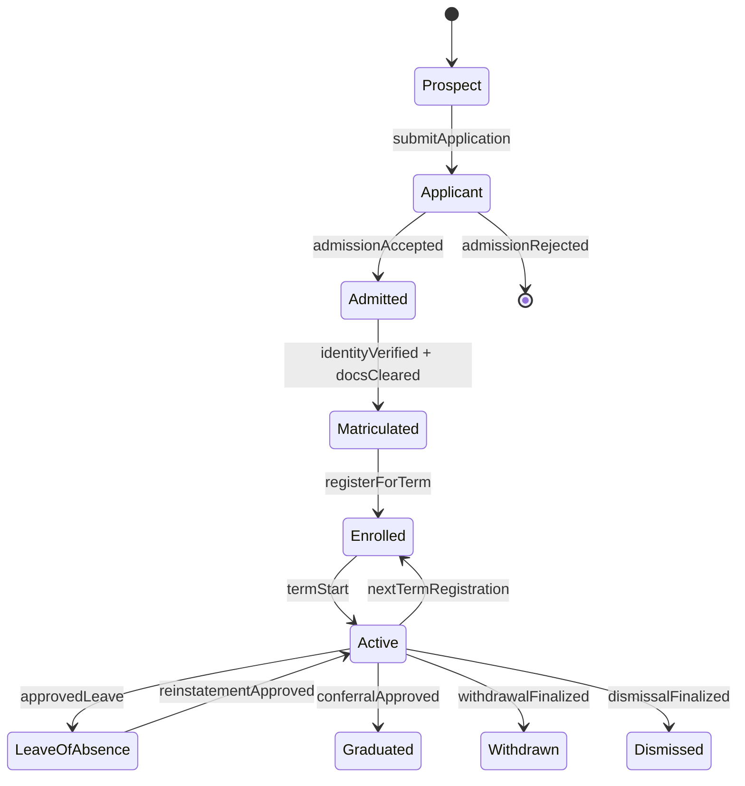
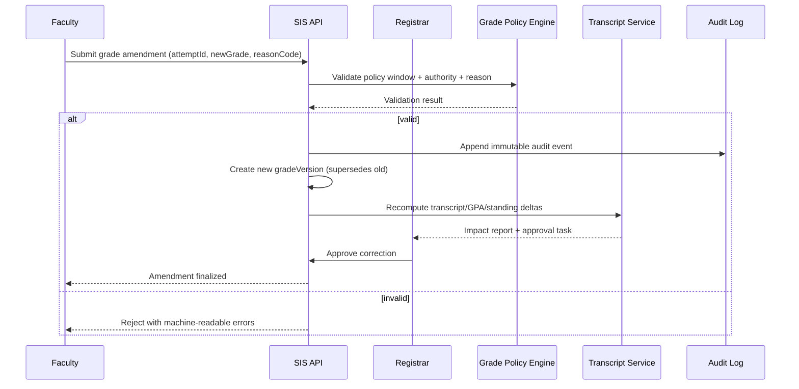
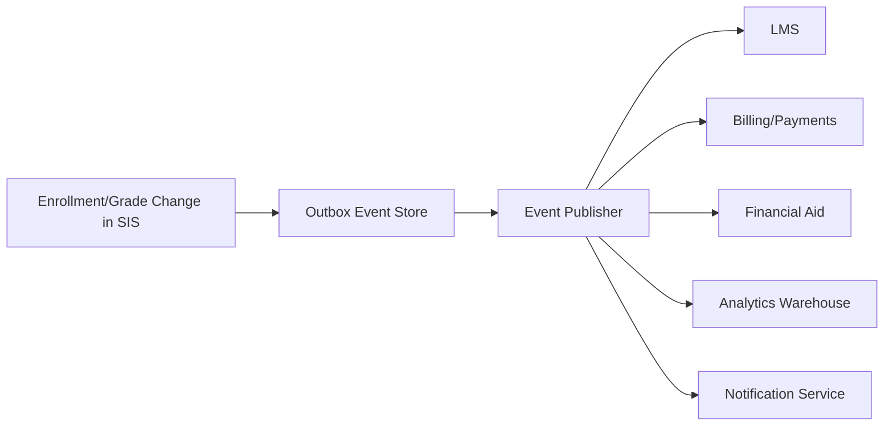

# User Stories

## Student User Stories

### Account & Profile Management

| ID | Story | Acceptance Criteria |
|----|-------|---------------------|
| STU-001 | As a student, I want to register with my personal and academic details so that I can create my account | - Personal info form - Document upload - Email OTP verification |
| STU-002 | As a student, I want to login with my institutional email and password so that I can access my dashboard | - Login works with email/password - Session management - Password reset link |
| STU-003 | As a student, I want to update my profile so that my information stays current | - Edit contact details - Upload profile photo - Save emergency contacts |
| STU-004 | As a student, I want to reset my password so that I can recover access to my account | - Reset link via email - Link expires in 24h - New password saved |

### Course Enrollment

| ID | Story | Acceptance Criteria |
|----|-------|---------------------|
| STU-005 | As a student, I want to browse the course catalog so that I can explore available courses | - Search by name/code - Filter by department - View syllabus and credits |
| STU-006 | As a student, I want to enroll in courses during the registration window so that I can plan my semester | - Prerequisite check - Seat availability shown - Confirmation email sent |
| STU-007 | As a student, I want to drop a course within the allowed period so that I can adjust my schedule | - Drop option available - Confirmation dialog - Enrollment updated |
| STU-008 | As a student, I want to join a waitlist for a full course so that I can be enrolled if seats open | - Waitlist position shown - Auto-enrollment on seat open - Notification sent |
| STU-009 | As a student, I want to view my current and past enrollments so that I have a record of all courses | - Semester-wise list - Course details shown - Status visible |

### Academics

| ID | Story | Acceptance Criteria |
|----|-------|---------------------|
| STU-010 | As a student, I want to view my grades for each course so that I can track my performance | - Course-wise grade shown - GPA calculated - Semester and CGPA visible |
| STU-011 | As a student, I want to view my attendance records so that I know my standing | - Course-wise attendance % - Session-level detail - Low attendance warning |
| STU-012 | As a student, I want to download my official transcript so that I can share it with employers or institutions | - PDF generated - Digitally signed - All courses included |
| STU-013 | As a student, I want to view my degree audit so that I know how many credits I need to graduate | - Credits earned shown - Remaining requirements listed - Estimated graduation date |
| STU-014 | As a student, I want to view my exam schedule so that I can prepare on time | - Exam dates and times shown - Hall and seat allocation visible - Download option |

### Fee Management

| ID | Story | Acceptance Criteria |
|----|-------|---------------------|
| STU-015 | As a student, I want to view my fee invoices so that I know what I owe | - Itemized invoice shown - Due dates visible - Payment history included |
| STU-016 | As a student, I want to pay fees online so that I don't need to visit the office | - Multiple payment methods - Receipt generated - Email confirmation sent |
| STU-017 | As a student, I want to apply for financial aid so that I can reduce my financial burden | - Aid application form - Document upload - Status tracking |
| STU-018 | As a student, I want to view my payment receipt so that I have proof of payment | - Receipt downloadable - All payment details shown - Official stamp/signature |

### Communication

| ID | Story | Acceptance Criteria |
|----|-------|---------------------|
| STU-019 | As a student, I want to view announcements on my dashboard so that I stay informed | - Latest announcements shown - Department-specific filter - Unread count badge |
| STU-020 | As a student, I want to send messages to faculty so that I can ask questions | - Compose message form - Threaded reply - Notification to recipient |
| STU-021 | As a student, I want to apply for leave so that my absence is documented | - Leave application form - Document attachment - Status tracking |

---

## Faculty User Stories

### Course Management

| ID | Story | Acceptance Criteria |
|----|-------|---------------------|
| FAC-001 | As a faculty member, I want to view my assigned courses so that I know my teaching schedule | - Course list visible - Student roster accessible - Timetable shown |
| FAC-002 | As a faculty member, I want to upload course materials so that students can access them | - File upload supported - Material organized by session - Students notified |
| FAC-003 | As a faculty member, I want to view the course enrollment list so that I know my students | - Enrolled students list - Student profile accessible - Export to CSV |

### Grade Management

| ID | Story | Acceptance Criteria |
|----|-------|---------------------|
| FAC-004 | As a faculty member, I want to enter grades for students so that academic records are updated | - Grade entry form - Bulk grade import - Submission confirmation |
| FAC-005 | As a faculty member, I want to amend a grade so that errors can be corrected | - Amendment request form - Reason required - Registrar approval workflow |
| FAC-006 | As a faculty member, I want to view grade distribution reports so that I can understand class performance | - Grade histogram shown - Average and spread displayed - Export to PDF |

### Attendance

| ID | Story | Acceptance Criteria |
|----|-------|---------------------|
| FAC-007 | As a faculty member, I want to mark attendance for each class so that records are maintained | - Student list shown - Present/Absent/Late options - Save and confirm |
| FAC-008 | As a faculty member, I want to view attendance summaries so that I can identify at-risk students | - Per-student attendance % - Below-threshold students highlighted - Export report |
| FAC-009 | As a faculty member, I want to approve or reject student leave applications so that absences are handled | - Leave request list - View supporting documents - Approve/Reject with comments |

### Communication

| ID | Story | Acceptance Criteria |
|----|-------|---------------------|
| FAC-010 | As a faculty member, I want to send announcements to my class so that students are informed | - Announcement form - Target course/section - Email + portal notification |
| FAC-011 | As a faculty member, I want to reply to student messages so that their queries are answered | - Message inbox - Threaded reply - Notification to student |

---

## Academic Advisor User Stories

### Student Planning

| ID | Story | Acceptance Criteria |
|----|-------|---------------------|
| ADV-001 | As an academic advisor, I want to view my assigned students so that I can manage their plans | - Student list visible - Academic standing shown - Alert flags visible |
| ADV-002 | As an academic advisor, I want to view a student's degree audit so that I can guide course selection | - Degree progress shown - Missing requirements listed - Credits earned tracked |
| ADV-003 | As an academic advisor, I want to approve course enrollment overrides so that special cases are handled | - Override request list - Student context visible - Approve/Reject action |
| ADV-004 | As an academic advisor, I want to set academic improvement plans for at-risk students so that they get support | - Plan creation form - Goals and milestones - Student notified |

---

## Admin Staff User Stories

### Dashboard & Reporting

| ID | Story | Acceptance Criteria |
|----|-------|---------------------|
| ADM-001 | As an admin, I want to view the institution-wide dashboard so that I can monitor platform health | - Enrollment stats shown - Fee collection metrics - Active user count |
| ADM-002 | As an admin, I want to generate custom reports so that I can analyze data | - Custom date range - Export to CSV/PDF - Scheduled reports |
| ADM-003 | As an admin, I want to manage the academic calendar so that key dates are published | - Calendar creation form - Event categories - Publish to all users |

### User Management

| ID | Story | Acceptance Criteria |
|----|-------|---------------------|
| ADM-004 | As an admin, I want to manage student accounts so that records are accurate | - Student list - Account status toggle - View enrollment history |
| ADM-005 | As an admin, I want to onboard faculty so that they can access the system | - Faculty registration form - Department assignment - Credentials issued |
| ADM-006 | As an admin, I want to manage roles and permissions so that access is controlled | - Role creation - Permission matrix - Role assignment to users |

### Course & Enrollment Administration

| ID | Story | Acceptance Criteria |
|----|-------|---------------------|
| ADM-007 | As an admin, I want to create and manage courses so that the catalog is up to date | - Course form - Department linkage - Prerequisite configuration |
| ADM-008 | As an admin, I want to open and close enrollment windows so that registration is controlled | - Window dates configuration - Per-semester settings - Notification to students |
| ADM-009 | As an admin, I want to manage classroom allocations so that schedules are conflict-free | - Room schedule matrix - Conflict detection - Override capability |

### Fee Administration

| ID | Story | Acceptance Criteria |
|----|-------|---------------------|
| ADM-010 | As an admin, I want to define fee structures so that billing is automated | - Fee component form - Program/batch targeting - Discount rules |
| ADM-011 | As an admin, I want to view fee collection reports so that finances are tracked | - Collection summary - Pending dues list - Export to Excel |
| ADM-012 | As an admin, I want to process financial aid applications so that eligible students are supported | - Application queue - Document review - Approve/Reject with comments |

---

## Registrar User Stories

### Academic Records

| ID | Story | Acceptance Criteria |
|----|-------|---------------------|
| REG-001 | As a registrar, I want to verify and publish final grades so that transcripts are accurate | - Grade review interface - Approve/hold action - Publication confirmation |
| REG-002 | As a registrar, I want to issue official transcripts so that students have certified records | - Transcript request queue - Digital signature applied - Delivery via download or post |
| REG-003 | As a registrar, I want to manage graduation clearance so that eligible students can graduate | - Clearance checklist - Degree audit integration - Approval workflow |
| REG-004 | As a registrar, I want to review and approve grade amendments so that records stay accurate | - Amendment request queue - Original and proposed grade shown - Approve/Reject with reason |

---

## Parent/Guardian User Stories

### Monitoring

| ID | Story | Acceptance Criteria |
|----|-------|---------------------|
| PAR-001 | As a parent, I want to view my ward's grades so that I can track their academic performance | - Grade summary visible - Semester-wise breakdown - GPA shown |
| PAR-002 | As a parent, I want to view attendance records so that I know if my ward is attending classes | - Attendance % per course - Absent sessions shown - Alert notifications |
| PAR-003 | As a parent, I want to view fee invoices and payment status so that I can ensure payments are made | - Invoice list visible - Due amounts highlighted - Payment history shown |
| PAR-004 | As a parent, I want to receive alerts for low attendance and academic warnings so that I can intervene | - Email/SMS alert on threshold breach - Summary of issue - Contact advisor option |

## Enrollment, Academic Integrity, Access Control, and Integration Contracts (Implementation-Ready)

### 1) Enrollment Lifecycle Rules (Authoritative)

#### 1.1 Lifecycle States and Transitions
| State | Entry Criteria | Exit Criteria | Allowed Actors | Terminal? |
|---|---|---|---|---|
| Prospect | Lead captured or inquiry created | Application submitted | Admissions CRM, Applicant | No |
| Applicant | Complete application + required docs | Admitted or Rejected | Applicant, Admissions Officer | No |
| Admitted | Admission decision = accepted | Matriculated or Offer Expired | Admissions, Registrar | No |
| Matriculated | Identity + eligibility checks passed | Enrolled for a term | Registrar | No |
| Enrolled (Term-Scoped) | Registered in >=1 credit-bearing section | Dropped all sections, Term Completed | Student, Advisor, Registrar | No |
| Active (Institution-Scoped) | Student is not graduated/withdrawn/dismissed | Graduated, Withdrawn, Dismissed | SIS policy engine | No |
| Leave of Absence | Approved leave request in valid window | Reinstated, Withdrawn, Dismissed | Student, Advisor, Registrar | No |
| Graduated | Degree audit complete + conferral approved | N/A | Registrar | Yes |
| Withdrawn | Approved withdrawal workflow complete | Reinstated (rare policy path) | Student, Registrar | Yes* |
| Dismissed | Policy or disciplinary action finalized | Reinstated by exception | Registrar, Academic Board | Yes* |

> *Terminal under normal policy; reinstatement requires exceptional workflow and two-party approval (advisor + registrar/board).

#### 1.2 Deterministic State Machine

#### 1.3 Enrollment/Registration Enforcement Rules
- **EL-001 Window Governance:** add/drop/withdraw windows are configured per term, program, and campus timezone; requests outside windows require override reason code.
- **EL-002 Seat Allocation:** seat release follows deterministic priority `(cohortPriority DESC, waitlistTimestamp ASC, randomTieBreakerSeed ASC)`.
- **EL-003 Prerequisite Resolution:** prerequisite checks run against canonical attempt history with in-progress and transfer-credit handling flags.
- **EL-004 Conflict Detection:** section enrollment is rejected if timetable overlap, credit overload, hold, or missing approval constraints fail.
- **EL-005 Downstream Consistency:** enrollment state changes emit events for LMS roster sync, fee recalculation, attendance eligibility, and aid re-evaluation.
- **EL-006 Re-Enrollment Gate:** reinstatement requires cleared financial/disciplinary holds and advisor + registrar approvals.

### 2) Grading and Transcript Consistency Constraints

#### 2.1 Grade Lifecycle and Versioning
- **GC-001 Immutable Posting:** once a grade version is `POSTED`, it is immutable.
- **GC-002 Amendment Model:** corrections create a new version linked by `supersedesGradeVersionId`; no in-place edits.
- **GC-003 Reason Codes:** every amendment must provide standardized reason (`CALCULATION_ERROR`, `LATE_SUBMISSION_APPROVED`, `INCOMPLETE_RESOLUTION`, etc.).
- **GC-004 Effective Dating:** transcript rendering always uses latest `effective=true` grade version at render time.

#### 2.2 Canonical Consistency Rules
| Rule ID | Constraint | Failure Handling |
|---|---|---|
| TR-001 | Transcript rows derive only from canonical course-attempt + grade-version records | Block issuance and raise registrar task |
| TR-002 | GPA/CGPA computed from policy-bound grade points and repeat/forgiveness rules | Recompute job queued; stale cache invalidated |
| TR-003 | Standing/honors/SAP updates run after each posted or amended grade event | Trigger synchronous policy check + async reconciliation |
| TR-004 | Official transcript issuance requires registrar sign-off + tamper-evident hash | Refuse release if signature or hash missing |
| TR-005 | Retroactive grade changes require impact statements (prereq, audit, aid, standing) | Hold change in `PENDING_IMPACT_REVIEW` |

#### 2.3 Grade Correction Sequence (Required)

### 3) Role-Based Access Specifics (RBAC + ABAC)

#### 3.1 Access Model
- **RBAC baseline** grants capability by role.
- **ABAC overlays** constrain by context attributes: campus, department, term, section assignment, advisee linkage, data sensitivity, legal hold.
- **Break-glass access** is time-bound, ticket-linked, and dual-approved.

#### 3.2 Permission Matrix (Minimum Required)
| Capability | Student | Faculty | Advisor | Registrar/Admin | Notes |
|---|---:|---:|---:|---:|---|
| View own transcript | ✅ | ❌ | ❌ | ✅ | Student self-service allowed |
| Submit final grades | ❌ | ✅* | ❌ | ✅ | *Assigned sections + open window only |
| Amend posted grade | ❌ | Request | ❌ | ✅ | Registrar finalizes amendments |
| Approve overload/waiver petition | ❌ | ❌ | ✅ | ✅ | Program-scoped |
| Release official transcript | ❌ | ❌ | ❌ | ✅ | Requires digital signature policy |
| View disciplinary records | Limited | ❌ | Limited | Scoped | Enhanced logging required |

#### 3.3 Security and Audit Controls
- **AC-001** least privilege defaults; deny-by-default policy on all privileged endpoints.
- **AC-002** MFA required for registrar/admin and any user performing grade or transcript actions.
- **AC-003** field-level masking for PII/financial attributes in UI, exports, and logs.
- **AC-004** all read/write of sensitive records generate audit events with `actorId`, `scope`, `justification`, `requestId`.
- **AC-005** periodic entitlement recertification (at least once per term).

### 4) Integration Contracts for External Systems

#### 4.1 Contract-First Standards
- APIs must publish OpenAPI/AsyncAPI artifacts with JSON Schema references and semantic versions.
- Breaking changes require version increment and migration window policy.
- Event contracts are backward-compatible for at least one full term unless emergency exception approved.

#### 4.2 External Integration Surface
| System | Direction | Contract Type | SLA/SLO | Idempotency Key |
|---|---|---|---|---|
| LMS | Bi-directional | REST + Events | Roster sync < 5 min | `termId:sectionId:studentId:eventType` |
| IdP/SSO | Inbound auth + outbound provisioning | SAML/OIDC + SCIM | Login p95 < 2s | `provisioningRequestId` |
| Payment Gateway | Outbound payment + inbound webhook | REST + Signed Webhooks | Payment callback < 60s | `invoiceId:attemptNo` |
| Financial Aid | Bi-directional | REST + Batch SFTP (optional) | Aid status < 15 min | `aidApplicationId:termId` |
| Library | Bi-directional | REST | Borrowing status < 10 min | `studentId:loanId:eventType` |
| Regulatory Reporting | Outbound | Secure file/API | Deadline-bound batch | `reportPeriod:studentId:recordType` |

#### 4.3 Event Contract Baseline

Required event metadata fields:
- `eventId`, `eventType`, `schemaVersion`, `occurredAt`, `sourceSystem`, `correlationId`, `idempotencyKey`
- domain IDs: `studentId`, `termId`, `courseOfferingId`, `attemptId`, `gradeVersionId` (as applicable)

#### 4.4 Reliability, Security, and Drift Controls
- **IC-001** retries use exponential backoff + jitter; dead-letter queues mandatory.
- **IC-002** all webhook callbacks must be signed and timestamp-validated.
- **IC-003** encryption in transit (TLS 1.2+) and at rest for replicated payload stores.
- **IC-004** contract tests + sandbox certification are release gates for enrollment/grade/transcript/billing changes.
- **IC-005** schema drift detection runs continuously and blocks incompatible deploys.

### 5) Operational Readiness and Acceptance Criteria

#### 5.1 Observability and SLOs
- Enrollment action API p95 latency <= 400ms during peak registration.
- Grade posting-to-transcript consistency <= 2 minutes (p99).
- LMS roster propagation <= 5 minutes (p99).
- Audit event durability >= 99.999% persisted write success.

#### 5.2 Data Retention and Compliance
- Grade versions and transcript issuance records are retained per institutional and statutory policy (minimum 7 years where applicable).
- Audit logs for sensitive operations retained in immutable storage tier with legal hold support.
- Data subject access/deletion requests must preserve legally required academic records with redaction-by-policy.

#### 5.3 Implementation-Ready Test Scenarios
1. Waitlist promotion tie-breaker determinism under concurrent seat release.
2. Retroactive grade correction impact on prerequisites and degree audit.
3. Unauthorized faculty grade amendment blocked with explicit error code.
4. Payment webhook replay handled idempotently without duplicate ledger entries.
5. Transcript signature/hash verification fails on tampered artifact.
6. Re-enrollment blocked when financial hold exists; succeeds after hold clearance.

